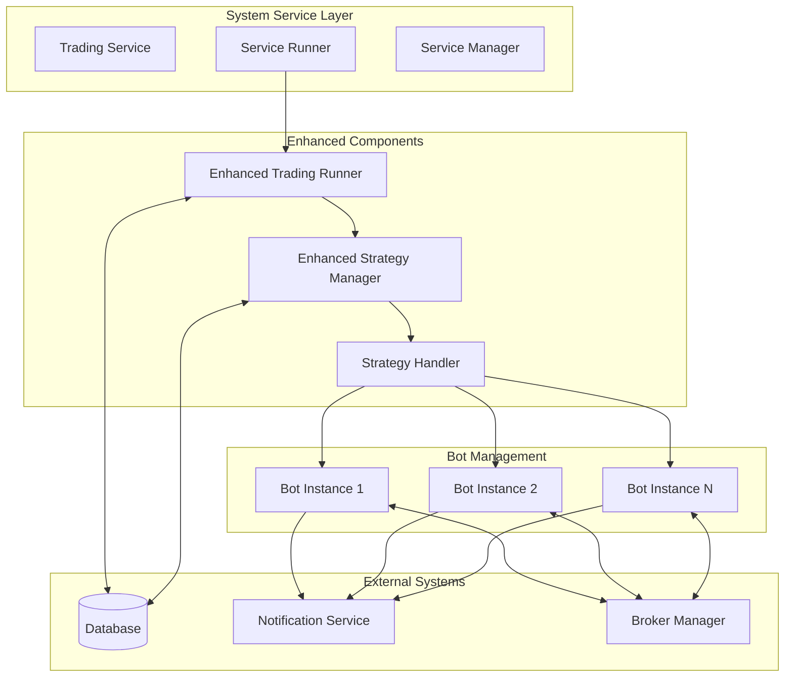
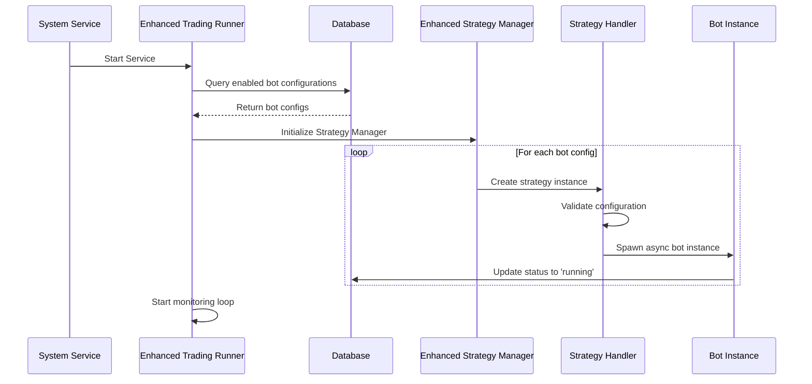
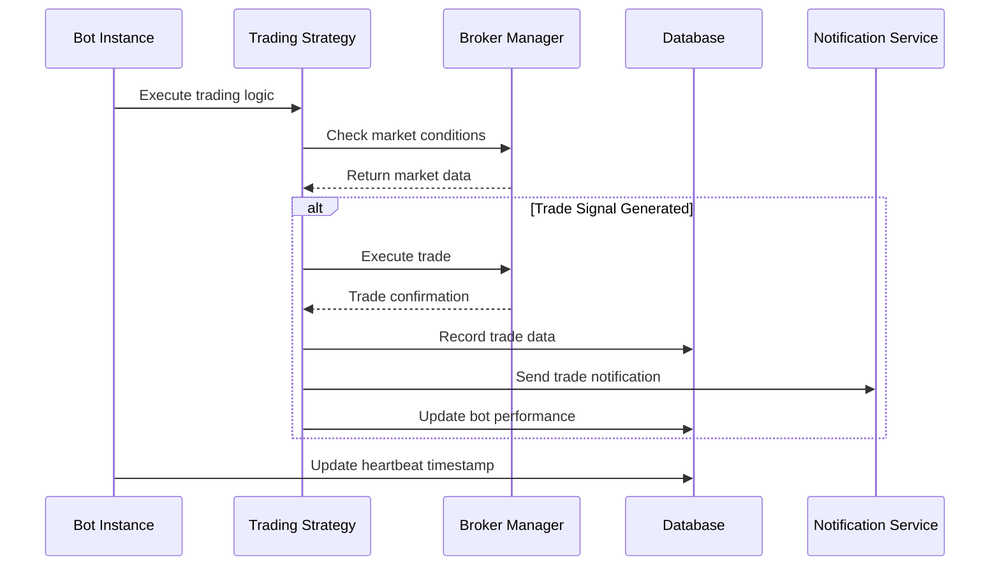
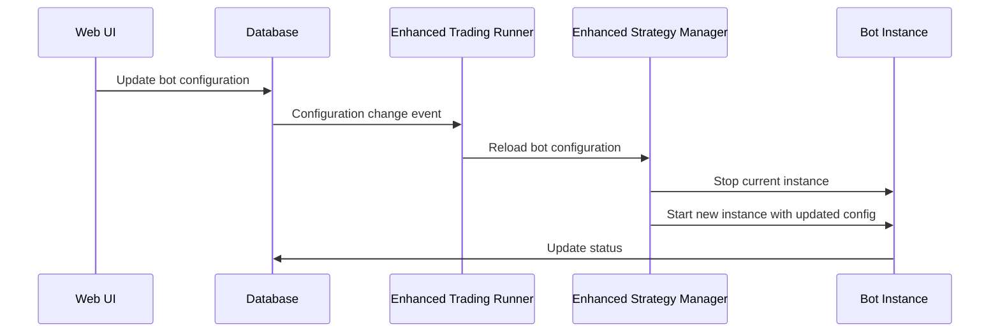

# Design Document

## Overview

This design document outlines the architecture for an enhanced database-driven trading bot service system that replaces JSON configuration files with database-only configuration management. The system enhances existing `trading_runner.py` and `strategy_manager.py` components to provide reliable, scalable, and maintainable trading bot management with comprehensive monitoring and notification capabilities.

## Architecture

### High-Level Architecture

The system follows a service-oriented architecture with async task-based bot management:



### Component Architecture

#### 1. Enhanced Trading Runner (`trading_runner.py`)

**Purpose**: Main service orchestrator that manages the lifecycle of multiple trading bot instances.

**Key Responsibilities**:
- Load bot configurations from database
- Initialize and manage async bot instances
- Provide system-level monitoring and health checks
- Handle graceful shutdown and recovery

**Enhanced Features**:
- Database-only configuration loading
- Async task management for concurrent bot execution
- System service integration (systemd/Windows service)
- Comprehensive error handling and recovery

#### 2. Enhanced Strategy Manager (`strategy_manager.py`)

**Purpose**: Manages individual bot instances with their specific strategies and configurations.

**Key Responsibilities**:
- Create and manage StrategyInstance objects
- Handle bot lifecycle (start/stop/restart)
- Monitor bot health and performance
- Update database with bot status and metrics

**Enhanced Features**:
- Database-driven strategy configuration
- Dynamic strategy type loading
- Async bot execution with isolation
- Real-time status updates to database

#### 3. Strategy Handler (New Component)

**Purpose**: Dynamic strategy loader that instantiates different strategy types based on configuration.

**Key Responsibilities**:
- Parse strategy configuration from database
- Dynamically import and instantiate strategy classes
- Validate strategy parameters
- Support plugin-style architecture for new strategy types

#### 4. Bot Instance Management

**Purpose**: Individual bot execution with proper isolation and monitoring.

**Key Responsibilities**:
- Execute trading strategy with configured parameters
- Send notifications for trade events
- Update database with trade and performance data
- Handle errors and recovery at instance level

## Data Flow

### 1. Service Startup Flow



### 2. Bot Execution Flow



### 3. Configuration Update Flow



## Component Design

### Enhanced Trading Runner

```python
class EnhancedTradingRunner:
    """Enhanced multi-bot trading service runner with database integration."""
    
    def __init__(self):
        self.strategy_manager = StrategyManager()
        self.db_connection = DatabaseConnection()
        self.running_bots = {}
        self.is_running = False
        self.monitoring_task = None
    
    async def load_bot_configurations(self) -> List[Dict]:
        """Load enabled bot configurations from database."""
        
    async def start_service(self):
        """Start the trading service with all enabled bots."""
        
    async def stop_service(self):
        """Gracefully stop all bots and clean up resources."""
        
    async def monitor_bots(self):
        """Monitor bot health and handle recovery."""
```

### Enhanced Strategy Manager

```python
class StrategyManager:
    """Enhanced strategy manager with database integration and async bot management."""
    
    def __init__(self):
        self.bot_instances = {}
        self.strategy_handler = StrategyHandler()
        self.db_connection = DatabaseConnection()
    
    async def create_bot_instance(self, config: Dict) -> str:
        """Create and start a new bot instance from database configuration."""
        
    async def stop_bot_instance(self, bot_id: str):
        """Stop a specific bot instance gracefully."""
        
    async def restart_bot_instance(self, bot_id: str):
        """Restart a bot instance with current configuration."""
        
    async def update_bot_status(self, bot_id: str, status: str, metadata: Dict = None):
        """Update bot status in database."""
```

### Strategy Handler

```python
class StrategyHandler:
    """Dynamic strategy loader and validator."""
    
    def __init__(self):
        self.strategy_registry = {}
        self._register_default_strategies()
    
    def load_strategy_class(self, strategy_type: str) -> Type:
        """Dynamically load strategy class based on type."""
        
    def validate_strategy_config(self, strategy_config: Dict) -> bool:
        """Validate strategy configuration parameters."""
        
    def create_strategy_instance(self, strategy_config: Dict, broker) -> BaseStrategy:
        """Create and configure strategy instance."""
```

### Bot Instance

```python
class BotInstance:
    """Individual bot instance with async execution and monitoring."""
    
    def __init__(self, bot_id: str, config: Dict, strategy_handler: StrategyHandler):
        self.bot_id = bot_id
        self.config = config
        self.strategy = None
        self.broker = None
        self.is_running = False
        self.last_heartbeat = None
    
    async def start(self):
        """Start the bot instance with configured strategy."""
        
    async def stop(self):
        """Stop the bot instance gracefully."""
        
    async def execute_trading_loop(self):
        """Main trading execution loop."""
        
    async def send_notification(self, event_type: str, data: Dict):
        """Send notification through notification service."""
```

## Database Integration

### Configuration Schema

The system uses the existing `trading_bots` table with the following JSON configuration structure:

```json
{
  "id": "rsi_atr_btc_paper",
  "name": "RSI+ATR BTC Paper Trading",
  "enabled": true,
  "symbol": "BTCUSDT",
  "broker": {
    "type": "binance",
    "trading_mode": "paper",
    "name": "rsi_atr_btc_paper_broker",
    "cash": 100.0
  },
  "strategy": {
    "type": "CustomStrategy",
    "parameters": {
      "entry_logic": {
        "name": "RSIBBVolumeEntryMixin",
        "params": {
          "e_rsi_period": 14,
          "e_rsi_oversold": 30,
          "e_bb_period": 20,
          "e_bb_dev": 2.0,
          "e_vol_ma_period": 20,
          "e_min_volume_ratio": 1.1,
          "e_use_bb_touch": true
        }
      },
      "exit_logic": {
        "name": "ATRExitMixin",
        "params": {
          "x_atr_period": 14,
          "x_sl_multiplier": 1.5
        }
      },
      "position_size": 0.1
    }
  },
  "data": {
    "data_source": "binance",
    "interval": "1h",
    "lookback_bars": 500
  },
  "trading": {
    "position_size": 0.1,
    "max_positions": 1
  },
  "risk_management": {
    "max_position_size": 1000.0,
    "stop_loss_pct": 3.0,
    "take_profit_pct": 6.0,
    "max_daily_loss": 200.0,
    "max_daily_trades": 5
  },
  "notifications": {
    "position_opened": true,
    "position_closed": true,
    "email_enabled": false,
    "telegram_enabled": true,
    "error_notifications": true
  }
}
```

### Database Operations

#### Bot Status Management
- Update `status` field: 'stopped', 'starting', 'running', 'error', 'stopping'
- Update `started_at` timestamp when bot starts
- Update `last_heartbeat` for monitoring
- Update `current_balance` and `total_pnl` for performance tracking

#### Trade Recording
- Insert records into `trading_trades` table for each executed trade
- Link trades to bot via `bot_id` foreign key
- Record entry/exit logic names and parameters
- Calculate and store P&L metrics

#### Performance Tracking
- Update `trading_performance_metrics` table with calculated metrics
- Store metrics as JSON for flexibility
- Track performance by bot, symbol, and time period

## Error Handling

### Bot-Level Error Handling

1. **Configuration Validation Errors**
   - Log detailed validation errors
   - Skip invalid bots without affecting others
   - Update bot status to 'error' in database
   - Send error notification if configured

2. **Runtime Execution Errors**
   - Implement retry logic with exponential backoff
   - Isolate errors to individual bot instances
   - Log errors with correlation IDs for debugging
   - Attempt automatic recovery up to configured limits

3. **Broker Connection Errors**
   - Handle network timeouts and API errors
   - Implement connection retry with circuit breaker pattern
   - Gracefully degrade functionality when possible
   - Notify users of persistent connection issues

### System-Level Error Handling

1. **Database Connection Errors**
   - Implement connection pooling with retry logic
   - Cache critical data for temporary offline operation
   - Queue database updates for when connection is restored
   - Provide fallback mechanisms for essential operations

2. **Service Startup Errors**
   - Validate system requirements before starting bots
   - Provide clear error messages for configuration issues
   - Support partial startup when some bots fail to initialize
   - Log startup sequence for debugging

3. **Resource Exhaustion**
   - Monitor CPU and memory usage
   - Implement bot throttling when resources are constrained
   - Provide warnings before reaching critical thresholds
   - Support graceful degradation of non-essential features

## Notification Integration

### Notification Events

1. **Trade Events**
   - Position opened with entry details
   - Position closed with P&L information
   - Stop loss or take profit triggered
   - Order execution confirmations

2. **System Events**
   - Bot started/stopped/restarted
   - Configuration updates applied
   - Error conditions and recovery actions
   - Service startup/shutdown notifications

3. **Performance Events**
   - Daily/weekly performance summaries
   - Risk limit breaches
   - Milestone achievements (profit targets, trade counts)
   - System health status updates

### Notification Channels

The system integrates with the existing notification service to support:
- **Telegram**: Real-time trade alerts and bot status
- **Email**: Daily summaries and important alerts
- **Webhook**: Integration with external monitoring systems
- **Database**: Persistent notification history

### Notification Configuration

Each bot can configure notifications independently:
```json
{
  "notifications": {
    "position_opened": true,
    "position_closed": true,
    "email_enabled": false,
    "telegram_enabled": true,
    "error_notifications": true,
    "performance_summaries": "daily",
    "risk_alerts": true
  }
}
```

## Monitoring and Health Checks

### Bot Health Monitoring

1. **Heartbeat System**
   - Each bot updates `last_heartbeat` timestamp regularly
   - Service monitors heartbeat intervals for unresponsive bots
   - Automatic restart for bots that miss heartbeat thresholds
   - Escalation to notifications for persistent issues

2. **Performance Monitoring**
   - Track trade execution latency
   - Monitor memory usage per bot instance
   - Measure database operation performance
   - Alert on performance degradation

3. **Error Rate Monitoring**
   - Track error frequency per bot and error type
   - Implement circuit breakers for high error rates
   - Provide error trend analysis
   - Automatic bot disabling for excessive errors

### System Health Monitoring

1. **Resource Monitoring**
   - CPU usage tracking with alerts
   - Memory usage monitoring and cleanup
   - Database connection pool health
   - Network connectivity status

2. **Service Health Checks**
   - HTTP health check endpoint for external monitoring
   - Database connectivity verification
   - Notification service integration status
   - Broker API connectivity checks

3. **Metrics Collection**
   - Prometheus-compatible metrics export
   - Custom metrics for trading-specific KPIs
   - Historical performance data collection
   - Real-time dashboard data feeds

## Security Considerations

### Configuration Security

1. **API Key Management**
   - Encrypt sensitive broker API keys in database
   - Use environment variables for encryption keys
   - Implement key rotation capabilities
   - Audit access to sensitive configuration data

2. **Database Security**
   - Use connection pooling with authentication
   - Implement row-level security for multi-user scenarios
   - Encrypt sensitive data at rest
   - Regular security audits and updates

3. **Service Security**
   - Run service with minimal required privileges
   - Implement secure communication channels
   - Regular security patches and updates
   - Monitoring for suspicious activities

### Operational Security

1. **Access Control**
   - Authenticate all configuration changes
   - Audit trail for all bot operations
   - Role-based access to different bot types
   - Secure API endpoints for external access

2. **Data Protection**
   - Backup critical configuration and trade data
   - Implement data retention policies
   - Secure data transmission
   - Privacy protection for user data

## Scalability and Performance

### Horizontal Scaling

1. **Multi-Instance Deployment**
   - Support running multiple service instances
   - Database-based coordination between instances
   - Load balancing for bot distribution
   - Failover capabilities for high availability

2. **Resource Optimization**
   - Async operations for concurrent bot execution
   - Connection pooling for database and broker APIs
   - Efficient memory management for large bot counts
   - CPU optimization for trading calculations

### Performance Optimization

1. **Database Performance**
   - Optimized queries for configuration loading
   - Indexing for fast bot status lookups
   - Batch operations for trade recording
   - Connection pooling and query optimization

2. **Trading Performance**
   - Minimize latency in trade execution
   - Efficient market data processing
   - Optimized strategy calculations
   - Parallel processing where possible

## Integration Points

### Existing System Integration

1. **Broker Manager Integration**
   - Use existing broker factory and management
   - Extend broker configurations for database storage
   - Maintain compatibility with existing broker types
   - Support new broker types through plugin architecture

2. **Strategy System Integration**
   - Support existing CustomStrategy and mixin system
   - Extend strategy loading for new strategy types
   - Maintain backward compatibility with existing strategies
   - Plugin architecture for future strategy development

3. **Notification Service Integration**
   - Use existing notification infrastructure
   - Extend notification types for trading events
   - Support user-specific notification preferences
   - Integration with existing channels (Telegram, email)

### External System Integration

1. **Web UI Integration**
   - API endpoints for bot management
   - Real-time status updates
   - Configuration management interface
   - Performance monitoring dashboards

2. **Monitoring System Integration**
   - Metrics export for external monitoring
   - Health check endpoints
   - Log aggregation support
   - Alert integration with external systems

## Deployment Architecture

### System Service Deployment

1. **Linux (systemd)**
   ```ini
   [Unit]
   Description=Enhanced Trading Bot Service
   After=network.target postgresql.service
   
   [Service]
   Type=simple
   User=trading
   WorkingDirectory=/opt/trading
   ExecStart=/opt/trading/venv/bin/python -m src.trading.enhanced_trading_service
   Restart=always
   RestartSec=10
   
   [Install]
   WantedBy=multi-user.target
   ```

2. **Windows Service**
   - Use Python service wrapper (e.g., python-windows-service)
   - Configure automatic startup and recovery
   - Integrate with Windows Event Log
   - Support service control manager operations

### Configuration Management

1. **Environment Configuration**
   - Environment-specific database connections
   - Logging configuration per environment
   - Feature flags for development/testing
   - Security settings per deployment type

2. **Service Configuration**
   - Service-level settings (monitoring intervals, retry limits)
   - Database connection parameters
   - Notification service integration settings
   - Performance tuning parameters

This design provides a comprehensive foundation for implementing the enhanced database-driven trading bot service system while maintaining compatibility with existing components and providing robust monitoring, error handling, and scalability features.