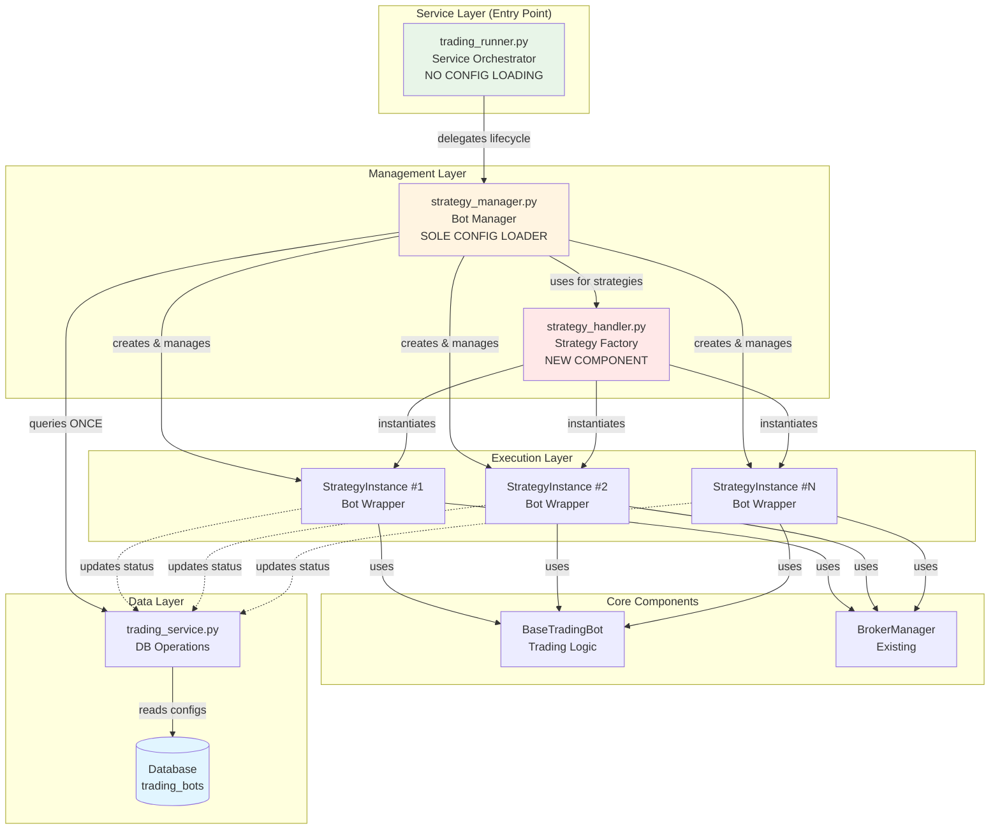
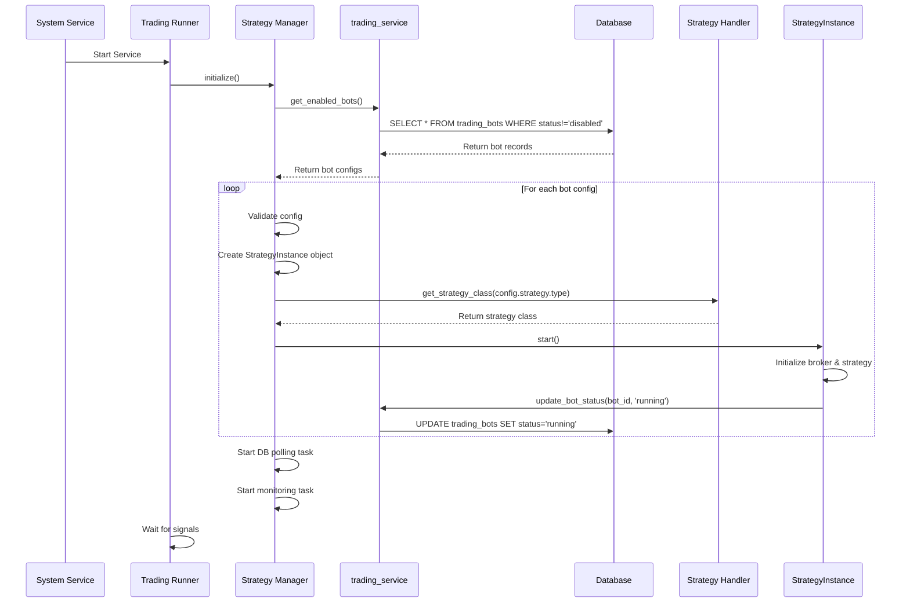
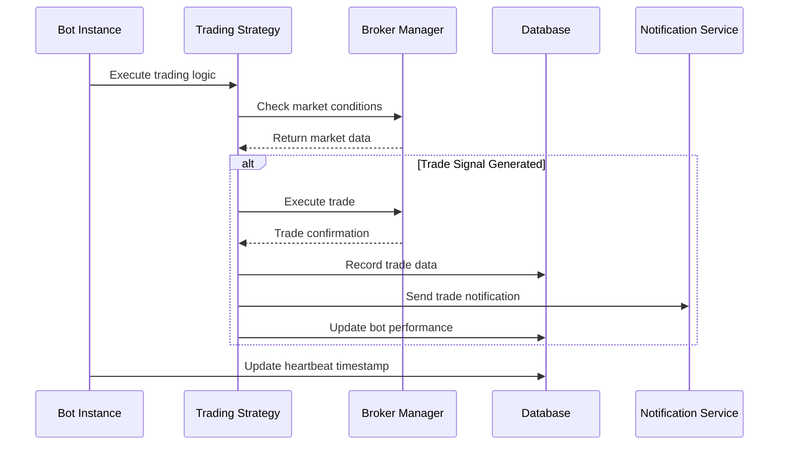
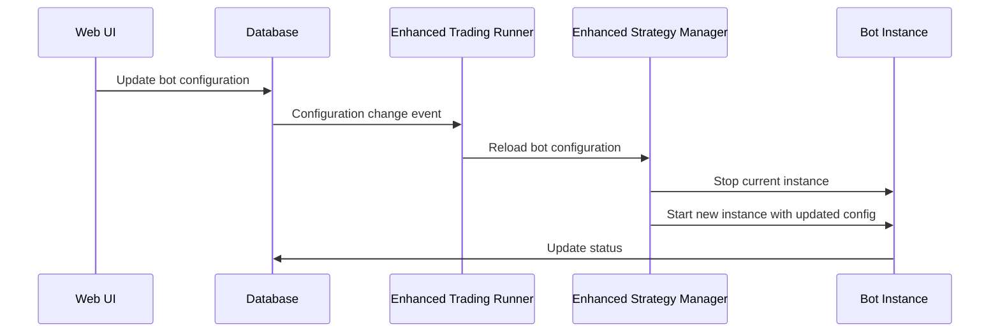

# Design Document

## Overview

This design document outlines the architecture for an enhanced database-driven trading bot service system that replaces JSON configuration files with database-only configuration management. The system enhances existing `trading_runner.py` and `strategy_manager.py` components to provide reliable, scalable, and maintainable trading bot management with comprehensive monitoring and notification capabilities.

## Architecture

### High-Level Architecture

The system follows a service-oriented architecture with async task-based bot management. **Key principle: Single source of configuration from database via strategy_manager.py only.**



**Deprecated Components:**
- `trading_bot.py` - Replaced by `trading_runner.py` as service entry point
- `live_trading_bot.py` - Logic refactored into `StrategyInstance`

### Component Architecture

#### 1. Trading Runner (`trading_runner.py`)

**Purpose**: Service orchestrator that manages service lifecycle. **DOES NOT LOAD CONFIGURATIONS.**

**Key Responsibilities**:
- Delegate to StrategyManager for all bot operations
- Handle system-level signals (SIGINT, SIGTERM)
- Coordinate service startup and shutdown
- Provide service-level health monitoring wrapper
- Implement system service integration

**Enhanced Features**:
- System service integration (systemd/Windows service)
- Graceful shutdown coordination
- Service-level error handling
- Health check endpoint for external monitoring

**What it DOES NOT do**:
- ❌ Load configurations from database (delegated to StrategyManager)
- ❌ Create bot instances (delegated to StrategyManager)
- ❌ Manage individual bots (delegated to StrategyManager)

#### 2. Strategy Manager (`strategy_manager.py`)

**Purpose**: Bot manager and **SOLE CONFIGURATION LOADER**. Central point for all bot configuration and lifecycle management.

**Key Responsibilities** (PRIMARY):
- **Load ALL bot configurations from database** (ONLY place this happens)
- Query `trading_service.get_enabled_bots()` and parse configs
- Create and manage StrategyInstance objects
- Handle bot lifecycle (start/stop/restart)
- Monitor bot health and performance
- Update database with bot status and metrics
- Implement DB polling for hot-reload

**Enhanced Features**:
- Database-driven strategy configuration (SOLE SOURCE)
- Integration with StrategyHandler for dynamic loading
- Async bot execution with isolation
- Real-time status updates to database
- Configuration hot-reload via DB polling

#### 3. Strategy Handler (`strategy_handler.py`) - NEW COMPONENT

**Purpose**: Dynamic strategy factory that instantiates different strategy types. **Strategy type resolution and validation.**

**Key Responsibilities**:
- Maintain strategy registry (CustomStrategy, ML strategies, etc.)
- Dynamically import and instantiate strategy classes based on type
- Validate strategy-specific parameters (entry/exit mixins, etc.)
- Support plugin-style architecture for new strategy types
- Provide fallback to CustomStrategy for unknown types

**Enhanced Features**:
- Strategy type discovery and registration
- Parameter validation framework
- Mixin loading for CustomStrategy (entry_logic, exit_logic)
- Extensible plugin architecture

#### 4. Strategy Instance (Enhanced `StrategyInstance` class)

**Purpose**: Individual bot wrapper with trading logic execution. **Refactored from `live_trading_bot.py`.**

**Key Responsibilities**:
- Wrap BaseTradingBot with async execution
- Manage broker connection for the bot
- Execute trading loop with configured strategy
- Send notifications for trade events
- Update database with trade and performance data
- Handle bot-level errors and recovery
- Implement heartbeat mechanism

**Refactoring Notes**:
- Absorbs logic from `LiveTradingBot` (Backtrader setup, data feeds)
- Uses BaseTradingBot for core trading functionality
- Maintains bot-level state and isolation

## Data Flow

### 1. Service Startup Flow (CORRECTED)



### 2. Bot Execution Flow



### 3. Configuration Update Flow



## Component Design

### Trading Runner (SIMPLIFIED - NO CONFIG LOADING)

```python
class TradingRunner:
    """Service orchestrator - delegates all bot management to StrategyManager."""

    def __init__(self):
        self.strategy_manager = StrategyManager()
        self.is_running = False

    async def start_service(self):
        """Start the trading service - DELEGATES to StrategyManager."""
        self.is_running = True

        # StrategyManager handles ALL config loading
        await self.strategy_manager.load_strategies_from_db()
        await self.strategy_manager.start_all_strategies()
        await self.strategy_manager.start_monitoring()

        # Optional: Start DB polling for hot-reload
        await self.strategy_manager.start_db_polling()

    async def stop_service(self):
        """Gracefully stop all bots - DELEGATES to StrategyManager."""
        self.is_running = False
        await self.strategy_manager.shutdown()

    async def run(self):
        """Main service loop - just coordinates startup/shutdown."""
        await self.start_service()

        # Wait for shutdown signal
        while self.is_running:
            await asyncio.sleep(1)
```

### Strategy Manager (SOLE CONFIG LOADER)

```python
class StrategyManager:
    """Bot manager - SOLE CONFIGURATION LOADER from database."""

    def __init__(self):
        self.strategy_instances: Dict[str, StrategyInstance] = {}
        self.strategy_handler = StrategyHandler()
        self.is_running = False
        self.monitoring_task = None
        self.db_poll_task = None

    async def load_strategies_from_db(self, user_id: Optional[int] = None) -> bool:
        """Load bot configurations from database - ONLY PLACE THIS HAPPENS."""
        try:
            # Query database via trading_service
            bots = trading_service.get_enabled_bots(user_id)

            for bot in bots:
                # Validate config
                is_valid, errors, _ = trading_service.validate_bot_configuration(bot["id"])
                if not is_valid:
                    logger.error(f"Bot {bot['id']} invalid: {errors}")
                    trading_service.update_bot_status(bot["id"], "error", error_message="; ".join(errors))
                    continue

                # Create StrategyInstance
                instance_id = str(bot["id"])
                config = self._db_bot_to_strategy_config(bot)
                self.strategy_instances[instance_id] = StrategyInstance(instance_id, config)

            return True
        except Exception as e:
            logger.exception("Failed to load from DB")
            return False

    async def start_all_strategies(self) -> int:
        """Start all loaded strategy instances."""
        started = 0
        for instance in self.strategy_instances.values():
            if await instance.start():
                started += 1
                # Update DB status
                trading_service.update_bot_status(int(instance.instance_id), "running")
        return started

    async def start_db_polling(self, user_id: Optional[int] = None, interval: int = 60):
        """Poll DB for config changes and hot-reload bots."""
        # Implemented in existing code (lines 427-508)
        pass

    async def shutdown(self):
        """Stop all bots and cleanup."""
        await self.stop_monitoring()
        await self.stop_all_strategies()
```

### Strategy Handler

```python
class StrategyHandler:
    """Dynamic strategy loader and validator."""
    
    def __init__(self):
        self.strategy_registry = {}
        self._register_default_strategies()
    
    def load_strategy_class(self, strategy_type: str) -> Type:
        """Dynamically load strategy class based on type."""
        
    def validate_strategy_config(self, strategy_config: Dict) -> bool:
        """Validate strategy configuration parameters."""
        
    def create_strategy_instance(self, strategy_config: Dict, broker) -> BaseStrategy:
        """Create and configure strategy instance."""
```

### Strategy Instance (Refactored from LiveTradingBot)

```python
class StrategyInstance:
    """Bot wrapper - refactored from LiveTradingBot with async execution."""

    def __init__(self, instance_id: str, config: Dict[str, Any]):
        self.instance_id = instance_id
        self.config = config
        self.name = config.get('name', f'Strategy_{instance_id}')
        self.broker = None
        self.trading_bot = None  # BaseTradingBot instance
        self.data_feed = None
        self.cerebro = None
        self.status = 'stopped'
        self.start_time = None
        self.error_count = 0
        self.last_error = None

    async def start(self) -> bool:
        """Start the bot instance - integrates LiveTradingBot logic."""
        try:
            # Create broker
            broker_config = self.config['broker']
            self.broker = get_broker(broker_config)

            # Get strategy class from StrategyHandler
            strategy_config = self.config['strategy']
            strategy_class = strategy_handler.get_strategy_class(strategy_config['type'])

            # Create BaseTradingBot with strategy
            bot_config = self._build_bot_config()
            self.trading_bot = BaseTradingBot(
                config=bot_config,
                strategy_class=strategy_class,
                parameters=strategy_config.get('parameters', {}),
                broker=self.broker,
                paper_trading=broker_config.get('trading_mode') == 'paper',
                bot_id=self.instance_id
            )

            # Setup data feed (from LiveTradingBot)
            await self._create_data_feed()

            # Setup Backtrader (from LiveTradingBot)
            await self._setup_backtrader()

            # Start trading bot
            await self._start_trading_bot()

            self.status = 'running'
            self.start_time = datetime.now(timezone.utc)
            return True

        except Exception as e:
            self.status = 'error'
            self.error_count += 1
            self.last_error = str(e)
            logger.exception(f"Failed to start {self.name}")
            return False

    async def stop(self) -> bool:
        """Stop the bot instance gracefully."""
        # Implementation from existing StrategyInstance + LiveTradingBot
        pass

    async def _create_data_feed(self):
        """Create data feed - from LiveTradingBot."""
        pass

    async def _setup_backtrader(self):
        """Setup Backtrader - from LiveTradingBot."""
        pass
```

## Database Integration

### Configuration Schema

The system uses the existing `trading_bots` table with the following JSON configuration structure:

```json
{
  "id": "rsi_atr_btc_paper",
  "name": "RSI+ATR BTC Paper Trading",
  "enabled": true,
  "symbol": "BTCUSDT",
  "broker": {
    "type": "binance",
    "trading_mode": "paper",
    "name": "rsi_atr_btc_paper_broker",
    "cash": 100.0
  },
  "strategy": {
    "type": "CustomStrategy",
    "parameters": {
      "entry_logic": {
        "name": "RSIBBVolumeEntryMixin",
        "params": {
          "e_rsi_period": 14,
          "e_rsi_oversold": 30,
          "e_bb_period": 20,
          "e_bb_dev": 2.0,
          "e_vol_ma_period": 20,
          "e_min_volume_ratio": 1.1,
          "e_use_bb_touch": true
        }
      },
      "exit_logic": {
        "name": "ATRExitMixin",
        "params": {
          "x_atr_period": 14,
          "x_sl_multiplier": 1.5
        }
      },
      "position_size": 0.1
    }
  },
  "data": {
    "data_source": "binance",
    "interval": "1h",
    "lookback_bars": 500
  },
  "trading": {
    "position_size": 0.1,
    "max_positions": 1
  },
  "risk_management": {
    "max_position_size": 1000.0,
    "stop_loss_pct": 3.0,
    "take_profit_pct": 6.0,
    "max_daily_loss": 200.0,
    "max_daily_trades": 5
  },
  "notifications": {
    "position_opened": true,
    "position_closed": true,
    "email_enabled": false,
    "telegram_enabled": true,
    "error_notifications": true
  }
}
```

### Database Operations

#### Bot Status Management
- Update `status` field: 'stopped', 'starting', 'running', 'error', 'stopping'
- Update `started_at` timestamp when bot starts
- Update `last_heartbeat` for monitoring
- Update `current_balance` and `total_pnl` for performance tracking

#### Trade Recording
- Insert records into `trading_trades` table for each executed trade
- Link trades to bot via `bot_id` foreign key
- Record entry/exit logic names and parameters
- Calculate and store P&L metrics

#### Performance Tracking
- Update `trading_performance_metrics` table with calculated metrics
- Store metrics as JSON for flexibility
- Track performance by bot, symbol, and time period

## Error Handling

### Bot-Level Error Handling

1. **Configuration Validation Errors**
   - Log detailed validation errors
   - Skip invalid bots without affecting others
   - Update bot status to 'error' in database
   - Send error notification if configured

2. **Runtime Execution Errors**
   - Implement retry logic with exponential backoff
   - Isolate errors to individual bot instances
   - Log errors with correlation IDs for debugging
   - Attempt automatic recovery up to configured limits

3. **Broker Connection Errors**
   - Handle network timeouts and API errors
   - Implement connection retry with circuit breaker pattern
   - Gracefully degrade functionality when possible
   - Notify users of persistent connection issues

### System-Level Error Handling

1. **Database Connection Errors**
   - Implement connection pooling with retry logic
   - Cache critical data for temporary offline operation
   - Queue database updates for when connection is restored
   - Provide fallback mechanisms for essential operations

2. **Service Startup Errors**
   - Validate system requirements before starting bots
   - Provide clear error messages for configuration issues
   - Support partial startup when some bots fail to initialize
   - Log startup sequence for debugging

3. **Resource Exhaustion**
   - Monitor CPU and memory usage
   - Implement bot throttling when resources are constrained
   - Provide warnings before reaching critical thresholds
   - Support graceful degradation of non-essential features

## Notification Integration

### Notification Events

1. **Trade Events**
   - Position opened with entry details
   - Position closed with P&L information
   - Stop loss or take profit triggered
   - Order execution confirmations

2. **System Events**
   - Bot started/stopped/restarted
   - Configuration updates applied
   - Error conditions and recovery actions
   - Service startup/shutdown notifications

3. **Performance Events**
   - Daily/weekly performance summaries
   - Risk limit breaches
   - Milestone achievements (profit targets, trade counts)
   - System health status updates

### Notification Channels

The system integrates with the existing notification service to support:
- **Telegram**: Real-time trade alerts and bot status
- **Email**: Daily summaries and important alerts
- **Webhook**: Integration with external monitoring systems
- **Database**: Persistent notification history

### Notification Configuration

Each bot can configure notifications independently:
```json
{
  "notifications": {
    "position_opened": true,
    "position_closed": true,
    "email_enabled": false,
    "telegram_enabled": true,
    "error_notifications": true,
    "performance_summaries": "daily",
    "risk_alerts": true
  }
}
```

## Monitoring and Health Checks

### Bot Health Monitoring

1. **Heartbeat System**
   - Each bot updates `last_heartbeat` timestamp regularly
   - Service monitors heartbeat intervals for unresponsive bots
   - Automatic restart for bots that miss heartbeat thresholds
   - Escalation to notifications for persistent issues

2. **Performance Monitoring**
   - Track trade execution latency
   - Monitor memory usage per bot instance
   - Measure database operation performance
   - Alert on performance degradation

3. **Error Rate Monitoring**
   - Track error frequency per bot and error type
   - Implement circuit breakers for high error rates
   - Provide error trend analysis
   - Automatic bot disabling for excessive errors

### System Health Monitoring

1. **Resource Monitoring**
   - CPU usage tracking with alerts
   - Memory usage monitoring and cleanup
   - Database connection pool health
   - Network connectivity status

2. **Service Health Checks**
   - HTTP health check endpoint for external monitoring
   - Database connectivity verification
   - Notification service integration status
   - Broker API connectivity checks

3. **Metrics Collection**
   - Prometheus-compatible metrics export
   - Custom metrics for trading-specific KPIs
   - Historical performance data collection
   - Real-time dashboard data feeds

## Security Considerations

### Configuration Security

1. **API Key Management**
   - Encrypt sensitive broker API keys in database
   - Use environment variables for encryption keys
   - Implement key rotation capabilities
   - Audit access to sensitive configuration data

2. **Database Security**
   - Use connection pooling with authentication
   - Implement row-level security for multi-user scenarios
   - Encrypt sensitive data at rest
   - Regular security audits and updates

3. **Service Security**
   - Run service with minimal required privileges
   - Implement secure communication channels
   - Regular security patches and updates
   - Monitoring for suspicious activities

### Operational Security

1. **Access Control**
   - Authenticate all configuration changes
   - Audit trail for all bot operations
   - Role-based access to different bot types
   - Secure API endpoints for external access

2. **Data Protection**
   - Backup critical configuration and trade data
   - Implement data retention policies
   - Secure data transmission
   - Privacy protection for user data

## Scalability and Performance

### Horizontal Scaling

1. **Multi-Instance Deployment**
   - Support running multiple service instances
   - Database-based coordination between instances
   - Load balancing for bot distribution
   - Failover capabilities for high availability

2. **Resource Optimization**
   - Async operations for concurrent bot execution
   - Connection pooling for database and broker APIs
   - Efficient memory management for large bot counts
   - CPU optimization for trading calculations

### Performance Optimization

1. **Database Performance**
   - Optimized queries for configuration loading
   - Indexing for fast bot status lookups
   - Batch operations for trade recording
   - Connection pooling and query optimization

2. **Trading Performance**
   - Minimize latency in trade execution
   - Efficient market data processing
   - Optimized strategy calculations
   - Parallel processing where possible

## Integration Points

### Existing System Integration

1. **Broker Manager Integration**
   - Use existing broker factory and management
   - Extend broker configurations for database storage
   - Maintain compatibility with existing broker types
   - Support new broker types through plugin architecture

2. **Strategy System Integration**
   - Support existing CustomStrategy and mixin system
   - Extend strategy loading for new strategy types
   - Maintain backward compatibility with existing strategies
   - Plugin architecture for future strategy development

3. **Notification Service Integration**
   - Use existing notification infrastructure
   - Extend notification types for trading events
   - Support user-specific notification preferences
   - Integration with existing channels (Telegram, email)

### External System Integration

1. **Web UI Integration**
   - API endpoints for bot management
   - Real-time status updates
   - Configuration management interface
   - Performance monitoring dashboards

2. **Monitoring System Integration**
   - Metrics export for external monitoring
   - Health check endpoints
   - Log aggregation support
   - Alert integration with external systems

## Deployment Architecture

### System Service Deployment

1. **Linux (systemd)**
   ```ini
   [Unit]
   Description=Enhanced Trading Bot Service
   After=network.target postgresql.service
   
   [Service]
   Type=simple
   User=trading
   WorkingDirectory=/opt/trading
   ExecStart=/opt/trading/venv/bin/python -m src.trading.enhanced_trading_service
   Restart=always
   RestartSec=10
   
   [Install]
   WantedBy=multi-user.target
   ```

2. **Windows Service**
   - Use Python service wrapper (e.g., python-windows-service)
   - Configure automatic startup and recovery
   - Integrate with Windows Event Log
   - Support service control manager operations

### Configuration Management

1. **Environment Configuration**
   - Environment-specific database connections
   - Logging configuration per environment
   - Feature flags for development/testing
   - Security settings per deployment type

2. **Service Configuration**
   - Service-level settings (monitoring intervals, retry limits)
   - Database connection parameters
   - Notification service integration settings
   - Performance tuning parameters

---

## Architectural Clarifications (IMPORTANT)

### Configuration Loading: Single Source of Truth

**Critical Design Principle**: Configuration is loaded from database **EXACTLY ONCE** by `strategy_manager.py` only.

#### What Changed from Original Design

**ORIGINAL (Redundant):**
```
trading_runner.py → loads configs from DB
    ↓
strategy_manager.py → loads configs from DB AGAIN (redundant!)
    ↓
Creates bots
```

**NEW (Correct):**
```
trading_runner.py → orchestrates only, NO config loading
    ↓
strategy_manager.py → SOLE config loader from DB
    ↓
Creates bots
```

### Component Responsibility Matrix

| Component | Config Loading | Bot Creation | Bot Lifecycle | Service Lifecycle | Status |
|-----------|---------------|--------------|---------------|-------------------|--------|
| `trading_runner.py` | ❌ NO | ❌ NO | ❌ NO | ✅ YES | Simplify |
| `strategy_manager.py` | ✅ YES (ONLY) | ✅ YES | ✅ YES | ❌ NO | Enhance |
| `strategy_handler.py` | ❌ NO | ❌ NO | ❌ NO | ❌ NO | Create NEW |
| `StrategyInstance` | ❌ NO | ❌ NO | ✅ YES (self) | ❌ NO | Refactor |
| `trading_bot.py` | N/A | N/A | N/A | N/A | DEPRECATE |
| `live_trading_bot.py` | N/A | N/A | N/A | N/A | REFACTOR |

### Deprecated Components

1. **`trading_bot.py`** - Single-bot JSON-based runner
   - **Reason**: Replaced by `trading_runner.py` as multi-bot service entry point
   - **Migration**: Use `trading_runner.py` instead
   - **Status**: Mark as deprecated, optionally keep for backward compatibility

2. **`live_trading_bot.py`** - Old bot implementation
   - **Reason**: Logic absorbed into `StrategyInstance` for consistency
   - **Migration**: Refactor into `StrategyInstance.start()` and related methods
   - **Status**: Extract logic, then deprecate or keep as reference

### Key Implementation Notes

1. **No Double Loading**: `trading_runner.py` must NOT load configs. It only orchestrates.

2. **StrategyManager Owns Everything**: All bot operations go through `strategy_manager.py`:
   - Loading configs from DB
   - Creating bot instances
   - Starting/stopping bots
   - Monitoring bot health
   - DB polling for hot-reload

3. **StrategyHandler is Pure Factory**: Only creates strategy class instances, doesn't manage state.

4. **StrategyInstance Absorbs LiveTradingBot**: Backtrader setup, data feeds, trading loop all move into `StrategyInstance`.

This design provides a comprehensive foundation for implementing the enhanced database-driven trading bot service system while maintaining compatibility with existing components and providing robust monitoring, error handling, and scalability features.