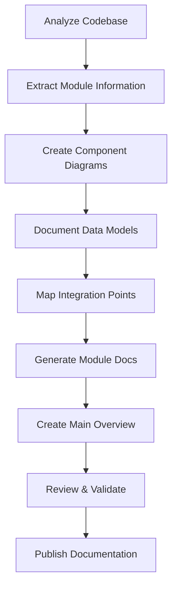

# High-Level Architecture Documentation Design

## Purpose

This design document outlines the structure and approach for creating comprehensive high-level architecture documentation for the Advanced Trading Framework. The documentation will serve as the definitive guide for understanding the system's architecture, module relationships, and data flow patterns.

## Architecture

### Documentation Structure

The HLA documentation will follow a hierarchical structure with a main overview document and detailed module-specific documents:

```
docs/HLA/
├── README.md                    # Main architecture overview
├── modules/
│   ├── data-management.md       # Data providers, feeds, caching
│   ├── trading-engine.md        # Trading bots, strategies, execution
│   ├── ml-analytics.md          # Machine learning and analytics
│   ├── communication.md         # Telegram, notifications, web UI
│   ├── infrastructure.md        # Database, scheduler, error handling
│   ├── configuration.md         # Config management and templates
│   └── security-auth.md         # Authentication and authorization
└── diagrams/
    ├── system-overview.mmd      # High-level system diagram
    ├── data-flow.mmd           # Data flow diagrams
    └── module-interactions.mmd  # Module interaction diagrams
```

### Component Design

#### 1. Main Architecture Overview (README.md)

**Components:**
- System introduction and purpose
- High-level component diagram
- Module responsibility matrix
- Technology stack overview
- Data flow summary
- Integration patterns

**Design Decisions:**
- Use Mermaid diagrams for visual representations
- Include both current and planned features with clear distinction
- Provide navigation links to detailed module documentation
- Include deployment and environment information

#### 2. Module Documentation Template

Each module document will follow a consistent structure:

**Sections:**
- **Purpose & Responsibilities**: What the module does
- **Key Components**: Main classes, services, and interfaces
- **Architecture Patterns**: Design patterns used (Repository, Service Layer, etc.)
- **Integration Points**: How it connects to other modules
- **Data Models**: Key data structures and schemas
- **Configuration**: Module-specific configuration options
- **Current Status**: Implementation status and features
- **Planned Enhancements**: Future roadmap items
- **Dependencies**: Internal and external dependencies

#### 3. Visual Documentation Strategy

**Diagram Types:**
- **System Overview**: High-level component relationships
- **Data Flow**: Information movement through the system
- **Module Interactions**: Detailed service communication
- **Database Schema**: Entity relationships and data models

**Design Principles:**
- Use consistent color coding across diagrams
- Include legend and notation explanations
- Keep diagrams focused and readable
- Provide both high-level and detailed views

### Data Flow

#### Documentation Generation Process



#### Information Architecture

The documentation will organize information in layers:

1. **System Level**: Overall architecture and design principles
2. **Module Level**: Individual module responsibilities and interfaces
3. **Component Level**: Detailed implementation patterns
4. **Integration Level**: Cross-module communication and data flow

### Design Decisions

#### 1. Documentation Format

**Decision**: Use Markdown with Mermaid diagrams
**Rationale**: 
- Version controllable and diff-friendly
- Renders well in GitHub and documentation platforms
- Mermaid provides professional diagrams without external tools
- Easy to maintain and update

#### 2. Module Categorization

**Decision**: Group modules by functional domain
**Rationale**:
- **Data Management**: All data-related functionality (providers, feeds, caching)
- **Trading Engine**: Core trading functionality (bots, strategies, execution)
- **ML & Analytics**: Advanced analytics and machine learning features
- **Communication**: User interfaces and notification systems
- **Infrastructure**: Supporting services (database, scheduler, error handling)
- **Configuration**: System configuration and management
- **Security & Auth**: Authentication and authorization systems

#### 3. Status Indicators

**Decision**: Use clear visual indicators for implementation status
**Rationale**:
- ✅ **Implemented**: Fully functional features
- 🔄 **In Progress**: Currently being developed
- 📋 **Planned**: Future roadmap items
- ⚠️ **Deprecated**: Legacy features being phased out

#### 4. Cross-Reference Strategy

**Decision**: Extensive cross-linking between documents
**Rationale**:
- Helps users navigate related information
- Shows module dependencies and relationships
- Improves documentation discoverability
- Maintains consistency across documents

### Integration Patterns

#### 1. Module Documentation Integration

Each module document will include:
- Links to related modules
- Dependency mapping
- Integration point descriptions
- API and interface documentation
- Configuration cross-references

#### 2. Diagram Integration

Visual elements will be integrated throughout:
- Main overview includes system-wide diagrams
- Module documents include focused component diagrams
- Data flow diagrams show information movement
- Database diagrams illustrate data relationships

#### 3. Code Integration

Documentation will reference actual code:
- Link to key source files
- Include relevant code snippets
- Reference configuration examples
- Point to test files for usage examples

### Error Handling

#### Documentation Maintenance

**Strategy**: Establish clear maintenance procedures
- Regular review cycles for accuracy
- Version control for documentation changes
- Automated checks for broken links
- Stakeholder review process for major updates

**Quality Assurance**:
- Technical accuracy validation
- Consistency checks across documents
- User feedback incorporation
- Regular updates with code changes

### Testing Strategy

#### Documentation Validation

**Approaches**:
- **Technical Review**: Validate technical accuracy with development team
- **User Testing**: Test documentation usability with new team members
- **Link Validation**: Automated checking of internal and external links
- **Diagram Validation**: Ensure diagrams accurately represent system state

**Success Metrics**:
- Time for new developers to understand system architecture
- Reduction in architecture-related questions
- Accuracy of system understanding based on documentation
- Ease of finding specific architectural information