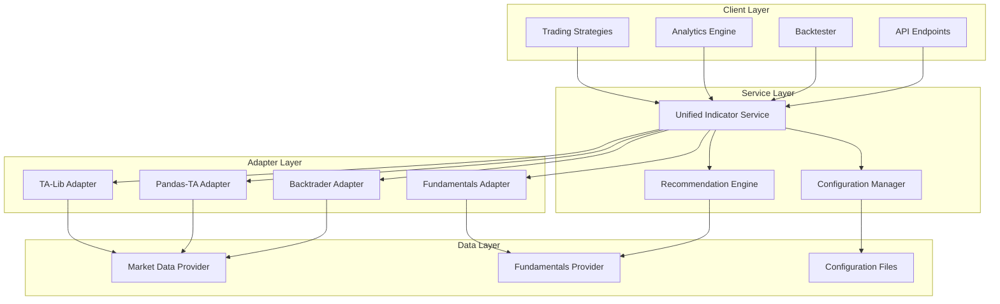

# Design Document

## Purpose

The unified indicator service consolidates multiple fragmented indicator implementations into a single, cohesive system that provides comprehensive technical and fundamental analysis capabilities. This design eliminates redundancy, improves maintainability, and establishes a consistent API for all indicator-related operations across the e-trading platform.

## Architecture

### High-Level Architecture

The unified indicator service follows a layered architecture with clear separation of concerns:



### Component Design

#### 1. Unified Indicator Service (Core)
- **Purpose**: Main orchestrator that coordinates all indicator operations
- **Responsibilities**:
  - Request routing to appropriate adapters
  - Result aggregation and formatting
  - Error handling and fallback logic
  - Performance monitoring and metrics collection

#### 2. Configuration Manager
- **Purpose**: Centralized parameter and preset management
- **Responsibilities**:
  - Load and validate configuration from multiple sources
  - Provide runtime parameter overrides
  - Manage indicator presets (default, conservative, aggressive, day_trading)
  - Handle indicator name mappings and aliases

#### 3. Recommendation Engine
- **Purpose**: Generate trading recommendations based on indicator values
- **Responsibilities**:
  - Calculate individual indicator recommendations
  - Compute composite recommendations from multiple indicators
  - Provide confidence scores and reasoning
  - Support contextual recommendations using related indicators

#### 4. Adapter Pattern Implementation
- **Purpose**: Abstract different calculation backends behind common interface
- **Responsibilities**:
  - Provide consistent API regardless of backend
  - Handle backend-specific parameter mapping
  - Implement graceful fallback mechanisms
  - Support both synchronous and asynchronous operations

## Data Models

### Core Data Structures

```python
@dataclass
class IndicatorRequest:
    ticker: str
    indicators: List[str]
    timeframe: str = "1d"
    period: str = "2y"
    provider: Optional[str] = None
    backend_preference: Optional[Dict[str, str]] = None
    force_refresh: bool = False
    include_recommendations: bool = True

@dataclass
class IndicatorResult:
    name: str
    value: Union[float, Dict[str, float]]
    recommendation: Optional[Recommendation]
    metadata: Dict[str, Any]
    source: str
    timestamp: datetime

@dataclass
class IndicatorSet:
    ticker: str
    results: Dict[str, IndicatorResult]
    composite_recommendation: Optional[CompositeRecommendation]
    performance_metrics: PerformanceMetrics
```

### Registry Schema

```python
@dataclass
class IndicatorMeta:
    name: str
    category: IndicatorCategory  # TECHNICAL | FUNDAMENTAL
    inputs: List[str]  # Required input columns
    outputs: List[str]  # Output value names
    supported_backends: List[str]
    default_parameters: Dict[str, Any]
    parameter_schema: Dict[str, Any]  # Validation schema
    description: str
```

## Integration Patterns

### 1. Adapter Integration

Each adapter implements the `BaseAdapter` interface:

```python
class BaseAdapter(ABC):
    @abstractmethod
    async def compute(
        self,
        name: str,
        df: pd.DataFrame,
        inputs: Dict[str, pd.Series],
        params: Dict[str, Any]
    ) -> Dict[str, pd.Series]:
        """Compute indicator values asynchronously"""
        pass
    
    @abstractmethod
    def supports(self, indicator_name: str) -> bool:
        """Check if adapter supports the indicator"""
        pass
```

### 2. Configuration Integration

The configuration system merges multiple sources with priority:
1. Runtime overrides (highest priority)
2. Custom presets
3. Default parameters (lowest priority)

### 3. Backtrader Integration

A specialized adapter provides direct Backtrader integration:

```python
class BacktraderAdapter(BaseAdapter):
    def create_indicator(self, name: str, **params) -> bt.Indicator:
        """Create Backtrader-compatible indicator instance using unified service"""
        pass
    
    def get_unified_indicators(self) -> Dict[str, Type[bt.Indicator]]:
        """Get unified service-backed Backtrader indicators"""
        pass
```

## Error Handling

### Error Categories and Strategies

1. **Configuration Errors**
   - Invalid parameters → Validation with helpful messages
   - Missing configuration → Fallback to defaults with warnings

2. **Data Errors**
   - Missing OHLCV data → Graceful degradation, partial results
   - Insufficient data points → Clear error messages with minimum requirements

3. **Calculation Errors**
   - Backend failures → Automatic fallback to alternative backends
   - Invalid results (NaN, Inf) → Filtering and logging

4. **Performance Errors**
   - Timeout errors → Circuit breaker pattern with exponential backoff
   - Memory errors → Graceful degradation and resource cleanup

### Error Recovery Mechanisms

```python
class ErrorRecoveryStrategy:
    def handle_backend_failure(self, primary_backend: str, indicator: str) -> str:
        """Return fallback backend for failed calculation"""
        
    def handle_data_insufficiency(self, required: int, available: int) -> bool:
        """Determine if calculation should proceed with limited data"""
        
    def handle_memory_pressure(self, operation: str) -> None:
        """Handle memory pressure during batch operations"""
```

## Testing Strategy

### Unit Testing
- **Adapter Tests**: Verify each adapter's calculation accuracy against known values
- **Configuration Tests**: Validate parameter loading, merging, and validation
- **Performance Tests**: Test batch processing and memory usage
- **Service Tests**: Test main service orchestration and error handling

### Integration Testing
- **End-to-End Tests**: Full request lifecycle from client to result
- **Backend Compatibility**: Cross-verify results between different backends
- **Performance Tests**: Benchmark against legacy implementations
- **Concurrency Tests**: Validate thread safety and async operations

### Compatibility Testing
- **Legacy API Tests**: Ensure backward compatibility with existing interfaces
- **Backtrader Tests**: Verify Backtrader integration works with existing strategies
- **Configuration Migration**: Test migration from old to new configuration formats

### Performance Benchmarks

Target performance metrics:
- **Latency**: < 100ms for single ticker, 10 indicators
- **Throughput**: > 1000 indicators/second for batch operations
- **Memory**: < 200MB for batch processing 100 tickers
- **Concurrency**: Support 10+ concurrent batch requests

## Design Decisions

### 1. Async-First Architecture
**Decision**: Implement async/await throughout the service
**Rationale**: Enables better concurrency for batch operations and external API calls
**Trade-offs**: Slightly more complex code, but significant performance benefits

### 2. Adapter Pattern for Backends
**Decision**: Use adapter pattern instead of direct backend integration
**Rationale**: Provides flexibility to add new backends and isolates backend-specific logic
**Trade-offs**: Additional abstraction layer, but improved maintainability

### 3. Pydantic for Data Validation
**Decision**: Use Pydantic models for request/response validation
**Rationale**: Provides automatic validation, serialization, and documentation
**Trade-offs**: Runtime overhead, but improved reliability and developer experience

### 4. Stateless Service Design
**Decision**: Implement stateless service without persistent caching
**Rationale**: Simpler implementation, better scalability, easier testing
**Trade-offs**: No result caching, but improved reliability and maintainability

### 5. Registry-Based Indicator Discovery
**Decision**: Use centralized registry instead of dynamic discovery
**Rationale**: Better performance, explicit control over available indicators
**Trade-offs**: Manual registration required, but clearer system boundaries

### 6. Clean Migration Strategy
**Decision**: Replace existing indicators with unified service implementations directly
**Rationale**: Eliminates complexity and technical debt, provides cleaner codebase
**Trade-offs**: Requires updating existing code, but results in simpler, more maintainable system

## Integration Points

### External Dependencies
- **Market Data**: Integration with existing `src.common.get_ohlcv` function
- **Fundamentals**: Integration with `src.common.fundamentals` module
- **Logging**: Uses project's standard logging configuration
- **Configuration**: Reads from `config/indicators.json` and supports environment overrides

### Internal Module Dependencies
- **Data Models**: Extends existing models in `src.model.indicators`
- **Recommendation Engine**: Integrates with `src.common.recommendation_engine`
- **Error Handling**: Uses project's standard error handling patterns
- **Testing**: Follows project's testing conventions and structure

### API Migration Matrix

| Legacy Interface | Unified Service Method | Migration Required |
|-----------------|----------------------|-------------------|
| `IndicatorService.get_indicators()` | `UnifiedService.calculate()` | Parameter updates |
| `IndicatorService.get_batch_indicators()` | `UnifiedService.calculate_batch()` | Parameter updates |
| `IndicatorFactory.create_*()` | `UnifiedService.calculate()` | Interface change |
| Backtrader indicators | Direct unified implementations | Parameter simplification |
| Configuration methods | `ConfigManager.*` | Simplified parameters |

This design provides a solid foundation for consolidating all indicator functionality while maintaining flexibility for future enhancements and ensuring smooth migration from the existing fragmented system.