# Notification Service Design - Database-Centric Architecture

## Purpose

The Notification Service is being refactored to a **database-centric architecture** where it operates as a pure message delivery engine without REST endpoints. The Main API Service handles all client interactions and database operations, while the Notification Service focuses solely on polling the database and delivering messages to external channels. This design consolidates all REST operations while maintaining autonomous message delivery.

## Architecture

### High-Level Architecture

```mermaid
graph TB
    subgraph "Client Applications"
        TradingBot[Trading Bot]
        WebUI[Web UI]
        TelegramBot[Telegram Bot]
        AlertSystem[Alert System]
        SchedulerService[Scheduler Service]
    end

    subgraph "Main API Service (Port 8000)"
        NotificationAPI[Notification REST API]
        AnalyticsAPI[Analytics REST API]
        AdminAPI[Admin REST API]
        HealthAPI[Health REST API]
        UnifiedAnalytics[Unified Analytics Module]
    end

    subgraph "Notification Service (No REST)"
        MessagePoller[Message Poller]
        DeliveryEngine[Delivery Engine]
        ChannelManager[Channel Manager]
        HealthReporter[Health Reporter]
    end

    subgraph "Channel Plugins"
        TelegramChannel[Telegram Plugin]
        EmailChannel[Email Plugin]
        SMSChannel[SMS Plugin]
        SlackChannel[Slack Plugin]
    end

    subgraph "External APIs"
        TelegramAPI[Telegram Bot API]
        SMTPServer[SMTP Server]
        SMSProvider[SMS Provider]
        SlackAPI[Slack API]
    end

    subgraph "Database (Communication Layer)"
        Messages[(msg_messages)]
        DeliveryStatus[(msg_delivery_status)]
        SystemHealth[(msg_system_health)]
        RateLimits[(msg_rate_limits)]
        ChannelConfigs[(msg_channel_configs)]
    end

    %% Client to Main API (REST)
    TradingBot --> NotificationAPI
    WebUI --> NotificationAPI
    TelegramBot --> NotificationAPI
    AlertSystem --> NotificationAPI
    SchedulerService --> NotificationAPI

    TradingBot --> AnalyticsAPI
    WebUI --> AnalyticsAPI
    WebUI --> AdminAPI
    WebUI --> HealthAPI

    %% Main API to Database (Direct SQL)
    NotificationAPI --> Messages
    AnalyticsAPI --> Messages
    AnalyticsAPI --> DeliveryStatus
    AdminAPI --> Messages
    HealthAPI --> SystemHealth
    UnifiedAnalytics --> Messages
    UnifiedAnalytics --> DeliveryStatus

    %% Notification Service to Database (Polling & Updates)
    MessagePoller --> Messages
    DeliveryEngine --> Messages
    DeliveryEngine --> DeliveryStatus
    HealthReporter --> SystemHealth
    ChannelManager --> ChannelConfigs

    %% Notification Service to External APIs
    ChannelManager --> TelegramChannel
    ChannelManager --> EmailChannel
    ChannelManager --> SMSChannel
    ChannelManager --> SlackChannel

    TelegramChannel --> TelegramAPI
    EmailChannel --> SMTPServer
    SMSChannel --> SMSProvider
    SlackChannel --> SlackAPI

    %% Styling
    classDef clientLayer fill:#e3f2fd
    classDef apiLayer fill:#f1f8e9
    classDef serviceLayer fill:#fff3e0
    classDef pluginLayer fill:#fce4ec
    classDef externalLayer fill:#f3e5f5
    classDef dataLayer fill:#e8f5e8

    class TradingBot,WebUI,TelegramBot,AlertSystem,SchedulerService clientLayer
    class NotificationAPI,AnalyticsAPI,AdminAPI,HealthAPI,UnifiedAnalytics apiLayer
    class MessagePoller,DeliveryEngine,ChannelManager,HealthReporter serviceLayer
    class TelegramChannel,EmailChannel,SMSChannel,SlackChannel pluginLayer
    class TelegramAPI,SMTPServer,SMSProvider,SlackAPI externalLayer
    class Messages,DeliveryStatus,SystemHealth,RateLimits,ChannelConfigs dataLayer
```



### Component Design

#### 1. Main API Service Components

##### 1.1 Notification REST API
- **Purpose**: Handle all notification-related REST endpoints
- **Endpoints**:
  - `POST /api/notifications/` - Create notification (writes to database)
  - `GET /api/notifications/` - List notifications (queries database)
  - `GET /api/notifications/{id}` - Get notification status (queries database)
  - `GET /api/notifications/{id}/delivery` - Get delivery status (queries database)
  - `POST /api/notifications/alert` - Send alert (convenience endpoint)
  - `POST /api/notifications/trade` - Send trade notification (convenience endpoint)

##### 1.2 Unified Analytics Module
- **Purpose**: Provide analytics for both notifications and trading data
- **Features**:
  - Notification delivery analytics
  - Trading performance analytics
  - Cross-domain correlation analysis
  - Reusable analytics patterns
- **Endpoints**:
  - `GET /api/analytics/notifications/delivery-rates`
  - `GET /api/analytics/notifications/response-times`
  - `GET /api/analytics/notifications/trends`
  - `GET /api/analytics/trading/performance` (future)
  - `GET /api/analytics/trading/strategies` (future)

##### 1.3 Administrative API
- **Purpose**: Handle all administrative operations with proper authentication
- **Endpoints**:
  - `POST /api/admin/notifications/cleanup`
  - `GET /api/admin/notifications/processor-stats`
  - `GET /api/admin/notifications/channels/config`
  - `PUT /api/admin/notifications/channels/{channel}/config`

##### 1.4 Health API
- **Purpose**: Provide consolidated health information
- **Endpoints**:
  - `GET /api/health` - Overall system health
  - `GET /api/health/notifications` - Notification system health
  - `GET /api/health/channels` - All channel health status
  - `GET /api/health/trading` - Trading system health (future)

#### 2. Notification Service Components (No REST)

##### 2.1 Message Poller
- **Purpose**: Poll database for pending messages
- **Features**:
  - Continuous polling with configurable intervals
  - Priority-based message selection
  - Distributed locking for multi-instance coordination
  - Graceful handling of database connectivity issues

##### 2.2 Delivery Engine
- **Purpose**: Process messages and coordinate delivery
- **Features**:
  - Asynchronous message processing
  - Rate limiting enforcement
  - Retry logic with exponential backoff
  - Status updates to database

##### 2.3 Channel Manager
- **Purpose**: Manage channel plugins and routing
- **Features**:
  - Dynamic plugin loading from database configuration
  - Channel health monitoring
  - Fallback routing for failed channels
  - Load balancing across healthy channels

##### 2.4 Health Reporter
- **Purpose**: Report service and channel health to database
- **Features**:
  - Periodic health checks
  - Channel connectivity testing
  - Performance metrics collection
  - Database-only health reporting (no REST endpoints)

### Database Schema (Enhanced)

#### Core Tables (Existing)
```sql
-- Messages table (enhanced for database-centric communication)
CREATE TABLE msg_messages (
    id BIGSERIAL PRIMARY KEY,
    message_type VARCHAR(50) NOT NULL,
    priority VARCHAR(20) NOT NULL DEFAULT 'NORMAL',
    channels TEXT[] NOT NULL,
    recipient_id VARCHAR(100),
    template_name VARCHAR(100),
    content JSONB NOT NULL,
    metadata JSONB,
    created_at TIMESTAMP WITH TIME ZONE DEFAULT NOW(),
    scheduled_for TIMESTAMP WITH TIME ZONE DEFAULT NOW(),
    status VARCHAR(20) DEFAULT 'PENDING',
    retry_count INTEGER DEFAULT 0,
    max_retries INTEGER DEFAULT 3,
    last_error TEXT,
    processed_at TIMESTAMP WITH TIME ZONE,
    locked_by VARCHAR(100), -- For distributed processing
    locked_at TIMESTAMP WITH TIME ZONE,
    
    -- Indexes for efficient polling
    INDEX idx_msg_messages_pending (status, priority, scheduled_for) WHERE status = 'PENDING',
    INDEX idx_msg_messages_locked (locked_by, locked_at) WHERE locked_by IS NOT NULL
);

-- Enhanced system health table (replaces msg_channel_health)
CREATE TABLE msg_system_health (
    id BIGSERIAL PRIMARY KEY,
    system VARCHAR(50) NOT NULL,              -- 'notification' for notification channels
    component VARCHAR(100),                   -- channel name (email, telegram, sms, etc.)
    status VARCHAR(20) NOT NULL,              -- HEALTHY, DEGRADED, DOWN, UNKNOWN
    last_success TIMESTAMPTZ,
    last_failure TIMESTAMPTZ,
    failure_count INTEGER NOT NULL DEFAULT 0,
    avg_response_time_ms INTEGER,
    error_message TEXT,
    metadata TEXT,                            -- JSON metadata
    checked_at TIMESTAMPTZ NOT NULL DEFAULT NOW(),
    
    CONSTRAINT check_system_health_status 
        CHECK (status IN ('HEALTHY', 'DEGRADED', 'DOWN', 'UNKNOWN')),
    UNIQUE INDEX idx_system_health_unique 
        ON (system, COALESCE(component, ''))
);

-- Channel configuration table (for database-driven config)
CREATE TABLE msg_channel_configs (
    id BIGSERIAL PRIMARY KEY,
    channel VARCHAR(50) NOT NULL UNIQUE,
    enabled BOOLEAN DEFAULT true,
    config JSONB NOT NULL,
    rate_limit_per_minute INTEGER DEFAULT 60,
    max_retries INTEGER DEFAULT 3,
    timeout_seconds INTEGER DEFAULT 30,
    fallback_channels TEXT[],
    created_at TIMESTAMP WITH TIME ZONE DEFAULT NOW(),
    updated_at TIMESTAMP WITH TIME ZONE DEFAULT NOW()
);
```

### Data Flow

#### 1. Message Creation Flow (Main API → Database → Notification Service)
```
1. Client → Main API: POST /api/notifications/
2. Main API → Database: INSERT INTO msg_messages
3. Main API → Client: Return message_id
4. Notification Service: Poll database for PENDING messages
5. Notification Service: Process message through channel plugins
6. Notification Service → Database: UPDATE message status and delivery results
```

#### 2. Status Query Flow (Client → Main API → Database)
```
1. Client → Main API: GET /api/notifications/{id}
2. Main API → Database: SELECT from msg_messages and msg_delivery_status
3. Main API → Client: Return aggregated status
```

#### 3. Analytics Flow (Client → Main API → Database)
```
1. Client → Main API: GET /api/analytics/notifications/delivery-rates
2. Main API → Database: Complex queries across msg_messages and msg_delivery_status
3. Main API: Process and aggregate data
4. Main API → Client: Return analytics results
```

#### 4. Health Monitoring Flow (Notification Service → Database → Main API)
```
1. Notification Service: Perform channel health checks
2. Notification Service → Database: UPDATE msg_system_health
3. Client → Main API: GET /api/health/channels
4. Main API → Database: SELECT from msg_system_health
5. Main API → Client: Return health status
```

### Communication Patterns

#### 1. Database-Centric Communication
```python
# Main API creates notification (no HTTP calls)
@router.post("/api/notifications/")
async def create_notification(notification: NotificationCreate):
    with db_service.uow() as uow:
        message = uow.notifications.messages.create_message({
            "message_type": notification.message_type,
            "priority": notification.priority,
            "channels": notification.channels,
            "recipient_id": notification.recipient_id,
            "content": notification.content,
            "status": "PENDING",
            "scheduled_for": datetime.now(timezone.utc)
        })
        uow.commit()
    
    # Notification service will pick it up automatically
    return {"message_id": message.id, "status": "queued"}

# Notification service polls for messages (no HTTP calls)
class MessagePoller:
    async def poll_messages(self):
        with db_service.uow() as uow:
            messages = uow.notifications.messages.get_pending_messages(
                limit=10, 
                lock_instance_id=self.instance_id
            )
            for message in messages:
                await self.delivery_engine.process_message(message)
```

#### 2. Distributed Processing Coordination
```python
# Database-based locking for multi-instance coordination
class MessageRepository:
    def get_pending_messages(self, limit: int, lock_instance_id: str) -> List[Message]:
        # Atomic operation to claim messages for processing
        query = """
        UPDATE msg_messages 
        SET locked_by = %s, locked_at = NOW()
        WHERE id IN (
            SELECT id FROM msg_messages 
            WHERE status = 'PENDING' 
            AND (locked_by IS NULL OR locked_at < NOW() - INTERVAL '5 minutes')
            AND scheduled_for <= NOW()
            ORDER BY priority DESC, created_at ASC
            LIMIT %s
            FOR UPDATE SKIP LOCKED
        )
        RETURNING *
        """
        return self.session.execute(query, (lock_instance_id, limit)).fetchall()
```

#### 3. Health Reporting Pattern
```python
# Notification service reports health to database only
class HealthReporter:
    async def report_channel_health(self, channel: str, health_result: ChannelHealth):
        with db_service.uow() as uow:
            uow.system_health.update_system_health(
                system="notification",
                component=channel,
                status=health_result.status,
                response_time_ms=health_result.response_time_ms,
                error_message=health_result.error_message
            )
            uow.commit()

# Main API queries health from database
@router.get("/api/health/channels")
async def get_channels_health():
    with db_service.uow() as uow:
        health_records = uow.system_health.get_notification_channels_health()
    return {"channels": health_records}
```

### Migration Strategy

#### Phase 1: Remove REST from Notification Service
1. **Strip REST endpoints** from notification service
2. **Implement message polling** from database
3. **Add database-based health reporting**
4. **Remove HTTP dependencies** from notification service

#### Phase 2: Consolidate APIs in Main Service
1. **Move notification endpoints** to Main API Service
2. **Implement direct database operations** for all notification queries
3. **Create unified analytics module** structure
4. **Add administrative endpoints** with proper authentication

#### Phase 3: Complete Migration
1. **Update all clients** to use Main API Service endpoints
2. **Remove notification service client HTTP calls**
3. **Verify database-only communication** between services
4. **Clean up legacy REST code** from notification service

### Benefits of Database-Centric Architecture

#### 1. Simplified Service Discovery
- Clients only need to know Main API Service endpoint
- No need to discover multiple service endpoints
- Single point of configuration for all REST operations

#### 2. Reliable Communication
- Database provides ACID guarantees for message delivery
- No HTTP timeouts or network issues between services
- Automatic retry and recovery through database transactions

#### 3. Unified Operations
- All REST endpoints in one service
- Consistent authentication and authorization
- Unified error handling and logging
- Single point for rate limiting and throttling

#### 4. Scalability
- Notification service can scale horizontally without coordination
- Database handles concurrency and locking
- Main API Service can scale independently
- Clear separation of concerns

#### 5. Analytics Consolidation
- Single analytics framework for all domains
- Easy to correlate notification and trading data
- Reusable analytics patterns
- Consistent reporting across all system components

This database-centric architecture provides a clean separation between client-facing REST operations and autonomous message delivery while ensuring reliable communication and simplified system management.