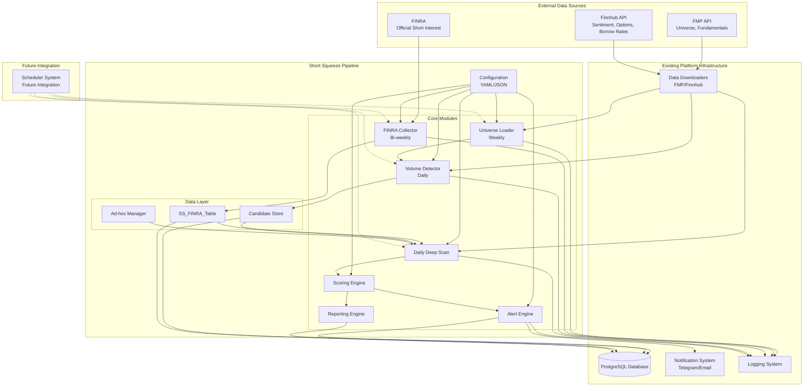

# Short Squeeze Detection Pipeline Design

## Overview

The Short Squeeze Detection Pipeline is designed as a modular system that integrates seamlessly with the existing trading platform infrastructure. The system follows a hybrid approach combining volume-based detection with official FINRA short interest data, using a multi-tier scheduling design with weekly universe scans, bi-weekly FINRA data collection, and daily focused monitoring.

The architecture emphasizes modularity, configurability, and integration with existing platform components while leveraging both real-time volume analysis and authoritative FINRA data for comprehensive squeeze detection. The system maintains flexibility to operate as standalone scripts initially and integrate with the scheduler system in the future.

## Architecture

### High-Level Architecture



### Component Architecture

The system is organized into distinct layers:

1. **Configuration Layer**: YAML-based configuration management
2. **Data Collection Layer**: Universe loading, FINRA data collection, and volume analysis
3. **Core Processing Layer**: Deep scanning, scoring, and alert generation
4. **Data Management Layer**: Candidate storage, FINRA data storage, and ad-hoc management
5. **Integration Layer**: Interfaces with existing platform infrastructure
6. **Future Integration Layer**: Prepared interfaces for scheduler integration

## Components and Interfaces

### 1. Configuration Manager

**Purpose**: Centralized configuration management for all pipeline parameters.

**Interface**:
```python
class PipelineConfig:
    def load_config(self, config_path: str) -> Dict[str, Any]
    def get_screener_config(self) -> ScreenerConfig
    def get_deep_scan_config(self) -> DeepScanConfig
    def get_alert_config(self) -> AlertConfig
    def get_scheduling_config(self) -> SchedulingConfig
```

**Key Responsibilities**:
- Load and validate YAML configuration
- Provide typed configuration objects to modules
- Support configuration hot-reloading for future scheduler integration

### 2. Universe Loader

**Purpose**: Fetch and filter the initial universe of stocks for analysis.

**Interface**:
```python
class UniverseLoader:
    def __init__(self, fmp_downloader: FMPDataDownloader)
    def load_universe(self) -> List[str]
    def filter_by_market_cap(self, min_cap: float, max_cap: float) -> List[str]
    def filter_by_volume(self, min_volume: int) -> List[str]
```

**Key Responsibilities**:
- Fetch stock universe from FMP
- Apply basic filters (market cap, volume, exchange)
- Return filtered ticker list for screener processing

### 3. FINRA Data Collector

**Purpose**: Collect official short interest data from FINRA on a bi-weekly basis.

**Interface**:
```python
class FINRADataCollector:
    def __init__(self, config: FINRAConfig)
    def download_finra_data(self) -> FINRADataSet
    def parse_finra_files(self, data: FINRADataSet) -> List[FINRARecord]
    def store_finra_data(self, records: List[FINRARecord]) -> None
    def get_latest_finra_data(self, ticker: str) -> Optional[FINRARecord]
```

**Key Responsibilities**:
- Download FINRA short interest files from official source
- Parse and validate FINRA data format
- Store data in ss_finra_short_interest table
- Provide interface for accessing latest short interest data

### 4. Volume-Based Squeeze Detector

**Purpose**: Identify potential squeeze candidates using volume analysis and momentum indicators.

**Interface**:
```python
class VolumeSqueezeDetector:
    def __init__(self, fmp_downloader: FMPDataDownloader, config: VolumeDetectorConfig)
    def analyze_volume_patterns(self, universe: List[str]) -> VolumeAnalysisResults
    def calculate_volume_spike_ratio(self, ticker: str) -> float
    def calculate_momentum_indicators(self, ticker: str) -> MomentumMetrics
    def identify_squeeze_candidates(self, results: VolumeAnalysisResults) -> List[Candidate]
```

**Key Responsibilities**:
- Analyze volume patterns across the stock universe
- Calculate volume spike ratios and momentum indicators
- Identify stocks with unusual volume activity
- Generate candidates for deep scan analysis

### 5. Daily Deep Scan Module

**Purpose**: Perform daily analysis on identified candidates combining volume analysis with FINRA data.

**Interface**:
```python
class DailyDeepScan:
    def __init__(self, fmp_downloader: FMPDataDownloader, 
                 finnhub_downloader: FinnhubDataDownloader,
                 short_squeeze_service: ShortSqueezeService,
                 config: DeepScanConfig)
    def run_deep_scan(self, candidates: List[Candidate]) -> DeepScanResults
    def combine_volume_and_finra_data(self, ticker: str) -> HybridMetrics
    def calculate_transient_metrics(self, ticker: str) -> TransientMetrics
    def update_candidate_scores(self, results: DeepScanResults) -> None
```

**Key Responsibilities**:
- Load active candidates from volume detector and ad-hoc sources
- Combine real-time volume data with latest FINRA short interest data
- Fetch sentiment and options data for comprehensive analysis
- Calculate hybrid metrics combining volume patterns and official short interest
- Update daily metrics in database

### 6. Scoring Engine

**Purpose**: Compute comprehensive squeeze probability scores combining volume analysis and FINRA data.

**Interface**:
```python
class ScoringEngine:
    def __init__(self, config: ScoringConfig)
    def calculate_squeeze_score(self, volume_metrics: VolumeMetrics,
                               finra_metrics: FINRAMetrics,
                               transient_metrics: TransientMetrics) -> float
    def normalize_metrics(self, metrics: Dict[str, float]) -> Dict[str, float]
    def apply_hybrid_weights(self, normalized_metrics: Dict[str, float]) -> float
```

**Key Responsibilities**:
- Combine volume analysis, FINRA data, and transient metrics
- Apply configurable weights for hybrid scoring approach
- Generate final squeeze probability score (0-1 scale)
- Handle cases where FINRA data may be delayed or unavailable

### 7. Alert Engine

**Purpose**: Manage alert generation and cooldown logic.

**Interface**:
```python
class AlertEngine:
    def __init__(self, notification_system: NotificationSystem, config: AlertConfig)
    def evaluate_alerts(self, scored_candidates: List[ScoredCandidate]) -> List[Alert]
    def check_cooldown(self, ticker: str, alert_level: AlertLevel) -> bool
    def send_alert(self, alert: Alert) -> bool
    def update_cooldown(self, ticker: str, alert_level: AlertLevel) -> None
```

**Key Responsibilities**:
- Evaluate alert conditions based on scores and thresholds
- Enforce cooldown periods to prevent spam
- Interface with existing notification system
- Log all alert events

### 8. Database Service Integration

**Purpose**: Use centralized database service for all short squeeze operations.

**Interface**:
```python
# Pipeline modules use the centralized service directly:
from src.data.db.core.database import session_scope
from src.data.db.services.short_squeeze_service import ShortSqueezeService

with session_scope() as session:
    service = ShortSqueezeService(session)
    service.save_screener_results(results, run_date)
    service.get_candidates_for_deep_scan()
    service.add_adhoc_candidate(ticker, reason, ttl_days)
```

**Key Responsibilities**:
- Use centralized `ShortSqueezeService` for all database operations
- Handle session management through `session_scope()` context manager
- Follow established patterns from other platform modules
- No additional abstraction layers needed

### 9. Ad-hoc Candidate Manager

**Purpose**: Handle manually added candidates for monitoring.

**Interface**:
```python
class AdHocManager:
    def __init__(self, candidate_store: CandidateStore, config: AdHocConfig)
    def add_candidate(self, ticker: str, reason: str) -> bool
    def remove_candidate(self, ticker: str) -> bool
    def get_active_candidates(self) -> List[AdHocCandidate]
    def expire_candidates(self) -> List[str]
```

**Key Responsibilities**:
- Manage ad-hoc candidate additions and removals
- Handle automatic expiration based on TTL
- Integrate with deep scan processing

### 10. Reporting Engine

**Purpose**: Generate summary reports and performance metrics.

**Interface**:
```python
class ReportingEngine:
    def __init__(self, candidate_store: CandidateStore, config: ReportConfig)
    def generate_weekly_summary(self) -> WeeklyReport
    def generate_daily_report(self) -> DailyReport
    def export_to_html(self, report: Report) -> str
    def export_to_csv(self, report: Report) -> str
```

**Key Responsibilities**:
- Generate weekly and daily summary reports
- Support multiple export formats (HTML, CSV)
- Include performance metrics and trend analysis

## Data Models

### Database Schema

The pipeline uses the centralized database infrastructure in `src/data/db/` and introduces four new tables to the existing PostgreSQL database:

**Database Models Location**: `src/data/db/models/model_short_squeeze.py`
**Repository Layer**: `src/data/db/repos/repo_short_squeeze.py`  
**Service Layer**: `src/data/db/services/short_squeeze_service.py` (includes FINRA functionality)
**Migration**: `src/data/db/migrations/add_short_squeeze_tables.py` and `src/data/db/migrations/add_finra_short_interest_table.py`

The five tables are:

1. **ss_snapshot**: Weekly screener snapshots (append-only) - now used for volume detector results
2. **ss_deep_metrics**: Daily deep scan metrics with unique constraint on (ticker, date)
3. **ss_alerts**: Alert history and cooldown tracking
4. **ss_ad_hoc_candidates**: Ad-hoc candidate management with unique ticker constraint
5. **ss_finra_short_interest**: Official FINRA short interest data with unique constraint on (ticker, settlement_date)

All tables include proper constraints, indexes, and follow the existing database naming conventions. The pipeline uses the centralized database connection management, session handling, and follows the established repository/service pattern.

### Core Data Structures

```python
@dataclass
class VolumeMetrics:
    volume_spike_ratio: float
    avg_volume_20d: int
    current_volume: int
    rsi: float
    price_momentum: float

@dataclass
class FINRAMetrics:
    short_interest_shares: int
    short_interest_pct: Optional[float]
    settlement_date: date
    days_to_cover: Optional[float]
    data_age_days: int

@dataclass
class TransientMetrics:
    call_put_ratio: Optional[float]
    sentiment_24h: float
    borrow_fee_pct: Optional[float]
    options_volume: Optional[int]

@dataclass
class HybridMetrics:
    volume_metrics: VolumeMetrics
    finra_metrics: Optional[FINRAMetrics]
    transient_metrics: TransientMetrics
    combined_score: float

@dataclass
class Candidate:
    ticker: str
    detection_score: float
    volume_metrics: VolumeMetrics
    last_updated: datetime
    source: str  # 'volume_detector' or 'adhoc'

@dataclass
class ScoredCandidate:
    candidate: Candidate
    hybrid_metrics: HybridMetrics
    squeeze_score: float
    alert_level: Optional[str]

@dataclass
class Alert:
    ticker: str
    alert_level: str
    reason: str
    squeeze_score: float
    volume_spike: float
    finra_si_pct: Optional[float]
    timestamp: datetime
    cooldown_expires: datetime
```

## Error Handling

### Error Categories and Strategies

1. **API Rate Limiting**:
   - Implement exponential backoff with jitter
   - Respect provider-specific rate limits (FMP: 300/min, Finnhub: 60/min)
   - Queue requests and batch where possible

2. **Data Quality Issues**:
   - Validate JSON responses and key field presence
   - Log data quality metrics per run
   - Continue processing with partial data, flag quality issues

3. **Database Connectivity**:
   - Implement connection pooling and retry logic
   - Use transactions for data consistency
   - Graceful degradation for non-critical operations

4. **External Service Failures**:
   - Implement circuit breaker pattern for repeated failures
   - Cache recent data for fallback scenarios
   - Alert administrators on prolonged outages

### Error Recovery Patterns

```python
class PipelineErrorHandler:
    def __init__(self, config: ErrorConfig):
        self.max_retries = config.max_retries
        self.backoff_factor = config.backoff_factor
        
    @retry_with_backoff
    def safe_api_call(self, api_func: Callable, *args, **kwargs):
        """Wrapper for API calls with retry logic"""
        
    def handle_partial_failure(self, results: List[Result], errors: List[Exception]):
        """Continue processing with partial results"""
        
    def should_abort_run(self, error_rate: float) -> bool:
        """Determine if error rate requires run abortion"""
```

## Testing Strategy

### Unit Testing

- **Configuration Management**: Test YAML parsing and validation
- **Data Processing**: Test metric calculations and scoring algorithms
- **Database Operations**: Test CRUD operations with test database
- **Alert Logic**: Test threshold evaluation and cooldown management

### Integration Testing

- **Data Provider Integration**: Test with mock API responses
- **Database Integration**: Test with containerized PostgreSQL
- **Notification Integration**: Test with mock notification system
- **End-to-End Pipeline**: Test complete workflow with sample data

### Performance Testing

- **API Rate Limiting**: Verify compliance with provider limits
- **Database Performance**: Test with realistic data volumes
- **Memory Usage**: Monitor memory consumption during large runs
- **Runtime Performance**: Ensure weekly runs complete within 3 hours

### Test Data Management

```python
class TestDataManager:
    def create_mock_screener_data(self, num_tickers: int) -> List[Dict]
    def create_mock_deep_scan_data(self, tickers: List[str]) -> List[Dict]
    def setup_test_database(self) -> DatabaseConnection
    def cleanup_test_data(self) -> None
```

## Integration Points

### Existing System Integration

1. **Data Downloaders**:
   - Use existing `FMPDataDownloader` and `FinnhubDataDownloader`
   - Extend with short squeeze specific methods if needed
   - Maintain compatibility with existing API key management

2. **Database System**:
   - **INTEGRATED**: Uses centralized database infrastructure in `src/data/db/`
   - **Models**: SQLAlchemy models in `src/data/db/models/model_short_squeeze.py`
   - **Repositories**: Data access layer in `src/data/db/repos/repo_short_squeeze.py`
   - **Services**: Business logic in `src/data/db/services/short_squeeze_service.py`
   - **Migrations**: Centralized migration system with `add_short_squeeze_tables.py`
   - **Connection Management**: Uses existing `session_scope()` and connection pooling

3. **Notification System**:
   - Use existing `NotificationSystem` for alerts
   - Support existing Telegram and email channels
   - Follow existing message formatting patterns

4. **Configuration System**:
   - Store pipeline-specific config in `src/ml/pipeline/p04_short_squeeze/config/`
   - Use existing environment variable patterns for sensitive data
   - Support existing configuration validation patterns

5. **Logging System**:
   - Use existing logger setup from `src.notification.logger`
   - Follow existing structured logging patterns
   - Integrate with existing log aggregation

### Future Scheduler Integration

The pipeline is designed with scheduler integration in mind:

```python
class SchedulerInterface:
    def register_weekly_job(self, job_func: Callable, schedule: str) -> str
    def register_daily_job(self, job_func: Callable, schedule: str) -> str
    def get_job_status(self, job_id: str) -> JobStatus
    def cancel_job(self, job_id: str) -> bool

class PipelineSchedulerAdapter:
    def __init__(self, scheduler: SchedulerInterface, config: SchedulingConfig)
    def schedule_screener(self) -> str
    def schedule_deep_scan(self) -> str
    def handle_job_failure(self, job_id: str, error: Exception) -> None
```

## Performance Considerations

### Scalability Design

1. **Batch Processing**: Process candidates in configurable batches to manage memory
2. **Parallel Processing**: Use thread pools for independent API calls
3. **Database Optimization**: Use bulk inserts and proper indexing
4. **Caching Strategy**: Cache frequently accessed configuration and reference data

### Resource Management

```python
class ResourceManager:
    def __init__(self, config: ResourceConfig):
        self.api_pool = ThreadPoolExecutor(max_workers=config.api_workers)
        self.db_pool = ConnectionPool(max_connections=config.db_connections)
        
    def manage_api_calls(self, calls: List[Callable]) -> List[Result]:
        """Manage concurrent API calls with rate limiting"""
        
    def batch_database_operations(self, operations: List[DatabaseOp]) -> None:
        """Batch database operations for efficiency"""
```

### Monitoring and Metrics

- **Runtime Metrics**: Track execution time for each module
- **API Usage**: Monitor API call counts and rate limit compliance
- **Data Quality**: Track percentage of successful data retrievals
- **Alert Performance**: Monitor alert accuracy and false positive rates

## Security Considerations

### API Key Management

- Use existing environment variable patterns for API keys
- Never log API keys or sensitive data
- Implement key rotation support for future use

### Data Privacy

- Store only necessary data for analysis
- Implement data retention policies
- Ensure compliance with financial data regulations

### Access Control

- Integrate with existing database access controls
- Use existing authentication patterns for future web interfaces
- Implement audit logging for sensitive operations

## Configuration Management

### Configuration Structure

```yaml
# config/short_squeeze_config.yml
scheduling:
  universe_loader:
    frequency: weekly
    day: monday
    time: '08:00'
    timezone: Europe/Zurich
  finra_collector:
    frequency: bi_weekly
    days: [1, 15]  # 1st and 15th of month
    time: '09:00'
    timezone: Europe/Zurich
  volume_detector:
    frequency: daily
    time: '09:30'
    timezone: Europe/Zurich
  deep_scan:
    frequency: daily
    time: '10:00'
    timezone: Europe/Zurich

universe_loader:
  filters:
    min_market_cap: 100_000_000  # $100M
    max_market_cap: 10_000_000_000  # $10B
    min_avg_volume: 500_000
    exchanges: ['NYSE', 'NASDAQ']
  
finra_collector:
  data_source: 'https://www.finra.org/finra-data/browse-catalog/short-sale-volume-data'
  file_patterns: ['CNMSshvol*.txt']
  max_file_age_days: 30
  retry_attempts: 3
  
volume_detector:
  analysis:
    volume_lookback_days: 20
    min_volume_spike_ratio: 3.0
    min_rsi_threshold: 70
    momentum_period: 14
  
  filters:
    max_candidates: 100
    min_price: 1.0
    max_price: 500.0
  
  scoring:
    weights:
      volume_spike_ratio: 0.4
      rsi: 0.3
      price_momentum: 0.2
      volume_consistency: 0.1

deep_scan:
  batch_size: 10
  api_delay_seconds: 0.2
  
  metrics:
    sentiment_lookback_hours: 24
    options_min_volume: 100
    finra_max_age_days: 14  # Use FINRA data up to 14 days old
  
  hybrid_scoring:
    # When FINRA data is available
    with_finra:
      weights:
        volume_spike: 0.25
        finra_short_interest: 0.30
        sentiment_24h: 0.20
        call_put_ratio: 0.15
        borrow_fee: 0.10
    
    # When FINRA data is not available or too old
    volume_only:
      weights:
        volume_spike: 0.45
        rsi: 0.25
        sentiment_24h: 0.20
        call_put_ratio: 0.10

alerting:
  thresholds:
    high:
      squeeze_score: 0.8
      min_volume_spike: 5.0
      min_finra_si_percent: 0.25  # When FINRA data available
      min_sentiment: 0.6
    medium:
      squeeze_score: 0.6
      min_volume_spike: 4.0
      min_finra_si_percent: 0.20
      min_sentiment: 0.5
    low:
      squeeze_score: 0.4
      min_volume_spike: 3.0
      min_finra_si_percent: 0.15
      min_sentiment: 0.4
  
  cooldown:
    high_alert_days: 7
    medium_alert_days: 5
    low_alert_days: 3
  
  channels:
    telegram:
      enabled: true
      chat_ids: ['@trading_alerts']
    email:
      enabled: true
      recipients: ['trader@example.com']

adhoc:
  default_ttl_days: 7
  max_active_candidates: 20
  auto_promote_threshold: 0.7

reporting:
  weekly_summary:
    top_candidates: 20
    include_charts: true
    formats: ['html', 'csv']
  
  daily_report:
    top_scores: 10
    include_trends: true
    formats: ['html']

performance:
  api_rate_limits:
    fmp_calls_per_minute: 250  # Leave buffer from 300 limit
    finnhub_calls_per_minute: 50  # Leave buffer from 60 limit
  
  database:
    batch_size: 100
    connection_timeout: 30
    query_timeout: 60
  
  error_handling:
    max_retries: 3
    backoff_factor: 2.0
    circuit_breaker_threshold: 0.5
```

This design provides a comprehensive, modular, and extensible foundation for the Short Squeeze Detection Pipeline while maintaining seamless integration with the existing trading platform infrastructure.