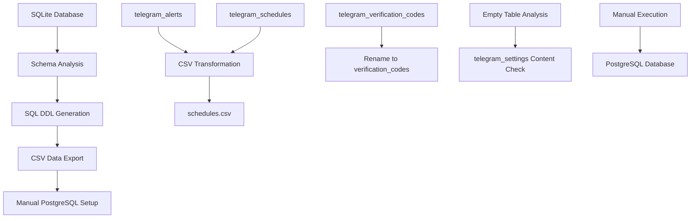

# Design Document

## Overview

This design outlines the migration from SQLite to PostgreSQL for the trading platform database, including schema consolidation and optimization. The migration will consolidate telegram-related tables into the existing unified scheduling system, remove unused tables, and provide SQL scripts and CSV exports for manual database migration. The approach focuses on generating PostgreSQL-compatible DDL scripts and CSV data exports that can be manually executed.

## Architecture

### Current Database Analysis

Based on the codebase analysis, here's the current table usage status:

#### Active Tables (Keep and Migrate)
- `users` - Core user management (actively used in `repo_users.py`)
- `auth_identities` - Authentication provider mapping (actively used)
- `trading_bot_instances` - Bot instance tracking (actively used in `repo_trading.py`)
- `trading_trades` - Trade execution records (actively used)
- `trading_positions` - Position management (actively used)
- `trading_performance_metrics` - Performance tracking (actively used)
- `webui_audit_logs` - Web UI audit trail (actively used in `repo_webui.py`)
- `webui_performance_snapshots` - Performance snapshots (actively used)
- `webui_strategy_templates` - Strategy templates (actively used)
- `webui_system_config` - System configuration (actively used)
- `schedules` - Unified job scheduling (actively used in `repo_jobs.py`)
- `runs` - Job execution history (actively used)

#### Tables to Consolidate and Remove
- `telegram_alerts` - Merge into `schedules` table as alert-type jobs
- `telegram_schedules` - Merge into `schedules` table as schedule-type jobs

#### Tables to Keep (Telegram Support)
- `telegram_broadcast_logs` - Broadcast history (actively used in `repo_telegram.py`)
- `telegram_command_audits` - Command audit trail (actively used)
- `telegram_feedbacks` - User feedback system (actively used)
- `telegram_settings` - Telegram configuration (needs content analysis)

#### Tables to Rename and Migrate
- `telegram_verification_codes` → `verification_codes` - General verification system (move to user domain)

#### System Tables
- `alembic_version` - Migration versioning (system table, migrate as-is)

### Migration Architecture



## Components and Interfaces

### 1. Schema Extractor
**Purpose:** Extracts SQLite schema and generates PostgreSQL DDL scripts

**Interface:**
```python
class SchemaExtractor:
    def extract_sqlite_schema(self) -> Dict[str, TableSchema]
    def generate_postgresql_ddl(self) -> str
    def map_sqlite_to_postgresql_types(self) -> Dict[str, str]
    def generate_create_table_scripts(self) -> List[str]
```

### 2. Data Exporter
**Purpose:** Exports SQLite data to CSV files for manual import

**Interface:**
```python
class DataExporter:
    def analyze_table_contents(self) -> Dict[str, TableInfo]
    def export_table_to_csv(self, table_name: str) -> str
    def export_all_non_empty_tables(self) -> List[str]
    def generate_import_scripts(self) -> str
```

### 3. Data Consolidator
**Purpose:** Handles merging telegram_alerts and telegram_schedules into schedules CSV

**Interface:**
```python
class DataConsolidator:
    def extract_telegram_alerts(self) -> List[Dict]
    def extract_telegram_schedules(self) -> List[Dict]
    def transform_to_unified_schedules(self) -> List[Dict]
    def export_consolidated_schedules_csv(self) -> str
```

### 4. Table Analyzer
**Purpose:** Analyzes table contents and usage patterns

**Interface:**
```python
class TableAnalyzer:
    def check_table_contents(self, table_name: str) -> TableContentInfo
    def analyze_telegram_settings(self) -> SettingsAnalysis
    def identify_empty_tables(self) -> List[str]
    def generate_table_summary_report(self) -> str
```

### 5. Script Generator
**Purpose:** Generates PostgreSQL setup and import scripts

**Interface:**
```python
class ScriptGenerator:
    def generate_database_setup_script(self) -> str
    def generate_table_creation_script(self) -> str
    def generate_csv_import_script(self) -> str
    def generate_validation_queries(self) -> str
```

## Data Models

### Schema Changes

#### Renamed Tables
```sql
-- telegram_verification_codes → verification_codes
CREATE TABLE verification_codes (
    id SERIAL PRIMARY KEY,
    user_id INTEGER NOT NULL REFERENCES users(id) ON DELETE CASCADE,
    code VARCHAR(32) NOT NULL,
    sent_time INTEGER NOT NULL,
    provider VARCHAR(20) DEFAULT 'telegram', -- Allow for future email/sms verification
    created_at TIMESTAMP WITH TIME ZONE DEFAULT NOW()
);
```

#### Consolidated Schedule Model
The existing `schedules` table will accommodate both alert and schedule functionality:

```sql
-- Enhanced schedules table (already exists, no changes needed)
CREATE TABLE schedules (
    id SERIAL PRIMARY KEY,
    user_id INTEGER NOT NULL,
    name VARCHAR(255) NOT NULL,
    job_type VARCHAR(50) NOT NULL, -- 'alert', 'screener', 'report', etc.
    target VARCHAR(255) NOT NULL,
    task_params JSONB NOT NULL DEFAULT '{}',
    cron VARCHAR(100) NOT NULL,
    enabled BOOLEAN NOT NULL DEFAULT true,
    next_run_at TIMESTAMP WITH TIME ZONE,
    created_at TIMESTAMP WITH TIME ZONE NOT NULL DEFAULT NOW(),
    updated_at TIMESTAMP WITH TIME ZONE NOT NULL DEFAULT NOW()
);
```

### Data Mapping Strategy

#### telegram_alerts → schedules
```json
{
  "mapping": {
    "user_id": "user_id",
    "status": "enabled", // ARMED/TRIGGERED -> true, INACTIVE -> false
    "config_json": "task_params.alert_config",
    "re_arm_config": "task_params.rearm_config",
    "email": "task_params.email_notification",
    "created_at": "created_at"
  },
  "derived_fields": {
    "job_type": "alert",
    "name": "Alert_{id}_{ticker}",
    "target": "alert_processor",
    "cron": "*/5 * * * *" // Default 5-minute check
  }
}
```

#### telegram_schedules → schedules
```json
{
  "mapping": {
    "user_id": "user_id",
    "ticker": "task_params.ticker",
    "scheduled_time": "cron", // Convert time to cron expression
    "active": "enabled",
    "email": "task_params.email_notification",
    "indicators": "task_params.indicators",
    "interval": "task_params.interval",
    "provider": "task_params.provider",
    "schedule_type": "job_type",
    "config_json": "task_params.schedule_config"
  },
  "derived_fields": {
    "name": "Schedule_{id}_{ticker}",
    "target": "screener_processor"
  }
}
```

## Output Deliverables

### 1. SQL DDL Scripts
- `01_create_database.sql` - Database and user creation
- `02_create_tables.sql` - All table creation statements
- `03_create_indexes.sql` - Index creation statements
- `04_create_constraints.sql` - Foreign key constraints

### 2. CSV Data Files
- Individual CSV files for each non-empty table
- `schedules_consolidated.csv` - Merged telegram_alerts and telegram_schedules data
- `verification_codes.csv` - Renamed telegram_verification_codes data

### 3. Import Scripts
- `import_data.sql` - PostgreSQL COPY commands for CSV import
- `validate_migration.sql` - Validation queries to verify data integrity

### 4. Analysis Reports
- `table_analysis_report.txt` - Summary of all tables and their contents
- `telegram_settings_analysis.txt` - Detailed analysis of telegram_settings content
- `migration_summary.txt` - Overview of changes and consolidations

## Error Handling

### Data Export Validation
- Verify CSV file integrity and completeness
- Check for special characters and encoding issues
- Validate foreign key relationships in exported data
- Generate row count summaries for verification

### Schema Conversion Validation
- Verify PostgreSQL DDL syntax
- Check data type compatibility
- Validate constraint definitions
- Test script execution in dry-run mode

## Testing Strategy

### 1. Pre-Migration Testing
- Schema validation against current SQLite database
- Data integrity checks on source database
- Backup and restore procedures validation
- Configuration validation

### 2. Migration Testing
- Schema creation in PostgreSQL
- Data migration accuracy verification
- Consolidation logic validation
- Performance benchmarking

### 3. Post-Migration Testing
- Full application test suite execution
- CRUD operations validation
- Foreign key constraint verification
- Performance comparison testing

### 4. Rollback Testing
- Rollback procedure validation
- Data recovery verification
- Configuration restoration testing

## Implementation Phases

### Phase 1: Database Analysis
1. Analyze SQLite schema structure
2. Check content of all tables (especially telegram_settings)
3. Identify empty vs non-empty tables
4. Generate table analysis report

### Phase 2: Schema Generation
1. Extract SQLite schema definitions
2. Convert to PostgreSQL-compatible DDL
3. Handle data type mappings (SQLite → PostgreSQL)
4. Generate table creation scripts
5. Create index and constraint scripts

### Phase 3: Data Consolidation
1. Extract telegram_alerts data and transform to schedules format
2. Extract telegram_schedules data and transform to schedules format
3. Merge both into consolidated schedules CSV
4. Rename telegram_verification_codes to verification_codes

### Phase 4: Data Export
1. Export all non-empty tables to CSV files
2. Handle special characters and encoding
3. Generate PostgreSQL COPY import scripts
4. Create data validation queries

### Phase 5: Script Generation and Documentation
1. Generate complete PostgreSQL setup scripts
2. Create import procedure documentation
3. Generate validation and testing scripts
4. Create rollback procedures documentation

## Data Type Mappings

### SQLite to PostgreSQL Type Conversion
```
SQLite Type          → PostgreSQL Type
INTEGER              → INTEGER or SERIAL (for auto-increment)
TEXT                 → VARCHAR(n) or TEXT
REAL                 → NUMERIC or FLOAT
BLOB                 → BYTEA
DATETIME             → TIMESTAMP WITH TIME ZONE
BOOLEAN              → BOOLEAN
JSON                 → JSONB
```

## Manual Execution Workflow

### 1. Pre-Migration Setup
1. Install PostgreSQL server
2. Create database and user with appropriate privileges
3. Verify PostgreSQL connection and permissions

### 2. Schema Creation
1. Execute `01_create_database.sql`
2. Execute `02_create_tables.sql`
3. Execute `03_create_indexes.sql`
4. Execute `04_create_constraints.sql`

### 3. Data Import
1. Upload CSV files to PostgreSQL server
2. Execute `import_data.sql` with COPY commands
3. Run `validate_migration.sql` to verify data integrity
4. Check row counts and foreign key relationships

### 4. Application Configuration
1. Update database connection strings
2. Update SQLAlchemy models if needed
3. Test application connectivity
4. Run application test suite

## Validation and Testing

### Data Integrity Checks
- Row count verification between SQLite and PostgreSQL
- Foreign key constraint validation
- Data type and format verification
- Special character and encoding validation

### Application Testing
- Database connection testing
- CRUD operation validation
- Query performance comparison
- Full application test suite execution