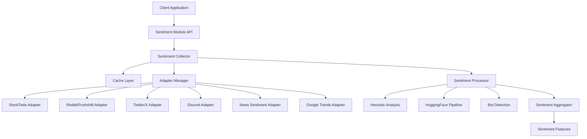
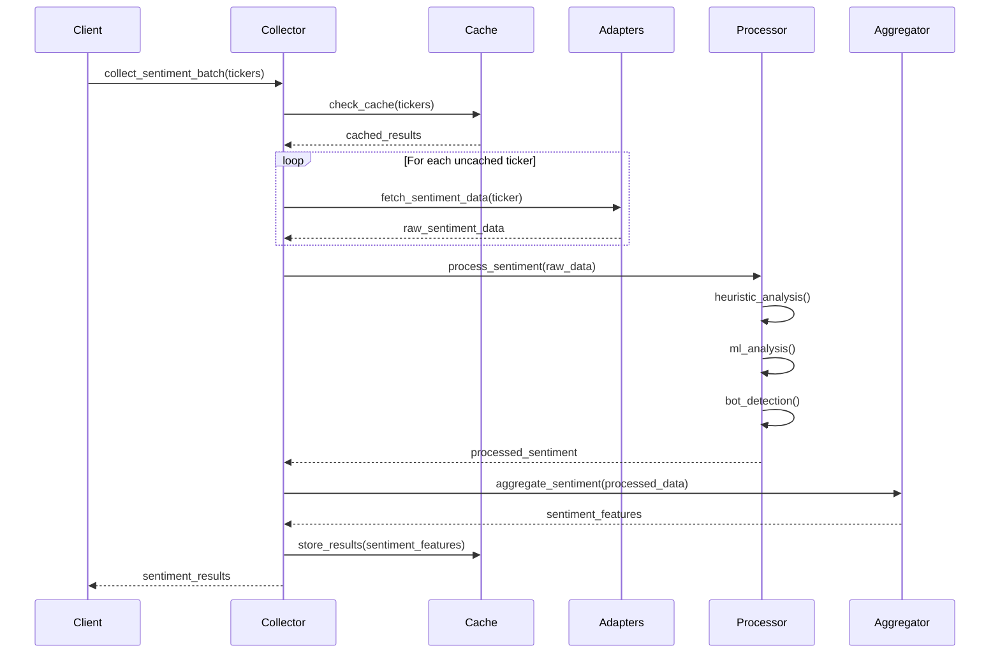

# Design Document

## Purpose

The Standalone Sentiment Module provides a comprehensive, reusable sentiment analysis system that can be integrated into any application requiring financial sentiment data. It transforms the existing pipeline-specific sentiment functionality into a general-purpose library with enhanced capabilities, multiple data sources, and robust testing.

## Architecture

The system follows a modular, plugin-based architecture that enables easy extension with new data sources while maintaining high performance through async processing and intelligent caching.

### High-Level Architecture



### Component Design

#### Core Components

**SentimentCollector**
- Orchestrates data collection from multiple adapters
- Manages concurrency and rate limiting
- Handles caching and deduplication
- Coordinates error handling and fallbacks

**AdapterManager**
- Factory pattern for adapter instantiation
- Plugin registry for new adapters
- Configuration management per adapter
- Health monitoring and circuit breaker logic

**SentimentProcessor**
- Combines heuristic and ML-based analysis
- Implements bot detection algorithms
- Calculates virality and engagement metrics
- Normalizes scores across different sources

**SentimentAggregator**
- Weighted combination of multiple signals
- Quality scoring and confidence intervals
- Feature engineering for downstream use
- Output formatting and serialization

#### Adapter Implementations

**AsyncStocktwitsAdapter** (Enhanced)
- Real-time social sentiment from StockTwits
- Improved rate limiting and error handling
- Enhanced message parsing and filtering
- Support for trending topics and influencer weighting

**AsyncPushshiftAdapter** (Enhanced)
- Reddit sentiment via Pushshift API
- Subreddit-specific sentiment analysis
- Comment thread analysis for context
- Author credibility scoring

**AsyncTwitterAdapter** (New)
- Twitter/X sentiment data collection
- Tweet sentiment and engagement analysis
- Hashtag and mention tracking
- Influencer sentiment weighting

**AsyncDiscordAdapter** (New)
- Discord server sentiment monitoring
- Channel-specific sentiment analysis
- Real-time message processing
- Community sentiment trends

**AsyncNewsAdapter** (New)
- Financial news sentiment from multiple sources
- Article sentiment analysis and summarization
- Source credibility weighting
- Breaking news sentiment impact

**AsyncTrendsAdapter** (New)
- Google Trends sentiment indicators
- Search volume correlation with sentiment
- Geographic sentiment distribution
- Trending topic analysis

#### Data Flow Architecture



## Design Decisions

### Technology Choices

**Async/Await Pattern**
- Enables high-concurrency data collection from multiple sources
- Non-blocking I/O for improved throughput
- Better resource utilization for API-heavy workloads

**Plugin Architecture**
- Easy addition of new sentiment sources
- Modular testing and maintenance
- Runtime configuration of active adapters

**Caching Strategy**
- Multi-tier caching: in-memory (default) + optional Redis
- TTL-based cache invalidation with configurable expiration
- Intelligent cache warming for popular tickers
- Graceful fallback to in-memory caching when Redis unavailable

**Configuration Management**
- YAML-based configuration files
- Environment variable overrides
- Runtime configuration updates

### Architecture Patterns

**Factory Pattern**
- AdapterManager creates appropriate adapter instances
- Configuration-driven adapter selection
- Consistent interface across all adapters

**Strategy Pattern**
- Pluggable sentiment analysis algorithms
- Runtime algorithm selection
- A/B testing support for different approaches

**Circuit Breaker Pattern**
- Graceful degradation when adapters fail
- Automatic recovery and health monitoring
- Configurable failure thresholds

**Observer Pattern**
- Event-driven architecture for real-time updates
- Metrics collection and monitoring
- Audit trail generation

### Performance Considerations

**Concurrency Management**
- Semaphore-based rate limiting per adapter
- Configurable concurrency levels
- Adaptive throttling based on API response times

**Memory Optimization**
- Streaming processing for large datasets
- Lazy loading of ML models
- Efficient data structures for sentiment features

**Caching Strategy**
- Multi-level caching (in-memory default + optional Redis)
- Intelligent cache eviction policies (LRU for memory, TTL for Redis)
- Cache warming for frequently requested tickers
- Automatic fallback to memory-only caching when Redis unavailable

**Batch Processing**
- Optimal batch sizes per adapter
- Parallel processing of ticker batches
- Efficient aggregation of results

### Security Decisions

**Credential Management**
- Environment-based API key storage
- Secure credential rotation support
- No credentials in logs or error messages

**Data Privacy**
- Minimal data retention policies
- Anonymization of user-generated content
- Secure transmission of all data

**Input Validation**
- Comprehensive input sanitization
- SQL injection prevention
- Rate limiting to prevent abuse

**Audit and Compliance**
- Complete audit trails for data access
- Compliance with financial data regulations
- Secure data disposal procedures

## Integration Patterns

### Programmatic Integration

```python
# Basic usage
from src.common.sentiments import collect_sentiment_batch

# Async usage
sentiment_data = await collect_sentiment_batch(['AAPL', 'TSLA'])

# Sync usage
sentiment_data = collect_sentiment_batch_sync(['AAPL', 'TSLA'])

# Custom configuration
config = {
    'providers': {'twitter': True, 'discord': False},
    'hf': {'enabled': True, 'model_name': 'custom-model'}
}
sentiment_data = await collect_sentiment_batch(['AAPL'], config=config)
```

### Pipeline Integration

```python
# Integration with existing pipelines
from src.common.sentiments import SentimentCollector

collector = SentimentCollector(config=pipeline_config)
async with collector:
    for batch in ticker_batches:
        sentiment_results = await collector.collect_batch(batch)
        pipeline.process_sentiment(sentiment_results)
```

### Custom Adapter Integration

```python
# Adding custom adapters
from src.common.sentiments.adapters.base import BaseAdapter

class CustomAdapter(BaseAdapter):
    async def fetch_sentiment(self, ticker: str) -> Dict:
        # Custom implementation
        pass

# Register custom adapter
collector.register_adapter('custom', CustomAdapter)
```

## Error Handling Strategy

### Graceful Degradation
- Continue processing with available adapters when some fail
- Provide partial results with quality indicators
- Maintain service availability during partial outages

### Retry Logic
- Exponential backoff for transient failures
- Configurable retry attempts per adapter
- Circuit breaker to prevent cascade failures

### Error Classification
- Transient errors (network, rate limits) - retry
- Permanent errors (authentication, invalid ticker) - fail fast
- Partial errors (some data missing) - continue with warnings

### Monitoring and Alerting
- Real-time error rate monitoring
- Automated alerts for service degradation
- Performance metrics collection and analysis

## Testing Strategy

### Unit Testing
- Individual adapter testing with mocked APIs
- Sentiment processing algorithm validation
- Bot detection accuracy testing
- Configuration management testing

### Integration Testing
- End-to-end sentiment collection workflows
- Multi-adapter coordination testing
- Cache integration and invalidation testing
- Error handling and recovery testing

### Performance Testing
- Load testing with various batch sizes
- Concurrency testing under high load
- Memory usage profiling and optimization
- API rate limit compliance testing

### Security Testing
- Input validation and sanitization testing
- Credential security and rotation testing
- Data privacy and anonymization testing
- Audit trail completeness testing

## Deployment Considerations

### Dependencies
- Minimal external dependencies for core functionality
- Optional dependencies for advanced features (HuggingFace, Redis)
- Graceful degradation when optional dependencies unavailable
- Clear dependency documentation and version pinning

### Configuration
- Environment-specific configuration files
- Secure credential management
- Runtime configuration updates without restart

### Monitoring
- Comprehensive metrics collection
- Health check endpoints
- Performance monitoring and alerting

### Scalability
- Horizontal scaling support
- Load balancing considerations
- Resource usage optimization