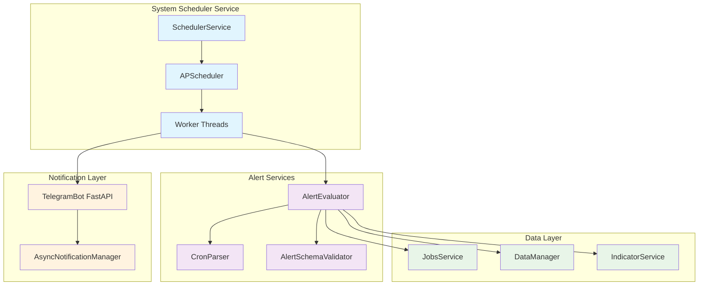
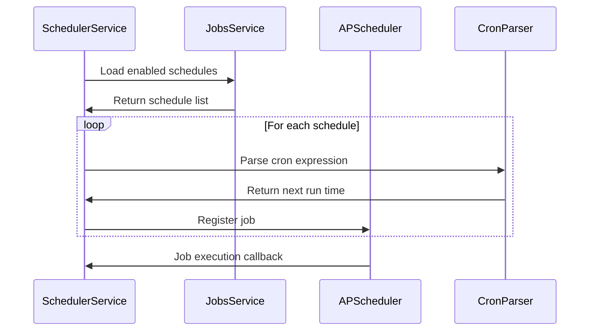
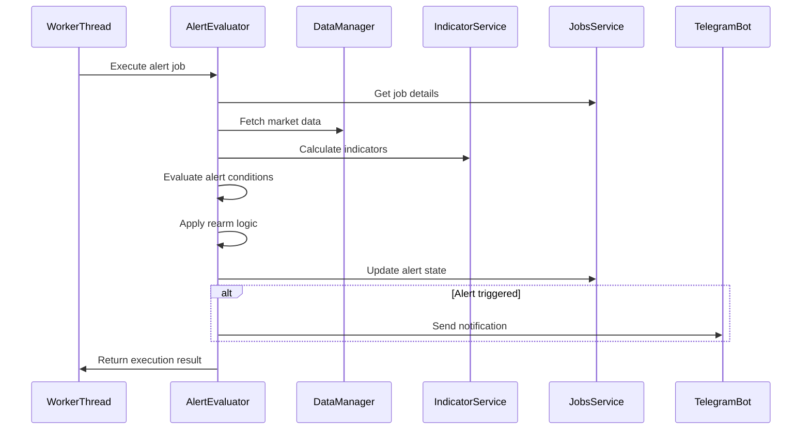

# Design

## Purpose

The System Scheduler module serves as the core scheduling engine for the Advanced Trading Framework, providing APScheduler-based job execution for alerts and schedules. It replaces the distributed alert evaluation logic currently in the Telegram services with a centralized, scalable solution that maintains clean separation of concerns and integrates seamlessly with existing data and notification systems.

## Architecture

### High-Level Architecture

The System Scheduler follows a service-oriented architecture with clear separation between scheduling, evaluation, and notification concerns:



### Component Design

#### 1. SchedulerService (Main Service)
- **Location**: `src/scheduler/scheduler_service.py`
- **Purpose**: Main service class that orchestrates job scheduling and execution
- **Responsibilities**:
  - Initialize APScheduler with database job store
  - Load enabled schedules from database on startup
  - Register jobs with APScheduler
  - Handle job execution callbacks
  - Manage service lifecycle

#### 2. AlertEvaluator (Alert Processing)
- **Location**: `src/common/alerts/alert_evaluator.py`
- **Purpose**: Centralized alert evaluation with rearm logic
- **Responsibilities**:
  - Evaluate complex rule-based alerts
  - Apply rearm logic after trigger evaluation
  - Manage alert state persistence
  - Integrate with market data and indicator services

#### 3. CronParser (Schedule Parsing)
- **Location**: `src/common/alerts/cron_parser.py`
- **Purpose**: Parse and validate cron expressions
- **Responsibilities**:
  - Support both 5-field and 6-field cron expressions
  - Calculate next run times
  - Validate cron syntax
  - Handle timezone conversions

#### 4. AlertSchemaValidator (Configuration Validation)
- **Location**: `src/common/alerts/schema_validator.py`
- **Purpose**: Validate alert and schedule configurations
- **Responsibilities**:
  - Load and cache JSON schemas
  - Validate task_params against schemas
  - Provide detailed validation error messages

### Data Flow

#### Job Scheduling Flow


#### Alert Evaluation Flow


## Components and Interfaces

### SchedulerService Interface

```python
class SchedulerService:
    def __init__(self, jobs_service: JobsService, alert_evaluator: AlertEvaluator)
    async def start(self) -> None
    async def stop(self) -> None
    async def reload_schedules(self) -> int
    def get_scheduler_status(self) -> Dict[str, Any]
    def _job_execution_callback(self, job_id: str, result: Any, error: Exception = None)
```

### AlertEvaluator Interface

```python
class AlertEvaluator:
    def __init__(self, data_manager: DataManager, indicator_service: IndicatorService, 
                 jobs_service: JobsService, schema_validator: AlertSchemaValidator)
    async def evaluate_alert(self, job_run: ScheduleRun) -> AlertEvaluationResult
    def _parse_alert_config(self, task_params: Dict[str, Any]) -> AlertConfig
    def _evaluate_rule_tree(self, rule: Dict[str, Any], market_data: pd.DataFrame, 
                           indicators: Dict[str, pd.Series]) -> bool
    def _apply_rearm_logic(self, alert_config: AlertConfig, current_state: Dict[str, Any], 
                          evaluation_result: bool) -> RearmResult
    def _update_alert_state(self, job_id: int, new_state: Dict[str, Any]) -> bool
```

### CronParser Interface

```python
class CronParser:
    @staticmethod
    def parse_cron(expression: str) -> CronExpression
    @staticmethod
    def validate_cron(expression: str) -> bool
    @staticmethod
    def calculate_next_run(expression: str, from_time: datetime = None) -> datetime
    @staticmethod
    def is_six_field_cron(expression: str) -> bool
```

### AlertSchemaValidator Interface

```python
class AlertSchemaValidator:
    def __init__(self, schema_dir: str = "src/common/alerts/schemas")
    def validate_alert_config(self, task_params: Dict[str, Any]) -> ValidationResult
    def validate_schedule_config(self, task_params: Dict[str, Any]) -> ValidationResult
    def load_schema(self, job_type: str) -> Dict[str, Any]
```

## Data Models

### AlertConfig Model
```python
@dataclass
class AlertConfig:
    ticker: str
    timeframe: str
    rule: Dict[str, Any]
    rearm: Optional[Dict[str, Any]]
    options: Dict[str, Any]
    notify: Dict[str, Any]
```

### AlertEvaluationResult Model
```python
@dataclass
class AlertEvaluationResult:
    triggered: bool
    rearmed: bool
    state_updates: Dict[str, Any]
    notification_data: Optional[Dict[str, Any]]
    error: Optional[str]
```

### RearmResult Model
```python
@dataclass
class RearmResult:
    should_rearm: bool
    new_status: str  # "ARMED", "TRIGGERED", "INACTIVE"
    state_updates: Dict[str, Any]
```

### CronExpression Model
```python
@dataclass
class CronExpression:
    expression: str
    fields: List[str]
    is_six_field: bool
    next_run: datetime
```

## Error Handling

### Error Categories

1. **Configuration Errors**
   - Invalid cron expressions
   - Schema validation failures
   - Missing required parameters

2. **Data Errors**
   - Market data unavailable
   - Indicator calculation failures
   - Database connection issues

3. **Execution Errors**
   - Job timeout
   - Worker thread exceptions
   - Notification delivery failures

### Error Handling Strategy

```python
class SchedulerErrorHandler:
    def handle_job_error(self, job_id: str, error: Exception) -> None:
        """Handle job execution errors with appropriate logging and recovery"""
        
    def handle_data_error(self, symbol: str, error: Exception) -> bool:
        """Handle data retrieval errors with fallback providers"""
        
    def handle_notification_error(self, notification_data: Dict, error: Exception) -> None:
        """Handle notification delivery errors with retry logic"""
```

### Retry Logic

- **Job Execution**: 3 retries with exponential backoff
- **Data Retrieval**: Provider failover with 2 retries per provider
- **Notifications**: Handled by AsyncNotificationManager (5 retries)

## Testing Strategy

### Unit Testing

1. **CronParser Tests**
   - Valid/invalid cron expression parsing
   - Next run time calculations
   - 5-field vs 6-field detection

2. **AlertEvaluator Tests**
   - Rule evaluation logic
   - Rearm condition handling
   - State persistence

3. **SchemaValidator Tests**
   - Schema loading and caching
   - Validation success/failure cases
   - Error message formatting

### Integration Testing

1. **SchedulerService Integration**
   - Job loading and registration
   - APScheduler integration
   - Database operations

2. **Alert Evaluation Integration**
   - Market data retrieval
   - Indicator calculations
   - Notification delivery

3. **End-to-End Testing**
   - Complete alert lifecycle
   - Schedule execution flow
   - Error recovery scenarios

### Performance Testing

1. **Load Testing**
   - Multiple concurrent job executions
   - High-frequency alert evaluations
   - Memory usage under load

2. **Stress Testing**
   - Database connection limits
   - Worker thread pool exhaustion
   - Queue overflow scenarios

## Design Decisions

### 1. APScheduler Integration
**Decision**: Use APScheduler with PostgreSQL job store and ThreadPoolExecutor
**Rationale**: 
- Mature, well-tested scheduling framework
- Database persistence for reliability
- Thread pool suitable for I/O-bound alert evaluations
- Built-in job management and monitoring

### 2. Centralized Alert Evaluation
**Decision**: Move alert logic from Telegram services to common alerts module
**Rationale**:
- Single source of truth for alert evaluation
- Easier testing and maintenance
- Reusable across different interfaces (Telegram, Web UI)
- Better separation of concerns

### 3. Direct FastAPI Notification
**Decision**: Call TelegramBot FastAPI endpoint directly for notifications
**Rationale**:
- Simple implementation with existing infrastructure
- Immediate delivery for time-sensitive alerts
- Leverages existing AsyncNotificationManager
- Can evolve to database queue later if needed

### 4. JSON Schema Validation
**Decision**: Use JSON Schema for task_params validation
**Rationale**:
- Industry standard for JSON validation
- Comprehensive validation rules
- Clear error messages
- Extensible for new job types

### 5. State Management in Database
**Decision**: Continue using state_json field for alert state
**Rationale**:
- Existing pattern that works well
- Survives service restarts
- Simple to implement and debug
- Can be optimized later if needed

## Integration Patterns

### Database Integration
- Use existing JobsService for all database operations
- Maintain transactional consistency for state updates
- Implement connection pooling for concurrent access

### Market Data Integration
- Use DataManager for provider-agnostic data access
- Implement provider failover for reliability
- Cache frequently accessed data

### Indicator Integration
- Use IndicatorService for all technical calculations
- Support both synchronous and asynchronous computation
- Handle missing data gracefully

### Notification Integration
- Call TelegramBot FastAPI `/api/notify` endpoint
- Include comprehensive alert context in notifications
- Handle delivery failures gracefully

## Performance Considerations

### Scalability
- ThreadPoolExecutor with configurable pool size
- Database connection pooling
- Efficient job querying with indexes
- Memory-efficient data processing

### Optimization
- Cache frequently used schemas and configurations
- Batch database operations where possible
- Lazy loading of market data
- Efficient indicator calculations

### Monitoring
- Job execution metrics and timing
- Error rates and types
- Queue depths and processing times
- Resource utilization tracking