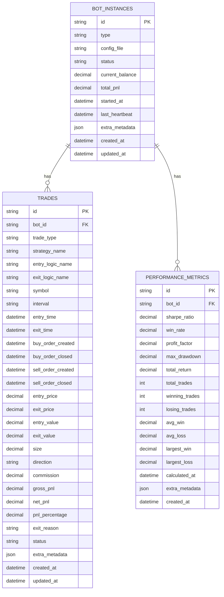
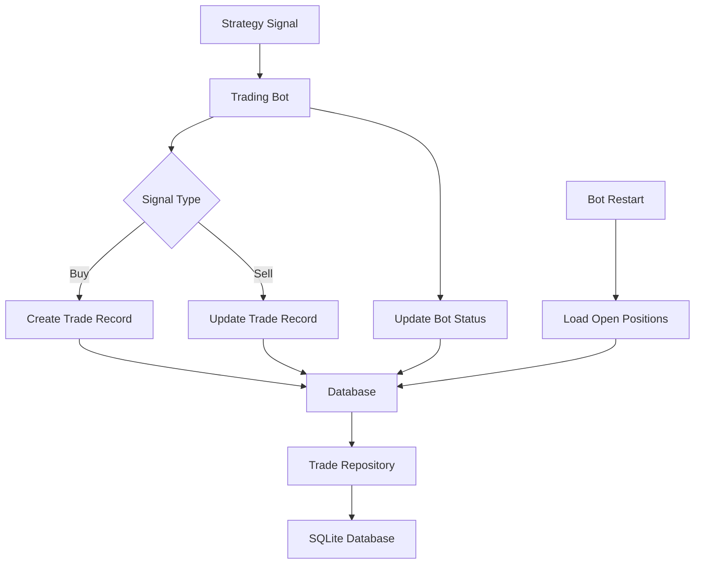

# Database Documentation

## Overview

The crypto trading platform uses SQLite as its primary database for storing trades, bot instances, and performance metrics. The database provides persistent storage for live trading, paper trading, and optimization results.

## Database Schema

### Entity Relationship Diagram



## Table Descriptions

### 1. TRADES Table

**Purpose**: Stores complete trade lifecycle information for all trading activities (live, paper, optimization).

**Key Features**:
- UUID primary key for distributed systems
- Complete order lifecycle tracking
- Support for both long and short positions
- Comprehensive PnL calculations
- Metadata storage for additional context

**Fields**:

| Field | Type | Description | Constraints |
|-------|------|-------------|-------------|
| `id` | VARCHAR(36) | Unique trade identifier | PRIMARY KEY, UUID |
| `bot_id` | VARCHAR(255) | Reference to bot instance | NOT NULL, INDEXED |
| `trade_type` | VARCHAR(10) | Type of trading | 'paper', 'live', 'optimization' |
| `strategy_name` | VARCHAR(100) | Name of the strategy used | NULLABLE |
| `entry_logic_name` | VARCHAR(100) | Entry logic mixin name | NOT NULL |
| `exit_logic_name` | VARCHAR(100) | Exit logic mixin name | NOT NULL |
| `symbol` | VARCHAR(20) | Trading symbol (e.g., BTCUSDT) | NOT NULL, INDEXED |
| `interval` | VARCHAR(10) | Time interval (e.g., 1h, 4h) | NOT NULL |
| `entry_time` | DATETIME | When position was opened | NULLABLE |
| `exit_time` | DATETIME | When position was closed | NULLABLE |
| `buy_order_created` | DATETIME | Buy order creation time | NULLABLE |
| `buy_order_closed` | DATETIME | Buy order execution time | NULLABLE |
| `sell_order_created` | DATETIME | Sell order creation time | NULLABLE |
| `sell_order_closed` | DATETIME | Sell order execution time | NULLABLE |
| `entry_price` | DECIMAL(20,8) | Entry price | NULLABLE |
| `exit_price` | DECIMAL(20,8) | Exit price | NULLABLE |
| `entry_value` | DECIMAL(20,8) | Total value at entry | NULLABLE |
| `exit_value` | DECIMAL(20,8) | Total value at exit | NULLABLE |
| `size` | DECIMAL(20,8) | Position size | NULLABLE |
| `direction` | VARCHAR(10) | Trade direction | 'long', 'short' |
| `commission` | DECIMAL(20,8) | Trading commission | NULLABLE |
| `gross_pnl` | DECIMAL(20,8) | Gross profit/loss | NULLABLE |
| `net_pnl` | DECIMAL(20,8) | Net profit/loss | NULLABLE |
| `pnl_percentage` | DECIMAL(10,4) | PnL as percentage | NULLABLE |
| `exit_reason` | VARCHAR(100) | Reason for exit | NULLABLE |
| `status` | VARCHAR(20) | Trade status | 'open', 'closed', 'cancelled' |
| `extra_metadata` | JSON | Additional context | NULLABLE |
| `created_at` | DATETIME | Record creation time | AUTO |
| `updated_at` | DATETIME | Last update time | AUTO |

**Indexes**:
- `idx_symbol_status` (symbol, status)
- `idx_entry_time` (entry_time)
- `idx_strategy` (entry_logic_name, exit_logic_name)
- `idx_bot_trade_type` (bot_id, trade_type)

### 2. BOT_INSTANCES Table

**Purpose**: Tracks running bot instances, their status, and performance metrics.

**Key Features**:
- Bot lifecycle management
- Status tracking and heartbeat monitoring
- Configuration file reference
- Performance aggregation

**Fields**:

| Field | Type | Description | Constraints |
|-------|------|-------------|-------------|
| `id` | VARCHAR(255) | Bot instance identifier | PRIMARY KEY |
| `type` | VARCHAR(20) | Bot type | 'paper', 'live', 'optimization' |
| `config_file` | VARCHAR(255) | Configuration file path | NULLABLE |
| `status` | VARCHAR(20) | Current bot status | 'running', 'stopped', 'error' |
| `current_balance` | DECIMAL(20,8) | Current account balance | NULLABLE |
| `total_pnl` | DECIMAL(20,8) | Total profit/loss | NULLABLE |
| `started_at` | DATETIME | When bot started | NULLABLE |
| `last_heartbeat` | DATETIME | Last heartbeat time | NULLABLE |
| `extra_metadata` | JSON | Additional bot context | NULLABLE |
| `created_at` | DATETIME | Record creation time | AUTO |
| `updated_at` | DATETIME | Last update time | AUTO |

### 3. PERFORMANCE_METRICS Table

**Purpose**: Stores calculated performance metrics for strategies and bots.

**Key Features**:
- Comprehensive performance tracking
- Time-series metrics storage
- Strategy comparison support
- Risk analysis data

**Fields**:

| Field | Type | Description | Constraints |
|-------|------|-------------|-------------|
| `id` | VARCHAR(36) | Unique metrics identifier | PRIMARY KEY, UUID |
| `bot_id` | VARCHAR(255) | Reference to bot instance | FOREIGN KEY |
| `sharpe_ratio` | DECIMAL(10,4) | Sharpe ratio | NULLABLE |
| `win_rate` | DECIMAL(5,2) | Win rate percentage | NULLABLE |
| `profit_factor` | DECIMAL(10,4) | Profit factor | NULLABLE |
| `max_drawdown` | DECIMAL(10,4) | Maximum drawdown | NULLABLE |
| `total_return` | DECIMAL(10,4) | Total return percentage | NULLABLE |
| `total_trades` | INTEGER | Total number of trades | NULLABLE |
| `winning_trades` | INTEGER | Number of winning trades | NULLABLE |
| `losing_trades` | INTEGER | Number of losing trades | NULLABLE |
| `avg_win` | DECIMAL(20,8) | Average winning trade | NULLABLE |
| `avg_loss` | DECIMAL(20,8) | Average losing trade | NULLABLE |
| `largest_win` | DECIMAL(20,8) | Largest winning trade | NULLABLE |
| `largest_loss` | DECIMAL(20,8) | Largest losing trade | NULLABLE |
| `calculated_at` | DATETIME | When metrics were calculated | NULLABLE |
| `extra_metadata` | JSON | Additional metrics context | NULLABLE |
| `created_at` | DATETIME | Record creation time | AUTO |

## Database Operations

### Trade Repository

The `TradeRepository` class provides a clean interface for all database operations:

```python
from src.trading.services.trading_bot_service import trading_bot_service

# Create repository
repo = TradeRepository()

# Create a new trade
trade_data = {
    'bot_id': 'my_bot_001',
    'trade_type': 'paper',
    'entry_logic_name': 'RSIBBVolumeEntryMixin',
    'exit_logic_name': 'ATRExitMixin',
    'symbol': 'BTCUSDT',
    'interval': '1h',
    'entry_time': datetime.now(timezone.utc),
    'entry_price': 50000.0,
    'size': 0.1,
    'direction': 'long',
    'status': 'open'
}
trade = repo.create_trade(trade_data)

# Update trade
update_data = {
    'exit_time': datetime.now(timezone.utc),
    'exit_price': 51000.0,
    'status': 'closed',
    'net_pnl': 100.0
}
repo.update_trade(trade.id, update_data)

# Query trades
open_trades = repo.get_open_trades(bot_id='my_bot_001')
closed_trades = repo.get_closed_trades(symbol='BTCUSDT')
```

### Bot Instance Management

```python
# Create bot instance
bot_data = {
    'id': 'my_bot_001',
    'type': 'paper',
    'config_file': 'config.json',
    'status': 'running',
    'current_balance': 1000.0
}
bot = repo.create_bot_instance(bot_data)

# Update bot status
repo.update_bot_instance('my_bot_001', {
    'status': 'stopped',
    'current_balance': 1050.0
})
```

### Performance Metrics

```python
# Create performance metrics
metrics_data = {
    'bot_id': 'my_bot_001',
    'sharpe_ratio': 1.5,
    'win_rate': 65.0,
    'profit_factor': 2.1,
    'total_trades': 100,
    'winning_trades': 65
}
metrics = repo.create_performance_metrics(metrics_data)
```

## Database Integration Points

### 1. Trading Bot Integration

The database is integrated into the trading bots at these key points:

- **Bot Initialization**: Creates/updates bot instance record
- **Trade Execution**: Creates trade records on entry, updates on exit
- **State Loading**: Loads open positions on bot restart
- **Status Updates**: Updates bot status and heartbeat
- **Performance Tracking**: Stores calculated metrics

### 2. Restart Recovery

The database enables seamless bot restart by:

1. Loading open positions from database
2. Restoring bot state and balance
3. Continuing trading from where it left off
4. Maintaining trade history across restarts

### 3. Multi-Bot Support

The database supports multiple concurrent bots by:

- Isolating trades by `bot_id`
- Tracking individual bot performance
- Supporting different bot types (paper/live/optimization)
- Maintaining separate state for each bot

## Data Flow



## Migration and Setup

### Database Initialization

The database is automatically initialized when the first bot starts:

```python
from src.data.database import get_database_manager

# Initialize database
db_manager = get_database_manager()
db_manager.create_tables()
```

### Database Location

- **Development**: `db/trading.db`
- **Production**: Configurable via environment variables
- **Backup**: Automatic backup before migrations

### Data Retention

- **Trades**: Kept for 90 days by default
- **Bot Instances**: Kept indefinitely
- **Performance Metrics**: Kept for 1 year by default

## Monitoring and Maintenance

### Database Health Checks

```python
# Check database connection
db_manager = get_database_manager()
session = db_manager.get_session()
session.close()

# Check table sizes
repo = TradeRepository()
summary = repo.get_trade_summary()
print(f"Total trades: {summary['total_trades']}")
```

### Cleanup Operations

```python
# Clean up old data
repo = TradeRepository()
deleted_count = repo.cleanup_old_data(days_to_keep=90)
print(f"Deleted {deleted_count} old records")
```

### Performance Optimization

- **Indexes**: Optimized for common query patterns
- **Connection Pooling**: Efficient session management
- **Batch Operations**: Bulk insert/update support
- **Query Optimization**: Efficient trade queries

## Troubleshooting

### Common Issues

1. **Database Locked**: Check for concurrent access
2. **Disk Space**: Monitor database file size
3. **Performance**: Check query execution plans
4. **Data Integrity**: Validate foreign key constraints

### Debugging Queries

```python
# Enable SQL logging
import logging
logging.getLogger('sqlalchemy.engine').setLevel(logging.INFO)

# Check specific trade
trade = repo.get_trade_by_id('trade_uuid')
print(f"Trade status: {trade.status}")
```

## Future Enhancements

### Planned Features

1. **PostgreSQL Support**: For production deployments
2. **Read Replicas**: For improved query performance
3. **Data Archiving**: Long-term storage solution
4. **Real-time Analytics**: Live performance dashboards
5. **Multi-tenant Support**: Isolated data per user

### Schema Evolution

The database schema is designed to be extensible:

- JSON fields for flexible metadata
- Versioned schema migrations
- Backward compatibility support
- Graceful schema updates

---

*Last Updated: December 2024*
*Version: 1.0* 