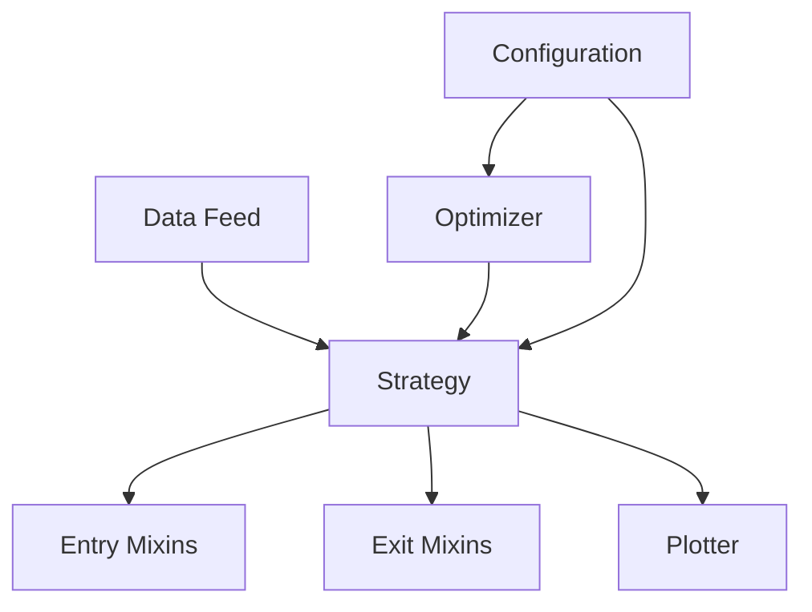
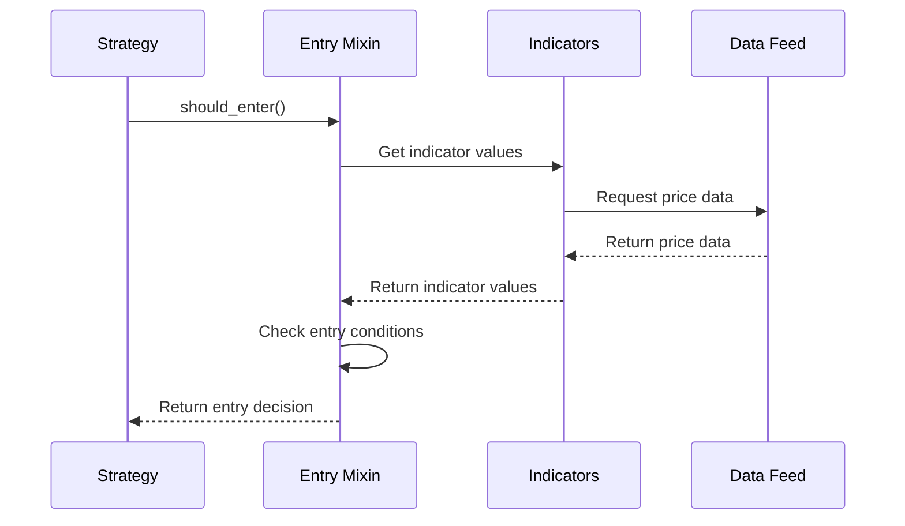
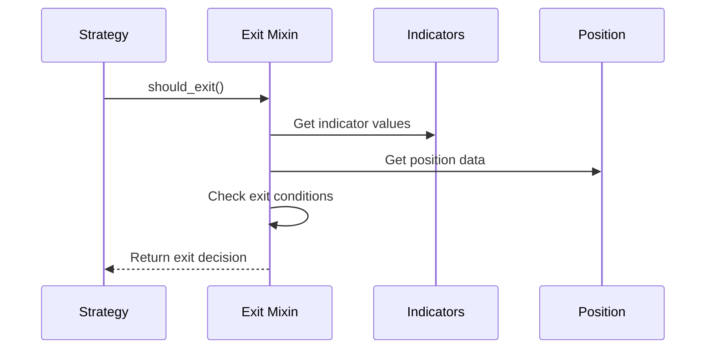

# Developer Guide

## Core Components

### System Architecture


### Strategy
The Strategy is the main container and orchestrator of the trading system. It:
- Holds the data feed (test or live market data)
- Manages the entry and exit mixins
- Tracks positions and trades
- Maintains the equity curve
- Handles order execution
- Provides logging and monitoring capabilities

Example Strategy Configuration:
```python
strategy_config = {
    "data": {
        "type": "csv",
        "path": "data/btc_usdt_1h.csv",
        "timeframe": "1h"
    },
    "entry_logic": {
        "name": "RSIBBEntryMixin",
        "params": {
            "rsi_period": 14,
            "rsi_oversold": 30,
            "bb_period": 20,
            "bb_stddev": 2.0
        }
    },
    "exit_logic": {
        "name": "TrailingStopExitMixin",
        "params": {
            "atr_period": 14,
            "atr_multiplier": 2.0
        }
    }
}
```

### Optimizer
The Optimizer is responsible for finding the optimal parameter combinations for strategies. It:
- Takes configuration files defining parameter ranges
- Generates parameter combinations to test
- Runs backtests with different parameter sets
- Evaluates results using specified metrics (e.g., profit, Sharpe ratio)
- Identifies the best performing parameter combinations
- Can use different optimization methods (grid search, genetic algorithms, etc.)

Example Optimization Configuration:
```json
{
    "strategy": {
        "entry_logic": {
            "name": "RSIBBEntryMixin",
            "params": {
                "rsi_period": {
                    "type": "int",
                    "min": 5,
                    "max": 30,
                    "step": 1
                },
                "rsi_oversold": {
                    "type": "float",
                    "min": 20,
                    "max": 40,
                    "step": 1
                }
            }
        }
    },
    "optimization": {
        "method": "grid_search",
        "metric": "sharpe_ratio",
        "timeframe": "1h",
        "start_date": "2023-01-01",
        "end_date": "2023-12-31"
    }
}
```

### Entry Mixins
Entry Mixins define when to enter trades. Each mixin:
- Implements a specific entry strategy (e.g., RSI, Bollinger Bands)
- Manages its own technical indicators
- Defines entry conditions through the `should_enter()` method
- Handles parameter validation and defaults
- Can be combined with other mixins for complex strategies

Example Entry Mixin Flow:


### Exit Mixins
Exit Mixins determine when to exit trades. Each mixin:
- Implements a specific exit strategy (e.g., trailing stop, time-based)
- Manages its own technical indicators
- Defines exit conditions through the `should_exit()` method
- Handles parameter validation and defaults
- Can be combined with other mixins for complex strategies

Example Exit Mixin Flow:


### Data Feed
The Data Feed provides market data to the strategy. It:
- Can be historical data for backtesting
- Can be live market data for trading
- Provides OHLCV (Open, High, Low, Close, Volume) data
- Handles data normalization and preprocessing
- Manages data timeframes and resampling

Example Data Feed Configuration:
```python
data_config = {
    "type": "csv",  # or "live" for real-time data
    "path": "data/btc_usdt_1h.csv",
    "timeframe": "1h",
    "columns": {
        "datetime": "timestamp",
        "open": "open",
        "high": "high",
        "low": "low",
        "close": "close",
        "volume": "volume"
    },
    "preprocessing": {
        "normalize": True,
        "fill_missing": True
    }
}
```

### Plotter
The Plotter visualizes strategy results. It:
- Creates price charts with indicators
- Shows entry and exit points
- Displays the equity curve
- Supports multiple subplots for different indicators
- Provides customization options for visualization

Example Plot Configuration:
```python
plot_config = {
    "style": "dark_background",
    "size": [15, 10],
    "dpi": 300,
    "show_grid": True,
    "show_equity_curve": True,
    "indicators": {
        "rsi": {"subplot": "separate", "color": "blue"},
        "bb": {"subplot": "price", "color": "red"},
        "volume": {"subplot": "separate", "color": "green"}
    }
}
```

### Component Interaction Example
Here's how the components work together in a typical trading scenario:

1. **Strategy Initialization**:
```python
# Create strategy with configuration
strategy = CustomStrategy(strategy_config)

# Initialize data feed
data_feed = DataFeed(data_config)
strategy.add_data(data_feed)

# Initialize entry and exit mixins
entry_mixin = EntryMixinFactory.create(entry_config)
exit_mixin = ExitMixinFactory.create(exit_config)
strategy.set_entry_mixin(entry_mixin)
strategy.set_exit_mixin(exit_mixin)
```

2. **Trading Loop**:
```python
# Strategy processes each bar
for bar in strategy.data:
    # Check entry conditions
    if not strategy.position and entry_mixin.should_enter():
        strategy.buy()
    
    # Check exit conditions
    if strategy.position and exit_mixin.should_exit():
        strategy.sell()
    
    # Update indicators and metrics
    strategy.update_indicators()
    strategy.update_metrics()
```

3. **Optimization Process**:
```python
# Create optimizer
optimizer = Optimizer(optimization_config)

# Run optimization
results = optimizer.optimize(strategy_config)

# Get best parameters
best_params = results.get_best_parameters()

# Create strategy with optimized parameters
optimized_strategy = CustomStrategy({
    **strategy_config,
    "entry_logic": {"params": best_params["entry"]},
    "exit_logic": {"params": best_params["exit"]}
})
```

4. **Result Visualization**:
```python
# Create plotter with configuration
plotter = Plotter(plot_config)

# Generate strategy visualization
plotter.plot(strategy)
```

### Creating TA-Lib Indicators

The system provides a framework for creating custom TA-Lib indicators that integrate seamlessly with Backtrader. This allows you to leverage TA-Lib's optimized calculations while maintaining compatibility with Backtrader's indicator interface.

#### Basic Structure

Each TA-Lib indicator should:
1. Inherit from `bt.Indicator`
2. Define its lines and parameters
3. Implement the `__init__` method for calculations
4. Implement the `next` method (can be empty if pre-calculating)

Example template:
```python
class TALibCustomIndicator(bt.Indicator):
    """
    TA-Lib Custom Indicator Wrapper
    
    Parameters:
        period (int): Period for calculation (default: 20)
        data (bt.Data): The data source (default: None)
    """
    
    lines = ('line1', 'line2')  # Define indicator lines
    params = (('period', 20),)  # Define parameters
    
    def __init__(self, data=None):
        super(TALibCustomIndicator, self).__init__()
        
        # Convert data to numpy arrays
        data_array = np.array(self.data.get(size=len(self.data)))
        
        # Calculate using TA-Lib
        values = talib.CUSTOM_FUNCTION(
            data_array,
            timeperiod=self.p.period
        )
        
        # Update indicator lines
        for i, value in enumerate(values):
            if i < len(self.lines[0]):
                self.lines[0][i] = value
    
    def next(self):
        """Required by Backtrader but can be empty if pre-calculating"""
        pass
```

#### Example: TALibRSI

Here's a complete example of the RSI indicator:
```python
class TALibRSI(bt.Indicator):
    """
    TA-Lib RSI (Relative Strength Index) Indicator Wrapper
    
    Parameters:
        period (int): Period for RSI calculation (default: 14)
    """
    
    lines = ('rsi',)  # Single line for RSI values
    params = (('period', 14),)  # Default period is 14
    
    def __init__(self):
        super(TALibRSI, self).__init__()
        
        # Convert data to numpy array
        close_data = np.array(self.data.close.get(size=len(self.data)))
        
        # Calculate RSI using TA-Lib
        rsi_values = talib.RSI(
            close_data,
            timeperiod=self.p.period
        )
        
        # Update the indicator's line with calculated values
        for i, value in enumerate(rsi_values):
            if i < len(self.lines[0]):
                self.lines[0][i] = value
    
    def next(self):
        """Required by Backtrader but can be empty if pre-calculating"""
        pass
```

#### Best Practices

1. **Error Handling**:
   - Always handle potential TA-Lib import errors
   - Provide fallback to Backtrader's native indicators
   - Log errors appropriately

2. **Performance**:
   - Pre-calculate values in `__init__` when possible
   - Use numpy arrays for efficient calculations
   - Minimize data copying

3. **Documentation**:
   - Document all parameters and their defaults
   - Explain the indicator's purpose and usage
   - Include examples in docstrings

4. **Testing**:
   - Test with both TA-Lib and Backtrader calculations
   - Verify results match expected values
   - Test edge cases and error conditions

#### Using TA-Lib Indicators

To use a TA-Lib indicator in your strategy:

```python
# In your strategy or mixin
if use_talib:
    self.rsi = TALibRSI(
        self.data,
        period=14
    )
else:
    self.rsi = bt.indicators.RSI(
        self.data,
        period=14
    )
```

#### Available TA-Lib Indicators

The system includes several pre-built TA-Lib indicators:

1. `TALibRSI`: Relative Strength Index
2. `TALibBB`: Bollinger Bands
3. `TALibATR`: Average True Range
4. `TALibSMA`: Simple Moving Average

Each indicator follows the same pattern and can be used interchangeably with Backtrader's native indicators.

## Adding New Entry/Exit Mixins

### Creating a New Mixin

1. Create a new file in the appropriate directory:
   - For entry mixins: `src/entry/your_mixin_name_mixin.py`
   - For exit mixins: `src/exit/your_mixin_name_mixin.py`

2. Implement your mixin class following this template:

```python
from typing import Any, Dict
import backtrader as bt
from src.entry.entry_mixin import BaseEntryMixin  # or BaseExitMixin for exit mixins

class YourMixin(BaseEntryMixin):  # or BaseExitMixin for exit mixins
    """Your mixin description"""
    
    def get_required_params(self) -> list:
        """List of required parameters"""
        return []
    
    def get_default_params(self) -> Dict[str, Any]:
        """Default parameter values"""
        return {
            "param1": default_value1,
            "param2": default_value2,
        }
    
    def _init_indicators(self):
        """Initialize your indicators"""
        if self.strategy is None:
            raise ValueError("Strategy must be set before initializing indicators")
            
        # Create your indicators here
        # Example:
        self.indicators["indicator1"] = bt.indicators.YourIndicator(
            self.strategy.data.close,
            period=self.get_param("param1")
        )
    
    def should_enter(self) -> bool:  # or should_exit() for exit mixins
        """Your entry/exit logic"""
        if not self.indicators:
            return False
            
        # Implement your logic here
        return your_condition
```

### Registering Your Mixin

1. Add your mixin to the appropriate factory:
   - For entry mixins: `src/entry/entry_mixin_factory.py`
   - For exit mixins: `src/exit/exit_mixin_factory.py`

2. Import your mixin and add it to the registry:

```python
from src.entry.your_mixin_name_mixin import YourMixin  # or appropriate path

ENTRY_MIXIN_REGISTRY = {
    # ... existing mixins ...
    "YourMixin": YourMixin,
}
```

### Creating Configuration Files

1. Create a JSON configuration file in the appropriate directory:
   - For entry mixins: `config/optimizer/entry/your_mixin_name.json`
   - For exit mixins: `config/optimizer/exit/your_mixin_name.json`

2. Define the configuration structure:

```json
{
    "name": "YourMixin",
    "params": {
        "param1": {
            "type": "int",  // or "float", "bool"
            "min": 5,       // for numeric types
            "max": 30,      // for numeric types
            "default": 10
        },
        "param2": {
            "type": "float",
            "min": 0.1,
            "max": 1.0,
            "default": 0.5
        },
        "param3": {
            "type": "bool",
            "default": true
        }
    },
    "description": "Description of your mixin's strategy and parameters"
}
```

3. Configuration file guidelines:
   - Use descriptive parameter names
   - Set reasonable min/max values for optimization
   - Include default values that work well in most cases
   - Add a clear description of the strategy
   - Document any special parameter requirements

Example configuration for RSI and Bollinger Bands mixin:

```json
{
    "name": "RSIBBExitMixin",
    "params": {
        "rsi_period": {
            "type": "int",
            "min": 5,
            "max": 30,
            "default": 14
        },
        "rsi_overbought": {
            "type": "float",
            "min": 60,
            "max": 90,
            "default": 70
        },
        "bb_period": {
            "type": "int",
            "min": 10,
            "max": 50,
            "default": 20
        },
        "bb_stddev": {
            "type": "float",
            "min": 1.0,
            "max": 3.0,
            "default": 2.0
        },
        "use_bb_touch": {
            "type": "bool",
            "default": true
        }
    },
    "description": "Exit strategy based on RSI overbought condition and Bollinger Bands upper band touch. Exits when RSI is overbought and price touches or crosses above the upper Bollinger Band."
}
```

### Using Your Mixin

1. Create a strategy configuration using your mixin:

```python
strategy_config = {
    "entry_logic": {  # or "exit_logic" for exit mixins
        "name": "YourMixin",
        "params": {
            "param1": value1,
            "param2": value2,
        }
    },
    # ... other configuration ...
}
```

2. Use the configuration with the CustomStrategy:

```python
strategy = CustomStrategy(strategy_config=strategy_config)
```

### Best Practices

1. **Indicator Management**:
   - Each mixin maintains its own `indicators` dictionary
   - Use unique names for indicators within your mixin
   - Initialize indicators in `_init_indicators()`

2. **Parameter Handling**:
   - Define default values in `get_default_params()`
   - List required parameters in `get_required_params()`
   - Use `self.get_param()` to safely access parameters

3. **Documentation**:
   - Add docstrings explaining your mixin's purpose
   - Document all parameters and their effects
   - Include usage examples in comments

4. **Testing**:
   - Test your mixin with different parameter combinations
   - Verify indicator calculations
   - Test edge cases and error conditions

5. **Configuration**:
   - Create comprehensive configuration files
   - Set appropriate optimization ranges
   - Document parameter relationships and dependencies
   - Include clear strategy descriptions

### Example: RSI and Bollinger Bands Mixin

Here's a complete example of creating a new mixin:

```python
"""
RSI and Bollinger Bands Mixin

This module implements a strategy based on RSI and Bollinger Bands.
The strategy enters/exits when:
1. RSI is in the oversold/overbought zone
2. Price touches the lower/upper Bollinger Band

Parameters:
    rsi_period (int): Period for RSI calculation
    rsi_threshold (float): RSI threshold for signals
    bb_period (int): Period for Bollinger Bands
    bb_stddev (float): Standard deviation multiplier
"""

class RSIBBMixin(BaseEntryMixin):
    def get_default_params(self) -> Dict[str, Any]:
        return {
            "rsi_period": 14,
            "rsi_threshold": 30,
            "bb_period": 20,
            "bb_stddev": 2.0,
        }
    
    def _init_indicators(self):
        self.indicators["rsi"] = bt.indicators.RSI(
            self.strategy.data.close,
            period=self.get_param("rsi_period")
        )
        
        bb = bt.indicators.BollingerBands(
            self.strategy.data.close,
            period=self.get_param("bb_period"),
            devfactor=self.get_param("bb_stddev")
        )
        self.indicators["bb_upper"] = bb.lines.top
        self.indicators["bb_lower"] = bb.lines.bot
    
    def should_enter(self) -> bool:
        rsi = self.indicators["rsi"][0]
        price = self.strategy.data.close[0]
        bb_lower = self.indicators["bb_lower"][0]
        
        return (rsi < self.get_param("rsi_threshold") and 
                price <= bb_lower * 1.01)
```

## Optimizer JSON Configuration Reference

### 1. optimizer.json
**Purpose:**  
Main configuration for the optimizer and visualization settings.

**Structure:**
```json
{
  "optimizer_settings": {
    "optimizer_type": "optuna",         // Optimization algorithm (e.g., optuna)
    "initial_capital": 1000.0,          // Starting capital for backtests
    "commission": 0.001,                // Commission per trade
    "risk_free_rate": 0.01,             // Risk-free rate for metrics
    "omega_threshold": 0.0,             // Omega ratio threshold
    "use_talib": false,                 // Use TA-Lib for indicators
    "n_trials": 100,                    // Number of optimization trials
    "n_jobs": 1,                        // Number of parallel jobs
    "n_random_trials": 10,              // Number of random trials before optimization
    "plot": true,                       // Whether to plot results
    "save_trades": true,                // Save trade logs
    "report_metrics": [],               // Metrics to report
    "trades_csv_path": null,            // Path to save trades as CSV
    "save_metrics": true,               // Save metrics to file
    "metrics_format": "json",           // Format for metrics output
    "print_summary": true,              // Print summary to console
    "report_params": true,              // Include parameters in report
    "report_filename_pattern": null,    // Custom filename pattern for reports
    "include_plots_in_report": true,    // Include plots in report
    "output_dir": "results",            // Output directory for results
    "position_size": 0.10               // Fraction of capital to use per trade (NEW, configurable)
  },
  "visualization_settings": {
    "plot_size": [60, 30],              // Plot size in characters
    "plot_style": "default",            // Plot style
    "font_size": 10,                    // Font size for plots
    "plot_dpi": 300,                    // DPI for plots
    "show_grid": true,                  // Show grid on plots
    "legend_loc": "upper left",         // Legend location
    "save_plot": true,                  // Save plot to file
    "show_plot": false,                 // Show plot interactively
    "plot_format": "png",               // Plot file format
    "show_equity_curve": true,          // Show equity curve
    "show_indicators": true,            // Show indicators on plot
    "color_scheme": {}                  // Custom color scheme
  }
}
```

---

### 2. Entry Mixins (`config/optimizer/entry/*.json`)
Each file defines an entry strategy and its tunable parameters.

#### Example: RSIVolumeSupertrendEntryMixin.json
```json
{
  "name": "RSIVolumeSupertrendEntryMixin",
  "params": {
    "rsi_period": { "type": "int", "low": 5, "high": 30, "default": 14 },
    "vol_ma_period": { "type": "int", "low": 5, "high": 50, "default": 20 },
    "st_period": { "type": "int", "low": 5, "high": 30, "default": 10 },
    "st_multiplier": { "type": "float", "low": 1.0, "high": 5.0, "default": 3.0 },
    "rsi_oversold": { "type": "int", "low": 20, "high": 40, "default": 30 }
  }
}
```
- **name**: The entry mixin class to use.
- **params**: Dictionary of tunable parameters, each with type, range, and default.

**Other entry mixins:**
- RSIBBVolumeEntryMixin.json: Adds Bollinger Bands and volume filter.
- RSIIchimokuEntryMixin.json: Combines RSI and Ichimoku Cloud.
- BBVolumeSuperTrendEntryMixin.json: Uses Bollinger Bands, volume, and SuperTrend.
- RSIBBEntryMixin.json: Combines RSI and Bollinger Bands.

---

### 3. Exit Mixins (`config/optimizer/exit/*.json`)
Each file defines an exit strategy and its tunable parameters.

#### Example: TrailingStopExitMixin.json
```json
{
  "name": "TrailingStopExitMixin",
  "params": {
    "trail_pct": { "type": "float", "low": 0.01, "high": 0.05, "default": 0.02 },
    "atr_period": { "type": "int", "low": 5, "high": 30, "default": 14 }
  }
}
```
- **name**: The exit mixin class to use.
- **params**: Dictionary of tunable parameters.

**Other exit mixins:**
- RSIBBExitMixin.json: Exits on RSI overbought and Bollinger Band touch.
- ATRExitMixin.json: Uses ATR for stop loss/take profit.
- MACrossoverExitMixin.json: Exits on moving average crossover.
- FixedRatioExitMixin.json: Uses fixed take profit and stop loss.
- TimeBasedExitMixin.json: Exits after a fixed number of bars.

#### Example: FixedRatioExitMixin.json
```json
{
  "name": "FixedRatioExitMixin",
  "params": {
    "take_profit": { "type": "float", "low": 0.01, "high": 0.1, "default": 0.03 },
    "stop_loss": { "type": "float", "low": 0.005, "high": 0.05, "default": 0.02 }
  }
}
```

---

**Parameter Types:**
- `"type": "int"`: Integer parameter, with `"low"` and `"high"` bounds.
- `"type": "float"`: Float parameter, with `"low"` and `"high"` bounds.
- `"type": "categorical"`: Categorical parameter, with `"choices"` array.
- `"type": "bool"`: Boolean parameter, with `"default"` value.

---

**How to Add/Modify Parameters:**
- To add a new parameter, add a new key to the `"params"` dictionary with its type, range, and default.
- To change the optimization range, adjust `"low"` and `"high"` values.
- To change the default, update the `"default"` value.

### Example: RSI and Bollinger Bands Mixin

Here's a complete example of creating a new mixin:

```python
"""
RSI and Bollinger Bands Mixin

This module implements a strategy based on RSI and Bollinger Bands.
The strategy enters/exits when:
1. RSI is in the oversold/overbought zone
2. Price touches the lower/upper Bollinger Band

Parameters:
    rsi_period (int): Period for RSI calculation
    rsi_threshold (float): RSI threshold for signals
    bb_period (int): Period for Bollinger Bands
    bb_stddev (float): Standard deviation multiplier
"""

class RSIBBMixin(BaseEntryMixin):
    def get_default_params(self) -> Dict[str, Any]:
        return {
            "rsi_period": 14,
            "rsi_threshold": 30,
            "bb_period": 20,
            "bb_stddev": 2.0,
        }
    
    def _init_indicators(self):
        self.indicators["rsi"] = bt.indicators.RSI(
            self.strategy.data.close,
            period=self.get_param("rsi_period")
        )
        
        bb = bt.indicators.BollingerBands(
            self.strategy.data.close,
            period=self.get_param("bb_period"),
            devfactor=self.get_param("bb_stddev")
        )
        self.indicators["bb_upper"] = bb.lines.top
        self.indicators["bb_lower"] = bb.lines.bot
    
    def should_enter(self) -> bool:
        rsi = self.indicators["rsi"][0]
        price = self.strategy.data.close[0]
        bb_lower = self.indicators["bb_lower"][0]
        
        return (rsi < self.get_param("rsi_threshold") and 
                price <= bb_lower * 1.01)
```

# Modular Strategy Framework

The advanced strategy system is now split into three core modules:
- `strategy_core.py`: Base classes, signals, risk, aggregation, regime detection
- `multi_timeframe_engine.py`: Multi-timeframe data handling and strategy logic
- `composite_strategy_manager.py`: Orchestration and composite signal management

## Extending the Framework

- To add a new strategy, inherit from `BaseStrategy` in `strategy_core.py` and implement `generate_signal()`.
- To create a new multi-timeframe strategy, inherit from `MultiTimeframeStrategy` in `multi_timeframe_engine.py`.
- To compose strategies, use `StrategyComposer` in `composite_strategy_manager.py`.
- For custom aggregation, extend `SignalAggregator`.

## Example
```python
from src.strategy.strategy_core import BaseStrategy, StrategySignal

class MyCustomStrategy(BaseStrategy):
    def generate_signal(self):
        # Your logic here
        return StrategySignal(
            strategy_name=self.name,
            signal_type="buy",
            confidence=1.0,
            weight=self.weight,
            timestamp=datetime.now(),
            metadata={}
        )
```

See also: `ADVANCED_STRATEGY_FRAMEWORK.md` for configuration and usage examples.

--- 