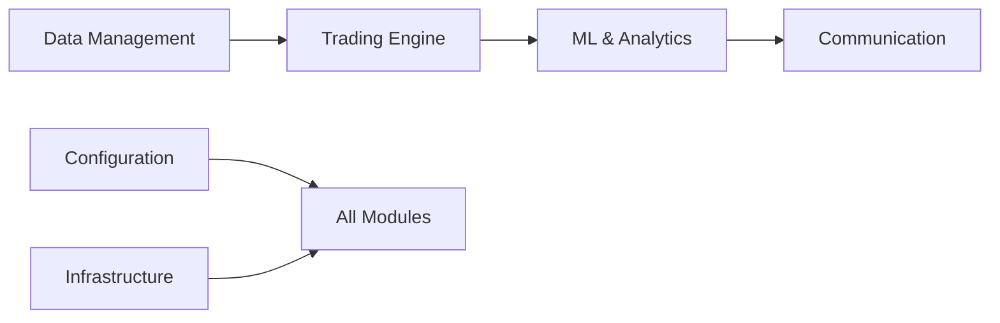

# Advanced Trading Framework - Documentation Index

## Quick Reference Guide

This index provides a comprehensive guide to all documentation, organized by topic and cross-referenced for easy navigation.

## 📚 Core Documentation

### System Architecture
- **[Main Architecture Overview](README.md)** - Complete system overview and module matrix
- **[System Overview Diagram](diagrams/system-overview.mmd)** - High-level component relationships
- **[Module Interactions](diagrams/module-interactions.mmd)** - Detailed service communication patterns
- **[Data Flow Architecture](diagrams/data-flow.mmd)** - Information flow through the system

### Database & Data Management
- **[Database Architecture](database-architecture.md)** - PostgreSQL schema and data models
- **[Data Providers & Sources](data-providers-sources.md)** - External data integration patterns
- **[Data Management Module](modules/data-management.md)** - Market data, feeds, and caching

## 🏗️ Module Documentation

### Core Business Logic
| Module | Purpose | Key Features | Status |
|--------|---------|--------------|--------|
| **[Data Management](modules/data-management.md)** | Market data acquisition and caching | Data feeds, providers, OHLCV processing | ✅ Complete |
| **[Trading Engine](modules/trading-engine.md)** | Strategy execution and bot management | Trading bots, strategy framework, execution | ✅ Complete |
| **[ML & Analytics](modules/ml-analytics.md)** | Machine learning and performance analytics | MLflow, feature engineering, backtesting | ✅ In Progress |

### User Interfaces & Communication
| Module | Purpose | Key Features | Status |
|--------|---------|--------------|--------|
| **[Communication](modules/communication.md)** | User interfaces and notifications | Telegram bot, Web UI, email notifications | ✅ Complete |
| **[Security & Auth](modules/security-auth.md)** | Authentication and authorization | User management, API security, access control | 📋 In Progress |

### Infrastructure & Support
| Module | Purpose | Key Features | Status |
|--------|---------|--------------|--------|
| **[Infrastructure](modules/infrastructure.md)** | Database, scheduling, error handling | PostgreSQL, APScheduler, logging | ✅ Complete |
| **[Configuration](modules/configuration.md)** | System configuration and templates | Config management, environment handling | ✅ Complete |

## 🔄 Service Integration

### Background Services
- **[Background Services](background-services.md)** - APScheduler system and job management
- **[Notification Services](notification-services.md)** - Multi-channel notification integration
- **[System Health Monitoring](system-health-monitoring.md)** - Comprehensive health monitoring and alerting
- **[Service Communication Diagram](diagrams/service-communication.mmd)** - Inter-service communication patterns

### API & External Integration
- **[API Endpoints Diagram](diagrams/api-endpoints.mmd)** - REST API structure and endpoints
- **[User Scenarios Diagram](diagrams/user-scenarios.mmd)** - Key user workflow patterns

## 🚀 Evolution & Maintenance

### System Evolution
- **[Migration & Evolution](migration-evolution.md)** - System upgrade and migration strategies
- **[API Migration Summary](API_MIGRATION_SUMMARY.md)** - REST layer restructuring from web_ui/backend to src/api
- **[Documentation Procedures](documentation-procedures.md)** - Maintenance and update procedures

### Templates & Standards
- **[Documentation Template](TEMPLATE.md)** - Standard template for new module documentation

## 📖 Key Concepts & Terminology

### Trading Concepts
| Term | Definition | Related Modules | Documentation |
|------|------------|-----------------|---------------|
| **Strategy Framework** | Modular trading strategy architecture with mixins | Trading Engine | [Trading Engine](modules/trading-engine.md#strategy-framework) |
| **OHLCV Data** | Open, High, Low, Close, Volume market data format | Data Management | [Data Management](modules/data-management.md#data-structures) |
| **Backtesting Engine** | Historical strategy testing and performance analysis | Trading Engine, ML & Analytics | [Trading Engine](modules/trading-engine.md#backtesting) |
| **Risk Management** | Position sizing, stop-loss, and portfolio controls | Trading Engine | [Trading Engine](modules/trading-engine.md#risk-management) |

### Technical Architecture
| Term | Definition | Related Modules | Documentation |
|------|------------|-----------------|---------------|
| **Repository Pattern** | Data access abstraction layer | Infrastructure, Data Management | [Database Architecture](database-architecture.md#repository-pattern) |
| **Service Layer** | Business logic encapsulation pattern | All Modules | [README](README.md#architectural-design-principles) |
| **Event-Driven Architecture** | Asynchronous processing and loose coupling | Infrastructure, Communication | [Background Services](background-services.md#event-processing) |
| **Circuit Breaker** | Failure detection and recovery pattern | Infrastructure | [Infrastructure](modules/infrastructure.md#error-handling) |
| **Health Monitoring** | Automated system health tracking and alerting | All Systems | [System Health Monitoring](system-health-monitoring.md) |
| **Heartbeat System** | Automatic health status reporting from all processes | Infrastructure | [System Health Monitoring](system-health-monitoring.md#heartbeat-implementation) |

### Data & ML Concepts
| Term | Definition | Related Modules | Documentation |
|------|------------|-----------------|---------------|
| **MLflow Integration** | Model lifecycle management and experiment tracking | ML & Analytics | [ML & Analytics](modules/ml-analytics.md#mlflow-integration) |
| **Feature Engineering** | Data transformation for machine learning | ML & Analytics | [ML & Analytics](modules/ml-analytics.md#feature-engineering) |
| **Regime Detection** | Market state identification using ML | ML & Analytics | [ML & Analytics](modules/ml-analytics.md#regime-detection) |
| **Performance Metrics** | Trading strategy evaluation metrics | ML & Analytics | [ML & Analytics](modules/ml-analytics.md#performance-analytics) |

## 🔗 Cross-Module Dependencies

### Primary Dependencies

### Integration Points
| Source Module | Target Module | Integration Type | Documentation |
|---------------|---------------|------------------|---------------|
| **Data Management** | **Trading Engine** | Market data feeds | [Data Flow](diagrams/data-flow.mmd) |
| **Trading Engine** | **ML & Analytics** | Trade results and signals | [Module Interactions](diagrams/module-interactions.mmd) |
| **ML & Analytics** | **Communication** | Performance alerts | [Notification Services](notification-services.md) |
| **Configuration** | **All Modules** | System-wide configuration | [Configuration](modules/configuration.md) |
| **Infrastructure** | **All Modules** | Database, logging, scheduling | [Infrastructure](modules/infrastructure.md) |

## 📋 Implementation Status

### Completed Features ✅
- Core trading functionality with strategy framework
- Multi-broker support (Binance, IBKR, Yahoo Finance)
- Comprehensive data management and caching
- Telegram bot interface with command system
- Background job scheduling and management
- Error handling and logging system
- Configuration management with hot reload

### In Progress Features 🔄
- Advanced ML features and model management
- Web UI enhancements and dashboard
- Enhanced security and authentication
- Real-time ML inference integration

### Planned Features 📋
- Microservices architecture migration
- Cloud-native deployment options
- Advanced order types and execution
- Enhanced portfolio analytics

## 🔍 Finding Information

### By Use Case
| I want to... | Start Here | Related Documentation |
|--------------|------------|----------------------|
| **Understand the overall system** | [README](README.md) | [System Overview](diagrams/system-overview.mmd) |
| **Add a new trading strategy** | [Trading Engine](modules/trading-engine.md) | [Strategy Framework](modules/trading-engine.md#strategy-framework) |
| **Integrate a new data provider** | [Data Management](modules/data-management.md) | [Data Providers](data-providers-sources.md) |
| **Set up notifications** | [Communication](modules/communication.md) | [Notification Services](notification-services.md) |
| **Configure the system** | [Configuration](modules/configuration.md) | [Environment Setup](../ENVIRONMENT_SETUP.md) |
| **Understand the database** | [Database Architecture](database-architecture.md) | [Infrastructure](modules/infrastructure.md) |
| **Add ML features** | [ML & Analytics](modules/ml-analytics.md) | [Feature Engineering](modules/ml-analytics.md#feature-engineering) |
| **Deploy the system** | [Migration & Evolution](migration-evolution.md) | [Infrastructure](modules/infrastructure.md) |

### By Component
| Component | Module | Key Documentation | Status |
|-----------|--------|-------------------|--------|
| **Trading Bots** | Trading Engine | [Bot Management](modules/trading-engine.md#bot-management) | ✅ |
| **Data Feeds** | Data Management | [Live Feeds](modules/data-management.md#live-feeds) | ✅ |
| **Telegram Bot** | Communication | [Telegram Interface](modules/communication.md#telegram-interface) | ✅ |
| **Web Dashboard** | Communication | [Web Interface](modules/communication.md#web-interface) | 🔄 |
| **ML Pipeline** | ML & Analytics | [MLflow Integration](modules/ml-analytics.md#mlflow-integration) | ✅ |
| **Job Scheduler** | Infrastructure | [Background Services](background-services.md) | ✅ |
| **Database Schema** | Infrastructure | [Database Architecture](database-architecture.md) | ✅ |
| **Configuration System** | Configuration | [Config Management](modules/configuration.md) | ✅ |

## 📞 Getting Help

### Documentation Issues
- **Missing Information**: Check related modules and cross-references
- **Outdated Content**: Refer to [Documentation Procedures](documentation-procedures.md)
- **Technical Questions**: See module-specific documentation and code examples

### Development Support
- **Setup Issues**: [Environment Setup Guide](../ENVIRONMENT_SETUP.md)
- **Development Workflow**: [Developer Guide](../DEVELOPER_GUIDE.md)
- **API Reference**: [API Documentation](../API.md)
- **User Guide**: [User Guide](../USER_GUIDE.md)

---

**Index Version**: 1.0.0  
**Last Updated**: January 18, 2025  
**Maintained by**: Documentation Team  

This index is automatically updated when new documentation is added. For suggestions or improvements, please refer to the [Documentation Procedures](documentation-procedures.md).