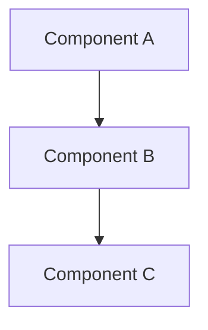

# Documentation Maintenance Procedures

## Overview

This document defines the procedures, templates, and automation strategies for maintaining the High-Level Architecture documentation in sync with code changes and system evolution.

## 🔄 Maintenance Workflow

### Automated Maintenance

#### 1. Version Synchronization
```bash
# Update version information across all documentation
./scripts/update_doc_versions.sh <new_version>

# Validate version consistency
./scripts/validate_versions.sh
```

#### 2. Link Validation
```bash
# Check all internal and external links
./scripts/validate_links.sh

# Generate link validation report
./scripts/generate_link_report.sh
```

#### 3. Code-Documentation Sync
```bash
# Validate code examples against current APIs
./scripts/validate_code_examples.sh

# Update implementation status indicators
./scripts/update_implementation_status.sh
```

### Manual Maintenance Schedule

| Frequency | Task | Responsible Team | Deliverable |
|-----------|------|------------------|-------------|
| **Weekly** | Link validation, broken reference fixes | Development Team | Link validation report |
| **Monthly** | Implementation status updates | Module Owners | Updated status indicators |
| **Quarterly** | Technical accuracy review | Architecture Team | Validation report |
| **Per Release** | Version updates, new feature documentation | Development Team | Updated documentation |
| **Annually** | Complete documentation audit | Architecture Team | Comprehensive audit report |

## 📋 Documentation Templates

### New Module Documentation Template

```markdown
# [Module Name] Module

## Purpose & Responsibilities

[Brief description of module purpose and core responsibilities]

## 🔗 Quick Navigation
- **[📖 Documentation Index](../INDEX.md)** - Complete documentation guide
- **[🏗️ System Architecture](../README.md)** - Overall system overview
- **[Related Module 1](module1.md)** - Description of relationship
- **[Related Module 2](module2.md)** - Description of relationship

## 🔄 Related Modules
| Module | Relationship | Integration Points |
|--------|--------------|-------------------|
| **[Module A](module-a.md)** | Relationship Type | Integration description |
| **[Module B](module-b.md)** | Relationship Type | Integration description |

## Key Components

### 1. Component Name (Purpose)

Brief description of component purpose and functionality.

```python
# Code example showing component usage
from src.module import Component

component = Component(config)
result = component.process(data)
```

**Key Features:**
- Feature 1 description
- Feature 2 description
- Feature 3 description

### 2. Component Name (Purpose)

[Continue with additional components...]

## Architecture Patterns

### Pattern Name
Description of architectural pattern used in this module.

## Integration Points

### With Module A
- **Data Flow**: Description of data exchange
- **API Interfaces**: Key interfaces and methods
- **Dependencies**: Required dependencies

### With Module B
- **Event Communication**: Event-based interactions
- **Service Calls**: Direct service interactions
- **Configuration**: Shared configuration requirements

## Configuration

### Required Configuration
```yaml
module_name:
  setting1: value1
  setting2: value2
  nested:
    option1: value1
    option2: value2
```

### Environment Variables
- `MODULE_SETTING_1`: Description and default value
- `MODULE_SETTING_2`: Description and default value

## Current Implementation Status

### ✅ Implemented Features
- [x] Feature 1 - Description
- [x] Feature 2 - Description

### 🔄 In Progress Features
- [ ] Feature 3 - Description and timeline
- [ ] Feature 4 - Description and timeline

### 📋 Planned Features
- [ ] Feature 5 - Description and planned timeline
- [ ] Feature 6 - Description and planned timeline

## Dependencies

### Internal Dependencies
- **[Module A](module-a.md)**: Dependency description
- **[Module B](module-b.md)**: Dependency description

### External Dependencies
- **Library Name** (version): Purpose and usage
- **Service Name**: Integration purpose

## Performance Considerations

### Scalability
- Performance characteristics
- Scaling limitations
- Optimization strategies

### Resource Usage
- Memory requirements
- CPU utilization
- Storage requirements

## Error Handling

### Error Types
- **Error Type 1**: Description and handling strategy
- **Error Type 2**: Description and handling strategy

### Recovery Mechanisms
- Automatic recovery procedures
- Manual intervention requirements
- Monitoring and alerting

## Testing Strategy

### Unit Tests
- Test coverage requirements
- Key test scenarios
- Mock strategies

### Integration Tests
- Integration test scenarios
- External service mocking
- End-to-end test cases

## Monitoring & Observability

### Key Metrics
- Performance metrics to monitor
- Business metrics to track
- Health check indicators

### Logging
- Log levels and categories
- Structured logging format
- Log retention policies

### Alerting
- Critical alert conditions
- Warning thresholds
- Notification channels

## Migration & Evolution

### Version Compatibility
- Backward compatibility requirements
- Breaking change policies
- Migration procedures

### Future Enhancements
- Planned architectural improvements
- Technology upgrade paths
- Deprecation timelines

---

**Module Version**: [Version]  
**Last Updated**: [Date]  
**Next Review**: [Date]  
**Maintainer**: [Team/Person]
```

### Feature Documentation Template

```markdown
# [Feature Name] Feature Documentation

## Overview
Brief description of the feature and its purpose.

## Requirements
- **Functional Requirements**: What the feature does
- **Non-Functional Requirements**: Performance, security, etc.
- **Dependencies**: Required modules and external services

## Architecture
Description of feature architecture and design decisions.

### Component Diagram


## Implementation Details

### Core Components
- **Component 1**: Purpose and functionality
- **Component 2**: Purpose and functionality

### API Interfaces
```python
# API usage examples
from src.module import FeatureAPI

api = FeatureAPI()
result = api.execute_feature(parameters)
```

### Configuration
```yaml
feature_name:
  enabled: true
  settings:
    option1: value1
    option2: value2
```

## Integration Points
- **Module A**: Integration description
- **Module B**: Integration description

## Testing
- **Unit Tests**: Test coverage and key scenarios
- **Integration Tests**: End-to-end testing approach
- **Performance Tests**: Performance validation

## Deployment
- **Configuration Changes**: Required configuration updates
- **Database Changes**: Schema migrations if needed
- **Service Dependencies**: New service requirements

## Monitoring
- **Metrics**: Key metrics to monitor
- **Alerts**: Alert conditions and thresholds
- **Logging**: Relevant log entries

## Documentation Updates
- **User Guide**: User-facing documentation changes
- **API Documentation**: API reference updates
- **Architecture Documentation**: Architecture impact

---

**Feature Version**: [Version]  
**Implementation Date**: [Date]  
**Maintainer**: [Team/Person]
```

## 🔧 Automation Scripts

### Version Update Script
```bash
#!/bin/bash
# scripts/update_doc_versions.sh

NEW_VERSION=$1
if [ -z "$NEW_VERSION" ]; then
    echo "Usage: $0 <new_version>"
    exit 1
fi

# Update version in main README
sed -i "s/Version: [0-9]\+\.[0-9]\+\.[0-9]\+/Version: $NEW_VERSION/g" docs/HLA/README.md

# Update version in all module documents
find docs/HLA/modules -name "*.md" -exec sed -i "s/Version: [0-9]\+\.[0-9]\+\.[0-9]\+/Version: $NEW_VERSION/g" {} \;

# Update last updated date
CURRENT_DATE=$(date +"%B %d, %Y")
find docs/HLA -name "*.md" -exec sed -i "s/Last Updated: .*/Last Updated: $CURRENT_DATE/g" {} \;

echo "Documentation versions updated to $NEW_VERSION"
```

### Link Validation Script
```bash
#!/bin/bash
# scripts/validate_links.sh

echo "Validating documentation links..."

# Check internal links
find docs/HLA -name "*.md" -exec grep -H "\[.*\](.*\.md)" {} \; | while read line; do
    file=$(echo $line | cut -d: -f1)
    link=$(echo $line | grep -o "\[.*\](.*\.md)" | sed 's/.*(\(.*\))/\1/')
    
    if [[ $link == ../* ]]; then
        # Relative link from HLA directory
        target="docs/HLA/$link"
    elif [[ $link == */* ]]; then
        # Relative link within HLA
        target="docs/HLA/$(dirname $file | sed 's|docs/HLA||')/$link"
    else
        # Same directory link
        target="$(dirname $file)/$link"
    fi
    
    if [ ! -f "$target" ]; then
        echo "BROKEN LINK: $file -> $link (target: $target)"
    fi
done

echo "Link validation complete"
```

### Implementation Status Update Script
```bash
#!/bin/bash
# scripts/update_implementation_status.sh

echo "Updating implementation status indicators..."

# Function to check if module is fully implemented
check_module_status() {
    local module_path=$1
    local module_name=$2
    
    # Check if module has comprehensive implementation
    if [ -d "$module_path" ] && [ $(find "$module_path" -name "*.py" | wc -l) -gt 5 ]; then
        echo "✅"
    elif [ -d "$module_path" ] && [ $(find "$module_path" -name "*.py" | wc -l) -gt 0 ]; then
        echo "🔄"
    else
        echo "📋"
    fi
}

# Update module status in README
DATA_STATUS=$(check_module_status "src/data" "Data Management")
TRADING_STATUS=$(check_module_status "src/trading" "Trading Engine")
ML_STATUS=$(check_module_status "src/ml" "ML & Analytics")
COMM_STATUS=$(check_module_status "src/telegram" "Communication")
INFRA_STATUS=$(check_module_status "src/data/db" "Infrastructure")
CONFIG_STATUS=$(check_module_status "src/config" "Configuration")
AUTH_STATUS=$(check_module_status "src/api" "Security & Auth")

echo "Module status updated"
```

### Code Example Validation Script
```python
#!/usr/bin/env python3
# scripts/validate_code_examples.py

import re
import ast
import sys
from pathlib import Path

def extract_code_blocks(file_path):
    """Extract Python code blocks from markdown files."""
    with open(file_path, 'r', encoding='utf-8') as f:
        content = f.read()
    
    # Find Python code blocks
    pattern = r'```python\n(.*?)\n```'
    code_blocks = re.findall(pattern, content, re.DOTALL)
    return code_blocks

def validate_syntax(code_block):
    """Validate Python syntax of code block."""
    try:
        ast.parse(code_block)
        return True, None
    except SyntaxError as e:
        return False, str(e)

def main():
    """Validate all code examples in documentation."""
    docs_path = Path('docs/HLA')
    errors = []
    
    for md_file in docs_path.rglob('*.md'):
        code_blocks = extract_code_blocks(md_file)
        
        for i, code_block in enumerate(code_blocks):
            # Skip import-only blocks and comments
            if code_block.strip().startswith('#') or 'import' in code_block and len(code_block.split('\n')) < 3:
                continue
                
            valid, error = validate_syntax(code_block)
            if not valid:
                errors.append(f"{md_file}:block_{i}: {error}")
    
    if errors:
        print("Code validation errors found:")
        for error in errors:
            print(f"  - {error}")
        sys.exit(1)
    else:
        print("All code examples are syntactically valid")

if __name__ == "__main__":
    main()
```

## 📊 Quality Assurance Procedures

### Documentation Review Checklist

#### Technical Accuracy
- [ ] All code examples are syntactically correct
- [ ] All referenced modules and classes exist
- [ ] All configuration examples are valid
- [ ] All API examples match current interfaces

#### Content Quality
- [ ] Clear and concise writing
- [ ] Consistent terminology throughout
- [ ] Proper grammar and spelling
- [ ] Logical information organization

#### Structure and Navigation
- [ ] Consistent document structure
- [ ] Working internal links
- [ ] Proper cross-references
- [ ] Clear section headings

#### Completeness
- [ ] All major components documented
- [ ] Integration points clearly described
- [ ] Configuration requirements specified
- [ ] Error handling documented

### Review Process

#### 1. Automated Validation
```bash
# Run all validation scripts
./scripts/validate_all.sh
```

#### 2. Peer Review
- **Technical Review**: Module owners review their module documentation
- **Architecture Review**: Architecture team reviews system-wide documentation
- **User Experience Review**: End users review documentation usability

#### 3. Approval Process
- **Draft**: Initial documentation creation
- **Review**: Peer and technical review
- **Revision**: Address review feedback
- **Approval**: Final approval by architecture team
- **Publication**: Update live documentation

## 🔄 Continuous Improvement

### Feedback Collection
- **User Feedback**: Regular feedback collection from documentation users
- **Usage Analytics**: Track documentation usage patterns
- **Issue Tracking**: GitHub issues for documentation problems
- **Survey Data**: Periodic documentation satisfaction surveys

### Improvement Metrics
- **Accuracy Score**: Percentage of accurate technical information
- **Completeness Score**: Coverage of system components
- **Usability Score**: User satisfaction with documentation
- **Maintenance Efficiency**: Time to update documentation after code changes

### Update Triggers
- **Code Changes**: Automatic documentation updates for API changes
- **Feature Releases**: Documentation updates for new features
- **Architecture Changes**: Major documentation revisions for architectural changes
- **User Feedback**: Documentation improvements based on user feedback

## 📅 Maintenance Calendar

### Monthly Tasks
- Week 1: Link validation and broken reference fixes
- Week 2: Implementation status updates
- Week 3: Code example validation
- Week 4: User feedback review and improvements

### Quarterly Tasks
- Technical accuracy validation
- Comprehensive documentation review
- Architecture diagram updates
- Performance metrics review

### Annual Tasks
- Complete documentation audit
- Documentation strategy review
- Tool and process improvements
- Training and knowledge transfer

---

**Procedures Version**: 1.0.0  
**Last Updated**: January 18, 2025  
**Next Review**: April 18, 2025  
**Maintained By**: Architecture Documentation Team