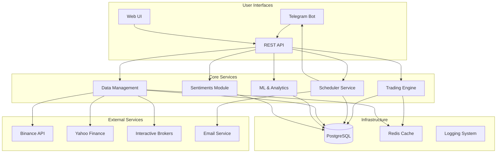

# Advanced Trading Framework - High-Level Architecture

## System Overview

The Advanced Trading Framework is a comprehensive, modular trading platform designed for automated trading, backtesting, analytics, and portfolio management. Built with Python and leveraging modern architectural patterns, the system provides a robust foundation for both paper and live trading operations.

### Purpose & Vision

The Advanced Trading Framework is designed as a comprehensive, production-ready ecosystem that bridges the gap between algorithmic trading research and live market execution. The platform serves multiple stakeholder needs:

**For Quantitative Researchers:**
- **Strategy Development**: Rapid prototyping and testing of trading strategies with modular mixin architecture
- **Backtesting Engine**: Comprehensive historical testing with advanced performance metrics
- **ML Integration**: End-to-end machine learning pipeline with MLflow integration for model management

**For Traders & Portfolio Managers:**
- **Multi-Asset Trading**: Unified interface for cryptocurrencies, stocks, forex, and commodities
- **Risk Management**: Sophisticated position sizing, stop-loss, and portfolio-level risk controls
- **Real-time Execution**: Live trading with multiple broker integrations and real-time data feeds

**For System Administrators:**
- **Operational Excellence**: Robust error handling, comprehensive logging, and automated recovery
- **Scalable Architecture**: Modular design supporting both single-server and distributed deployments
- **Monitoring & Alerting**: Multi-channel notifications and performance monitoring

**Core Value Propositions:**
1. **Unified Platform**: Single codebase supporting research, backtesting, and live trading
2. **Production Ready**: Enterprise-grade error handling, logging, and operational features
3. **Extensible Design**: Plugin architecture for strategies, data providers, and notification channels
4. **Multi-Asset Support**: Consistent API across different asset classes and markets
5. **Advanced Analytics**: Built-in performance metrics, ML capabilities, and portfolio analytics

### Technology Stack & Architecture Decisions

| Component | Technology | Version | Rationale |
|-----------|------------|---------|-----------|
| **Backend Framework** | Python 3.9+ | 3.9+ | Mature ecosystem, extensive financial libraries, strong ML support |
| **Database** | PostgreSQL | 13+ | ACID compliance, advanced indexing, time-series capabilities |
| **Web Framework** | FastAPI | 0.104+ | High performance, automatic API documentation, async support |
| **Trading Engine** | Backtrader | 1.9.78+ | Mature backtesting framework, extensive indicator library |
| **Scheduler** | APScheduler | 3.10+ | Robust job scheduling, persistence, clustering support |
| **ML Framework** | MLflow + scikit-learn | 2.8+ / 1.3+ | Model lifecycle management, experiment tracking |
| **Messaging** | Telegram Bot API | aiogram 3.0+ | Real-time notifications, command interface |
| **Caching** | Redis (planned) | 7.0+ | High-performance caching, session management |
| **Process Management** | systemd / Docker | - | Production deployment, service management |

**Key Technology Decisions:**

1. **Python Ecosystem**: Chosen for its rich financial and ML libraries (pandas, numpy, scikit-learn, TA-Lib)
2. **PostgreSQL**: Selected over NoSQL for ACID compliance and complex query capabilities needed for financial data
3. **Backtrader**: Preferred over custom engine for its mature ecosystem and extensive testing
4. **FastAPI**: Chosen over Flask/Django for performance and automatic API documentation
5. **Modular Architecture**: Designed for easy migration to microservices if needed

## High-Level System Architecture



## Module Architecture

### Core Modules

| Module | Status | Purpose | Key Components |
|--------|--------|---------|----------------|
| **[Data Management](modules/data-management.md)** | ✅ | Market data, providers, caching | Data feeds, downloaders, OHLCV processing |
| **[Trading Engine](modules/trading-engine.md)** | ✅ | Strategy execution, bot management | Trading bots, strategy framework, execution |
| **[ML & Analytics](modules/ml-analytics.md)** | ✅ | Machine learning, performance analytics | MLflow, feature engineering, backtesting |
| **[Sentiments](modules/sentiments.md)** | ✅ | Social media and news sentiment | Adapters, aggregation, heuristic analysis |
| **[Communication](modules/communication.md)** | ✅ | User interfaces, notifications | Telegram bot, Web UI, email notifications |
| **[Infrastructure](modules/infrastructure.md)** | ✅ | Database, scheduling, error handling | PostgreSQL, APScheduler, logging |
| **[Configuration](modules/configuration.md)** | ✅ | System configuration, templates | Config management, environment handling |
| **[Security & Auth](modules/security-auth.md)** | 📋 | Authentication, authorization | User management, API security, access control |

**Legend**: ✅ Implemented | 🔄 In Progress | 📋 Planned

### Module Responsibilities Matrix

| Module | Primary Responsibilities | Key Components | Dependencies | Status |
|--------|-------------------------|----------------|--------------|--------|
| **[Data Management](modules/data-management.md)** | Market data acquisition, caching, validation | DataManager, UnifiedCache, ProviderSelector, Live feeds | External APIs (Binance, Yahoo, IBKR) | ✅ |
| **[Model](modules/data-management.md#data-models)** | Data structures, schemas, validation | Trade, User, Alert models, Database schemas | PostgreSQL, SQLAlchemy | ✅ |
| **[Common](modules/infrastructure.md#shared-utilities)** | Shared utilities, indicator calculations | IndicatorService, RecommendationEngine, OHLCV utils | TA-Lib, pandas, numpy | ✅ |
| **[Strategy](modules/trading-engine.md#strategy-framework)** | Trading strategy framework, mixins | BaseStrategy, Entry/Exit mixins, CustomStrategy | Backtrader, Common, Data | ✅ |
| **[Sentiments](modules/sentiments.md)** | Sentiment collection and analysis | News/Social adapters, Aggregator, Heuristics | Finnhub, Google Trends, aiohttp | ✅ |
| **[Trading](modules/trading-engine.md#execution-engine)** | Trade execution, bot management | TradingBot, BrokerFactory, Position management | Strategy, Data, Model | ✅ |
| **[Backtester](modules/trading-engine.md#backtesting)** | Historical strategy testing | BacktestEngine, Performance analytics | Backtrader, Strategy, Data | ✅ |
| **[ML](modules/ml-analytics.md)** | Machine learning, regime detection | MLflow integration, Feature engineering, LSTM/HMM models | MLflow, scikit-learn, PyTorch | 🔄 |
| **[Analytics](modules/ml-analytics.md#performance-analytics)** | Performance metrics, reporting | Sharpe ratio, Drawdown, Risk metrics | Trading, Model, Common | ✅ |
| **[Indicators](modules/trading-engine.md#technical-indicators)** | Technical indicator calculations | RSI, MACD, Bollinger Bands, ATR | TA-Lib, pandas | ✅ |
| **[Scheduler](modules/infrastructure.md#job-management)** | Background job management | APScheduler, Job persistence, Cron jobs | APScheduler, Database | ✅ |
| **[Notification](modules/communication.md#notification-system)** | Multi-channel notifications | Email, Telegram, Alert system | SMTP, Telegram API | ✅ |
| **[Telegram](modules/communication.md#telegram-interface)** | Telegram bot interface | Command handlers, User management, Screener bot | aiogram, Notification, Analytics | ✅ |
| **[Web UI](modules/communication.md#web-interface)** | Web-based management interface | FastAPI backend (src/api/), React frontend, Dashboard | FastAPI, React, Trading | ✅ |
| **[Config](modules/configuration.md)** | Configuration management | Environment configs, Validation, Hot reload | Pydantic, JSON/YAML | ✅ |
| **[Error Handling](modules/infrastructure.md#error-handling)** | System resilience, error recovery | Exception handling, Circuit breaker, Logging | Python logging, Custom handlers | ✅ |
| **[Util](modules/infrastructure.md#utilities)** | General utilities, helpers | File operations, Date/time utils, Validation | Python standard library | ✅ |

#### Module Integration Points

```mermaid
graph TB
    %% External Data Sources
    subgraph "External APIs"
        BINANCE_API[Binance API]
        YAHOO_API[Yahoo Finance API]
        IBKR_API[Interactive Brokers API]
        TELEGRAM_API[Telegram Bot API]
        EMAIL_SMTP[Email SMTP]
    end

    %% Core System Layers
    subgraph "Data Layer"
        DATA[Data Management]
        MODEL[Model/Database]
        CACHE[Caching System]
    end

    subgraph "Business Logic Layer"
        STRATEGY[Strategy Framework]
        TRADING[Trading Engine]
        ML[ML & Analytics]
        SENTIMENT[Sentiment Module]
        BACKTESTER[Backtester]
        ANALYTICS[Analytics]
    end

    subgraph "Service Layer"
        SCHEDULER[Scheduler]
        NOTIFICATION[Notification]
        CONFIG[Configuration]
        ERROR[Error Handling]
    end

    subgraph "Interface Layer"
        TELEGRAM[Telegram Bot]
        WEB_UI[Web Interface]
        API[REST API]
    end

    subgraph "Infrastructure Layer"
        COMMON[Common Utilities]
        INDICATORS[Technical Indicators]
        UTIL[General Utilities]
        DATABASE[(PostgreSQL)]
    end

    %% External API Connections
    BINANCE_API --> DATA
    YAHOO_API --> DATA
    IBKR_API --> DATA
    TELEGRAM_API --> TELEGRAM
    EMAIL_SMTP --> NOTIFICATION

    %% Data Layer Connections
    DATA --> CACHE
    DATA --> MODEL
    MODEL --> DATABASE
    CONFIG --> DATA
    CONFIG --> MODEL

    %% Business Logic Connections
    DATA --> STRATEGY
    DATA --> TRADING
    DATA --> ML
    DATA --> BACKTESTER
    DATA --> ANALYTICS
    DATA --> SENTIMENT

    MODEL --> STRATEGY
    MODEL --> TRADING
    MODEL --> ML
    MODEL --> BACKTESTER
    MODEL --> ANALYTICS
    MODEL --> SENTIMENT

    INDICATORS --> STRATEGY
    INDICATORS --> BACKTESTER
    INDICATORS --> ML
    INDICATORS --> SENTIMENT
    COMMON --> STRATEGY
    COMMON --> TRADING
    COMMON --> ML
    COMMON --> ANALYTICS
    COMMON --> SENTIMENT

    STRATEGY --> BACKTESTER
    STRATEGY --> TRADING
    ML --> STRATEGY
    SENTIMENT --> STRATEGY
    SENTIMENT --> ML
    BACKTESTER --> ANALYTICS
    TRADING --> ANALYTICS

    %% Service Layer Connections
    CONFIG --> STRATEGY
    CONFIG --> TRADING
    CONFIG --> ML
    CONFIG --> SCHEDULER
    CONFIG --> NOTIFICATION

    SCHEDULER --> TRADING
    SCHEDULER --> ML
    SCHEDULER --> ANALYTICS
    SCHEDULER --> NOTIFICATION

    ERROR --> TRADING
    ERROR --> SCHEDULER
    ERROR --> DATA
    ERROR --> ML

    TRADING --> NOTIFICATION
    ANALYTICS --> NOTIFICATION
    ML --> NOTIFICATION
    SENTIMENT --> NOTIFICATION
    SCHEDULER --> NOTIFICATION

    %% Interface Layer Connections
    NOTIFICATION --> TELEGRAM
    NOTIFICATION --> WEB_UI

    TELEGRAM --> STRATEGY
    TELEGRAM --> ANALYTICS
    TELEGRAM --> TRADING
    TELEGRAM --> MODEL

    WEB_UI --> API
    API --> STRATEGY
    API --> ANALYTICS
    API --> TRADING
    API --> ML
    API --> MODEL

    %% Infrastructure Connections
    UTIL --> DATA
    UTIL --> STRATEGY
    UTIL --> ANALYTICS
    UTIL --> TRADING

    %% Styling
    classDef external fill:#e1f5fe,stroke:#01579b,stroke-width:2px
    classDef dataLayer fill:#f3e5f5,stroke:#4a148c,stroke-width:2px
    classDef businessLayer fill:#e8f5e8,stroke:#1b5e20,stroke-width:2px
    classDef serviceLayer fill:#fff3e0,stroke:#e65100,stroke-width:2px
    classDef interfaceLayer fill:#fce4ec,stroke:#880e4f,stroke-width:2px
    classDef infraLayer fill:#f1f8e9,stroke:#33691e,stroke-width:2px
    classDef database fill:#e3f2fd,stroke:#0d47a1,stroke-width:3px

    class BINANCE_API,YAHOO_API,IBKR_API,TELEGRAM_API,EMAIL_SMTP external
    class DATA,MODEL,CACHE dataLayer
    class STRATEGY,TRADING,ML,BACKTESTER,ANALYTICS businessLayer
    class SCHEDULER,NOTIFICATION,CONFIG,ERROR serviceLayer
    class TELEGRAM,WEB_UI,API interfaceLayer
    class COMMON,INDICATORS,UTIL,DATABASE infraLayer
    class DATABASE database
```



#### Dependency Analysis

**High-Level Dependencies:**
- **Data Management** ← External APIs (Binance, Yahoo, IBKR)
- **Business Logic** ← Data Management, Model, Common
- **Service Layer** ← Business Logic, Configuration
- **Interface Layer** ← Service Layer, Business Logic
- **Infrastructure** ← All layers (cross-cutting concerns)

**Critical Integration Points:**
1. **Data Management → Strategy Framework**: Market data feeds strategy decisions
2. **Strategy Framework → Trading Engine**: Strategy signals trigger trade execution
3. **Trading Engine → Analytics**: Trade results feed performance analysis
4. **Analytics → Notification**: Performance alerts and reports
5. **Configuration → All Modules**: System-wide configuration management
6. **Error Handling → All Modules**: Cross-cutting error recovery and logging

**Module Implementation Status:**
- ✅ **Fully Implemented** (11 modules): Core trading functionality complete
- 🔄 **In Progress** (1 module): ML features and Web UI frontend enhancements
- 📋 **Planned** (0 modules): All major modules have been implemented

## Data Flow Architecture

### Primary Data Flows

1. **Market Data Flow**: External APIs → Data Management → Cache/Database → Trading Engine
2. **Trading Flow**: Strategy Signals → Trading Engine → Broker APIs → Database
3. **Analytics Flow**: Historical Data → ML Pipeline → Performance Metrics → Notifications
4. **User Command Flow**: Telegram/Web → API → Business Logic → Database → Response

### Integration Patterns

- **Repository Pattern**: Data access abstraction layer
- **Service Layer**: Business logic encapsulation
- **Event-Driven**: Asynchronous processing for notifications and background tasks
- **Microservice-Ready**: Modular design supporting future service decomposition

## Deployment Architecture

### Current Deployment

- **Single Server**: All components on one machine
- **Database**: PostgreSQL with connection pooling
- **Process Management**: systemd services for production
- **Monitoring**: File-based logging with rotation

### Planned Enhancements

- **Containerization**: Docker deployment with docker-compose
- **Load Balancing**: Nginx reverse proxy
- **Monitoring**: Prometheus + Grafana integration
- **High Availability**: Database clustering and service redundancy

## Development Guidelines

### Code Organization

```
src/
├── data/           # Data management and providers
├── trading/        # Trading engine and strategies
├── ml/            # Machine learning and analytics
├── telegram/      # Telegram bot interface
├── api/           # REST API backend (FastAPI)
├── web_ui/        # Web interface frontend (React)
├── scheduler/     # Background job management
├── notification/  # Notification services
├── config/        # Configuration management
└── common/        # Shared utilities
```

### Architectural Design Principles

#### 1. **Separation of Concerns**
- **Data Layer**: Isolated data access with repository pattern
- **Business Logic**: Pure business rules without infrastructure dependencies  
- **Presentation Layer**: UI/API concerns separated from business logic
- **Infrastructure**: Cross-cutting concerns (logging, caching, scheduling) as separate modules

#### 2. **Dependency Inversion & Injection**
- **Abstract Interfaces**: Business logic depends on abstractions, not concrete implementations
- **Plugin Architecture**: Strategies, data providers, and brokers implement common interfaces
- **Configuration-Driven**: Runtime behavior controlled through configuration, not code changes

#### 3. **Fail-Safe & Resilient Design**
- **Circuit Breaker Pattern**: Automatic failure detection and recovery for external services
- **Graceful Degradation**: System continues operating with reduced functionality during failures
- **Comprehensive Error Handling**: Structured error handling with proper logging and user notification
- **Data Integrity**: Transactional operations with rollback capabilities

#### 4. **Observability & Monitoring**
- **Structured Logging**: Consistent log format with correlation IDs for request tracing
- **Metrics Collection**: Performance metrics, business metrics, and system health indicators
- **Distributed Tracing**: Request flow tracking across module boundaries
- **Comprehensive Health Monitoring**: Automatic health reporting from all processes and components
- **Real-time System Health**: Unified health dashboard with automatic heartbeat reporting
- **Proactive Alerting**: Multi-channel notifications for system issues and trading anomalies

**Health Monitoring Features**:
- **Automatic Heartbeats**: All processes report health status every 30-60 seconds
- **Component-Level Monitoring**: Individual monitoring of notification channels, services, and bots
- **Health APIs**: RESTful endpoints for health status queries and management
- **Historical Health Data**: Trend analysis and failure pattern detection
- **Intelligent Alerting**: Context-aware alerts with escalation procedures

#### 5. **Security by Design**
- **Principle of Least Privilege**: Minimal required permissions for each component
- **Defense in Depth**: Multiple security layers (authentication, authorization, input validation)
- **Secure Configuration**: Sensitive data encrypted at rest and in transit
- **Audit Trail**: Complete audit log of all trading decisions and user actions

#### 6. **Performance & Scalability**
- **Asynchronous Processing**: Non-blocking operations for I/O intensive tasks
- **Caching Strategy**: Multi-level caching (application, database, external API)
- **Database Optimization**: Proper indexing, query optimization, connection pooling
- **Horizontal Scaling**: Stateless services supporting load balancing and clustering

#### 7. **Testability & Quality Assurance**
- **Test-Driven Development**: Unit tests written alongside implementation
- **Integration Testing**: End-to-end testing of critical trading workflows
- **Mock External Dependencies**: Isolated testing without external service dependencies
- **Continuous Integration**: Automated testing and quality checks

#### 8. **Configuration Management**
- **Environment Separation**: Clear separation between development, testing, and production
- **Hot Configuration Reload**: Runtime configuration changes without service restart
- **Configuration Validation**: Schema validation for all configuration files
- **Secret Management**: Secure handling of API keys and sensitive configuration

#### 9. **Event-Driven Architecture**
- **Loose Coupling**: Modules communicate through events rather than direct calls
- **Asynchronous Processing**: Background processing for non-critical operations
- **Event Sourcing**: Complete audit trail of system state changes
- **Pub/Sub Pattern**: Decoupled notification and alert system

#### 10. **Domain-Driven Design**
- **Ubiquitous Language**: Consistent terminology across code, documentation, and user interfaces
- **Bounded Contexts**: Clear module boundaries aligned with business domains
- **Rich Domain Models**: Business logic encapsulated in domain objects
- **Anti-Corruption Layer**: Clean interfaces between different domain contexts

## Quick Navigation

### 📚 Complete Documentation Index
**[📖 Full Documentation Index](INDEX.md)** - Comprehensive guide to all documentation with cross-references and search by topic

### 🏗️ Module Documentation
| Module | Purpose | Key Features | Quick Links |
|--------|---------|--------------|-------------|
| **[Data Management](modules/data-management.md)** | Market data, feeds, caching | Data providers, OHLCV processing, live feeds | [Data Sources](data-providers-sources.md) • [Database Schema](database-architecture.md) |
| **[Trading Engine](modules/trading-engine.md)** | Strategy execution, bot management | Trading bots, strategy framework, backtesting | [Strategy Framework](modules/trading-engine.md#strategy-framework) • [Risk Management](modules/trading-engine.md#risk-management) |
| **[ML & Analytics](modules/ml-analytics.md)** | Machine learning, performance analytics | MLflow integration, feature engineering, regime detection | [MLflow Setup](modules/ml-analytics.md#mlflow-integration) • [Performance Metrics](modules/ml-analytics.md#performance-analytics) |
| **[Communication](modules/communication.md)** | User interfaces, notifications | Telegram bot, Web UI, email notifications | [Telegram Commands](modules/communication.md#telegram-interface) • [Notification Setup](notification-services.md) |
| **[Infrastructure](modules/infrastructure.md)** | Database, scheduling, error handling | PostgreSQL, APScheduler, logging system | [Database Setup](database-architecture.md) • [Job Scheduling](background-services.md) |
| **[Configuration](modules/configuration.md)** | System configuration, templates | Config management, environment handling, hot reload | [Config Templates](modules/configuration.md#templates) • [Environment Setup](../ENVIRONMENT_SETUP.md) |
| **[Security & Auth](modules/security-auth.md)** | Authentication, authorization | User management, API security, access control | [User Management](modules/security-auth.md#user-management) • [API Security](modules/security-auth.md#api-security) |

### 📊 System Architecture Diagrams
| Diagram | Purpose | Related Documentation |
|---------|---------|----------------------|
| **[System Overview](diagrams/system-overview.mmd)** | High-level component relationships | [Module Matrix](#module-responsibilities-matrix) • [Integration Points](#module-integration-points) |
| **[Data Flow](diagrams/data-flow.mmd)** | Information flow through the system | [Data Management](modules/data-management.md) • [Data Sources](data-providers-sources.md) |
| **[Module Interactions](diagrams/module-interactions.mmd)** | Detailed service communication patterns | [Service Communication](diagrams/service-communication.mmd) • [Background Services](background-services.md) |
| **[Service Communication](diagrams/service-communication.mmd)** | Inter-service communication protocols | [API Endpoints](diagrams/api-endpoints.mmd) • [Notification Services](notification-services.md) |
| **[API Endpoints](diagrams/api-endpoints.mmd)** | REST API structure and endpoints | [API Documentation](../API.md) • [Web Interface](modules/communication.md#web-interface) |
| **[User Scenarios](diagrams/user-scenarios.mmd)** | Key user workflow patterns | [User Guide](../USER_GUIDE.md) • [Telegram Interface](modules/communication.md#telegram-interface) |

### 🚀 System Evolution & Maintenance
| Document | Purpose | Related Information |
|----------|---------|-------------------|
| **[Migration & Evolution](migration-evolution.md)** | System upgrade and migration strategies | [Version History](#version-information--updates) • [Roadmap Planning](migration-evolution.md#roadmap) |
| **[Documentation Procedures](documentation-procedures.md)** | Maintenance and update procedures | [Update Schedule](#documentation-update-procedures) • [Quality Assurance](#quality-assurance) |
| **[Background Services](background-services.md)** | APScheduler system and job management | [Infrastructure Module](modules/infrastructure.md) • [Job Scheduling](modules/infrastructure.md#job-management) |
| **[Notification Services](notification-services.md)** | Multi-channel notification integration | [Communication Module](modules/communication.md) • [Alert System](modules/communication.md#notification-system) |

### 🎯 Getting Started by Use Case
| I want to... | Start Here | Next Steps |
|--------------|------------|------------|
| **🏗️ Understand the system architecture** | [System Overview](#high-level-system-architecture) → [Module Matrix](#module-responsibilities-matrix) | [System Diagrams](#system-architecture-diagrams) → [Module Documentation](#module-documentation) |
| **📈 Create a trading strategy** | [Trading Engine](modules/trading-engine.md#strategy-framework) → [Strategy Examples](modules/trading-engine.md#strategy-examples) | [Backtesting](modules/trading-engine.md#backtesting) → [Risk Management](modules/trading-engine.md#risk-management) |
| **📊 Add data sources** | [Data Management](modules/data-management.md#data-providers) → [Data Sources](data-providers-sources.md) | [Database Schema](database-architecture.md) → [Caching Strategy](modules/data-management.md#caching) |
| **🤖 Set up notifications** | [Communication](modules/communication.md#notification-system) → [Notification Services](notification-services.md) | [Telegram Setup](modules/communication.md#telegram-interface) → [Email Configuration](modules/communication.md#email-notifications) |
| **⚙️ Configure the system** | [Configuration](modules/configuration.md) → [Environment Setup](../ENVIRONMENT_SETUP.md) | [Config Templates](modules/configuration.md#templates) → [Hot Reload](modules/configuration.md#hot-reload) |
| **🧠 Add ML features** | [ML & Analytics](modules/ml-analytics.md#mlflow-integration) → [Feature Engineering](modules/ml-analytics.md#feature-engineering) | [Model Training](modules/ml-analytics.md#model-training) → [Regime Detection](modules/ml-analytics.md#regime-detection) |
| **🔧 Deploy and maintain** | [Migration & Evolution](migration-evolution.md) → [Infrastructure](modules/infrastructure.md) | [Documentation Procedures](documentation-procedures.md) → [Monitoring Setup](modules/infrastructure.md#monitoring) |

### 📚 External Documentation
| Document | Purpose | Related Modules |
|----------|---------|-----------------|
| **[Installation Guide](../ENVIRONMENT_SETUP.md)** | System setup and configuration | [Configuration](modules/configuration.md) • [Infrastructure](modules/infrastructure.md) |
| **[Developer Guide](../DEVELOPER_GUIDE.md)** | Development workflow and standards | [All Modules](#module-documentation) • [Documentation Procedures](documentation-procedures.md) |
| **[API Documentation](../API.md)** | REST API reference and examples | [Communication](modules/communication.md) • [Security & Auth](modules/security-auth.md) |
| **[User Guide](../USER_GUIDE.md)** | End-user documentation and tutorials | [Communication](modules/communication.md) • [Trading Engine](modules/trading-engine.md) |

## Version Information & Updates

### Current Version: 1.3.0
- **Release Date**: January 2025
- **Last Updated**: January 15, 2025
- **Next Planned Release**: 1.4.0 (February 2025)

### Version History
| Version | Release Date | Key Features | Status |
|---------|--------------|--------------|--------|
| **1.0.0** | September 2024 | Initial release with core trading functionality | Released |
| **1.1.0** | October 2024 | Multi-broker support, enhanced data management | Released |
| **1.2.0** | November 2024 | Advanced risk management, ML integration | Released |
| **1.3.0** | January 2025 | Configuration enhancements, security improvements | Current |
| **1.4.0** | February 2025 | Advanced order types, real-time ML inference | Planned |
| **2.0.0** | Q2 2025 | Microservices architecture, cloud-native deployment | Planned |

### Documentation Update Procedures

#### Automatic Updates
- **Module Status**: Updated automatically when implementation status changes
- **Performance Metrics**: Updated monthly with system benchmarks
- **API Documentation**: Generated automatically from code annotations

#### Manual Update Schedule
- **Architecture Overview**: Reviewed quarterly (Jan, Apr, Jul, Oct)
- **Module Documentation**: Updated with each feature release
- **Migration Guides**: Updated before major version releases
- **Roadmap**: Reviewed and updated monthly

#### Update Responsibilities
- **Architecture Team**: Overall system design and module integration
- **Development Teams**: Module-specific documentation and implementation status
- **DevOps Team**: Infrastructure and deployment documentation
- **Product Team**: Roadmap and feature prioritization

### Cross-Reference Links

#### Internal Documentation
- [Migration & Evolution Strategy](migration-evolution.md) - System upgrade and migration plans
- [Module Dependencies](diagrams/module-interactions.mmd) - Detailed module relationships
- [Data Flow Architecture](diagrams/data-flow.mmd) - System data flow patterns
- [Service Communication](diagrams/service-communication.mmd) - Inter-service communication

#### Module Documentation Cross-References
- **Data Management** ↔ **Trading Engine**: Market data feeds and strategy execution
- **Trading Engine** ↔ **ML & Analytics**: Strategy signals and performance analysis
- **Communication** ↔ **Security & Auth**: User management and secure access
- **Infrastructure** ↔ **Configuration**: System services and configuration management
- **All Modules** ↔ **Infrastructure**: Database, logging, and error handling

#### External References
- [Installation Guide](../ENVIRONMENT_SETUP.md) - System setup and configuration
- [Developer Guide](../DEVELOPER_GUIDE.md) - Development workflow and standards
- [API Documentation](../API.md) - REST API reference and examples
- [User Guide](../USER_GUIDE.md) - End-user documentation and tutorials

### Documentation Maintenance

#### Quality Assurance
- **Technical Review**: All documentation reviewed by technical leads
- **User Testing**: Documentation tested with new team members
- **Link Validation**: Automated checking of internal and external links
- **Version Synchronization**: Documentation versions aligned with code releases

#### Feedback & Contributions
- **Issue Tracking**: Documentation issues tracked in project repository
- **Community Contributions**: External contributions welcome via pull requests
- **User Feedback**: Regular feedback collection from documentation users
- **Continuous Improvement**: Monthly documentation improvement initiatives

---

**Document Version**: 1.3.0  
**Last Updated**: January 15, 2025  
**Next Review**: April 15, 2025  
**Maintainers**: Architecture Team, Development Team

For questions or contributions, please refer to the [Developer Guide](../DEVELOPER_GUIDE.md) or open an issue in the project repository.
