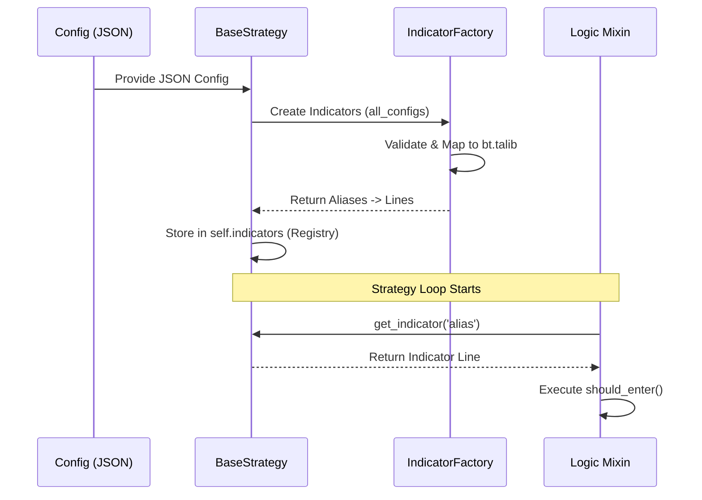

# Unified Indicator Architecture

**Document Version:** 1.0
**Status:** Active

## Overview

The **Unified Indicator Architecture** is a design pattern implemented in this framework to decouple trading logic (mixins) from indicator calculation and data management. It ensures that the same indicators are calculated identically across backtesting, optimization, and live trading environments.

## Core Components

### 1. JSON Configuration
Indicators are defined as a list of objects within the `entry_logic` or `exit_logic` sections of a bot's configuration.

```json
"indicators": [
    {
        "type": "RSI",
        "params": { "timeperiod": 14 },
        "fields_mapping": { "rsi": "entry_rsi" }
    }
]
```

### 2. Indicator Factory (`IndicatorFactory`)
A centralized factory that:
- Maps types (e.g., `RSI`) to implementation classes (mostly `bt.talib` wrappers).
- Validates parameters against required fields.
- Instantiates the indicator with the correct data inputs (Close, HLC, or full Data Feed).
- Returns a mapping of **Aliases** (e.g., `entry_rsi`) to **Indicator Lines**.

### 3. Registry (`BaseStrategy`)
The `BaseStrategy` maintains a central registry (`self.indicators`) where all initialized indicator lines are stored. This registry acts as the "Single Source of Truth" for all calculations within a strategy instance.

### 4. Logic Mixins (`BaseEntryMixin`, `BaseExitMixin`)
Mixins contain the "brain" of the strategy. Instead of creating indicators, they query the registry:

```python
rsi = self.get_indicator('entry_rsi')
if rsi[0] < self.get_param('rsi_oversold'):
    return True
```

---

## Why "Unified"?

The architecture is called "Unified" because it bridges the gap between different execution environments:

### Backtesting & Optimization
- **Initialization**: `CustomOptimizer` passes the JSON configuration to `CustomStrategy`.
- **Calculation**: Indicators are created in the strategy's `__init__`. In `runonce=True` mode (default for optimization), they are pre-calculated for the entire historical dataset using vectorized operations.
- **Access**: The backtest loop accesses pre-calculated values via the registry aliases.

### Live Trading
- **Initialization**: `LiveTradingBot` loads the same JSON from the database or config file.
- **Calculation**: Indicators are created exactly the same way during bot startup.
- **Access**: As live bars arrive, the registry is updated, and the logic uses the same aliases to check conditions.

## Key Benefits

| Benefit | Description |
| :--- | :--- |
| **Consistency** | Eliminates "Look-ahead bias" or "Signal drift" between backtesting and live execution. |
| **Performance** | Leverages `TA-Lib` (C-based performance) and Backtrader's vectorized `runonce` mode. |
| **Decoupling** | You can change the parameters or even the type of an indicator in the JSON without touching a single line of Python logic. |
| **Reusability** | Multiple mixins can share the same indicator by referencing the same alias, reducing redundant calculations. |

## Sequence Diagram


