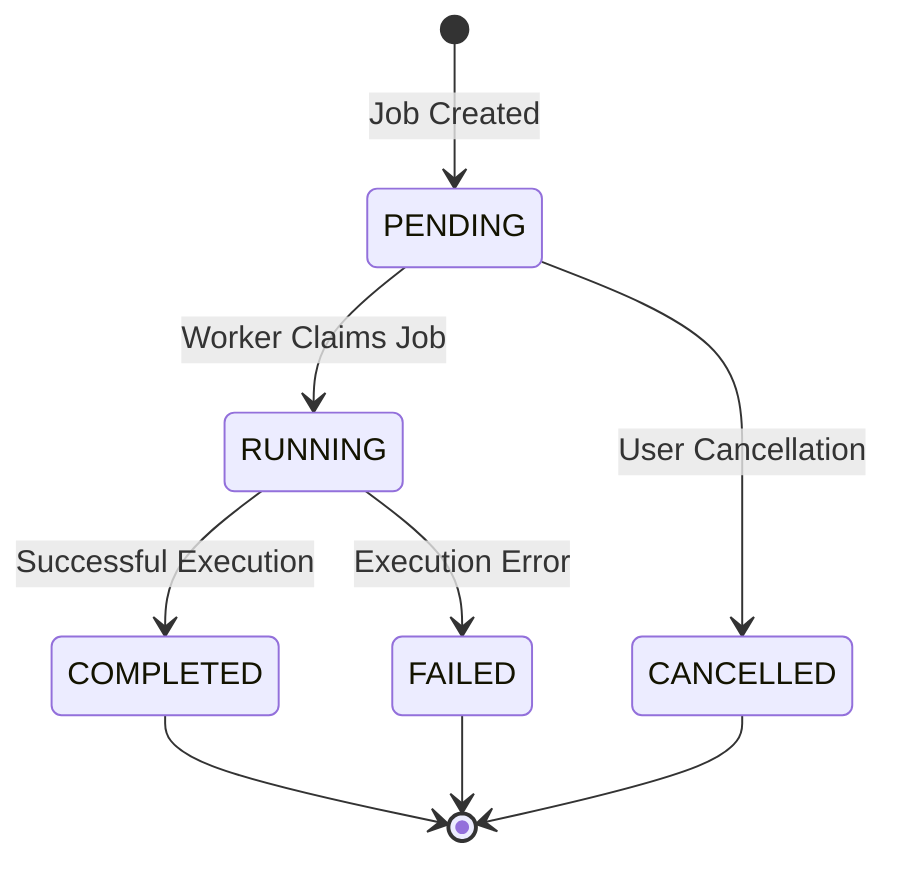

# Background Services and Job Management

## Overview

The Advanced Trading Framework implements a comprehensive background service architecture for handling asynchronous operations, scheduled tasks, and job execution. The system is built around APScheduler for job scheduling and a custom job management system for execution tracking and persistence.

## Architecture Components

### 1. Job Scheduling System

#### APScheduler Integration
- **Framework**: Advanced Python Scheduler (APScheduler)
- **Storage**: PostgreSQL-based job store for persistence
- **Executors**: Thread pool and process pool executors
- **Triggers**: Cron-based scheduling with timezone support

#### Job Types
The system supports multiple job types:

```python
class JobType(str, Enum):
    REPORT = "report"           # Generate trading reports
    SCREENER = "screener"       # Run stock screeners
    ALERT = "alert"            # Process price alerts
    NOTIFICATION = "notification" # Send notifications
    DATA_PROCESSING = "data_processing" # Process market data
    BACKUP = "backup"          # System backups
```

### 2. Job Persistence Layer

#### Schedule Model
Persistent schedule definitions stored in PostgreSQL:

```sql
CREATE TABLE job_schedules (
    id SERIAL PRIMARY KEY,
    user_id INTEGER NOT NULL,
    name VARCHAR(255) NOT NULL,
    job_type VARCHAR(50) NOT NULL,
    target VARCHAR(255) NOT NULL,
    task_params JSONB NOT NULL DEFAULT '{}',
    cron VARCHAR(100) NOT NULL,
    enabled BOOLEAN NOT NULL DEFAULT true,
    next_run_at TIMESTAMP WITH TIME ZONE,
    created_at TIMESTAMP WITH TIME ZONE NOT NULL DEFAULT NOW(),
    updated_at TIMESTAMP WITH TIME ZONE NOT NULL DEFAULT NOW()
);
```

#### Run Tracking Model
Execution history and status tracking:

```sql
CREATE TABLE job_schedule_runs (
    id SERIAL PRIMARY KEY,
    run_id UUID NOT NULL DEFAULT gen_random_uuid(),
    job_type TEXT NOT NULL,
    job_id BIGINT,
    user_id BIGINT,
    status TEXT,
    scheduled_for TIMESTAMP WITH TIME ZONE,
    enqueued_at TIMESTAMP WITH TIME ZONE DEFAULT NOW(),
    started_at TIMESTAMP WITH TIME ZONE,
    finished_at TIMESTAMP WITH TIME ZONE,
    job_snapshot JSONB,
    result JSONB,
    error TEXT,
    worker_id VARCHAR(255)
);
```

### 3. Job Execution States

#### Run Status Lifecycle

```mermaid
stateDiagram-v2
    [*] --> PENDING : Job Created
    PENDING --> RUNNING : Worker Claims Job
    PENDING --> CANCELLED : User Cancellation
    RUNNING --> COMPLETED : Successful Execution
    RUNNING --> FAILED : Execution Error
    COMPLETED --> [*]
    FAILED --> [*]
    CANCELLED --> [*]
```

#### Status Definitions
- **PENDING**: Job queued for execution
- **RUNNING**: Currently being executed by a worker
- **COMPLETED**: Successfully finished
- **FAILED**: Execution failed with error
- **CANCELLED**: Cancelled before execution

### 4. Background Service Types

#### 4.1 Telegram Bot Service
**Purpose**: Handles Telegram bot operations and user interactions

**Responsibilities**:
- Process incoming Telegram commands
- Generate and send reports
- Manage user alerts and schedules
- Handle user registration and verification

**Service Pattern**:
```python
class TelegramBotService:
    async def process_command(self, user_id: str, command: str) -> None
    async def send_notification(self, user_id: str, message: str) -> bool
    async def generate_report(self, user_id: str, params: dict) -> dict
```

**Job Integration**:
- Scheduled reports via cron expressions
- Alert processing on market events
- Batch notification delivery

#### 4.2 Data Processing Service
**Purpose**: Handles market data collection, processing, and caching

**Responsibilities**:
- Fetch data from multiple providers (Binance, Yahoo Finance, IBKR)
- Process and normalize market data
- Update cache layers
- Generate derived indicators

**Service Pattern**:
```python
class DataProcessingService:
    async def fetch_market_data(self, symbols: List[str]) -> dict
    async def process_ohlcv_data(self, data: dict) -> dict
    async def update_cache(self, symbol: str, data: dict) -> None
```

**Job Integration**:
- Scheduled data updates (every 1-5 minutes)
- End-of-day data processing
- Cache warming jobs

#### 4.3 Notification Service
**Purpose**: Manages multi-channel notification delivery

**Responsibilities**:
- Queue and batch notifications
- Handle rate limiting
- Retry failed deliveries
- Support multiple channels (Telegram, Email, WebSocket)

**Service Pattern**:
```python
class NotificationService:
    async def queue_notification(self, notification: Notification) -> bool
    async def process_notification_batch(self, batch: List[Notification]) -> dict
    async def handle_delivery_failure(self, notification: Notification) -> None
```

**Job Integration**:
- Batch notification processing
- Retry failed notifications
- Cleanup old notifications

#### 4.4 Trading Strategy Service
**Purpose**: Manages trading strategy execution and monitoring

**Responsibilities**:
- Execute trading strategies
- Monitor strategy performance
- Handle position management
- Generate trading signals

**Service Pattern**:
```python
class TradingStrategyService:
    async def execute_strategy(self, strategy_id: str) -> dict
    async def monitor_positions(self, strategy_id: str) -> dict
    async def handle_signals(self, signals: List[Signal]) -> None
```

**Job Integration**:
- Strategy execution on market events
- Performance monitoring jobs
- Risk management checks

### 5. Job Management Service Layer

#### JobsService Class
Central service for job management operations:

```python
class JobsService:
    def __init__(self, session: Session):
        self.session = session
        self.repository = JobsRepository(session)
    
    # Schedule Management
    def create_schedule(self, user_id: int, schedule_data: ScheduleCreate) -> Schedule
    def update_schedule(self, schedule_id: int, update_data: ScheduleUpdate) -> Schedule
    def delete_schedule(self, schedule_id: int) -> bool
    def trigger_schedule(self, schedule_id: int) -> Run
    
    # Run Management
    def create_run(self, user_id: int, run_data: RunCreate) -> Run
    def claim_run(self, run_id: UUID, worker_id: str) -> Run
    def update_run(self, run_id: UUID, update_data: RunUpdate) -> Run
    def cancel_run(self, run_id: UUID) -> bool
    
    # Statistics and Monitoring
    def get_run_statistics(self, user_id: int, job_type: JobType, days: int) -> dict
    def cleanup_old_runs(self, days_to_keep: int) -> int
```

### 6. Worker Architecture

#### Worker Pool Management
- **Thread Pool**: For I/O-bound tasks (API calls, database operations)
- **Process Pool**: For CPU-intensive tasks (data processing, ML computations)
- **Async Workers**: For concurrent operations

#### Worker Claiming Pattern
```python
async def worker_loop():
    while running:
        # Claim available jobs
        runs = jobs_service.get_pending_runs(job_type=worker_job_type, limit=1)
        
        for run in runs:
            claimed_run = jobs_service.claim_run(run.run_id, worker_id)
            if claimed_run:
                await execute_job(claimed_run)
        
        await asyncio.sleep(polling_interval)
```

### 7. Job Execution Patterns

#### 7.1 Report Generation Jobs
```python
async def execute_report_job(run: Run) -> dict:
    try:
        # Update status to running
        jobs_service.update_run(run.run_id, RunUpdate(
            status=RunStatus.RUNNING,
            started_at=datetime.utcnow(),
            worker_id=worker_id
        ))
        
        # Execute report generation
        snapshot = run.job_snapshot
        report_data = await generate_report(
            report_type=snapshot['report_type'],
            parameters=snapshot['parameters']
        )
        
        # Update with results
        jobs_service.update_run(run.run_id, RunUpdate(
            status=RunStatus.COMPLETED,
            finished_at=datetime.utcnow(),
            result=report_data
        ))
        
        return report_data
        
    except Exception as e:
        # Update with error
        jobs_service.update_run(run.run_id, RunUpdate(
            status=RunStatus.FAILED,
            finished_at=datetime.utcnow(),
            error=str(e)
        ))
        raise
```

#### 7.2 Screener Jobs
```python
async def execute_screener_job(run: Run) -> dict:
    snapshot = run.job_snapshot
    
    # Expand tickers from screener set
    tickers = jobs_service.expand_screener_target(snapshot['screener_set'])
    
    # Apply filter criteria
    filtered_results = await apply_screener_filters(
        tickers=tickers,
        criteria=snapshot['filter_criteria']
    )
    
    # Return top N results
    top_results = filtered_results[:snapshot.get('top_n', 10)]
    
    return {
        'screener_set': snapshot['screener_set'],
        'total_tickers': len(tickers),
        'filtered_count': len(filtered_results),
        'results': top_results
    }
```

### 8. Failure Recovery Mechanisms

#### 8.1 Job Retry Logic
- **Exponential Backoff**: Increasing delays between retries
- **Max Retry Attempts**: Configurable retry limits
- **Dead Letter Queue**: Failed jobs moved to separate queue

#### 8.2 Worker Health Monitoring
- **Heartbeat System**: Workers send periodic health checks
- **Stale Job Detection**: Identify jobs stuck in RUNNING state
- **Automatic Recovery**: Restart failed workers

#### 8.3 Database Consistency
- **Transactional Updates**: Atomic job status changes
- **Optimistic Locking**: Prevent concurrent job claiming
- **Cleanup Procedures**: Remove orphaned jobs and old runs

### 9. Monitoring and Observability

#### 9.1 Job Metrics
- **Execution Times**: Track job duration and performance
- **Success Rates**: Monitor job completion rates
- **Queue Depths**: Track pending job counts
- **Worker Utilization**: Monitor worker pool usage

#### 9.2 Alerting
- **Failed Jobs**: Alert on job failures
- **Queue Backlog**: Alert on growing queues
- **Worker Failures**: Alert on worker crashes
- **Performance Degradation**: Alert on slow jobs

### 10. Configuration Management

#### 10.1 Scheduler Configuration
```python
SCHEDULER_CONFIG = {
    'jobstores': {
        'default': {
            'type': 'sqlalchemy',
            'url': DATABASE_URL,
            'tablename': 'apscheduler_jobs'
        }
    },
    'executors': {
        'default': {'type': 'threadpool', 'max_workers': 20},
        'processpool': {'type': 'processpool', 'max_workers': 5}
    },
    'job_defaults': {
        'coalesce': False,
        'max_instances': 3,
        'misfire_grace_time': 30
    }
}
```

#### 10.2 Job-Specific Configuration
```python
JOB_CONFIGS = {
    'report_generation': {
        'max_runtime': 300,  # 5 minutes
        'retry_attempts': 3,
        'retry_delay': 60
    },
    'data_processing': {
        'max_runtime': 600,  # 10 minutes
        'retry_attempts': 2,
        'retry_delay': 120
    },
    'notifications': {
        'max_runtime': 30,   # 30 seconds
        'retry_attempts': 5,
        'retry_delay': 10
    }
}
```

### 11. API Integration

#### 11.1 Job Management Endpoints
- `POST /api/reports/run` - Execute report immediately
- `POST /api/screeners/run` - Execute screener immediately
- `GET /api/runs/{id}` - Get run status
- `GET /api/runs` - List runs with filtering
- `DELETE /api/runs/{id}` - Cancel pending run

#### 11.2 Schedule Management Endpoints
- `POST /api/schedules` - Create new schedule
- `GET /api/schedules` - List schedules
- `PUT /api/schedules/{id}` - Update schedule
- `DELETE /api/schedules/{id}` - Delete schedule
- `POST /api/schedules/{id}/trigger` - Manually trigger schedule

### 12. Performance Considerations

#### 12.1 Scalability
- **Horizontal Scaling**: Multiple worker instances
- **Load Balancing**: Distribute jobs across workers
- **Resource Isolation**: Separate pools for different job types

#### 12.2 Optimization
- **Job Batching**: Group similar jobs for efficiency
- **Connection Pooling**: Reuse database connections
- **Caching**: Cache frequently accessed data
- **Lazy Loading**: Load job data only when needed

### 13. Security Considerations

#### 13.1 Job Isolation
- **User Permissions**: Jobs run with user-specific permissions
- **Resource Limits**: Prevent resource exhaustion
- **Sandboxing**: Isolate job execution environments

#### 13.2 Data Protection
- **Encrypted Storage**: Sensitive job data encrypted at rest
- **Audit Logging**: Track all job operations
- **Access Control**: Restrict job management operations

This background services and job management system provides a robust foundation for handling asynchronous operations in the trading platform, with comprehensive monitoring, failure recovery, and scalability features.