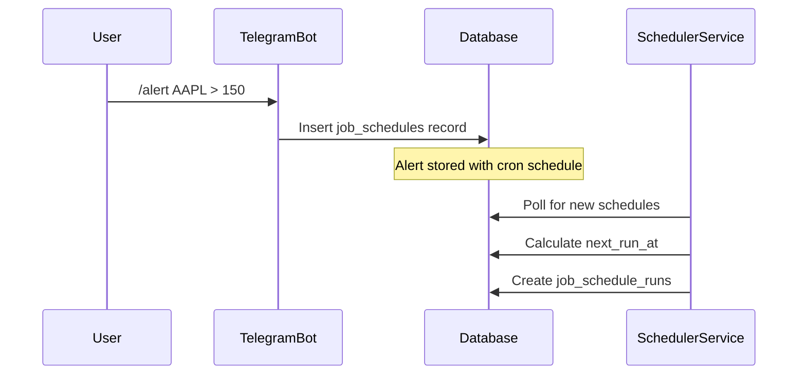
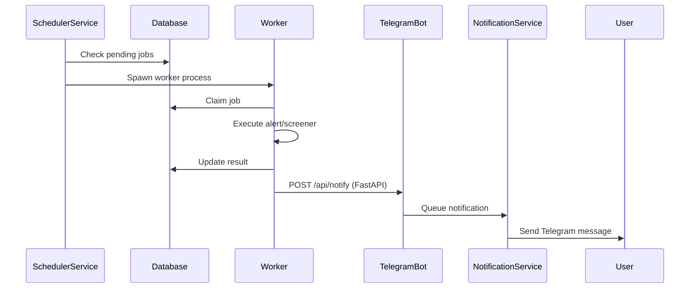
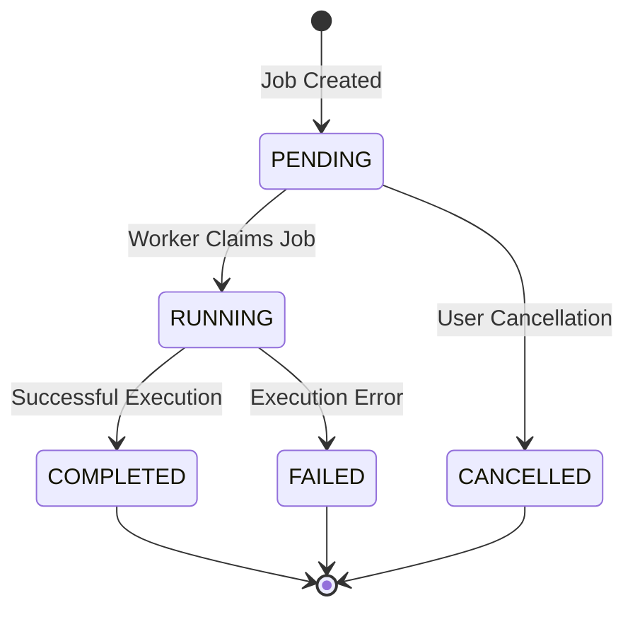

# Background Services and Job Management

## Overview

The Advanced Trading Framework implements a dual-layer background service architecture:

1. **System Services**: Independent services that run as separate processes (TradingBot, TelegramBot)
2. **Scheduled Job Services**: APScheduler-based services for executing scheduled tasks (alerts, screeners, reports)

This architecture separates long-running system services from scheduled job execution, providing better scalability and fault isolation.

## Architecture Components

### 1. System Services Layer

#### 1.1 Trading Bot Service (`src/trading/live_trading_bot.py`)
**Purpose**: Manages live trading operations and strategy execution

**Service Characteristics**:
- Runs as independent system process
- Not APScheduler-based
- Handles real-time trading operations
- Manages broker connections and data feeds

**Responsibilities**:
- Execute trading strategies with real-time data
- Manage positions and orders
- Handle broker communication
- Process market events and signals
- Maintain trading state persistence

**Service Pattern**:
```python
class LiveTradingBot(BaseTradingBot):
    def __init__(self, config: TradingBotConfig):
        # Initialize broker, data feeds, strategies
        
    def start(self):
        # Start trading operations
        
    def stop(self):
        # Graceful shutdown
```

#### 1.2 Telegram Bot Service (`src/telegram/bot.py`)
**Purpose**: Handles Telegram bot operations and user interactions

**Service Characteristics**:
- Runs as independent system process
- Not APScheduler-based
- Handles incoming Telegram commands
- Manages user communications

**Responsibilities**:
- Process incoming Telegram commands
- Handle user registration and verification
- Manage user alerts and schedules (via API)
- Send notifications and reports
- Provide real-time user interaction

**Service Pattern**:
```python
class TelegramBot:
    def __init__(self, token: str):
        self.bot = Bot(token=token)
        self.dispatcher = Dispatcher()
        
    async def start_polling(self):
        # Start bot polling for messages
        
    async def process_command(self, message: Message):
        # Handle incoming commands
```

### 2. Scheduled Job Services Layer

#### 2.1 Job Scheduling System

#### APScheduler Integration
- **Framework**: Advanced Python Scheduler (APScheduler) - *Planned Implementation*
- **Storage**: PostgreSQL-based job store for persistence
- **Executors**: Thread pool and process pool executors
- **Triggers**: Cron-based scheduling with timezone support
- **Background Service**: `src/scheduler/background_bot.py` - *To be implemented*

#### Job Types
The system supports multiple job types:

```python
class JobType(str, Enum):
    REPORT = "report"           # Generate trading reports
    SCREENER = "screener"       # Run stock screeners
    ALERT = "alert"            # Process price alerts
    NOTIFICATION = "notification" # Send notifications
    DATA_PROCESSING = "data_processing" # Process market data
    BACKUP = "backup"          # System backups
```

#### 2.2 Job Persistence Layer

#### Schedule Model (`job_schedules` table)
Persistent schedule definitions stored in PostgreSQL with cron-style scheduling:

```sql
CREATE TABLE job_schedules (
    id SERIAL PRIMARY KEY,
    user_id INTEGER NOT NULL,
    name VARCHAR(255) NOT NULL,
    job_type VARCHAR(50) NOT NULL,
    target VARCHAR(255) NOT NULL,
    task_params JSONB NOT NULL DEFAULT '{}',
    cron VARCHAR(100) NOT NULL,
    enabled BOOLEAN NOT NULL DEFAULT true,
    next_run_at TIMESTAMP WITH TIME ZONE,
    created_at TIMESTAMP WITH TIME ZONE NOT NULL DEFAULT NOW(),
    updated_at TIMESTAMP WITH TIME ZONE NOT NULL DEFAULT NOW()
);
```

#### Run Tracking Model (`job_schedule_runs` table)
Execution history and status tracking for scheduled jobs:

```sql
CREATE TABLE job_schedule_runs (
    id SERIAL PRIMARY KEY,
    run_id UUID NOT NULL DEFAULT gen_random_uuid(),
    job_type TEXT NOT NULL,
    job_id BIGINT,
    user_id BIGINT,
    status TEXT,
    scheduled_for TIMESTAMP WITH TIME ZONE,
    enqueued_at TIMESTAMP WITH TIME ZONE DEFAULT NOW(),
    started_at TIMESTAMP WITH TIME ZONE,
    finished_at TIMESTAMP WITH TIME ZONE,
    job_snapshot JSONB,
    result JSONB,
    error TEXT,
    worker_id VARCHAR(255)
);
```

### 3. Service Communication Architecture

#### 3.1 System Service Independence
- **TradingBot** and **TelegramBot** run as separate **systemd services** (Linux deployment)
- Each service manages its own lifecycle and error handling
- Services communicate through PostgreSQL database and FastAPI endpoints
- No direct inter-process communication required

#### 3.2 Alert/Schedule Creation Flow

```mermaid
sequenceDiagram
    participant User
    participant TelegramBot
    participant Database
    participant SchedulerService
    
    User->>TelegramBot: /alert AAPL > 150
    TelegramBot->>Database: Insert job_schedules record
    Note over Database: Alert stored with cron schedule
    SchedulerService->>Database: Poll for new schedules
    SchedulerService->>Database: Calculate next_run_at
    SchedulerService->>Database: Create job_schedule_runs
```

#### 3.3 Job Execution and Notification Flow

```mermaid
sequenceDiagram
    participant SchedulerService
    participant Database
    participant Worker
    participant TelegramBot
    participant NotificationService
    
    SchedulerService->>Database: Check pending jobs
    SchedulerService->>Worker: Spawn worker process
    Worker->>Database: Claim job
    Worker->>Worker: Execute alert/screener
    Worker->>Database: Update result
    Worker->>TelegramBot: POST /api/notify (FastAPI)
    TelegramBot->>NotificationService: Queue notification
    NotificationService->>User: Send Telegram message
```

#### 3.4 Service Communication Patterns

**Alert/Schedule Storage**:
- TelegramBot stores user alerts/schedules directly in PostgreSQL
- Background scheduler service polls database for new/updated schedules
- No real-time communication needed between TelegramBot and SchedulerService

**Notification Delivery**:
- Background workers execute alerts/schedules
- Workers call TelegramBot FastAPI endpoint: `POST /api/notify`
- TelegramBot queues notifications in background notification service
- Notification service handles actual message delivery to users

**Service Dependencies**:
- **TelegramBot**: Independent systemd service, exposes FastAPI for notifications
- **TradingBot**: Independent systemd service, no direct scheduler interaction
- **SchedulerService**: New systemd service (to be implemented), spawns workers
- **NotificationService**: Background service within TelegramBot process

### 4. Job Execution States

#### Run Status Lifecycle

```mermaid
stateDiagram-v2
    [*] --> PENDING : Job Created
    PENDING --> RUNNING : Worker Claims Job
    PENDING --> CANCELLED : User Cancellation
    RUNNING --> COMPLETED : Successful Execution
    RUNNING --> FAILED : Execution Error
    COMPLETED --> [*]
    FAILED --> [*]
    CANCELLED --> [*]
```

#### Status Definitions
- **PENDING**: Job queued for execution
- **RUNNING**: Currently being executed by a worker
- **COMPLETED**: Successfully finished
- **FAILED**: Execution failed with error
- **CANCELLED**: Cancelled before execution

### 5. Scheduled Job Types

#### 5.1 Report Generation Jobs
**Purpose**: Generate and deliver scheduled trading reports

**Execution Context**: APScheduler worker process
**Trigger**: Cron-based scheduling from `job_schedules.cron`
**Storage**: Results stored in `job_schedule_runs.result`

**Job Parameters** (stored in `task_params`):
```json
{
    "report_type": "daily_summary|portfolio_analysis|performance_report",
    "parameters": {
        "symbols": ["AAPL", "MSFT"],
        "timeframe": "1d",
        "include_charts": true
    }
}
```

**Integration with System Services**:
- Results delivered via TelegramBot notifications
- Can trigger trading actions via TradingBot API

#### 5.2 Screener Jobs
**Purpose**: Execute stock screening with custom criteria

**Execution Context**: APScheduler worker process
**Trigger**: Cron-based scheduling from `job_schedules.cron`
**Target**: Screener set name or ticker list (stored in `target` field)

**Job Parameters** (stored in `task_params`):
```json
{
    "screener_set": "sp500|nasdaq|custom",
    "filter_criteria": {
        "min_market_cap": 1000000000,
        "max_pe_ratio": 25,
        "min_volume": 1000000
    },
    "top_n": 10
}
```

**Integration with System Services**:
- Results delivered via TelegramBot
- Can create alerts for matching stocks

#### 5.3 Alert Jobs
**Purpose**: Monitor market conditions and trigger notifications

**Execution Context**: APScheduler worker process
**Trigger**: Cron-based scheduling (typically frequent, e.g., every minute)
**Target**: Symbol or condition to monitor

**Job Parameters** (stored in `task_params`):
```json
{
    "symbol": "AAPL",
    "condition": "price_above|price_below|volume_spike|rsi_oversold",
    "threshold": 150.00,
    "notification_channels": ["telegram", "email"]
}
```

**Integration with System Services**:
- Notifications sent via TelegramBot
- Can trigger trading actions via TradingBot

#### 5.4 Data Processing Jobs
**Purpose**: Scheduled data collection and processing tasks

**Execution Context**: APScheduler worker process
**Trigger**: Cron-based scheduling (e.g., every 5 minutes, end-of-day)
**Target**: Data source or processing task identifier

**Job Parameters** (stored in `task_params`):
```json
{
    "data_source": "yahoo|binance|ibkr",
    "symbols": ["AAPL", "MSFT", "GOOGL"],
    "operations": ["fetch", "normalize", "cache", "indicators"]
}
```

**Integration with System Services**:
- Updated data available to TradingBot for strategy execution
- Cache updates improve TelegramBot response times

### 6. Service Deployment and Management

#### 6.1 System Service Deployment (Current Implementation)

**TradingBot Service** (`systemd` service):
- Deployed as independent systemd service on Linux
- Configuration via JSON files with Pydantic validation
- Independent lifecycle management and automatic restart on failure
- No direct interaction with scheduler service

**TelegramBot Service** (`systemd` service):
- Deployed as independent systemd service
- Exposes FastAPI endpoints for notification delivery
- Handles webhook or polling mode for Telegram API
- Contains background notification service for message queuing
- Stores user alerts/schedules in PostgreSQL database

#### 6.2 Scheduled Service Deployment (Planned Implementation)

**Background Scheduler Service** (`systemd` service - *To be implemented*):
- New independent systemd service for alert/schedule processing
- Reads `job_schedules` table on startup and polls for changes
- Calculates `next_run_at` for all enabled schedules
- Spawns worker processes for job execution
- Workers communicate back to TelegramBot via FastAPI calls

**Service Architecture**:
```
┌─────────────────┐    ┌─────────────────┐    ┌─────────────────┐
│   TradingBot    │    │  TelegramBot    │    │ SchedulerService│
│  (systemd)      │    │   (systemd)     │    │   (systemd)     │
│                 │    │                 │    │                 │
│ - Live Trading  │    │ - User Commands │    │ - Alert Exec    │
│ - Strategies    │    │ - FastAPI       │    │ - Screener Exec │
│ - Broker Conn   │    │ - Notifications │    │ - Worker Spawn  │
└─────────────────┘    └─────────────────┘    └─────────────────┘
         │                       │                       │
         └───────────────────────┼───────────────────────┘
                                 │
                    ┌─────────────────┐
                    │   PostgreSQL    │
                    │   Database      │
                    │                 │
                    │ - job_schedules │
                    │ - schedule_runs │
                    │ - trading_data  │
                    └─────────────────┘
```

#### 6.3 Service Communication Patterns

**Database-Mediated Communication**:
- Primary data exchange through PostgreSQL
- TelegramBot writes alerts/schedules to `job_schedules` table
- SchedulerService reads schedules and writes execution results
- No direct inter-service messaging required

**API-Based Notification Flow**:
- Background workers execute scheduled jobs
- Workers POST results to TelegramBot FastAPI: `/api/notify`
- TelegramBot queues notifications in background service
- Asynchronous message delivery to users

**Service Independence**:
- Each service can restart independently without affecting others
- Database provides persistent state across service restarts
- Loose coupling enables independent scaling and deployment

### 7. Job Management Service Layer

#### JobsService Class
Central service for job management operations:

```python
class JobsService:
    def __init__(self, session: Session):
        self.session = session
        self.repository = JobsRepository(session)
    
    # Schedule Management
    def create_schedule(self, user_id: int, schedule_data: ScheduleCreate) -> Schedule
    def update_schedule(self, schedule_id: int, update_data: ScheduleUpdate) -> Schedule
    def delete_schedule(self, schedule_id: int) -> bool
    def trigger_schedule(self, schedule_id: int) -> Run
    
    # Run Management
    def create_run(self, user_id: int, run_data: RunCreate) -> Run
    def claim_run(self, run_id: UUID, worker_id: str) -> Run
    def update_run(self, run_id: UUID, update_data: RunUpdate) -> Run
    def cancel_run(self, run_id: UUID) -> bool
    
    # Statistics and Monitoring
    def get_run_statistics(self, user_id: int, job_type: JobType, days: int) -> dict
    def cleanup_old_runs(self, days_to_keep: int) -> int
```

### 8. Worker Architecture

#### Worker Pool Management
- **Thread Pool**: For I/O-bound tasks (API calls, database operations)
- **Process Pool**: For CPU-intensive tasks (data processing, ML computations)
- **Async Workers**: For concurrent operations

#### Worker Claiming Pattern
```python
async def worker_loop():
    while running:
        # Claim available jobs
        runs = jobs_service.get_pending_runs(job_type=worker_job_type, limit=1)
        
        for run in runs:
            claimed_run = jobs_service.claim_run(run.run_id, worker_id)
            if claimed_run:
                await execute_job(claimed_run)
        
        await asyncio.sleep(polling_interval)
```

### 9. Job Execution Patterns

#### 7.1 Report Generation Jobs
```python
async def execute_report_job(run: Run) -> dict:
    try:
        # Update status to running
        jobs_service.update_run(run.run_id, RunUpdate(
            status=RunStatus.RUNNING,
            started_at=datetime.utcnow(),
            worker_id=worker_id
        ))
        
        # Execute report generation
        snapshot = run.job_snapshot
        report_data = await generate_report(
            report_type=snapshot['report_type'],
            parameters=snapshot['parameters']
        )
        
        # Update with results
        jobs_service.update_run(run.run_id, RunUpdate(
            status=RunStatus.COMPLETED,
            finished_at=datetime.utcnow(),
            result=report_data
        ))
        
        return report_data
        
    except Exception as e:
        # Update with error
        jobs_service.update_run(run.run_id, RunUpdate(
            status=RunStatus.FAILED,
            finished_at=datetime.utcnow(),
            error=str(e)
        ))
        raise
```

#### 7.2 Screener Jobs
```python
async def execute_screener_job(run: Run) -> dict:
    snapshot = run.job_snapshot
    
    # Expand tickers from screener set
    tickers = jobs_service.expand_screener_target(snapshot['screener_set'])
    
    # Apply filter criteria
    filtered_results = await apply_screener_filters(
        tickers=tickers,
        criteria=snapshot['filter_criteria']
    )
    
    # Return top N results
    top_results = filtered_results[:snapshot.get('top_n', 10)]
    
    return {
        'screener_set': snapshot['screener_set'],
        'total_tickers': len(tickers),
        'filtered_count': len(filtered_results),
        'results': top_results
    }
```

### 10. Failure Recovery Mechanisms

#### 8.1 Job Retry Logic
- **Exponential Backoff**: Increasing delays between retries
- **Max Retry Attempts**: Configurable retry limits
- **Dead Letter Queue**: Failed jobs moved to separate queue

#### 8.2 Worker Health Monitoring
- **Heartbeat System**: Workers send periodic health checks
- **Stale Job Detection**: Identify jobs stuck in RUNNING state
- **Automatic Recovery**: Restart failed workers

#### 8.3 Database Consistency
- **Transactional Updates**: Atomic job status changes
- **Optimistic Locking**: Prevent concurrent job claiming
- **Cleanup Procedures**: Remove orphaned jobs and old runs

### 11. Monitoring and Observability

#### 9.1 Job Metrics
- **Execution Times**: Track job duration and performance
- **Success Rates**: Monitor job completion rates
- **Queue Depths**: Track pending job counts
- **Worker Utilization**: Monitor worker pool usage

#### 9.2 Alerting
- **Failed Jobs**: Alert on job failures
- **Queue Backlog**: Alert on growing queues
- **Worker Failures**: Alert on worker crashes
- **Performance Degradation**: Alert on slow jobs

### 12. Configuration Management

#### 10.1 Scheduler Configuration
```python
SCHEDULER_CONFIG = {
    'jobstores': {
        'default': {
            'type': 'sqlalchemy',
            'url': DATABASE_URL,
            'tablename': 'apscheduler_jobs'
        }
    },
    'executors': {
        'default': {'type': 'threadpool', 'max_workers': 20},
        'processpool': {'type': 'processpool', 'max_workers': 5}
    },
    'job_defaults': {
        'coalesce': False,
        'max_instances': 3,
        'misfire_grace_time': 30
    }
}
```

#### 10.2 Job-Specific Configuration
```python
JOB_CONFIGS = {
    'report_generation': {
        'max_runtime': 300,  # 5 minutes
        'retry_attempts': 3,
        'retry_delay': 60
    },
    'data_processing': {
        'max_runtime': 600,  # 10 minutes
        'retry_attempts': 2,
        'retry_delay': 120
    },
    'notifications': {
        'max_runtime': 30,   # 30 seconds
        'retry_attempts': 5,
        'retry_delay': 10
    }
}
```

### 13. API Integration

#### 11.1 Job Management Endpoints
- `POST /api/reports/run` - Execute report immediately
- `POST /api/screeners/run` - Execute screener immediately
- `GET /api/runs/{id}` - Get run status
- `GET /api/runs` - List runs with filtering
- `DELETE /api/runs/{id}` - Cancel pending run

#### 11.2 Schedule Management Endpoints
- `POST /api/schedules` - Create new schedule
- `GET /api/schedules` - List schedules
- `PUT /api/schedules/{id}` - Update schedule
- `DELETE /api/schedules/{id}` - Delete schedule
- `POST /api/schedules/{id}/trigger` - Manually trigger schedule

### 14. Performance Considerations

#### 12.1 Scalability
- **Horizontal Scaling**: Multiple worker instances
- **Load Balancing**: Distribute jobs across workers
- **Resource Isolation**: Separate pools for different job types

#### 12.2 Optimization
- **Job Batching**: Group similar jobs for efficiency
- **Connection Pooling**: Reuse database connections
- **Caching**: Cache frequently accessed data
- **Lazy Loading**: Load job data only when needed

### 15. Notification Service Architecture

#### 15.1 Background Notification Service Design

The notification service runs as a background component within the TelegramBot process, handling asynchronous message delivery and queuing.

**Service Characteristics**:
- Embedded within TelegramBot systemd service
- Handles message queuing and delivery
- Provides FastAPI endpoint for other services
- Manages rate limiting and retry logic

**Integration Pattern**:
```python
class TelegramBot:
    def __init__(self):
        self.bot = Bot(token=token)
        self.notification_service = BackgroundNotificationService()
        self.fastapi_app = FastAPI()
        
    async def start(self):
        # Start notification service
        await self.notification_service.start()
        
        # Start FastAPI server for external notifications
        await self.start_fastapi_server()
        
        # Start Telegram bot polling
        await self.start_polling()

class BackgroundNotificationService:
    def __init__(self):
        self.message_queue = asyncio.Queue()
        self.running = False
        
    async def queue_notification(self, user_id: int, message: str):
        await self.message_queue.put({
            'user_id': user_id,
            'message': message,
            'timestamp': datetime.utcnow()
        })
        
    async def process_notifications(self):
        while self.running:
            try:
                notification = await asyncio.wait_for(
                    self.message_queue.get(), timeout=1.0
                )
                await self.send_telegram_message(notification)
            except asyncio.TimeoutError:
                continue
```

#### 15.2 FastAPI Notification Endpoint

**Endpoint Design**:
```python
@app.post("/api/notify")
async def notify_user(notification: NotificationRequest):
    """
    Receive notifications from background services (SchedulerService workers)
    """
    await notification_service.queue_notification(
        user_id=notification.user_id,
        message=notification.message
    )
    return {"status": "queued", "message_id": str(uuid.uuid4())}

class NotificationRequest(BaseModel):
    user_id: int
    message: str
    priority: str = "normal"  # normal, high, urgent
    notification_type: str = "alert"  # alert, report, screener
```

#### 15.3 Service Communication Discussion Points

**Current Architecture Questions**:
1. **Notification Service Location**: Should it be embedded in TelegramBot or separate service?
2. **Communication Method**: FastAPI calls vs message queue vs database polling?
3. **Service Discovery**: How do other services find TelegramBot FastAPI endpoint?
4. **Failure Handling**: What happens if TelegramBot is down when worker tries to notify?

**Proposed Solutions**:

**Option A: Embedded Notification Service (Current Plan)**
- ✅ Simpler deployment (one less systemd service)
- ✅ Direct access to Telegram bot instance
- ❌ TelegramBot becomes single point of failure for notifications
- ❌ Harder to scale notification processing independently

**Option B: Separate Notification Service**
- ✅ Independent scaling and failure isolation
- ✅ Can serve multiple communication channels (Telegram, email, SMS)
- ❌ More complex deployment and service coordination
- ❌ Additional service to monitor and maintain

**Recommended Approach**: Start with embedded service (Option A) for simplicity, with architecture that allows future extraction to separate service.

#### 15.4 Cross-Service Communication Patterns

**Service Registry Pattern** (Future Enhancement):
```python
# Services register their endpoints in database
service_registry = {
    "telegram_bot": {
        "host": "localhost",
        "port": 8001,
        "endpoints": {
            "notify": "/api/notify",
            "health": "/health"
        }
    }
}
```

**Configuration-Based Discovery** (Current Approach):
```python
# Each service configured with other service endpoints
TELEGRAM_BOT_CONFIG = {
    "notification_endpoint": "http://localhost:8001/api/notify"
}
```

### 16. Security Considerations

#### 16.1 Job Isolation
- **User Permissions**: Jobs run with user-specific permissions
- **Resource Limits**: Prevent resource exhaustion
- **Sandboxing**: Isolate job execution environments

#### 16.2 Data Protection
- **Encrypted Storage**: Sensitive job data encrypted at rest
- **Audit Logging**: Track all job operations
- **Access Control**: Restrict job management operations

#### 16.3 Inter-Service Security
- **API Authentication**: FastAPI endpoints require authentication tokens
- **Network Security**: Services communicate over localhost or secured network
- **Input Validation**: All API inputs validated and sanitized

### 16. Service Architecture Summary

#### System Services (Independent systemd Services)
- **TradingBot** (`src/trading/live_trading_bot.py`): Real-time trading operations
- **TelegramBot** (`src/telegram/bot.py`): User interaction, command processing, and FastAPI notification endpoint
- **SchedulerService** (`src/scheduler/background_bot.py`): *Planned - Alert/schedule execution with worker spawning*
- **Characteristics**: Long-running systemd services, independent lifecycle management

#### Scheduled Job Services (APScheduler-based Workers)
- **Background Scheduler** spawns workers for job execution
- **Job Types**: Reports, Screeners, Alerts, Data Processing, Notifications, Backups
- **Worker Communication**: Results sent via FastAPI calls to TelegramBot
- **Characteristics**: Cron-scheduled, worker-based execution, database persistence

#### Service Communication Flow

**Alert/Schedule Creation**:
1. User creates alert via TelegramBot
2. TelegramBot stores in PostgreSQL `job_schedules` table
3. SchedulerService polls database for new schedules

**Alert/Schedule Execution**:
1. SchedulerService spawns worker for scheduled job
2. Worker executes alert/screener logic
3. Worker POSTs result to TelegramBot FastAPI endpoint
4. TelegramBot queues notification in background service
5. Background notification service delivers message to user

#### Key Architecture Principles
1. **Service Independence**: Each systemd service can restart independently
2. **Database-Mediated State**: PostgreSQL provides persistent communication layer
3. **API-Based Notifications**: FastAPI enables loose coupling for result delivery
4. **Worker Isolation**: Scheduled jobs run in separate processes for fault tolerance
5. **Scalable Design**: Services can be scaled independently based on load

#### Implementation Status
- ✅ **TradingBot**: Implemented as systemd service
- ✅ **TelegramBot**: Implemented as systemd service with FastAPI
- 🔄 **SchedulerService**: Planned implementation for alert/schedule processing
- 🔄 **Notification Service**: Background service integration within TelegramBot

This architecture provides robust separation of concerns while enabling efficient communication between services through well-defined interfaces and persistent storage.