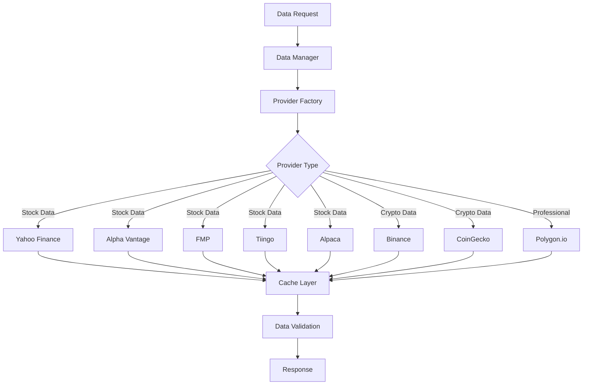
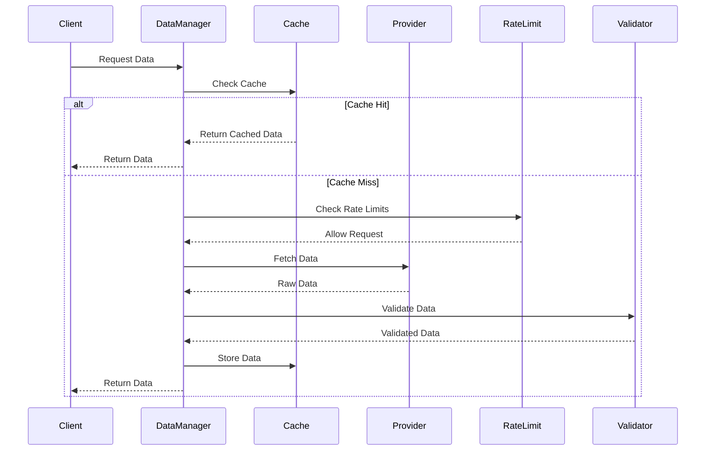
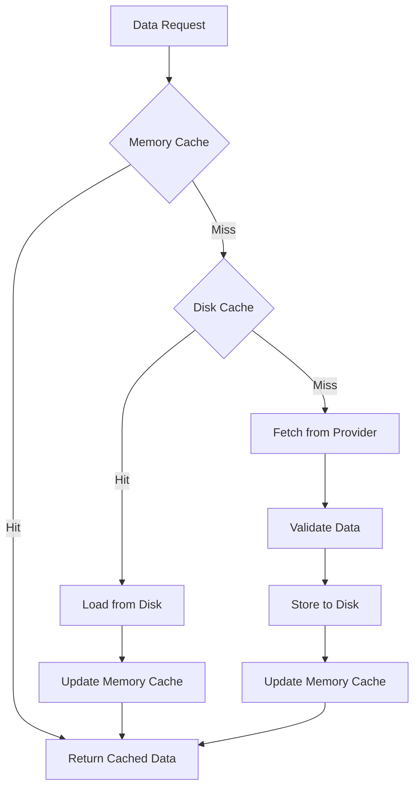
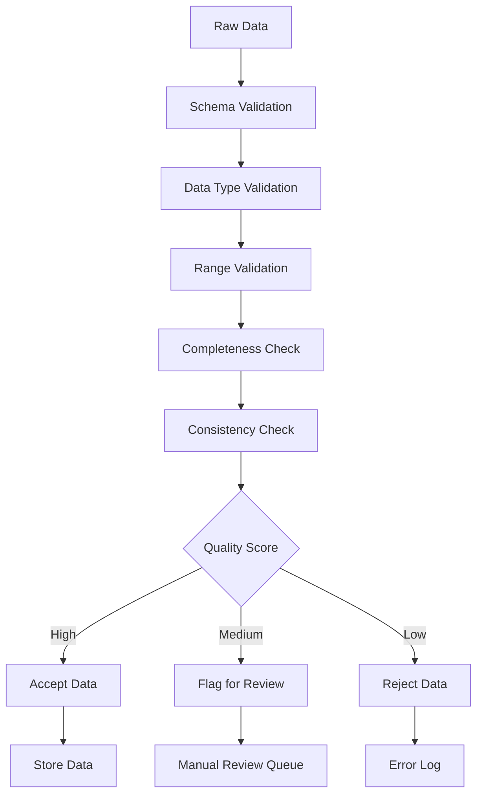
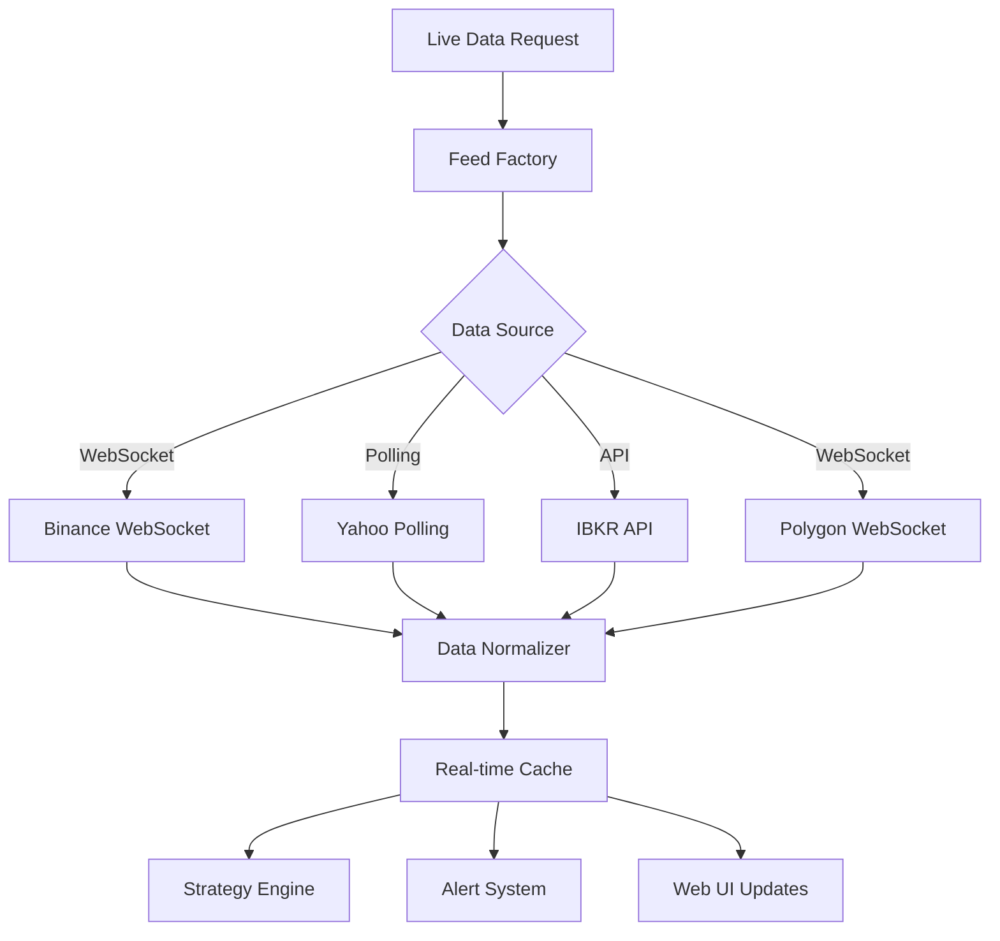

# Data Providers and Sources Documentation

## Overview

The Advanced Trading Framework integrates with multiple data providers to deliver comprehensive market data coverage across stocks, cryptocurrencies, ETFs, and other financial instruments. The system implements a flexible provider architecture with caching, rate limiting, and failover capabilities.

## Data Provider Architecture

### Provider Integration Pattern



### Data Flow Architecture



## Supported Data Providers

### 1. Stock Market Data Providers

#### Yahoo Finance (Primary - Free)
- **Provider Code**: `yf`, `yahoo`, `yfinance`
- **Coverage**: Global stocks, ETFs, indices, mutual funds
- **Data Types**: OHLCV, fundamental data, historical data
- **Rate Limits**: ~100 requests/minute (unofficial)
- **Cost**: Free
- **API Key**: Not required
- **Reliability**: ⭐⭐⭐⭐ (95% uptime)

**Capabilities:**
- Daily data: Full historical coverage
- Intraday data: 60-day limit (5m, 15m, 30m, 1h)
- Fundamental data: Basic financial metrics
- Real-time quotes: 15-minute delay

**Configuration:**
```python
from src.data.downloader.yahoo_data_downloader import YahooDataDownloader

downloader = YahooDataDownloader()
data = downloader.download_data("AAPL", "1d", "2020-01-01", "2023-12-31")
```

#### Financial Modeling Prep (FMP) - Recommended for Intraday
- **Provider Code**: `fmp`, `financial_modeling_prep`
- **Coverage**: US stocks, ETFs, crypto, forex, commodities
- **Data Types**: OHLCV, comprehensive fundamentals, financial statements
- **Rate Limits**: 3,000 requests/minute (free tier)
- **Cost**: Free tier available, $15/month for premium
- **API Key**: Required
- **Reliability**: ⭐⭐⭐⭐⭐ (99.5% uptime)

**Capabilities:**
- Full historical intraday data (no 60-day limit)
- Comprehensive fundamental data
- Financial statements (income, balance sheet, cash flow)
- Stock screening capabilities
- Real-time data (premium)

**Configuration:**
```python
from src.data.downloader.fmp_data_downloader import FMPDataDownloader

downloader = FMPDataDownloader(api_key="your_fmp_api_key")
data = downloader.download_data("AAPL", "5m", "2020-01-01", "2023-12-31")
```

#### Alpha Vantage (Backup Provider)
- **Provider Code**: `av`, `alphavantage`, `alpha_vantage`
- **Coverage**: Global stocks, ETFs, forex, crypto
- **Data Types**: OHLCV, technical indicators, fundamental data
- **Rate Limits**: 5 requests/minute, 25 requests/day (free)
- **Cost**: Free tier, $49.99/month for premium
- **API Key**: Required
- **Reliability**: ⭐⭐⭐⭐ (98% uptime)

**Capabilities:**
- Full historical intraday data
- Technical indicators (RSI, MACD, Bollinger Bands)
- Fundamental data and earnings
- Currency exchange rates

**Configuration:**
```python
from src.data.downloader.alpha_vantage_data_downloader import AlphaVantageDataDownloader

downloader = AlphaVantageDataDownloader(api_key="your_alpha_vantage_key")
data = downloader.download_data("AAPL", "5m", "2020-01-01", "2023-12-31")
```

#### Tiingo (Historical Data Specialist)
- **Provider Code**: `tiingo`
- **Coverage**: US stocks, ETFs (historical data back to 1962)
- **Data Types**: OHLCV, fundamental data, news sentiment
- **Rate Limits**: 1,000 requests/day (free), 10,000/day (premium)
- **Cost**: Free tier, $20/month for premium
- **API Key**: Required
- **Reliability**: ⭐⭐⭐⭐⭐ (99.8% uptime)

**Capabilities:**
- Extensive historical coverage (back to 1962)
- High-quality fundamental data
- News sentiment analysis
- End-of-day and weekly/monthly data

**Configuration:**
```python
from src.data.downloader.tiingo_data_downloader import TiingoDataDownloader

downloader = TiingoDataDownloader(api_key="your_tiingo_key")
data = downloader.download_data("AAPL", "1d", "1990-01-01", "2023-12-31")
```

#### Alpaca Markets (Professional Grade)
- **Provider Code**: `alpaca`, `alp`
- **Coverage**: US stocks and ETFs
- **Data Types**: OHLCV, level 2 data, trade data
- **Rate Limits**: 200 requests/minute (free), 10,000 bars per request
- **Cost**: Free tier available
- **API Key**: Required (API key + secret)
- **Reliability**: ⭐⭐⭐⭐⭐ (99.7% uptime)

**Capabilities:**
- Professional-grade market data
- Paper trading integration
- Live trading capabilities
- High-frequency data support

**Configuration:**
```python
from src.data.downloader.alpaca_data_downloader import AlpacaDataDownloader

downloader = AlpacaDataDownloader(
    api_key="your_alpaca_key",
    secret_key="your_alpaca_secret",
    base_url="https://paper-api.alpaca.markets"
)
data = downloader.download_data("AAPL", "1m", "2023-01-01", "2023-12-31")
```

#### Polygon.io (Enterprise Grade)
- **Provider Code**: `pg`, `polygon`, `polygon_io`
- **Coverage**: US stocks, options, forex, crypto
- **Data Types**: OHLCV, tick data, options chains
- **Rate Limits**: 5 requests/minute (free), 100-1000/minute (paid)
- **Cost**: Free tier, $29/month for basic, $399/month for professional
- **API Key**: Required
- **Reliability**: ⭐⭐⭐⭐⭐ (99.9% uptime)

**Capabilities:**
- Tick-level data
- Options market data
- Real-time WebSocket feeds
- Institutional-grade infrastructure

### 2. Cryptocurrency Data Providers

#### Binance (Primary - Crypto)
- **Provider Code**: `bnc`, `binance`
- **Coverage**: 500+ cryptocurrency pairs
- **Data Types**: OHLCV, order book, trade data
- **Rate Limits**: 1,200 requests/minute (public data)
- **Cost**: Free for public data
- **API Key**: Optional for public data, required for account data
- **Reliability**: ⭐⭐⭐⭐⭐ (99.9% uptime)

**Capabilities:**
- Real-time WebSocket feeds
- Historical kline data
- Order book snapshots
- 24hr ticker statistics

**Configuration:**
```python
from src.data.downloader.binance_data_downloader import BinanceDataDownloader

# Public data (no API key needed)
downloader = BinanceDataDownloader()
data = downloader.download_data("BTCUSDT", "1h", "2020-01-01", "2023-12-31")

# With API credentials for enhanced features
downloader = BinanceDataDownloader(
    api_key="your_binance_key",
    api_secret="your_binance_secret"
)
```

#### CoinGecko (Free Crypto Data)
- **Provider Code**: `cg`, `coingecko`, `coin_gecko`
- **Coverage**: 10,000+ cryptocurrencies
- **Data Types**: OHLCV, market cap, volume, social metrics
- **Rate Limits**: 50 requests/minute (free)
- **Cost**: Free
- **API Key**: Not required
- **Reliability**: ⭐⭐⭐⭐ (96% uptime)

**Capabilities:**
- Comprehensive crypto coverage
- Market capitalization data
- Social sentiment metrics
- DeFi protocol data

**Configuration:**
```python
from src.data.downloader.coingecko_data_downloader import CoinGeckoDataDownloader

downloader = CoinGeckoDataDownloader()
data = downloader.download_data("bitcoin", "1d", "2020-01-01", "2023-12-31")
```

### 3. Professional Data Providers

#### Finnhub (Real-time Professional)
- **Provider Code**: `fh`, `finnhub`
- **Coverage**: Global stocks, forex, crypto
- **Data Types**: Real-time quotes, news, earnings, insider trading
- **Rate Limits**: 60 requests/minute (free)
- **Cost**: Free tier, $7.99/month for premium
- **API Key**: Required
- **Reliability**: ⭐⭐⭐⭐ (97% uptime)

#### Twelve Data (Global Coverage)
- **Provider Code**: `td`, `twelvedata`, `twelve_data`
- **Coverage**: Global stocks, forex, crypto, ETFs
- **Data Types**: OHLCV, technical indicators, fundamentals
- **Rate Limits**: 8 requests/minute (free)
- **Cost**: Free tier, $8/month for basic
- **API Key**: Required
- **Reliability**: ⭐⭐⭐⭐ (96% uptime)

## Data Provider Factory

### Factory Pattern Implementation

The system uses a factory pattern to create data providers dynamically:

```python
from src.data.downloader.data_downloader_factory import DataDownloaderFactory

# Create provider by code
downloader = DataDownloaderFactory.create_downloader("fmp", api_key="your_key")

# List supported providers
providers = DataDownloaderFactory.get_supported_providers()
print(providers)  # ['yf', 'yahoo', 'av', 'alphavantage', 'fmp', ...]

# Get provider information
info = DataDownloaderFactory.get_provider_info()
```

### Provider Selection Strategy

```python
def get_optimal_provider(symbol: str, interval: str, data_type: str) -> str:
    """
    Select optimal provider based on requirements.
    
    Args:
        symbol: Trading symbol
        interval: Data interval (1m, 5m, 1h, 1d)
        data_type: Type of data needed (ohlcv, fundamental, news)
    
    Returns:
        Provider code for optimal provider
    """
    if symbol.endswith('USDT') or symbol.endswith('BTC'):
        # Cryptocurrency
        return 'binance' if interval in ['1m', '5m'] else 'coingecko'
    
    elif interval in ['1m', '5m', '15m', '30m']:
        # Intraday stock data
        return 'fmp'  # Best rate limits and historical coverage
    
    elif data_type == 'fundamental':
        # Fundamental data
        return 'fmp'  # Most comprehensive fundamental data
    
    else:
        # Daily stock data
        return 'yahoo'  # Free and reliable for daily data
```

## Caching Strategy

### Multi-Level Caching Architecture



### Cache Configuration

```python
# Cache settings
CACHE_CONFIG = {
    'memory_cache': {
        'enabled': True,
        'max_size_mb': 512,
        'ttl_seconds': 300  # 5 minutes
    },
    'disk_cache': {
        'enabled': True,
        'directory': 'data/cache',
        'max_size_gb': 10,
        'retention_days': 30
    },
    'redis_cache': {
        'enabled': False,  # Optional Redis integration
        'host': 'localhost',
        'port': 6379,
        'ttl_seconds': 3600
    }
}
```

### Cache Invalidation Policies

1. **Time-based Expiration**:
   - Intraday data: 5-minute TTL
   - Daily data: 1-hour TTL after market close
   - Fundamental data: 24-hour TTL

2. **Event-based Invalidation**:
   - Market open/close events
   - Earnings announcements
   - Stock splits and dividends

3. **Manual Invalidation**:
   - Admin cache clearing
   - Provider-specific cache clearing
   - Symbol-specific cache clearing

## Rate Limiting Implementation

### Rate Limiter Architecture

```python
class RateLimiter:
    """
    Token bucket rate limiter with provider-specific limits.
    """
    
    def __init__(self, provider: str):
        self.provider = provider
        self.limits = self._get_provider_limits(provider)
        self.buckets = {}
    
    def _get_provider_limits(self, provider: str) -> dict:
        """Get rate limits for specific provider."""
        limits = {
            'yahoo': {'requests_per_minute': 100, 'burst': 10},
            'fmp': {'requests_per_minute': 3000, 'burst': 100},
            'alphavantage': {'requests_per_minute': 5, 'requests_per_day': 25},
            'binance': {'requests_per_minute': 1200, 'burst': 50},
            'coingecko': {'requests_per_minute': 50, 'burst': 10}
        }
        return limits.get(provider, {'requests_per_minute': 60, 'burst': 10})
    
    def acquire(self, tokens: int = 1) -> bool:
        """Acquire tokens from rate limiter."""
        # Token bucket implementation
        pass
```

### Provider-Specific Rate Limits

| Provider | Free Tier | Paid Tier | Burst Limit |
|----------|-----------|-----------|-------------|
| Yahoo Finance | 100/min | 100/min | 10 |
| FMP | 3000/min | 3000/min | 100 |
| Alpha Vantage | 5/min, 25/day | 75-1200/min | 5 |
| Binance | 1200/min | 1200/min | 50 |
| CoinGecko | 50/min | 500/min | 10 |
| Tiingo | 1000/day | 10000/day | 20 |
| Alpaca | 200/min | 200/min | 20 |
| Polygon.io | 5/min | 100-1000/min | 5 |

## Data Validation and Quality Control

### Validation Pipeline



### Quality Metrics

```python
class DataQualityMetrics:
    """
    Data quality assessment metrics.
    """
    
    def calculate_quality_score(self, data: pd.DataFrame) -> dict:
        """
        Calculate comprehensive quality score.
        
        Returns:
            Dictionary with quality metrics
        """
        return {
            'completeness': self._calculate_completeness(data),
            'accuracy': self._calculate_accuracy(data),
            'consistency': self._calculate_consistency(data),
            'timeliness': self._calculate_timeliness(data),
            'overall_score': self._calculate_overall_score(data)
        }
    
    def _calculate_completeness(self, data: pd.DataFrame) -> float:
        """Calculate data completeness (0-1)."""
        total_expected = len(data)
        total_missing = data.isnull().sum().sum()
        return 1.0 - (total_missing / (total_expected * len(data.columns)))
    
    def _calculate_accuracy(self, data: pd.DataFrame) -> float:
        """Calculate data accuracy based on validation rules."""
        # Implement accuracy checks (price ranges, volume validation, etc.)
        pass
```

### Data Validation Rules

1. **Price Validation**:
   - Prices must be positive
   - High >= Low, High >= Open, High >= Close
   - Volume must be non-negative
   - No extreme price movements (>50% in single bar)

2. **Timestamp Validation**:
   - Timestamps must be in chronological order
   - No duplicate timestamps
   - Timestamps must align with market hours

3. **Completeness Validation**:
   - All required fields present (OHLCV)
   - No gaps in time series data
   - Minimum data points per request

## Error Handling and Failover

### Failover Strategy

```python
class DataProviderFailover:
    """
    Automatic failover between data providers.
    """
    
    def __init__(self):
        self.provider_priority = {
            'stocks_intraday': ['fmp', 'alphavantage', 'yahoo'],
            'stocks_daily': ['yahoo', 'fmp', 'tiingo'],
            'crypto': ['binance', 'coingecko'],
            'fundamental': ['fmp', 'alphavantage', 'yahoo']
        }
    
    def get_data_with_failover(self, symbol: str, interval: str, 
                              start_date: str, end_date: str) -> pd.DataFrame:
        """
        Attempt to get data with automatic failover.
        """
        data_type = self._determine_data_type(symbol, interval)
        providers = self.provider_priority.get(data_type, ['yahoo'])
        
        for provider in providers:
            try:
                downloader = DataDownloaderFactory.create_downloader(provider)
                data = downloader.download_data(symbol, interval, start_date, end_date)
                
                if self._validate_data(data):
                    return data
                    
            except Exception as e:
                logger.warning("Provider %s failed: %s", provider, e)
                continue
        
        raise Exception(f"All providers failed for {symbol}")
```

### Error Recovery Mechanisms

1. **Automatic Retry**: Exponential backoff for transient errors
2. **Provider Switching**: Automatic failover to backup providers
3. **Partial Data Recovery**: Accept partial datasets when possible
4. **Circuit Breaker**: Temporarily disable failing providers

## Live Data Feeds

### Real-time Data Architecture



### Live Feed Configuration

```python
# Live data feed configuration
LIVE_FEED_CONFIG = {
    'binance': {
        'type': 'websocket',
        'url': 'wss://stream.binance.com:9443/ws/',
        'reconnect_interval': 5,
        'heartbeat_interval': 30
    },
    'yahoo': {
        'type': 'polling',
        'interval': 60,  # seconds
        'batch_size': 10
    },
    'ibkr': {
        'type': 'api',
        'host': '127.0.0.1',
        'port': 7497,
        'client_id': 1
    }
}
```

## Performance Optimization

### Data Retrieval Optimization

1. **Batch Requests**: Group multiple symbol requests
2. **Parallel Processing**: Concurrent provider requests
3. **Connection Pooling**: Reuse HTTP connections
4. **Compression**: Enable gzip compression for large datasets

### Memory Management

```python
class DataMemoryManager:
    """
    Efficient memory management for large datasets.
    """
    
    def __init__(self, max_memory_mb: int = 1024):
        self.max_memory_mb = max_memory_mb
        self.data_cache = {}
        self.memory_usage = 0
    
    def store_data(self, key: str, data: pd.DataFrame) -> None:
        """Store data with memory management."""
        data_size = data.memory_usage(deep=True).sum() / 1024 / 1024  # MB
        
        # Check if we need to free memory
        if self.memory_usage + data_size > self.max_memory_mb:
            self._free_memory(data_size)
        
        self.data_cache[key] = data
        self.memory_usage += data_size
    
    def _free_memory(self, required_mb: float) -> None:
        """Free memory using LRU eviction."""
        # Implement LRU eviction logic
        pass
```

## Configuration Management

### Provider Configuration

```yaml
# config/data/providers.yaml
providers:
  yahoo:
    enabled: true
    rate_limit:
      requests_per_minute: 100
      burst: 10
    cache_ttl: 300
    timeout: 30
    
  fmp:
    enabled: true
    api_key: ${FMP_API_KEY}
    rate_limit:
      requests_per_minute: 3000
      burst: 100
    cache_ttl: 300
    timeout: 30
    
  binance:
    enabled: true
    api_key: ${BINANCE_API_KEY}
    api_secret: ${BINANCE_API_SECRET}
    testnet: false
    rate_limit:
      requests_per_minute: 1200
      burst: 50
    cache_ttl: 60
```

### Environment Variables

```bash
# Data provider API keys
export FMP_API_KEY="your_fmp_api_key"
export ALPHA_VANTAGE_KEY="your_alpha_vantage_key"
export TIINGO_API_KEY="your_tiingo_api_key"
export BINANCE_API_KEY="your_binance_api_key"
export BINANCE_API_SECRET="your_binance_secret"
export ALPACA_API_KEY="your_alpaca_key"
export ALPACA_SECRET_KEY="your_alpaca_secret"
export POLYGON_API_KEY="your_polygon_key"

# Cache configuration
export DATA_CACHE_DIR="/path/to/cache"
export CACHE_MAX_SIZE_GB="10"
export CACHE_RETENTION_DAYS="30"

# Rate limiting
export RATE_LIMIT_ENABLED="true"
export RATE_LIMIT_REDIS_URL="redis://localhost:6379"
```

## Monitoring and Alerting

### Provider Health Monitoring

```python
class ProviderHealthMonitor:
    """
    Monitor provider health and performance.
    """
    
    def __init__(self):
        self.metrics = {}
        self.alerts = []
    
    def check_provider_health(self, provider: str) -> dict:
        """
        Check provider health status.
        
        Returns:
            Health status dictionary
        """
        return {
            'status': 'healthy',  # healthy, degraded, down
            'response_time_ms': 150,
            'success_rate': 0.99,
            'rate_limit_usage': 0.75,
            'last_error': None,
            'uptime_percentage': 99.9
        }
    
    def generate_alerts(self) -> list:
        """Generate alerts for provider issues."""
        alerts = []
        
        for provider in self.get_enabled_providers():
            health = self.check_provider_health(provider)
            
            if health['success_rate'] < 0.95:
                alerts.append({
                    'type': 'low_success_rate',
                    'provider': provider,
                    'value': health['success_rate'],
                    'threshold': 0.95
                })
        
        return alerts
```

### Performance Metrics

1. **Response Time**: Average API response times
2. **Success Rate**: Percentage of successful requests
3. **Rate Limit Usage**: Current rate limit utilization
4. **Data Quality**: Quality scores over time
5. **Cache Hit Rate**: Cache effectiveness metrics

## Future Enhancements

### Planned Improvements

1. **Machine Learning Integration**: Predictive caching based on usage patterns
2. **Real-time Data Fusion**: Combine multiple providers for enhanced accuracy
3. **Alternative Data Sources**: Social sentiment, satellite data, news analytics
4. **Blockchain Data**: DeFi protocols, on-chain analytics
5. **Options Data**: Options chains, Greeks, implied volatility

### Scalability Enhancements

1. **Microservices Architecture**: Separate services for each provider
2. **Event-Driven Architecture**: Async data processing pipeline
3. **Kubernetes Deployment**: Container orchestration for scaling
4. **Global CDN**: Distributed caching for worldwide access

---

*Last updated: 2025-01-18*
*Version: 1.0*