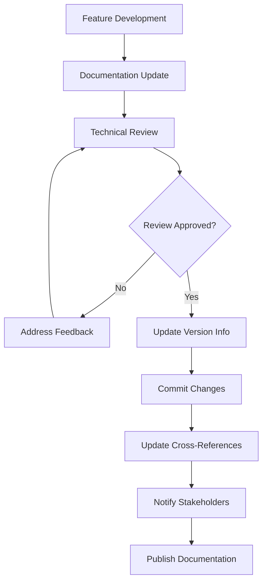

# Documentation Update Procedures

## Overview

This document defines the procedures for maintaining, updating, and versioning the High-Level Architecture (HLA) documentation for the Advanced Trading Framework. It ensures documentation accuracy, consistency, and alignment with system evolution.

## Documentation Structure & Ownership

### Documentation Hierarchy

```
docs/HLA/
├── README.md                           # Architecture Team
├── migration-evolution.md             # Architecture Team
├── documentation-procedures.md        # Architecture Team
├── modules/
│   ├── data-management.md             # Data Team
│   ├── trading-engine.md              # Trading Team
│   ├── ml-analytics.md                # ML Team
│   ├── communication.md               # Frontend Team
│   ├── infrastructure.md              # DevOps Team
│   ├── configuration.md               # Platform Team
│   └── security-auth.md               # Security Team
└── diagrams/
    ├── system-overview.mmd            # Architecture Team
    ├── data-flow.mmd                  # Architecture Team
    ├── module-interactions.mmd        # Architecture Team
    └── service-communication.mmd      # Architecture Team
```

### Team Responsibilities

| Team | Documentation Scope | Update Frequency | Review Cycle |
|------|---------------------|------------------|--------------|
| **Architecture Team** | System overview, integration patterns, diagrams | Monthly | Quarterly |
| **Data Team** | Data management module, provider integrations | Per release | Monthly |
| **Trading Team** | Trading engine, strategies, risk management | Per release | Monthly |
| **ML Team** | ML pipeline, analytics, model management | Per release | Monthly |
| **Frontend Team** | Communication module, UI/UX, notifications | Per release | Monthly |
| **DevOps Team** | Infrastructure, deployment, monitoring | Per release | Monthly |
| **Platform Team** | Configuration, common utilities | Per release | Monthly |
| **Security Team** | Authentication, authorization, compliance | Per release | Monthly |

## Update Procedures

### Automatic Updates

#### Implementation Status Updates
```yaml
# Triggered by: Code commits, feature completion
# Frequency: Real-time
# Process:
- Git hooks detect feature completion markers
- CI/CD pipeline updates implementation status
- Documentation status badges updated automatically
- Stakeholders notified of status changes
```

#### Performance Metrics Updates
```yaml
# Triggered by: Performance benchmarks, monitoring data
# Frequency: Weekly
# Process:
- Automated performance tests generate metrics
- Benchmarking pipeline updates documentation
- Performance trend analysis included
- Alerts sent for significant performance changes
```

#### API Documentation Updates
```yaml
# Triggered by: Code changes with API annotations
# Frequency: Per commit
# Process:
- OpenAPI specifications generated from code
- API documentation updated automatically
- Breaking changes flagged for review
- Version compatibility matrix updated
```

### Manual Update Procedures

#### Module Documentation Updates

**Trigger Events:**
- Feature implementation completion
- Architecture changes
- Performance optimizations
- Bug fixes affecting documented behavior

**Update Process:**
1. **Preparation Phase**
   - Review implementation changes
   - Identify documentation impact areas
   - Gather performance metrics and examples
   - Prepare update checklist

2. **Content Update Phase**
   - Update feature status (✅ 🔄 📋)
   - Revise technical specifications
   - Update code examples and configurations
   - Refresh performance characteristics

3. **Review Phase**
   - Technical review by module lead
   - Cross-module impact assessment
   - Link validation and consistency check
   - User experience validation

4. **Publication Phase**
   - Commit changes with descriptive messages
   - Update version information
   - Notify stakeholders of changes
   - Update cross-reference links

#### Roadmap Updates

**Schedule**: Monthly (First Monday of each month)

**Process:**
1. **Data Collection**
   - Gather progress reports from all teams
   - Review completed features and milestones
   - Assess timeline adjustments needed
   - Collect user feedback and feature requests

2. **Roadmap Analysis**
   - Update feature completion status
   - Adjust timeline estimates based on progress
   - Reprioritize features based on business needs
   - Identify dependencies and blockers

3. **Documentation Update**
   - Update roadmap sections in all modules
   - Revise timeline estimates and targets
   - Update migration and evolution strategy
   - Refresh version history and planning

4. **Stakeholder Communication**
   - Publish roadmap updates
   - Communicate significant changes
   - Gather feedback on priorities
   - Schedule review meetings as needed

### Version Management

#### Documentation Versioning Strategy

**Version Format**: `MAJOR.MINOR.PATCH`
- **MAJOR**: Significant architecture changes, breaking changes
- **MINOR**: New features, module additions, non-breaking changes
- **PATCH**: Bug fixes, clarifications, minor updates

**Version Alignment**:
- Documentation versions align with system releases
- Module documentation inherits system version
- Individual updates increment patch version
- Major releases require comprehensive review

#### Version Control Workflow



#### Release Documentation Process

**Pre-Release (2 weeks before release)**
1. **Documentation Freeze**
   - Freeze major documentation changes
   - Complete all pending updates
   - Perform comprehensive review
   - Validate all cross-references

2. **Quality Assurance**
   - Technical accuracy validation
   - Link checking and validation
   - User experience testing
   - Performance benchmark updates

**Release Day**
1. **Version Update**
   - Update all version numbers
   - Update release dates
   - Publish release notes
   - Update version history

2. **Publication**
   - Deploy updated documentation
   - Update external references
   - Notify user community
   - Monitor for issues

**Post-Release (1 week after release)**
1. **Feedback Collection**
   - Gather user feedback
   - Monitor documentation usage
   - Identify improvement areas
   - Plan next update cycle

## Quality Assurance

### Review Process

#### Technical Review Checklist
- [ ] **Accuracy**: All technical information verified against implementation
- [ ] **Completeness**: All features and changes documented
- [ ] **Consistency**: Terminology and formatting consistent across documents
- [ ] **Examples**: Code examples tested and validated
- [ ] **Performance**: Metrics updated and accurate
- [ ] **Links**: All internal and external links functional

#### Content Review Standards
- [ ] **Clarity**: Information presented clearly and concisely
- [ ] **Structure**: Logical organization and flow
- [ ] **Audience**: Appropriate for target audience (developers, users, administrators)
- [ ] **Visuals**: Diagrams and charts accurate and helpful
- [ ] **Navigation**: Easy to find and navigate information

### Automated Quality Checks

#### Link Validation
```bash
# Daily automated link checking
python scripts/validate_links.py --docs-dir docs/HLA/
# Report broken links to documentation maintainers
# Create GitHub issues for broken external links
```

#### Content Validation
```bash
# Weekly content validation
python scripts/validate_content.py --check-examples --check-metrics
# Validate code examples against current codebase
# Check performance metrics against benchmarks
```

#### Consistency Checks
```bash
# Monthly consistency validation
python scripts/check_consistency.py --terminology --formatting
# Ensure consistent terminology across documents
# Validate formatting and structure standards
```

## Cross-Reference Management

### Link Management Strategy

#### Internal Links
- **Relative Links**: Use relative paths for internal documentation
- **Anchor Links**: Use descriptive anchor names for section references
- **Cross-Module Links**: Maintain bidirectional links between related modules
- **Diagram References**: Link diagrams to relevant documentation sections

#### External Links
- **Stability Check**: Verify external link stability before inclusion
- **Archive Links**: Provide archive.org links for important external resources
- **Version Specific**: Link to specific versions of external documentation
- **Fallback Options**: Provide alternative sources when possible

### Dependency Tracking

#### Module Dependencies
```yaml
# Example dependency mapping
data-management:
  depends_on: [infrastructure, configuration]
  used_by: [trading-engine, ml-analytics, communication]
  
trading-engine:
  depends_on: [data-management, infrastructure, configuration]
  used_by: [communication, ml-analytics]
  
ml-analytics:
  depends_on: [data-management, trading-engine, infrastructure]
  used_by: [communication, trading-engine]
```

#### Update Propagation
- **Dependency Analysis**: Identify documentation impact of changes
- **Cascade Updates**: Automatically update dependent documentation
- **Validation**: Ensure consistency across dependent modules
- **Notification**: Alert maintainers of dependency changes

## Metrics & Monitoring

### Documentation Metrics

#### Usage Metrics
- **Page Views**: Track most and least accessed documentation
- **User Paths**: Analyze common navigation patterns
- **Search Queries**: Monitor internal search terms
- **Feedback Scores**: Collect user satisfaction ratings

#### Quality Metrics
- **Update Frequency**: Track documentation freshness
- **Review Coverage**: Ensure all content receives regular review
- **Issue Resolution**: Monitor and resolve documentation issues
- **Link Health**: Track broken link incidents and resolution

#### Performance Metrics
- **Load Times**: Monitor documentation site performance
- **Search Performance**: Optimize internal search functionality
- **Mobile Experience**: Ensure mobile-friendly documentation
- **Accessibility**: Maintain accessibility standards compliance

### Monitoring Dashboard

#### Key Performance Indicators
- **Documentation Coverage**: Percentage of features documented
- **Update Timeliness**: Average time from feature completion to documentation
- **User Satisfaction**: Average user rating and feedback scores
- **Issue Resolution Time**: Average time to resolve documentation issues

#### Alerting Rules
- **Stale Content**: Alert when documentation hasn't been updated in 90 days
- **Broken Links**: Immediate alert for broken internal links
- **Performance Issues**: Alert when page load times exceed thresholds
- **User Feedback**: Alert for negative feedback or reported issues

## Tools & Automation

### Documentation Tools

#### Content Management
- **Markdown Editor**: VS Code with markdown extensions
- **Diagram Tools**: Mermaid for technical diagrams
- **Screenshot Tools**: Automated screenshot generation for UI documentation
- **Version Control**: Git with branch-based workflow

#### Automation Scripts
```bash
# Documentation maintenance scripts
scripts/
├── validate_links.py          # Link validation and reporting
├── validate_content.py        # Content accuracy validation
├── check_consistency.py       # Terminology and formatting checks
├── generate_metrics.py        # Documentation metrics generation
├── update_status.py           # Implementation status updates
└── publish_docs.py            # Documentation publication workflow
```

#### CI/CD Integration
```yaml
# GitHub Actions workflow for documentation
name: Documentation CI/CD
on:
  push:
    paths: ['docs/**']
  pull_request:
    paths: ['docs/**']
  schedule:
    - cron: '0 2 * * 1'  # Weekly validation

jobs:
  validate:
    runs-on: ubuntu-latest
    steps:
      - name: Validate Links
        run: python scripts/validate_links.py
      - name: Check Consistency
        run: python scripts/check_consistency.py
      - name: Generate Metrics
        run: python scripts/generate_metrics.py
```

## Communication & Feedback

### Stakeholder Communication

#### Update Notifications
- **Email Digest**: Weekly summary of documentation changes
- **Slack Notifications**: Real-time updates for significant changes
- **Release Notes**: Comprehensive documentation changes in release notes
- **Team Meetings**: Regular documentation review in team meetings

#### Feedback Channels
- **GitHub Issues**: Technical issues and improvement suggestions
- **User Surveys**: Quarterly user experience surveys
- **Team Feedback**: Regular feedback collection from development teams
- **Community Input**: External contributor feedback and suggestions

### Continuous Improvement

#### Feedback Analysis
- **Monthly Review**: Analyze feedback and usage metrics
- **Improvement Planning**: Identify and prioritize improvement areas
- **Implementation**: Execute improvement initiatives
- **Measurement**: Track improvement impact and effectiveness

#### Best Practices Evolution
- **Industry Standards**: Stay current with documentation best practices
- **Tool Evaluation**: Regularly evaluate new documentation tools
- **Process Optimization**: Continuously improve documentation processes
- **Knowledge Sharing**: Share best practices across teams

---

**Document Version**: 1.0  
**Last Updated**: January 15, 2025  
**Next Review**: April 15, 2025  
**Owner**: Architecture Team

This documentation procedures guide will be reviewed and updated quarterly to ensure effectiveness and alignment with team needs.