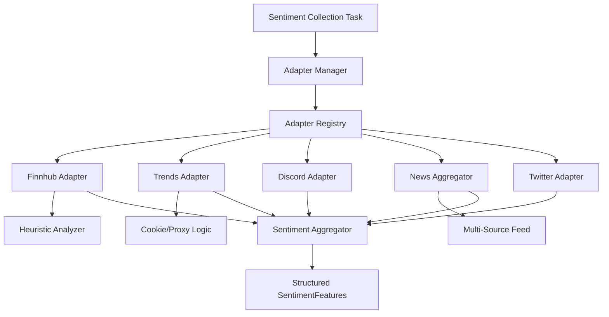

# Sentiments Module

## Purpose & Responsibilities

The Sentiments module provides a unified interface for collecting, analyzing, and aggregating sentiment data from various social media, news, and search interest sources. It transforms raw unstructured text and search data into structured `SentimentFeatures` that can be used by trading strategies and ML models.

## Architecture

The module follows a pluggable adapter architecture managed by a central `AdapterRegistry`.

### Component Diagram

## Key Components

### 1. Adapter Manager & Registry
The `AdapterManager` orchestrates the collection process across all enabled adapters. It handles concurrency, per-provider rate limiting, and result aggregation.

### 2. Provider Adapters
Each adapter (`BaseSentimentAdapter` subclass) encapsulates the logic for a specific data source:
- **Finnhub**: Subscription-aware; falls back to raw news analysis if premium sentiment endpoints are 403-restricted.
    - *Free Tier Limit*: No access to `news-sentiment` or `social-sentiment`. 60 calls/min limit on news fetching.
- **Google Trends**: Uses session-based cookie establishment and Chrome-mimicry to ensure reliable search interest data.
    - *Limit*: Susceptible to rate limiting and 429/400 errors if requests are too frequent or lack valid session cookies.
- **Discord**: Connects to financial servers and channels to track real-time community mentions.
    - *Limit*: Limited by bot permissions and rate limits on the Discord API (50 requests per second globally).
- **Twitter/X**: Integrated with API v2; includes sophisticated backoff logic for Free tier limits.
    - *Free Tier Limit*: Extreme restriction of **1 request per 15 minutes**. This makes it impractical for real-time tickers, leading to its default suppression.
- **News Aggregator**: Combines feeds from Alpha Vantage, Finnhub News, and NewsAPI.
    - *Free Tier Limit*: Alpha Vantage (25 calls/day), NewsAPI (100 calls/day).

### 3. Heuristic Sentiment Analyzer
A rule-based NLP engine that provides sentiment scores when source-side sentiment is unavailable or restricted. Used heavily in fallbacks (e.g., Finnhub news fallback).

## Data Models

### SentimentFeatures
The output of the collection pipeline is a standardized object:

| Field | Type | Description |
| :--- | :--- | :--- |
| `sentiment_score` | `float` | Weighted aggregate score (-1.0 to 1.0) |
| `mentions` | `int` | Total count of mentions across all providers |
| `bullish_count` | `int` | Total count of positive items |
| `bearish_count` | `int` | Total count of negative items |
| `provider_scores` | `dict` | Individual scores from each contributing adapter |
| `timestamp` | `iso8601` | Collection time |

## Configuration

The module is configured via environment variables and `collect_sentiment_async.py` defaults:

- `SENTIMENT_FINNHUB_ENABLED`: Enable/Disable Finnhub.
- `SENTIMENT_WEIGHT_FINNHUB`: Weight (0.0 to 1.0) for Finnhub in the aggregate.
- `SENTIMENT_TRENDS_ENABLED`: Enable/Disable Google Trends.
- `SENTIMENT_TWITTER_ENABLED`: Enable/Disable Twitter (Default: False for Free Tier).

## Status and Health

| Provider | Status | Notes |
| :--- | :--- | :--- |
| **Google Trends** | ✅ Healthy | Dynamic token management implemented. |
| **Finnhub** | ✅ Healthy | Hybrid news-fallback logic active. |
| **News Aggregator**| ✅ Healthy | Multi-feed aggregation active. |
| **Twitter/X** | 🔕 Suppressed | Disabled by default due to Free Tier limits. |
| **StockTwits** | ❌ Blocked | 403 Forbidden issues (WAF/Anti-bot). |
| **Reddit/Pushshift**| 🔕 Suppressed | Force-disabled to reduce log noise. |

---
*Last updated: December 2025*
*Version: 1.1.0*
