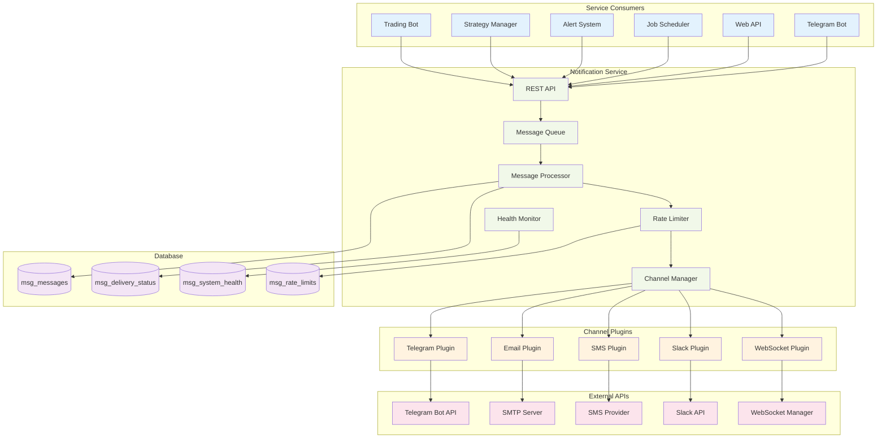

# Notification Services Integration

## Overview

The Advanced Trading Framework implements a dedicated Notification Service that handles all outbound communications across multiple channels including Telegram, Email, SMS, and WebSocket connections. The service is designed as an autonomous process with advanced features like database-backed queuing, per-user rate limiting, delivery tracking, channel health monitoring, and plugin-based extensibility.

## Architecture Evolution

### Current Architecture (Legacy)
The system previously used an embedded `AsyncNotificationManager` within individual services, leading to tight coupling and limited scalability.

### New Architecture (Target)
A dedicated Notification Service provides centralized, scalable, and maintainable notification delivery with comprehensive monitoring and analytics.

## Architecture Components

### 1. Notification Service Architecture



### 2. Core Service Components

#### 2.1 Notification Service
Autonomous service that handles all outbound communications:

**Key Features:**
- **Autonomous Process**: Runs independently as a separate service
- **Database-Backed Queue**: Persistent message storage with priority handling
- **Plugin Architecture**: Extensible channel system for easy integration
- **Per-User Rate Limiting**: Prevents spam and respects API limits
- **Delivery Tracking**: Comprehensive analytics and monitoring
- **Health Monitoring**: Automatic channel health detection and fallback

#### 2.2 REST API Layer
HTTP interface for service consumers:

```python
# Message enqueueing endpoint
POST /api/v1/messages
{
    "message_type": "trade_alert",
    "priority": "HIGH",
    "channels": ["telegram", "email"],
    "recipient_id": "user123",
    "template_name": "trade_alert",
    "content": {
        "symbol": "BTCUSDT",
        "action": "BUY",
        "price": 65000
    },
    "metadata": {
        "telegram_chat_id": 123456789
    }
}
```

#### 2.3 Message Processing Engine
Core processing system with advanced features:

- **Priority Queues**: CRITICAL, HIGH, NORMAL, LOW priority levels
- **Immediate Processing**: High-priority messages bypass batching
- **Batch Processing**: Efficient handling of normal priority messages
- **Retry Mechanisms**: Exponential backoff for failed deliveries
- **Dead Letter Queue**: Permanent failure handling

#### 2.4 Channel Plugin System
Extensible architecture for notification channels:

```python
class NotificationChannel(ABC):
    @abstractmethod
    async def send(self, message: Message) -> DeliveryResult:
        """Send message through this channel"""
        pass
    
    @abstractmethod
    async def get_health(self) -> ChannelHealth:
        """Get current channel health status"""
        pass
    
    def format_message(self, template: str, data: Dict[str, Any]) -> str:
        """Format message using channel-specific formatting"""
        pass
```

### 3. Database Schema

#### 3.1 Message Storage
Persistent storage for reliable message delivery:

```sql
-- Core message table
CREATE TABLE msg_messages (
    id BIGSERIAL PRIMARY KEY,
    message_type VARCHAR(50) NOT NULL,
    priority VARCHAR(20) NOT NULL DEFAULT 'NORMAL',
    channels TEXT[] NOT NULL,
    recipient_id VARCHAR(100),
    template_name VARCHAR(100),
    content JSONB NOT NULL,
    metadata JSONB,
    created_at TIMESTAMP WITH TIME ZONE DEFAULT NOW(),
    status VARCHAR(20) DEFAULT 'PENDING',
    retry_count INTEGER DEFAULT 0
);

-- Delivery tracking table
CREATE TABLE msg_delivery_status (
    id BIGSERIAL PRIMARY KEY,
    message_id BIGINT REFERENCES msg_messages(id),
    channel VARCHAR(50) NOT NULL,
    status VARCHAR(20) NOT NULL,
    delivered_at TIMESTAMP WITH TIME ZONE,
    response_time_ms INTEGER,
    error_message TEXT
);

-- System health monitoring (replaces msg_channel_health)
-- Notification channels are stored as system='notification', component=channel_name
CREATE TABLE msg_system_health (
    id BIGSERIAL PRIMARY KEY,
    system VARCHAR(50) NOT NULL,              -- 'notification' for notification channels
    component VARCHAR(100),                   -- channel name (email, telegram, sms, etc.)
    status VARCHAR(20) NOT NULL,              -- HEALTHY, DEGRADED, DOWN, UNKNOWN
    last_success TIMESTAMPTZ,                 -- Last successful health check
    last_failure TIMESTAMPTZ,                 -- Last failed health check
    failure_count INTEGER NOT NULL DEFAULT 0, -- Consecutive failure count
    avg_response_time_ms INTEGER,             -- Average response time
    error_message TEXT,                       -- Error details
    metadata TEXT,                            -- JSON metadata
    checked_at TIMESTAMPTZ NOT NULL DEFAULT NOW(), -- Last check timestamp
    
    CONSTRAINT check_system_health_status 
        CHECK (status IN ('HEALTHY', 'DEGRADED', 'DOWN', 'UNKNOWN')),
    CONSTRAINT check_failure_count_positive 
        CHECK (failure_count >= 0),
    CONSTRAINT check_avg_response_time_positive 
        CHECK (avg_response_time_ms >= 0)
);

-- Indexes for performance
CREATE INDEX idx_system_health_system ON msg_system_health(system);
CREATE INDEX idx_system_health_status ON msg_system_health(status);
CREATE INDEX idx_system_health_checked_at ON msg_system_health(checked_at);
CREATE UNIQUE INDEX idx_system_health_unique 
    ON msg_system_health (system, COALESCE(component, ''));

-- Backward compatibility view for channel health
CREATE OR REPLACE VIEW v_channel_health AS
SELECT 
    component as channel,
    status,
    last_success,
    last_failure,
    failure_count,
    avg_response_time_ms,
    error_message,
    checked_at
FROM msg_system_health 
WHERE system = 'notification' AND component IS NOT NULL;

-- Per-user rate limiting
CREATE TABLE msg_rate_limits (
    id BIGSERIAL PRIMARY KEY,
    user_id VARCHAR(100) NOT NULL,
    channel VARCHAR(50) NOT NULL,
    tokens INTEGER NOT NULL,
    last_refill TIMESTAMP WITH TIME ZONE DEFAULT NOW()
);
```

### 4. Channel Plugin Implementations

#### 4.1 Telegram Plugin
Enhanced Telegram message delivery:

```python
class TelegramPlugin(NotificationChannel):
    def __init__(self, config: Dict[str, Any]):
        super().__init__(config)
        self.bot = Bot(token=config["bot_token"])
        self.timeout = config.get("timeout", 30)

    async def send(self, message: Message) -> DeliveryResult:
        try:
            # Extract chat ID from message metadata
            chat_id = message.metadata.get('telegram_chat_id')
            
            # Format message using template
            formatted_text = self.format_message(
                message.template_name, 
                message.content
            )
            
            # Handle attachments if present
            if message.metadata.get("attachments"):
                return await self._send_with_attachments(
                    chat_id, formatted_text, message.metadata["attachments"]
                )
            
            # Send text message with splitting for long messages
            result = await self._send_with_splitting(chat_id, formatted_text)
            
            return DeliveryResult(
                success=True,
                external_id=str(result.message_id),
                response_time_ms=self._calculate_response_time()
            )
            
        except Exception as e:
            return DeliveryResult(
                success=False,
                error_message=str(e)
            )

    async def get_health(self) -> ChannelHealth:
        try:
            # Test API connectivity
            await self.bot.get_me()
            return ChannelHealth(status="healthy")
        except Exception as e:
            return ChannelHealth(
                status="down",
                error_message=str(e)
            )
```

**Enhanced Features**:
- **Message Splitting**: Automatically splits messages longer than 4096 characters
- **Attachment Support**: Handles both file paths and byte data
- **Reply Support**: Supports replying to specific messages
- **Dynamic Chat IDs**: Per-message chat ID specification
- **Health Monitoring**: Automatic API connectivity testing
- **Error Recovery**: Graceful fallback and retry mechanisms

#### 4.2 Email Plugin
Enhanced SMTP-based email delivery:

```python
class EmailPlugin(NotificationChannel):
    def __init__(self, config: Dict[str, Any]):
        super().__init__(config)
        self.smtp_server = config["smtp_server"]
        self.smtp_port = config["smtp_port"]
        self.username = config["username"]
        self.password = config["password"]

    async def send(self, message: Message) -> DeliveryResult:
        try:
            # Extract recipient from message metadata
            recipient = message.metadata.get('email_recipient')
            
            # Format message as HTML
            html_content = self.format_message_html(
                message.template_name,
                message.content
            )
            
            # Prepare attachments
            attachments = self._prepare_attachments(
                message.metadata.get("attachments", {})
            )
            
            # Send email asynchronously
            result = await self._send_smtp_email(
                recipient=recipient,
                subject=message.content.get("subject", "Notification"),
                html_content=html_content,
                attachments=attachments
            )
            
            return DeliveryResult(
                success=True,
                external_id=result.message_id,
                response_time_ms=self._calculate_response_time()
            )
            
        except Exception as e:
            return DeliveryResult(
                success=False,
                error_message=str(e)
            )

    async def get_health(self) -> ChannelHealth:
        try:
            # Test SMTP connectivity
            await self._test_smtp_connection()
            return ChannelHealth(status="healthy")
        except Exception as e:
            return ChannelHealth(
                status="down",
                error_message=str(e)
            )
```

**Enhanced Features**:
- **MIME Attachment Support**: Handles various file types with proper encoding
- **HTML Template System**: Rich email formatting with templates
- **Async SMTP**: Non-blocking email sending with connection pooling
- **Dynamic Recipients**: Per-message recipient specification
- **Health Monitoring**: SMTP server connectivity testing
- **Delivery Confirmation**: Email delivery status tracking

#### 4.3 SMS Plugin
Mobile notification delivery:

```python
class SMSPlugin(NotificationChannel):
    def __init__(self, config: Dict[str, Any]):
        super().__init__(config)
        self.provider = config["provider"]  # twilio, aws_sns, etc.
        self.credentials = config["credentials"]
        self.from_number = config["from_number"]

    async def send(self, message: Message) -> DeliveryResult:
        try:
            # Extract phone number from message metadata
            phone_number = message.metadata.get('phone_number')
            
            # Format message for SMS (160 char limit)
            sms_content = self.format_message_sms(
                message.template_name,
                message.content
            )
            
            # Send SMS via provider
            result = await self._send_sms(
                to_number=phone_number,
                from_number=self.from_number,
                content=sms_content
            )
            
            return DeliveryResult(
                success=True,
                external_id=result.sid,
                response_time_ms=self._calculate_response_time()
            )
            
        except Exception as e:
            return DeliveryResult(
                success=False,
                error_message=str(e)
            )

    async def get_health(self) -> ChannelHealth:
        try:
            # Test provider API connectivity
            await self._test_provider_connection()
            return ChannelHealth(status="healthy")
        except Exception as e:
            return ChannelHealth(
                status="down",
                error_message=str(e)
            )
```

**Key Features**:
- **Multiple Providers**: Support for Twilio, AWS SNS, and other SMS providers
- **Message Optimization**: Automatic truncation and formatting for SMS limits
- **Delivery Confirmation**: SMS delivery status tracking
- **Health Monitoring**: Provider API connectivity testing
- **Cost Optimization**: Intelligent message batching and routing

### 5. Service Integration Patterns

#### 5.1 Service Consumer Integration
Service consumers interact with the Notification Service via REST API:

```python
# Example: Alert Evaluator sending notification
async def send_alert_notification(alert_data):
    message = {
        "message_type": "trade_alert",
        "priority": "HIGH",
        "channels": ["telegram", "email"],
        "recipient_id": alert_data["user_id"],
        "template_name": "trade_alert",
        "content": {
            "symbol": alert_data["symbol"],
            "action": alert_data["action"],
            "price": alert_data["price"]
        },
        "metadata": {
            "alert_id": alert_data["id"],
            "telegram_chat_id": alert_data["telegram_chat_id"],
            "email_recipient": alert_data["email"]
        }
    }
    
    response = await http_client.post(
        "http://notification-service:8080/api/v1/messages",
        json=message
    )
    return response.json()["message_id"]
```

#### 5.2 Priority-Based Processing
Messages are processed based on priority levels:

- **CRITICAL**: Immediate delivery, bypass all limits (< 5 seconds)
- **HIGH**: Fast delivery, bypass batching (< 30 seconds)
- **NORMAL**: Standard processing with batching (< 5 minutes)
- **LOW**: Batch processing during low-traffic periods

#### 5.3 Per-User Rate Limiting
Advanced rate limiting prevents spam and respects API limits:

```python
# Rate limiting configuration per channel
RATE_LIMITS = {
    "telegram": {"tokens": 30, "refill_rate": 30, "per": "minute"},
    "email": {"tokens": 10, "refill_rate": 10, "per": "minute"},
    "sms": {"tokens": 5, "refill_rate": 5, "per": "minute"}
}
```

#### 5.4 Channel Health and Fallback
Automatic health monitoring with intelligent fallback integrated into the platform-wide health monitoring system:

**Health Monitoring Integration**:
- **Unified Health System**: Channel health is now part of the comprehensive system health monitoring
- **Automatic Heartbeats**: Each notification channel reports health status every 60 seconds
- **System Integration**: Channel health data is stored in `msg_system_health` table as notification system components
- **Backward Compatibility**: Original channel health APIs remain functional

**Health Check Implementation**:
```python
def create_channel_health_check(channel_name):
    def channel_health_check():
        try:
            # Channel-specific health checks
            if channel_name == 'email':
                # Test SMTP connectivity
                return test_smtp_connection()
            elif channel_name == 'telegram':
                # Test Telegram Bot API
                return test_telegram_api()
            # ... other channels
            
            return {
                'status': 'HEALTHY',
                'metadata': {
                    'channel': channel_name,
                    'last_check': datetime.now().isoformat()
                }
            }
        except Exception as e:
            return {
                'status': 'DOWN',
                'error_message': f'Channel {channel_name} failed: {str(e)}'
            }
    return channel_health_check
```

**Health Status Levels**:
- **HEALTHY**: Channel fully operational and responsive
- **DEGRADED**: Channel operational but with warnings (slow response, rate limits)
- **DOWN**: Channel unavailable or failing
- **UNKNOWN**: Health status cannot be determined

**Fallback and Recovery**:
- **Automatic Fallback**: Route to secondary channels when primary fails
- **Recovery Detection**: Automatic re-enabling when channels recover
- **Admin Alerts**: Notify administrators of channel failures via healthy channels
- **Intelligent Routing**: Route messages based on channel health and user preferences

**Health Monitoring APIs**:
```bash
# Get all notification channel health (backward compatible)
GET /api/v1/channels/health

# Get specific channel health
GET /api/v1/channels/{channel_name}/health

# Update channel health status
POST /api/v1/channels/{channel_name}/health

# Get notification system health (new unified API)
GET /api/v1/health/system/notification
```

For comprehensive health monitoring documentation, see [System Health Monitoring](system-health-monitoring.md).

### 6. Advanced Features

#### 6.1 Message Archiving and Cleanup
Automated data lifecycle management:

```python
# Archival configuration
ARCHIVAL_POLICIES = {
    "delivered_messages": {
        "archive_after_days": 30,
        "delete_after_days": 365
    },
    "failed_messages": {
        "archive_after_days": 7,
        "delete_after_days": 90
    },
    "delivery_status": {
        "archive_after_days": 90,
        "delete_after_days": 730
    }
}

async def archive_old_messages():
    """Archive messages based on configured policies"""
    for table, policy in ARCHIVAL_POLICIES.items():
        # Archive old records
        await archive_records(
            table=table,
            older_than_days=policy["archive_after_days"]
        )
        
        # Delete very old archived records
        await delete_archived_records(
            table=f"{table}_archive",
            older_than_days=policy["delete_after_days"]
        )
```

**Archival Features**:
- **Automated Archival**: Messages archived after 30 days
- **Compressed Storage**: Archived data stored in compressed format
- **Configurable Policies**: Different retention rules per message type
- **Performance Optimization**: Cleanup during low-traffic periods

#### 6.2 Delivery Analytics and Monitoring
Comprehensive tracking and analytics system:

```python
# Delivery statistics API
GET /api/v1/stats/delivery
{
    "period": "24h",
    "channels": {
        "telegram": {
            "sent": 1250,
            "delivered": 1240,
            "failed": 10,
            "avg_response_time_ms": 850,
            "success_rate": 99.2
        },
        "email": {
            "sent": 450,
            "delivered": 445,
            "failed": 5,
            "avg_response_time_ms": 2100,
            "success_rate": 98.9
        }
    },
    "by_priority": {
        "critical": {"sent": 15, "avg_delivery_time_ms": 1200},
        "high": {"sent": 180, "avg_delivery_time_ms": 3500},
        "normal": {"sent": 1400, "avg_delivery_time_ms": 45000}
    }
}
```

**Analytics Features**:
- **Real-time Metrics**: Live delivery statistics and success rates
- **Performance Tracking**: Response times and throughput monitoring
- **Channel Comparison**: Comparative analysis across channels
- **User Analytics**: Per-user delivery patterns and preferences

#### 6.3 Plugin Architecture and Extensibility
Modular system for easy channel integration:

```python
# Plugin registration system
class ChannelPluginManager:
    def __init__(self):
        self.plugins: Dict[str, NotificationChannel] = {}
    
    def register_plugin(self, name: str, plugin_class: Type[NotificationChannel]):
        """Register a new channel plugin"""
        self.plugins[name] = plugin_class
    
    def load_plugins(self, config: Dict[str, Any]):
        """Load and initialize plugins from configuration"""
        for channel_name, channel_config in config["channels"].items():
            if channel_config["enabled"]:
                plugin_class = self.plugins[channel_config["plugin"]]
                self.channels[channel_name] = plugin_class(channel_config)

# Example: Adding a new Slack plugin
@register_plugin("slack")
class SlackPlugin(NotificationChannel):
    async def send(self, message: Message) -> DeliveryResult:
        # Slack-specific implementation
        pass
    
    async def get_health(self) -> ChannelHealth:
        # Slack health check
        pass
```

**Extensibility Features**:
- **Plugin Discovery**: Automatic plugin detection and loading
- **Configuration Driven**: Channel plugins configured via YAML/JSON
- **Hot Reload**: Add new channels without service restart
- **Standardized Interface**: Consistent API across all channel types

### 7. Migration Strategy

#### 7.1 Backward Compatibility
Smooth transition from existing AsyncNotificationManager:

```python
# Compatibility wrapper for existing code
class AsyncNotificationManagerCompat:
    def __init__(self, notification_service_url: str):
        self.service_url = notification_service_url
        self.http_client = httpx.AsyncClient()
    
    async def send_notification(self, **kwargs):
        """Proxy method that forwards to notification service"""
        # Convert old format to new API format
        message = self._convert_legacy_format(kwargs)
        
        # Send to notification service
        response = await self.http_client.post(
            f"{self.service_url}/api/v1/messages",
            json=message
        )
        return response.json()["message_id"]
    
    def _convert_legacy_format(self, kwargs):
        """Convert legacy notification format to new API format"""
        return {
            "message_type": kwargs.get("notification_type", "info"),
            "priority": kwargs.get("priority", "NORMAL").upper(),
            "channels": kwargs.get("channels", ["telegram"]),
            "recipient_id": kwargs.get("recipient_id"),
            "content": {
                "title": kwargs.get("title"),
                "message": kwargs.get("message")
            },
            "metadata": kwargs.get("data", {})
        }
```

#### 7.2 Gradual Migration Plan
Phased approach to minimize disruption:

**Phase 1: Service Deployment**
- Deploy notification service alongside existing system
- Implement database schema and core APIs
- Create channel plugins for existing channels (Telegram, Email)

**Phase 2: Service Consumer Migration**
- Migrate AlertEvaluator to use notification service APIs
- Update SchedulerService for report notifications
- Modify TelegramBot for non-interactive notifications

**Phase 3: Full Migration and Cleanup**
- Migrate all remaining service consumers
- Remove AsyncNotificationManager dependencies
- Clean up legacy notification code

### 8. Operational Considerations

#### 8.1 Service Deployment
Autonomous service deployment configuration:

```yaml
# docker-compose.yml
version: '3.8'
services:
  notification-service:
    build: ./src/notification
    ports:
      - "8080:8080"
    environment:
      - DATABASE_URL=postgresql://user:pass@db:5432/trading_db
      - TELEGRAM_BOT_TOKEN=${TELEGRAM_BOT_TOKEN}
      - SMTP_USERNAME=${SMTP_USERNAME}
      - SMTP_PASSWORD=${SMTP_PASSWORD}
    depends_on:
      - db
    restart: unless-stopped
    healthcheck:
      test: ["CMD", "curl", "-f", "http://localhost:8080/api/v1/health"]
      interval: 30s
      timeout: 10s
      retries: 3
```

#### 8.2 Monitoring and Alerting
Comprehensive observability setup:

```python
# Prometheus metrics
notification_messages_total = Counter(
    'notification_messages_total',
    'Total number of notification messages',
    ['channel', 'status', 'priority']
)

notification_delivery_duration = Histogram(
    'notification_delivery_duration_seconds',
    'Time spent delivering notifications',
    ['channel']
)

channel_health_status = Gauge(
    'notification_channel_health',
    'Channel health status (1=healthy, 0=down)',
    ['channel']
)
```

#### 8.3 Security and Compliance
Security measures for production deployment:

- **API Authentication**: Service-to-service authentication with JWT tokens
- **Rate Limiting**: Prevent abuse and DoS attacks
- **Input Validation**: Comprehensive message content sanitization
- **Audit Logging**: Complete audit trail for compliance
- **Credential Management**: Secure storage of channel credentials
- **Data Encryption**: Encrypt sensitive message content at rest

### 7. Template System

#### 7.1 Message Templates
Standardized message formats for different notification types:

```python
NOTIFICATION_TEMPLATES = {
    "trade_entry": "🟢 {side} {symbol}\n💰 Price: ${price:,.2f}\n📊 Quantity: {quantity}\n⏰ {timestamp}",
    "trade_exit": "🔴 {side} {symbol}\n💰 Price: ${price:,.2f}\n📊 P&L: {pnl:+.2f}%\n🎯 Exit: {exit_type}\n⏰ {timestamp}",
    "alert": "⚠️ {alert_type}\n📝 {message}\n⏰ {timestamp}",
    "error": "🚨 ERROR\n📝 {error_message}\n🔧 Source: {source}\n⏰ {timestamp}",
    "report": "📊 {report_type} Report\n📝 {summary}\n📎 Attachments: {attachment_count}\n⏰ {timestamp}"
}
```

#### 7.2 Customization Options
Users can customize:
- **Message Formats**: Custom templates per notification type
- **Channel Preferences**: Which channels to use for different notifications
- **Timing Preferences**: Quiet hours, batching preferences
- **Content Filters**: Filter out certain types of notifications

### 8. Monitoring and Analytics

#### 8.1 Notification Statistics
Track notification system performance:

```python
def get_stats(self) -> Dict[str, Any]:
    return {
        "sent": self.stats["sent"],
        "failed": self.stats["failed"],
        "queued": self.stats["queued"],
        "batched": self.stats["batched"],
        "queue_size": self.notification_queue.qsize(),
        "batch_queue_size": self.batch_queue.qsize(),
        "enabled_channels": [
            name for name, channel in self.channels.items() 
            if channel.is_enabled()
        ]
    }
```

#### 8.2 Health Monitoring
Monitor notification system health:
- **Queue Depths**: Alert when queues grow too large
- **Delivery Rates**: Track successful delivery percentages
- **Channel Status**: Monitor individual channel health
- **Response Times**: Track notification delivery times

#### 8.3 Performance Metrics
Key performance indicators:
- **Throughput**: Notifications per minute
- **Latency**: Time from creation to delivery
- **Success Rate**: Percentage of successful deliveries
- **Channel Utilization**: Usage distribution across channels

### 9. Configuration Management

#### 9.1 Channel Configuration
```python
NOTIFICATION_CONFIG = {
    "telegram": {
        "enabled": True,
        "token": "BOT_TOKEN",
        "default_chat_id": "CHAT_ID",
        "rate_limit": 1.0,
        "retry_attempts": 3
    },
    "email": {
        "enabled": True,
        "smtp_server": "smtp.gmail.com",
        "smtp_port": 587,
        "sender_email": "bot@example.com",
        "rate_limit": 5.0,
        "retry_attempts": 2
    },
    "websocket": {
        "enabled": True,
        "broadcast_system_events": True,
        "user_specific_routing": True
    }
}
```

#### 9.2 User Preferences
Per-user notification settings:
```python
USER_NOTIFICATION_PREFERENCES = {
    "channels": ["telegram", "email"],
    "quiet_hours": {"start": "22:00", "end": "08:00"},
    "notification_types": {
        "trade_entry": ["telegram"],
        "trade_exit": ["telegram", "email"],
        "alerts": ["telegram", "email"],
        "reports": ["email"]
    },
    "batching": {
        "enabled": True,
        "batch_size": 5,
        "timeout": 30
    }
}
```

### 10. Security Considerations

#### 10.1 Authentication
- **API Keys**: Secure storage of Telegram bot tokens and email credentials
- **User Verification**: Telegram user verification before sending notifications
- **Permission Checks**: Ensure users can only receive their own notifications

#### 10.2 Data Protection
- **Message Encryption**: Sensitive data encrypted in transit
- **PII Handling**: Careful handling of personally identifiable information
- **Audit Logging**: Log all notification activities for compliance

#### 10.3 Rate Limiting Protection
- **Anti-Spam**: Prevent notification spam attacks
- **Resource Protection**: Protect external services from overload
- **User Limits**: Per-user notification limits

### 11. Error Handling and Recovery

#### 11.1 Graceful Degradation
- **Channel Fallback**: Fall back to alternative channels when primary fails
- **Partial Delivery**: Continue with successful channels even if some fail
- **Service Recovery**: Automatic recovery when services come back online

#### 11.2 Error Classification
- **Temporary Errors**: Network issues, rate limiting (retry)
- **Permanent Errors**: Invalid tokens, blocked users (don't retry)
- **Configuration Errors**: Missing settings, invalid formats (alert admin)

#### 11.3 Recovery Strategies
- **Exponential Backoff**: Increasing delays between retries
- **Circuit Breaker**: Temporarily disable failing channels
- **Dead Letter Queue**: Store permanently failed notifications for analysis

### 9. Benefits and Improvements

#### 9.1 Architectural Benefits
The new Notification Service architecture provides significant improvements:

- **Decoupling**: Services no longer need direct notification dependencies
- **Scalability**: Horizontal scaling and load balancing support
- **Reliability**: Database-backed queues ensure message persistence
- **Observability**: Comprehensive monitoring and analytics
- **Extensibility**: Plugin architecture for easy channel addition
- **Maintainability**: Centralized notification logic and configuration

#### 9.2 Performance Improvements
Enhanced performance characteristics:

- **Async Processing**: Non-blocking message delivery
- **Priority Handling**: Critical messages delivered within 5 seconds
- **Batch Optimization**: Efficient handling of bulk notifications
- **Connection Pooling**: Optimized external API connections
- **Caching**: Template and configuration caching

#### 9.3 Operational Excellence
Improved operational capabilities:

- **Health Monitoring**: Automatic channel health detection
- **Fallback Routing**: Intelligent failover mechanisms
- **Delivery Tracking**: Complete message lifecycle visibility
- **Analytics Dashboard**: Real-time performance metrics
- **Automated Cleanup**: Data lifecycle management

## Conclusion

The Notification Service represents a significant architectural evolution from the embedded AsyncNotificationManager to a dedicated, autonomous service. This transformation addresses key challenges around coupling, scalability, and maintainability while providing enhanced features like comprehensive delivery tracking, channel health monitoring, and plugin-based extensibility.

The service's database-backed architecture ensures reliability and persistence, while the priority-based processing system guarantees that critical notifications are delivered promptly. The plugin architecture enables easy integration of new communication channels, and the comprehensive monitoring system provides visibility into notification system performance.

This design provides a robust foundation for all outbound communications in the Advanced Trading Framework, supporting current needs while enabling future growth and feature expansion.