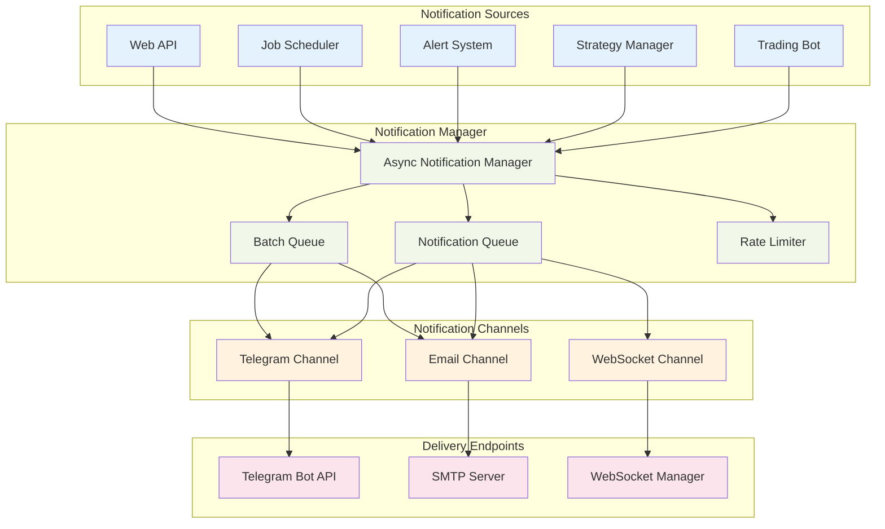

# Notification Services Integration

## Overview

The Advanced Trading Framework implements a sophisticated multi-channel notification system that provides real-time communication across various channels including Telegram, Email, and WebSocket connections. The system is designed for high availability, rate limiting, batching, and intelligent routing of notifications.

## Architecture Components

### 1. Notification System Architecture


```mermaid
graph TB
    subgraph "Notification Sources"
        TradingBot[Trading Bot]
        StrategyMgr[Strategy Manager]
        AlertSystem[Alert System]
        JobScheduler[Job Scheduler]
        WebAPI[Web API]
    end

    subgraph "Notification Manager"
        NotificationMgr[Async Notification Manager]
        NotificationQueue[Notification Queue]
        BatchQueue[Batch Queue]
        RateLimiter[Rate Limiter]
    end

    subgraph "Notification Channels"
        TelegramChannel[Telegram Channel]
        EmailChannel[Email Channel]
        WebSocketChannel[WebSocket Channel]
    end

    subgraph "Delivery Endpoints"
        TelegramAPI[Telegram Bot API]
        SMTPServer[SMTP Server]
        WebSocketMgr[WebSocket Manager]
    end

    %% Notification Flow
    TradingBot --> NotificationMgr
    StrategyMgr --> NotificationMgr
    AlertSystem --> NotificationMgr
    JobScheduler --> NotificationMgr
    WebAPI --> NotificationMgr

    NotificationMgr --> NotificationQueue
    NotificationMgr --> BatchQueue
    NotificationMgr --> RateLimiter

    NotificationQueue --> TelegramChannel
    NotificationQueue --> EmailChannel
    NotificationQueue --> WebSocketChannel

    BatchQueue --> TelegramChannel
    BatchQueue --> EmailChannel

    TelegramChannel --> TelegramAPI
    EmailChannel --> SMTPServer
    WebSocketChannel --> WebSocketMgr

    %% Styling
    classDef sourceLayer fill:#e3f2fd
    classDef managerLayer fill:#f1f8e9
    classDef channelLayer fill:#fff3e0
    classDef endpointLayer fill:#fce4ec

    class TradingBot,StrategyMgr,AlertSystem,JobScheduler,WebAPI sourceLayer
    class NotificationMgr,NotificationQueue,BatchQueue,RateLimiter managerLayer
    class TelegramChannel,EmailChannel,WebSocketChannel channelLayer
    class TelegramAPI,SMTPServer,WebSocketMgr endpointLayer
```

### 2. Core Notification Components

#### 2.1 Async Notification Manager
Central orchestrator for all notification operations:

```python
class AsyncNotificationManager:
    def __init__(self,
                 telegram_token: Optional[str] = None,
                 telegram_chat_id: Optional[str] = None,
                 email_api_key: Optional[str] = None,
                 email_sender: Optional[str] = None,
                 email_receiver: Optional[str] = None,
                 batch_size: int = 10,
                 batch_timeout: float = 30.0,
                 max_queue_size: int = 1000):
        
        # Channel management
        self.channels: Dict[str, NotificationChannel] = {}
        
        # Queue management
        self.notification_queue = asyncio.Queue(maxsize=max_queue_size)
        self.batch_queue = asyncio.Queue(maxsize=max_queue_size)
        
        # Rate limiting
        self.rate_limits = {
            "telegram": {"last_sent": 0, "min_interval": 1.0},
            "email": {"last_sent": 0, "min_interval": 5.0}
        }
        
        # Statistics tracking
        self.stats = {"sent": 0, "failed": 0, "queued": 0, "batched": 0}
```

#### 2.2 Notification Channels
Abstract base class for all notification channels:

```python
class NotificationChannel:
    def __init__(self, name: str):
        self.name = name
        self.enabled = True

    async def send(self, notification: Notification) -> bool:
        raise NotImplementedError

    def is_enabled(self) -> bool:
        return self.enabled
```

### 3. Channel Implementations

#### 3.1 Telegram Channel
Handles Telegram message delivery with advanced features:

```python
class TelegramChannel(NotificationChannel):
    def __init__(self, token: str, chat_id: str):
        super().__init__("telegram")
        self.bot = Bot(token=token)
        self.chat_id = chat_id

    async def send(self, notification: Notification) -> bool:
        # Dynamic chat ID support
        target_chat_id = notification.data.get('telegram_chat_id', self.chat_id)
        
        # Attachment handling
        if notification.data and "attachments" in notification.data:
            return await self._send_with_attachments(notification, target_chat_id)
        
        # Message splitting for long messages
        return await self._send_telegram_message_with_splitting(
            chat_id=target_chat_id,
            text=notification.message,
            reply_to_message_id=notification.data.get('reply_to_message_id')
        )
```

**Key Features**:
- **Message Splitting**: Automatically splits messages longer than 4096 characters
- **Attachment Support**: Handles both file paths and byte data
- **Reply Support**: Supports replying to specific messages
- **Dynamic Chat IDs**: Can send to different chat IDs per notification
- **Error Recovery**: Graceful fallback when reply fails

#### 3.2 Email Channel
SMTP-based email delivery with attachment support:

```python
class EmailChannel(NotificationChannel):
    def __init__(self, api_key: str, sender_email: str, receiver_email: str):
        super().__init__("email")
        self.notifier = EmailNotifier()
        self.sender_email = sender_email
        self.receiver_email = receiver_email

    async def send(self, notification: Notification) -> bool:
        # Channel filtering
        channels = notification.data.get("channels") if notification.data else None
        if channels and "email" not in channels:
            return False
        
        # Attachment processing
        attachments = self._prepare_attachments(notification.data.get("attachments", {}))
        
        # HTML formatting
        html_message = notification.message.replace('\n', '<br>')
        
        # Async email sending
        await loop.run_in_executor(
            None,
            self.notifier.send_email_with_mime,
            self.receiver_email,
            notification.title,
            html_message,
            None,
            attachments
        )
```

**Key Features**:
- **MIME Attachment Support**: Handles various file types
- **HTML Formatting**: Converts plain text to HTML
- **Async Execution**: Non-blocking email sending
- **Dynamic Recipients**: Per-notification email addresses

#### 3.3 WebSocket Channel
Real-time web interface notifications:

```python
class WebSocketManager:
    def __init__(self):
        self.connections: Dict[str, WebSocketConnection] = {}
        self.user_connections: Dict[str, Set[str]] = {}
        self.strategy_subscribers: Dict[str, Set[str]] = {}
        self.system_subscribers: Set[str] = set()

    async def broadcast_notification(self, notification: Dict[str, Any]):
        message = {
            "type": "notification",
            "data": notification,
            "timestamp": datetime.now().isoformat()
        }
        await self.broadcast_to_all(message)
```

### 4. Notification Types and Routing

#### 4.1 Notification Types
```python
class NotificationType(str, Enum):
    TRADE_ENTRY = "trade_entry"
    TRADE_EXIT = "trade_exit"
    ALERT = "alert"
    ERROR = "error"
    INFO = "info"
    SYSTEM = "system"
    REPORT = "report"
```

#### 4.2 Priority Levels
```python
class NotificationPriority(str, Enum):
    LOW = "low"
    NORMAL = "normal"
    HIGH = "high"
    CRITICAL = "critical"
```

#### 4.3 Routing Logic
Notifications are routed based on:
- **Channel Preferences**: User-specified channel preferences
- **Priority Level**: Critical notifications bypass batching
- **Notification Type**: Trade notifications have different routing than reports
- **User Permissions**: Admin notifications vs user notifications

### 5. Advanced Features

#### 5.1 Batching System
Groups similar notifications to reduce noise:

```python
async def _batch_worker(self):
    batch: List[Notification] = []
    last_batch_time = time.time()

    while self.running:
        # Collect notifications for batching
        try:
            notification = await asyncio.wait_for(
                self.batch_queue.get(),
                timeout=0.1
            )
            batch.append(notification)
        except asyncio.TimeoutError:
            pass

        # Process batch when size or timeout reached
        current_time = time.time()
        should_process = (
            len(batch) >= self.batch_size or
            (batch and current_time - last_batch_time >= self.batch_timeout)
        )

        if should_process and batch:
            await self._process_batch(batch)
            batch = []
            last_batch_time = current_time
```

**Batching Rules**:
- Email notifications are batched by default
- Critical notifications bypass batching
- Trade notifications are sent immediately
- Batch size: 10 notifications or 30-second timeout

#### 5.2 Rate Limiting
Prevents overwhelming external services:

```python
def _check_rate_limit(self, channel_name: str) -> bool:
    if channel_name not in self.rate_limits:
        return True

    limit = self.rate_limits[channel_name]
    current_time = time.time()

    if current_time - limit["last_sent"] < limit["min_interval"]:
        return False

    limit["last_sent"] = current_time
    return True
```

**Rate Limits**:
- Telegram: 1 message per second
- Email: 1 email per 5 seconds
- WebSocket: No rate limiting (internal)

#### 5.3 Retry Mechanism
Handles failed deliveries with exponential backoff:

```python
async def _handle_failed_notification(self, notification: Notification):
    if notification.retry_count < notification.max_retries:
        notification.retry_count += 1
        # Exponential backoff
        delay = 2 ** notification.retry_count
        await asyncio.sleep(delay)

        # Re-queue for retry
        try:
            await self.notification_queue.put(notification)
        except asyncio.QueueFull:
            _logger.error("Queue full, cannot retry notification")
    else:
        _logger.error("Notification failed after %s retries", notification.max_retries)
```

### 6. Integration Points

#### 6.1 Trading Bot Integration
Trading bots send notifications for:
- **Trade Entries**: Buy/sell order executions
- **Trade Exits**: Position closures with P&L
- **Strategy Events**: Strategy start/stop/error events
- **Performance Alerts**: Drawdown, profit targets, etc.

```python
# Example trading bot notification
await notification_manager.send_trade_notification(
    symbol="BTCUSDT",
    side="BUY",
    price=65000.0,
    quantity=0.1,
    pnl=2.5,
    exit_type="TP"
)
```

#### 6.2 Web API Integration
Web interface sends notifications for:
- **User Actions**: Strategy creation, updates, deletions
- **System Events**: System status changes
- **Admin Actions**: User management, system configuration

```python
# Example web API notification
await notification_manager.send_notification(
    notification_type=NotificationType.INFO,
    title="Strategy Created",
    message=f"Strategy '{strategy_name}' created successfully",
    channels=["telegram", "websocket"],
    telegram_chat_id=user_telegram_id
)
```

#### 6.3 Job Scheduler Integration
Scheduled jobs send notifications for:
- **Report Generation**: Completed reports with attachments
- **Screener Results**: Stock screening results
- **System Maintenance**: Backup completion, cleanup results

```python
# Example scheduled job notification
await notification_manager.send_notification(
    notification_type=NotificationType.REPORT,
    title="Daily Report Generated",
    message="Your daily trading report is ready",
    attachments={"report.pdf": report_bytes},
    channels=["email", "telegram"],
    email_receiver=user_email
)
```

#### 6.4 Alert System Integration
Smart alert system integration:

```python
class SmartAlertSystem:
    async def _send_alert_notifications(self, alert: Alert, rule: AlertRule):
        for channel in rule.channels:
            if channel == AlertChannel.TELEGRAM:
                await self.notification_manager.send_notification(
                    notification_type=NotificationType.ALERT,
                    title=f"Trading Alert: {alert.rule_name}",
                    message=alert.message,
                    priority=NotificationPriority.HIGH,
                    channels=["telegram"]
                )
```

### 7. Template System

#### 7.1 Message Templates
Standardized message formats for different notification types:

```python
NOTIFICATION_TEMPLATES = {
    "trade_entry": "🟢 {side} {symbol}\n💰 Price: ${price:,.2f}\n📊 Quantity: {quantity}\n⏰ {timestamp}",
    "trade_exit": "🔴 {side} {symbol}\n💰 Price: ${price:,.2f}\n📊 P&L: {pnl:+.2f}%\n🎯 Exit: {exit_type}\n⏰ {timestamp}",
    "alert": "⚠️ {alert_type}\n📝 {message}\n⏰ {timestamp}",
    "error": "🚨 ERROR\n📝 {error_message}\n🔧 Source: {source}\n⏰ {timestamp}",
    "report": "📊 {report_type} Report\n📝 {summary}\n📎 Attachments: {attachment_count}\n⏰ {timestamp}"
}
```

#### 7.2 Customization Options
Users can customize:
- **Message Formats**: Custom templates per notification type
- **Channel Preferences**: Which channels to use for different notifications
- **Timing Preferences**: Quiet hours, batching preferences
- **Content Filters**: Filter out certain types of notifications

### 8. Monitoring and Analytics

#### 8.1 Notification Statistics
Track notification system performance:

```python
def get_stats(self) -> Dict[str, Any]:
    return {
        "sent": self.stats["sent"],
        "failed": self.stats["failed"],
        "queued": self.stats["queued"],
        "batched": self.stats["batched"],
        "queue_size": self.notification_queue.qsize(),
        "batch_queue_size": self.batch_queue.qsize(),
        "enabled_channels": [
            name for name, channel in self.channels.items() 
            if channel.is_enabled()
        ]
    }
```

#### 8.2 Health Monitoring
Monitor notification system health:
- **Queue Depths**: Alert when queues grow too large
- **Delivery Rates**: Track successful delivery percentages
- **Channel Status**: Monitor individual channel health
- **Response Times**: Track notification delivery times

#### 8.3 Performance Metrics
Key performance indicators:
- **Throughput**: Notifications per minute
- **Latency**: Time from creation to delivery
- **Success Rate**: Percentage of successful deliveries
- **Channel Utilization**: Usage distribution across channels

### 9. Configuration Management

#### 9.1 Channel Configuration
```python
NOTIFICATION_CONFIG = {
    "telegram": {
        "enabled": True,
        "token": "BOT_TOKEN",
        "default_chat_id": "CHAT_ID",
        "rate_limit": 1.0,
        "retry_attempts": 3
    },
    "email": {
        "enabled": True,
        "smtp_server": "smtp.gmail.com",
        "smtp_port": 587,
        "sender_email": "bot@example.com",
        "rate_limit": 5.0,
        "retry_attempts": 2
    },
    "websocket": {
        "enabled": True,
        "broadcast_system_events": True,
        "user_specific_routing": True
    }
}
```

#### 9.2 User Preferences
Per-user notification settings:
```python
USER_NOTIFICATION_PREFERENCES = {
    "channels": ["telegram", "email"],
    "quiet_hours": {"start": "22:00", "end": "08:00"},
    "notification_types": {
        "trade_entry": ["telegram"],
        "trade_exit": ["telegram", "email"],
        "alerts": ["telegram", "email"],
        "reports": ["email"]
    },
    "batching": {
        "enabled": True,
        "batch_size": 5,
        "timeout": 30
    }
}
```

### 10. Security Considerations

#### 10.1 Authentication
- **API Keys**: Secure storage of Telegram bot tokens and email credentials
- **User Verification**: Telegram user verification before sending notifications
- **Permission Checks**: Ensure users can only receive their own notifications

#### 10.2 Data Protection
- **Message Encryption**: Sensitive data encrypted in transit
- **PII Handling**: Careful handling of personally identifiable information
- **Audit Logging**: Log all notification activities for compliance

#### 10.3 Rate Limiting Protection
- **Anti-Spam**: Prevent notification spam attacks
- **Resource Protection**: Protect external services from overload
- **User Limits**: Per-user notification limits

### 11. Error Handling and Recovery

#### 11.1 Graceful Degradation
- **Channel Fallback**: Fall back to alternative channels when primary fails
- **Partial Delivery**: Continue with successful channels even if some fail
- **Service Recovery**: Automatic recovery when services come back online

#### 11.2 Error Classification
- **Temporary Errors**: Network issues, rate limiting (retry)
- **Permanent Errors**: Invalid tokens, blocked users (don't retry)
- **Configuration Errors**: Missing settings, invalid formats (alert admin)

#### 11.3 Recovery Strategies
- **Exponential Backoff**: Increasing delays between retries
- **Circuit Breaker**: Temporarily disable failing channels
- **Dead Letter Queue**: Store permanently failed notifications for analysis

This comprehensive notification system provides reliable, scalable, and feature-rich communication capabilities across multiple channels, ensuring that users stay informed about their trading activities and system events in real-time.