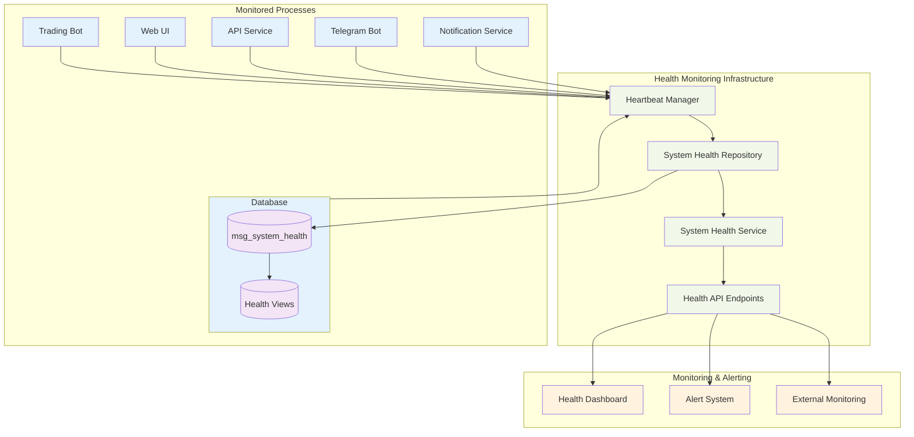
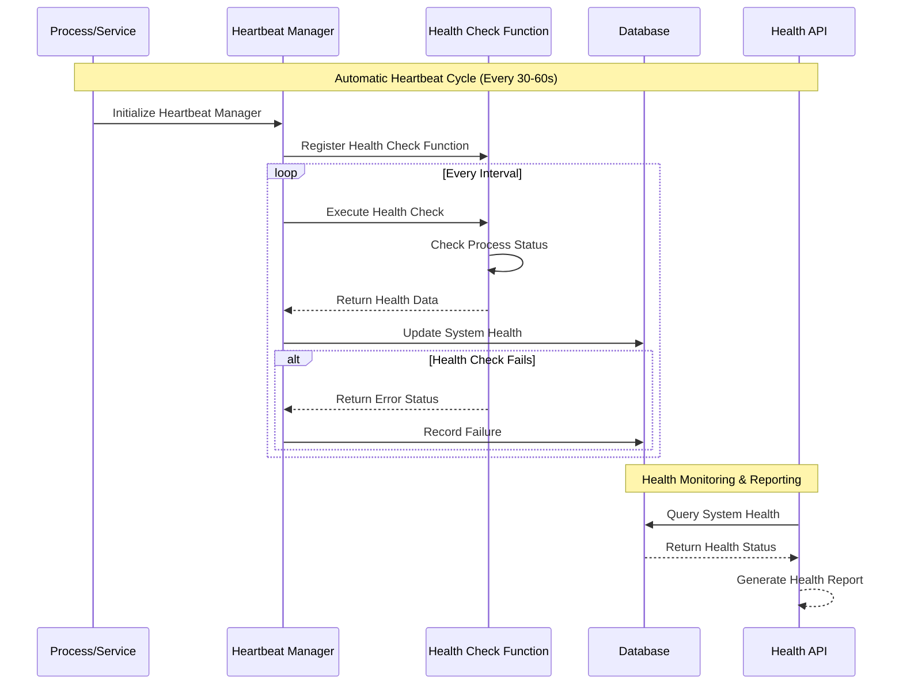

# System Health Monitoring Architecture

## Overview

The Advanced Trading Framework implements a comprehensive health monitoring system that provides real-time visibility into the status of all subsystems and components. The system evolved from simple notification channel monitoring to a unified platform-wide health monitoring solution that tracks the health of all processes, services, and components.

## Architecture Evolution

### Legacy System
Previously, the system only monitored notification channels using a dedicated `msg_channel_health` table, providing limited visibility into overall system health.

### Current System
A unified health monitoring system tracks all subsystems including notification channels, telegram bot, API services, web UI, trading bots, and system resources using a comprehensive `msg_system_health` table with automatic heartbeat reporting.

## System Architecture

### 1. Health Monitoring Components



### 2. Heartbeat System Architecture



## Database Schema

### System Health Table Structure

The `msg_system_health` table provides comprehensive health tracking:

```sql
CREATE TABLE msg_system_health (
    id BIGSERIAL PRIMARY KEY,
    system VARCHAR(50) NOT NULL,              -- System name (notification, telegram_bot, etc.)
    component VARCHAR(100),                   -- Component name (email, slack, etc.) - optional
    status VARCHAR(20) NOT NULL,              -- HEALTHY, DEGRADED, DOWN, UNKNOWN
    last_success TIMESTAMPTZ,                 -- Last successful health check
    last_failure TIMESTAMPTZ,                -- Last failed health check
    failure_count INTEGER NOT NULL DEFAULT 0, -- Consecutive failure count
    avg_response_time_ms INTEGER,             -- Average response time
    error_message TEXT,                       -- Error details
    metadata TEXT,                            -- JSON metadata
    checked_at TIMESTAMPTZ NOT NULL DEFAULT NOW(), -- Last check timestamp
    
    CONSTRAINT check_system_health_status 
        CHECK (status IN ('HEALTHY', 'DEGRADED', 'DOWN', 'UNKNOWN')),
    CONSTRAINT check_failure_count_positive 
        CHECK (failure_count >= 0),
    CONSTRAINT check_avg_response_time_positive 
        CHECK (avg_response_time_ms >= 0)
);

-- Indexes for performance
CREATE INDEX idx_system_health_system ON msg_system_health(system);
CREATE INDEX idx_system_health_status ON msg_system_health(status);
CREATE INDEX idx_system_health_checked_at ON msg_system_health(checked_at);
CREATE UNIQUE INDEX idx_system_health_unique 
    ON msg_system_health (system, COALESCE(component, ''));
```

### Health Monitoring Views

```sql
-- System overview with aggregated statistics
CREATE OR REPLACE VIEW v_system_overview AS
SELECT
    system,
    COUNT(*) as total_components,
    COUNT(CASE WHEN status = 'HEALTHY' THEN 1 END) as healthy_components,
    COUNT(CASE WHEN status = 'DEGRADED' THEN 1 END) as degraded_components,
    COUNT(CASE WHEN status = 'DOWN' THEN 1 END) as down_components,
    CASE
        WHEN COUNT(CASE WHEN status = 'DOWN' THEN 1 END) > 0 THEN 'DOWN'
        WHEN COUNT(CASE WHEN status = 'DEGRADED' THEN 1 END) > 0 THEN 'DEGRADED'
        WHEN COUNT(CASE WHEN status = 'HEALTHY' THEN 1 END) = COUNT(*) THEN 'HEALTHY'
        ELSE 'UNKNOWN'
    END as overall_status,
    AVG(avg_response_time_ms) as avg_response_time_ms,
    MAX(checked_at) as last_checked
FROM msg_system_health
GROUP BY system;

-- Detailed system health summary
CREATE OR REPLACE VIEW v_system_health_summary AS
SELECT
    sh.system,
    sh.component,
    sh.status,
    sh.failure_count,
    sh.avg_response_time_ms,
    sh.last_success,
    sh.last_failure,
    sh.checked_at,
    sh.error_message,
    CASE 
        WHEN sh.last_failure IS NULL THEN 0
        WHEN sh.last_success IS NULL THEN 100
        WHEN sh.last_failure > sh.last_success THEN 
            LEAST(100, (sh.failure_count * 10))
        ELSE 0
    END as recent_failure_rate,
    CASE
        WHEN sh.checked_at < NOW() - INTERVAL '5 minutes' THEN 'STALE'
        ELSE 'CURRENT'
    END as data_freshness
FROM msg_system_health sh
ORDER BY 
    CASE sh.status 
        WHEN 'DOWN' THEN 1 
        WHEN 'DEGRADED' THEN 2 
        WHEN 'HEALTHY' THEN 3 
        ELSE 4 
    END,
    sh.system, sh.component;
```

## Monitored Systems

### 1. Notification Service Health

**System**: `notification`  
**Components**: `email`, `telegram`, `sms`, `slack`, `discord`

**Health Checks**:
- Main service: Message processor status, database connectivity
- Email channel: SMTP server connectivity, authentication
- Telegram channel: Bot API connectivity, token validation
- SMS channel: Provider API connectivity, credit balance
- Slack channel: Webhook connectivity, workspace access
- Discord channel: Bot connectivity, server permissions

**Health Check Function Example**:
```python
def notification_health_check():
    try:
        if message_processor and message_processor.is_running:
            return {
                'status': 'HEALTHY',
                'metadata': {
                    'service': config.service_name,
                    'version': config.version,
                    'message_processor_running': True
                }
            }
        else:
            return {
                'status': 'DOWN',
                'error_message': 'Message processor not running'
            }
    except Exception as e:
        return {
            'status': 'DOWN',
            'error_message': f'Health check failed: {str(e)}'
        }
```

### 2. Telegram Bot Health

**System**: `telegram_bot`  
**Components**: None (single component system)

**Health Checks**:
- Bot initialization status
- Telegram API connectivity
- Bot token validation
- Notification service client connectivity
- Command processing capability

**Status Logic**:
- `HEALTHY`: Bot fully operational with all dependencies
- `DEGRADED`: Bot operational but notification client unavailable
- `DOWN`: Bot not initialized or API connectivity failed

### 3. API Service Health

**System**: `api_service`  
**Components**: None (single component system)

**Health Checks**:
- Strategy service initialization
- Monitoring service status
- Trading system availability
- Database connectivity
- WebSocket connections

**Status Logic**:
- `HEALTHY`: All services operational and trading system available
- `DEGRADED`: Core services operational but trading system unavailable
- `DOWN`: Core services failed to initialize

### 4. Web UI Health

**System**: `web_ui`  
**Components**: None (single component system)

**Health Checks**:
- Backend process status
- Frontend process status (development mode)
- Static file serving (production mode)
- API connectivity

**Status Logic**:
- `HEALTHY`: Both backend and frontend operational
- `DEGRADED`: Backend operational but frontend issues
- `DOWN`: Backend not running

### 5. Trading Bot Health

**System**: `trading_bot`  
**Components**: None (single component system)

**Health Checks**:
- Bot running status
- Configuration validation
- Broker connectivity
- Strategy execution status
- Risk management system

**Status Logic**:
- `HEALTHY`: Bot running and executing strategies
- `DEGRADED`: Bot running but with warnings or limited functionality
- `DOWN`: Bot stopped or connection lost

### 6. Database Health

**System**: `database`  
**Components**: None (single component system)

**Health Checks**:
- Connection pool status
- Query response time
- Database connectivity
- Transaction processing

**Metadata Includes**:
- Query response time
- Connection pool size
- Active connections
- Database version

## Health Monitoring APIs

### Core Health Endpoints

#### Overall Platform Health
```http
GET /api/v1/health
```

**Response**:
```json
{
    "overall_status": "HEALTHY",
    "timestamp": "2025-10-22T17:30:00Z",
    "service": "notification-service",
    "version": "1.0.0",
    "systems_overview": [...],
    "statistics": {
        "total_systems": 12,
        "healthy_systems": 10,
        "degraded_systems": 1,
        "down_systems": 1,
        "unknown_systems": 0
    }
}
```

#### All Systems Health
```http
GET /api/v1/health/systems
```

**Response**:
```json
{
    "overview": {...},
    "systems": [
        {
            "system": "notification",
            "component": null,
            "status": "HEALTHY",
            "last_success": "2025-10-22T17:29:30Z",
            "avg_response_time_ms": 150,
            "metadata": {...}
        },
        {
            "system": "notification",
            "component": "email",
            "status": "HEALTHY",
            "last_success": "2025-10-22T17:29:00Z",
            "avg_response_time_ms": 200,
            "metadata": {...}
        }
    ],
    "timestamp": "2025-10-22T17:30:00Z"
}
```

#### Specific System Health
```http
GET /api/v1/health/system/{system_name}?component={component_name}
```

#### Unhealthy Systems
```http
GET /api/v1/health/unhealthy
```

### Backward Compatibility Endpoints

#### Notification Channels Health
```http
GET /api/v1/channels/health
```

**Response**:
```json
{
    "channels": [
        {
            "channel": "email",
            "status": "HEALTHY",
            "last_success": "2025-10-22T17:29:00Z",
            "failure_count": 0,
            "avg_response_time_ms": 200,
            "error_message": null,
            "checked_at": "2025-10-22T17:30:00Z"
        }
    ],
    "timestamp": "2025-10-22T17:30:00Z"
}
```

#### Specific Channel Health
```http
GET /api/v1/channels/{channel_name}/health
```

### Health Management Endpoints

#### Update System Health
```http
POST /api/v1/health/system/{system_name}
Content-Type: application/json

{
    "status": "DEGRADED",
    "error_message": "High response time detected",
    "response_time_ms": 800,
    "metadata": {
        "custom_field": "value"
    }
}
```

#### Update Channel Health
```http
POST /api/v1/channels/{channel_name}/health
Content-Type: application/json

{
    "status": "DOWN",
    "error_message": "SMTP server unreachable"
}
```

#### Cleanup Stale Records
```http
POST /api/v1/health/cleanup?stale_threshold_hours=24
```

## Heartbeat Implementation

### Heartbeat Manager

The `HeartbeatManager` class provides automatic health reporting for each process:

```python
from src.common.heartbeat_manager import HeartbeatManager

# Initialize heartbeat manager
heartbeat_manager = HeartbeatManager(
    system='telegram_bot',
    interval_seconds=30
)

# Set custom health check function
def telegram_bot_health_check():
    # Implement health check logic
    return {
        'status': 'HEALTHY',
        'metadata': {...}
    }

heartbeat_manager.set_health_check_function(telegram_bot_health_check)
heartbeat_manager.start_heartbeat()
```

### Process Heartbeat Manager

For processes with multiple components (like notification service):

```python
from src.common.heartbeat_manager import ProcessHeartbeatManager

# Initialize process manager
process_manager = ProcessHeartbeatManager('notification')

# Add main service heartbeat
main_heartbeat = process_manager.add_main_heartbeat(
    interval_seconds=30,
    health_check_func=notification_health_check
)

# Add component heartbeats
for channel in ['email', 'telegram', 'sms']:
    process_manager.add_component_heartbeat(
        component=channel,
        interval_seconds=60,
        health_check_func=create_channel_health_check(channel)
    )

# Start all heartbeats
process_manager.start_all_heartbeats()
```

### Health Check Function Interface

All health check functions must return a dictionary with:

```python
{
    'status': 'HEALTHY' | 'DEGRADED' | 'DOWN' | 'UNKNOWN',
    'response_time_ms': Optional[int],
    'error_message': Optional[str],
    'metadata': Optional[Dict[str, Any]]
}
```

## Monitoring and Alerting

### Real-time Monitoring

**Health Dashboard Features**:
- Real-time system status overview
- Individual component health details
- Historical health trends
- Response time monitoring
- Failure rate analytics

**Key Metrics**:
- Overall platform health status
- System availability percentages
- Average response times
- Failure counts and patterns
- Recovery time statistics

### Alerting System

**Alert Triggers**:
- System status changes to DOWN or DEGRADED
- Consecutive failures exceed threshold
- Response times exceed acceptable limits
- Stale heartbeat data detected

**Alert Channels**:
- Email notifications
- Slack/Discord messages
- Telegram alerts
- WebSocket real-time updates
- External monitoring system webhooks

**Alert Example**:
```json
{
    "alert_type": "SYSTEM_DOWN",
    "system": "trading_bot",
    "component": null,
    "status": "DOWN",
    "error_message": "Connection lost to broker",
    "timestamp": "2025-10-22T17:30:00Z",
    "metadata": {
        "failure_count": 3,
        "last_success": "2025-10-22T17:25:00Z"
    }
}
```

### External Monitoring Integration

**Prometheus Metrics**:
```prometheus
# System health status (0=DOWN, 1=DEGRADED, 2=HEALTHY)
system_health_status{system="notification", component="email"} 2

# Response time metrics
system_response_time_ms{system="api_service"} 150

# Failure count metrics
system_failure_count{system="telegram_bot"} 0
```

**Grafana Dashboard**:
- System health overview panel
- Response time trends
- Failure rate charts
- Availability heatmaps
- Alert history

## Migration from Channel Health

### Database Migration

The system migrated from `msg_channel_health` to `msg_system_health`:

```sql
-- 1. Rename existing table
ALTER TABLE msg_channel_health RENAME TO msg_system_health;

-- 2. Add new columns
ALTER TABLE msg_system_health ADD COLUMN system VARCHAR(50);
ALTER TABLE msg_system_health ADD COLUMN metadata TEXT;

-- 3. Rename channel column to component
ALTER TABLE msg_system_health RENAME COLUMN channel TO component;

-- 4. Update existing data
UPDATE msg_system_health SET system = 'notification';

-- 5. Add constraints and indexes
ALTER TABLE msg_system_health ALTER COLUMN system SET NOT NULL;
ALTER TABLE msg_system_health DROP CONSTRAINT check_channel_health_status;
ALTER TABLE msg_system_health ADD CONSTRAINT check_system_health_status 
    CHECK (status IN ('HEALTHY', 'DEGRADED', 'DOWN', 'UNKNOWN'));

CREATE INDEX idx_system_health_system ON msg_system_health(system);
CREATE UNIQUE INDEX idx_system_health_unique 
    ON msg_system_health (system, COALESCE(component, ''));
```

### Backward Compatibility

The system maintains full backward compatibility:

- **API Endpoints**: Original `/api/v1/channels/health` endpoints continue to work
- **Data Structure**: Channel health data is preserved as notification system components
- **Functionality**: All existing channel monitoring features remain available
- **Migration Path**: Gradual migration with no service interruption

## Performance and Scalability

### Performance Characteristics

**Heartbeat Overhead**:
- Single database write every 30-60 seconds per process
- Minimal CPU usage (separate thread)
- Low memory footprint
- No impact on main process performance

**Database Impact**:
- Lightweight table structure
- Optimized indexes for query performance
- Automatic cleanup of stale records
- Efficient aggregation queries

**Scalability**:
- Supports unlimited number of systems and components
- Horizontal scaling through database partitioning
- Efficient querying with proper indexing
- Minimal network overhead

### Optimization Features

**Automatic Cleanup**:
```python
# Clean up records older than 24 hours
health_service.cleanup_stale_records(stale_threshold_hours=24)
```

**Batch Operations**:
- Heartbeat updates are batched for efficiency
- Bulk health status queries
- Optimized view queries for dashboards

**Caching**:
- Health status caching for high-frequency queries
- Dashboard data caching
- API response caching

## Best Practices

### Health Check Implementation

**Do's**:
- Keep health checks lightweight and fast
- Include meaningful metadata
- Use appropriate status levels
- Handle exceptions gracefully
- Test connectivity to external dependencies

**Don'ts**:
- Avoid heavy computations in health checks
- Don't include sensitive information in metadata
- Avoid blocking operations
- Don't ignore health check failures

### Monitoring Strategy

**Proactive Monitoring**:
- Set up alerts for all critical systems
- Monitor trends, not just current status
- Use multiple alert channels for redundancy
- Implement escalation procedures

**Response Procedures**:
- Define clear response procedures for each alert type
- Automate recovery where possible
- Document troubleshooting steps
- Maintain runbooks for common issues

### System Design

**Resilience**:
- Design systems to gracefully handle health check failures
- Implement circuit breakers for external dependencies
- Use health checks to trigger automatic recovery
- Plan for partial system degradation

**Observability**:
- Include comprehensive metadata in health reports
- Log health check results for debugging
- Correlate health data with application logs
- Use distributed tracing for complex systems

## Future Enhancements

### Planned Features

**Advanced Analytics**:
- Predictive health monitoring using ML
- Anomaly detection for unusual patterns
- Capacity planning based on health trends
- Performance optimization recommendations

**Enhanced Alerting**:
- Smart alert grouping and deduplication
- Context-aware alert routing
- Integration with incident management systems
- Automated escalation procedures

**Distributed Monitoring**:
- Multi-region health monitoring
- Cross-service dependency tracking
- Distributed system health correlation
- Global health status aggregation

**Self-Healing Systems**:
- Automatic recovery procedures
- Health-based auto-scaling
- Intelligent failover mechanisms
- Predictive maintenance scheduling

---

**Document Version**: 1.0.0  
**Last Updated**: October 22, 2025  
**Related Documents**: 
- [Notification Services](notification-services.md)
- [Database Architecture](database-architecture.md)
- [Background Services](background-services.md)