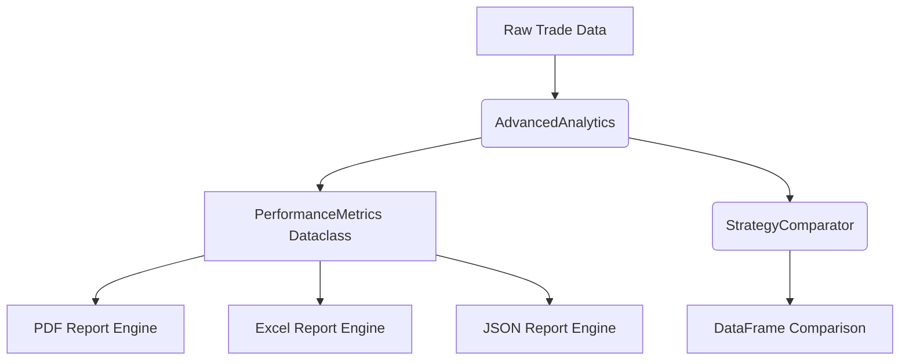

# Design

## Purpose
The `analytics` module provides mathematical models and calculation engines to process backtest results and strategy trade executions. It helps developers and traders analyze strategy quality, returns risk, and consistency.

## Architecture
The module is self-contained and exposes two main classes:
1. `AdvancedAnalytics` - Wraps a list of trade objects, calculates statistics, and generates multi-format reports.
2. `StrategyComparator` - Standardizes metrics across different strategy instances to construct comparative matrices.

### High-Level Architecture

### Component Design
- **Metric Computation**: Built on top of standard numpy operations, with built-in protections against division-by-zero or empty data sets.
- **Reporting**: ReportLab flowables compose the PDF representation. OpenPyXL applies grid fills and header styling for the Excel spreadsheets.

## Data Flow
- Input: List of dictionaries matching the `Trade` model structure.
- Output: Standard python types, `PerformanceMetrics` dataclass, Pandas `DataFrame`, or physical files (PDF, XLSX, JSON).

## Design Decisions
- **Lazy Evaluation**: Metrics are computed on demand when requested or during report compilation.
- **Type Safety**: Avoids returning numpy type wrappers (like `numpy.float64` or `numpy.timedelta64`) to the outer application layers by casting all metrics directly to Python primitives.
