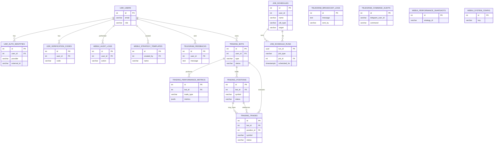

# PostgreSQL Schema — `public` (converted to Markdown)

This document is a Markdown conversion of the provided SQL DDL. It includes schema creation, sequences, tables, indexes, constraints, comments and functions. SQL blocks are preserved for easy copy/paste.

---

## Schema

```sql
-- DROP SCHEMA public;

CREATE SCHEMA public AUTHORIZATION pg_database_owner;

COMMENT ON SCHEMA public IS 'standard public schema';
```

---

## Sequences

```sql
-- DROP SEQUENCE public.job_schedules_id_seq;

CREATE SEQUENCE public.job_schedules_id_seq
    INCREMENT BY 1
    MINVALUE 1
    MAXVALUE 2147483647
    START 1
    CACHE 1
    NO CYCLE;

-- DROP SEQUENCE public.telegram_broadcast_logs_id_seq1;

CREATE SEQUENCE public.telegram_broadcast_logs_id_seq1
    INCREMENT BY 1
    MINVALUE 1
    MAXVALUE 2147483647
    START 1
    CACHE 1
    NO CYCLE;

-- DROP SEQUENCE public.telegram_command_audits_id_seq1;

CREATE SEQUENCE public.telegram_command_audits_id_seq1
    INCREMENT BY 1
    MINVALUE 1
    MAXVALUE 2147483647
    START 1
    CACHE 1
    NO CYCLE;

-- DROP SEQUENCE public.telegram_feedbacks_id_seq1;

CREATE SEQUENCE public.telegram_feedbacks_id_seq1
    INCREMENT BY 1
    MINVALUE 1
    MAXVALUE 2147483647
    START 1
    CACHE 1
    NO CYCLE;

-- DROP SEQUENCE public.trading_bots_id_seq;

CREATE SEQUENCE public.trading_bots_id_seq
    INCREMENT BY 1
    MINVALUE 1
    MAXVALUE 2147483647
    START 1
    CACHE 1
    NO CYCLE;

-- DROP SEQUENCE public.trading_performance_metrics_id_seq;

CREATE SEQUENCE public.trading_performance_metrics_id_seq
    INCREMENT BY 1
    MINVALUE 1
    MAXVALUE 2147483647
    START 1
    CACHE 1
    NO CYCLE;

-- DROP SEQUENCE public.trading_positions_id_seq;

CREATE SEQUENCE public.trading_positions_id_seq
    INCREMENT BY 1
    MINVALUE 1
    MAXVALUE 2147483647
    START 1
    CACHE 1
    NO CYCLE;

-- DROP SEQUENCE public.trading_trades_id_seq;

CREATE SEQUENCE public.trading_trades_id_seq
    INCREMENT BY 1
    MINVALUE 1
    MAXVALUE 2147483647
    START 1
    CACHE 1
    NO CYCLE;

-- DROP SEQUENCE public.usr_auth_identities_id_seq;

CREATE SEQUENCE public.usr_auth_identities_id_seq
    INCREMENT BY 1
    MINVALUE 1
    MAXVALUE 2147483647
    START 1
    CACHE 1
    NO CYCLE;

-- DROP SEQUENCE public.usr_users_id_seq;

CREATE SEQUENCE public.usr_users_id_seq
    INCREMENT BY 1
    MINVALUE 1
    MAXVALUE 2147483647
    START 1
    CACHE 1
    NO CYCLE;

-- DROP SEQUENCE public.usr_verification_codes_id_seq;

CREATE SEQUENCE public.usr_verification_codes_id_seq
    INCREMENT BY 1
    MINVALUE 1
    MAXVALUE 2147483647
    START 1
    CACHE 1
    NO CYCLE;

-- DROP SEQUENCE public.webui_audit_logs_id_seq1;

CREATE SEQUENCE public.webui_audit_logs_id_seq1
    INCREMENT BY 1
    MINVALUE 1
    MAXVALUE 2147483647
    START 1
    CACHE 1
    NO CYCLE;

-- DROP SEQUENCE public.webui_performance_snapshots_id_seq1;

CREATE SEQUENCE public.webui_performance_snapshots_id_seq1
    INCREMENT BY 1
    MINVALUE 1
    MAXVALUE 2147483647
    START 1
    CACHE 1
    NO CYCLE;

-- DROP SEQUENCE public.webui_strategy_templates_id_seq1;

CREATE SEQUENCE public.webui_strategy_templates_id_seq1
    INCREMENT BY 1
    MINVALUE 1
    MAXVALUE 2147483647
    START 1
    CACHE 1
    NO CYCLE;

-- DROP SEQUENCE public.webui_system_config_id_seq1;

CREATE SEQUENCE public.webui_system_config_id_seq1
    INCREMENT BY 1
    MINVALUE 1
    MAXVALUE 2147483647
    START 1
    CACHE 1
    NO CYCLE;
```

---

## Tables

### `job_schedules`

```sql
-- public.job_schedules definition

-- Drop table

-- DROP TABLE public.job_schedules;

CREATE TABLE public.job_schedules (
  id int4 GENERATED ALWAYS AS IDENTITY(
    INCREMENT BY 1 MINVALUE 1 MAXVALUE 2147483647 START 1 CACHE 1 NO CYCLE
  ) NOT NULL,
  user_id int4 NOT NULL,
  "name" varchar(255) NOT NULL,
  job_type varchar(50) NOT NULL,
  "target" varchar(255) NOT NULL,
  task_params jsonb DEFAULT '{}'::jsonb NOT NULL,
  cron varchar(100) NOT NULL,
  enabled bool DEFAULT true NOT NULL,
  next_run_at timestamptz NULL,
  created_at timestamptz DEFAULT now() NOT NULL,
  updated_at timestamptz DEFAULT now() NOT NULL,
  CONSTRAINT job_schedules_pkey PRIMARY KEY (id)
);
```

---

### `telegram_broadcast_logs`

```sql
-- public.telegram_broadcast_logs definition

-- Drop table

-- DROP TABLE public.telegram_broadcast_logs;

CREATE TABLE public.telegram_broadcast_logs (
  id int4 GENERATED ALWAYS AS IDENTITY(
    INCREMENT BY 1 MINVALUE 1 MAXVALUE 2147483647 START 1 CACHE 1 NO CYCLE
  ) NOT NULL,
  message text NOT NULL,
  sent_by varchar(255) NOT NULL,
  success_count int4 NULL,
  total_count int4 NULL,
  created_at timestamptz DEFAULT now() NULL,
  CONSTRAINT telegram_broadcast_logs_pkey PRIMARY KEY (id)
);
```

---

### `telegram_command_audits`

```sql
-- public.telegram_command_audits definition

-- Drop table

-- DROP TABLE public.telegram_command_audits;

CREATE TABLE public.telegram_command_audits (
  id int4 GENERATED ALWAYS AS IDENTITY(
    INCREMENT BY 1 MINVALUE 1 MAXVALUE 2147483647 START 1 CACHE 1 NO CYCLE
  ) NOT NULL,
  telegram_user_id varchar(255) NOT NULL,
  command varchar(255) NOT NULL,
  full_message text NULL,
  is_registered_user bool NULL,
  user_email varchar(255) NULL,
  success bool NULL,
  error_message text NULL,
  response_time_ms int4 NULL,
  created_at timestamptz DEFAULT now() NULL,
  CONSTRAINT telegram_command_audits_pkey PRIMARY KEY (id)
);
CREATE INDEX ix_telegram_command_audits_command ON public.telegram_command_audits USING btree (command);
CREATE INDEX ix_telegram_command_audits_created ON public.telegram_command_audits USING btree (created_at);
CREATE INDEX ix_telegram_command_audits_success ON public.telegram_command_audits USING btree (success);
CREATE INDEX ix_telegram_command_audits_telegram_user_id ON public.telegram_command_audits USING btree (telegram_user_id);
```

---

### `telegram_settings`

```sql
-- public.telegram_settings definition

-- Drop table

-- DROP TABLE public.telegram_settings;

CREATE TABLE public.telegram_settings (
  "key" varchar(100) NOT NULL,
  value text NULL,
  CONSTRAINT telegram_settings_pkey PRIMARY KEY ("key")
);
```

---

### `usr_users`

```sql
-- public.usr_users definition

-- Drop table

-- DROP TABLE public.usr_users;

CREATE TABLE public.usr_users (
  id int4 GENERATED ALWAYS AS IDENTITY(
    INCREMENT BY 1 MINVALUE 1 MAXVALUE 2147483647 START 1 CACHE 1 NO CYCLE
  ) NOT NULL,
  email varchar(100) NULL,
  "role" varchar(20) DEFAULT 'trader'::character varying NOT NULL,
  is_active bool DEFAULT true NULL,
  created_at timestamptz DEFAULT now() NULL,
  updated_at timestamp NULL,
  last_login timestamp NULL,
  CONSTRAINT users_pkey PRIMARY KEY (id)
);
CREATE INDEX ix_users_email ON public.usr_users USING btree (email);
COMMENT ON TABLE public.usr_users IS 'User accounts and authentication';
```

---

### `webui_performance_snapshots`

```sql
-- public.webui_performance_snapshots definition

-- Drop table

-- DROP TABLE public.webui_performance_snapshots;

CREATE TABLE public.webui_performance_snapshots (
  id int4 GENERATED ALWAYS AS IDENTITY(
    INCREMENT BY 1 MINVALUE 1 MAXVALUE 2147483647 START 1 CACHE 1 NO CYCLE
  ) NOT NULL,
  strategy_id varchar(100) NOT NULL,
  "timestamp" timestamptz DEFAULT now() NULL,
  pnl jsonb NOT NULL,
  positions jsonb NULL,
  trades_count int4 DEFAULT 0 NULL,
  win_rate jsonb NULL,
  drawdown jsonb NULL,
  metrics jsonb NULL,
  CONSTRAINT webui_performance_snapshots_pkey PRIMARY KEY (id)
);
CREATE INDEX ix_webui_performance_snapshots_strategy_id ON public.webui_performance_snapshots USING btree (strategy_id);
```

---

### `webui_system_config`

```sql
-- public.webui_system_config definition

-- Drop table

-- DROP TABLE public.webui_system_config;

CREATE TABLE public.webui_system_config (
  id int4 GENERATED ALWAYS AS IDENTITY(
    INCREMENT BY 1 MINVALUE 1 MAXVALUE 2147483647 START 1 CACHE 1 NO CYCLE
  ) NOT NULL,
  "key" varchar(100) NOT NULL,
  value jsonb NOT NULL,
  description text NULL,
  created_at timestamptz DEFAULT now() NULL,
  updated_at timestamp NULL,
  CONSTRAINT webui_system_config_pkey PRIMARY KEY (id)
);
```

---

### `job_schedule_runs`

```sql
-- public.job_schedule_runs definition

-- Drop table

-- DROP TABLE public.job_schedule_runs;

CREATE TABLE public.job_schedule_runs (
  id int4 GENERATED ALWAYS AS IDENTITY(
    INCREMENT BY 1 MINVALUE 1 MAXVALUE 2147483647 START 1 CACHE 1 NO CYCLE
  ) NOT NULL,
  job_type text NOT NULL,
  job_id int4 NULL,
  user_id int8 NULL,
  status text NULL,
  scheduled_for timestamptz NULL,
  enqueued_at timestamptz DEFAULT now() NULL,
  started_at timestamptz NULL,
  finished_at timestamptz NULL,
  job_snapshot jsonb NULL,
  "result" jsonb NULL,
  "error" text NULL,
  CONSTRAINT job_schedule_runs_job_id_fkey FOREIGN KEY (job_id) REFERENCES public.job_schedules(id) ON DELETE CASCADE
);
CREATE UNIQUE INDEX ux_runs_job_scheduled_for ON public.job_schedule_runs USING btree (job_type, job_id, scheduled_for);
```

---

### `telegram_feedbacks`

```sql
-- public.telegram_feedbacks definition

-- Drop table

-- DROP TABLE public.telegram_feedbacks;

CREATE TABLE public.telegram_feedbacks (
  id int4 GENERATED ALWAYS AS IDENTITY(
    INCREMENT BY 1 MINVALUE 1 MAXVALUE 2147483647 START 1 CACHE 1 NO CYCLE
  ) NOT NULL,
  user_id int4 NOT NULL,
  "type" varchar(50) NULL,
  message text NULL,
  created_at timestamptz DEFAULT now() NULL,
  status varchar(20) NULL,
  CONSTRAINT telegram_feedbacks_pkey PRIMARY KEY (id),
  CONSTRAINT telegram_feedbacks_user_id_fkey FOREIGN KEY (user_id) REFERENCES public.usr_users(id) ON DELETE CASCADE
);
```

---

### `trading_bots`

```sql
-- public.trading_bots definition

-- Drop table

-- DROP TABLE public.trading_bots;

CREATE TABLE public.trading_bots (
  "type" varchar(20) NOT NULL,
  status varchar(20) NOT NULL,
  started_at timestamp NULL,
  last_heartbeat timestamp NULL,
  error_count int4 NULL,
  current_balance numeric(20, 8) NULL,
  total_pnl numeric(20, 8) NULL,
  extra_metadata jsonb NULL,
  created_at timestamptz DEFAULT now() NULL,
  updated_at timestamp NULL,
  config jsonb NOT NULL,
  user_id int4 NOT NULL,
  id int4 GENERATED ALWAYS AS IDENTITY(
    INCREMENT BY 1 MINVALUE 1 MAXVALUE 2147483647 START 1 CACHE 1 NO CYCLE
  ) NOT NULL,
  description text NULL,
  CONSTRAINT trading_bots_pk PRIMARY KEY (id),
  CONSTRAINT trading_bots_user_id_fkey FOREIGN KEY (user_id) REFERENCES public.usr_users(id) ON DELETE CASCADE
);

-- Column comments
COMMENT ON COLUMN public.trading_bots.description IS 'Trading bot description. Defined by the trader, who creates the bot.';

-- Table Triggers
create trigger update_bots_updated_at before
update
    on
    public.trading_bots for each row execute function update_updated_at_column();
```

---

### `trading_performance_metrics`

```sql
-- public.trading_performance_metrics definition

-- Drop table

-- DROP TABLE public.trading_performance_metrics;

CREATE TABLE public.trading_performance_metrics (
  bot_id int4 NOT NULL,
  trade_type varchar(10) NOT NULL,
  symbol varchar(20) NULL,
  "interval" varchar(10) NULL,
  entry_logic_name varchar(100) NULL,
  exit_logic_name varchar(100) NULL,
  metrics jsonb NOT NULL,
  calculated_at timestamp NULL,
  created_at timestamptz DEFAULT now() NULL,
  id int4 GENERATED ALWAYS AS IDENTITY(
    INCREMENT BY 1 MINVALUE 1 MAXVALUE 2147483647 START 1 CACHE 1 NO CYCLE
  ) NOT NULL,
  CONSTRAINT trading_performance_metrics_pkey PRIMARY KEY (id),
  CONSTRAINT trading_perf_metrics_bot_id_fkey FOREIGN KEY (bot_id) REFERENCES public.trading_bots(id) ON DELETE CASCADE
);
CREATE INDEX ix_trading_performance_metrics_bot_id ON public.trading_performance_metrics USING btree (bot_id);
CREATE INDEX ix_trading_performance_metrics_calculated_at ON public.trading_performance_metrics USING btree (calculated_at);
CREATE INDEX ix_trading_performance_metrics_symbol ON public.trading_performance_metrics USING btree (symbol);
COMMENT ON TABLE public.trading_performance_metrics IS 'Performance metrics for trading strategies';
```

---

### `trading_positions`

```sql
-- public.trading_positions definition

-- Drop table

-- DROP TABLE public.trading_positions;

CREATE TABLE public.trading_positions (
  bot_id int4 NOT NULL,
  trade_type varchar(10) NOT NULL,
  symbol varchar(20) NOT NULL,
  direction varchar(10) NOT NULL,
  opened_at timestamp NULL,
  closed_at timestamp NULL,
  qty_open numeric(20, 8) DEFAULT 0 NOT NULL,
  avg_price numeric(20, 8) NULL,
  realized_pnl numeric(20, 8) DEFAULT 0 NULL,
  status varchar(12) NOT NULL,
  extra_metadata jsonb NULL,
  id int4 GENERATED ALWAYS AS IDENTITY(
    INCREMENT BY 1 MINVALUE 1 MAXVALUE 2147483647 START 1 CACHE 1 NO CYCLE
  ) NOT NULL,
  CONSTRAINT trading_positions_pkey PRIMARY KEY (id),
  CONSTRAINT trading_positions_bot_id_fkey FOREIGN KEY (bot_id) REFERENCES public.trading_bots(id) ON DELETE CASCADE
);
CREATE INDEX ix_trading_positions_bot_id ON public.trading_positions USING btree (bot_id);
CREATE INDEX ix_trading_positions_symbol ON public.trading_positions USING btree (symbol);
COMMENT ON TABLE public.trading_positions IS 'Open and closed trading positions';
```

---

### `trading_trades`

```sql
-- public.trading_trades definition

-- Drop table

-- DROP TABLE public.trading_trades;

CREATE TABLE public.trading_trades (
  bot_id int4 NOT NULL,
  trade_type varchar(10) NOT NULL,
  strategy_name varchar(100) NULL,
  entry_logic_name varchar(100) NOT NULL,
  exit_logic_name varchar(100) NOT NULL,
  symbol varchar(20) NOT NULL,
  "interval" varchar(10) NOT NULL,
  entry_time timestamp NULL,
  exit_time timestamp NULL,
  buy_order_created timestamp NULL,
  buy_order_closed timestamp NULL,
  sell_order_created timestamp NULL,
  sell_order_closed timestamp NULL,
  entry_price numeric(20, 8) NULL,
  exit_price numeric(20, 8) NULL,
  entry_value numeric(20, 8) NULL,
  exit_value numeric(20, 8) NULL,
  "size" numeric(20, 8) NULL,
  direction varchar(10) NOT NULL,
  commission numeric(20, 8) NULL,
  gross_pnl numeric(20, 8) NULL,
  net_pnl numeric(20, 8) NULL,
  pnl_percentage numeric(10, 4) NULL,
  exit_reason varchar(100) NULL,
  status varchar(20) NOT NULL,
  extra_metadata jsonb NULL,
  created_at timestamptz DEFAULT now() NULL,
  updated_at timestamp NULL,
  position_id int4 NULL,
  id int4 GENERATED ALWAYS AS IDENTITY(
    INCREMENT BY 1 MINVALUE 1 MAXVALUE 2147483647 START 1 CACHE 1 NO CYCLE
  ) NOT NULL,
  CONSTRAINT trading_trades_pkey PRIMARY KEY (id),
  CONSTRAINT trading_trades_bot_id_fkey FOREIGN KEY (bot_id) REFERENCES public.trading_bots(id) ON DELETE CASCADE,
  CONSTRAINT trading_trades_position_id_fkey FOREIGN KEY (position_id) REFERENCES public.trading_positions(id) ON DELETE SET NULL
);
CREATE INDEX ix_trading_trades_bot_id ON public.trading_trades USING btree (bot_id);
CREATE INDEX ix_trading_trades_entry_time ON public.trading_trades USING btree (entry_time);
CREATE INDEX ix_trading_trades_status ON public.trading_trades USING btree (status);
CREATE INDEX ix_trading_trades_strategy_name ON public.trading_trades USING btree (strategy_name);
CREATE INDEX ix_trading_trades_symbol ON public.trading_trades USING btree (symbol);
CREATE INDEX ix_trading_trades_trade_type ON public.trading_trades USING btree (trade_type);
COMMENT ON TABLE public.trading_trades IS 'Individual trade records';
```

---

### `usr_auth_identities`

```sql
-- public.usr_auth_identities definition

-- Drop table

-- DROP TABLE public.usr_auth_identities;

CREATE TABLE public.usr_auth_identities (
  id int4 GENERATED ALWAYS AS IDENTITY(
    INCREMENT BY 1 MINVALUE 1 MAXVALUE 2147483647 START 1 CACHE 1 NO CYCLE
  ) NOT NULL,
  user_id int4 NOT NULL,
  provider varchar(32) NOT NULL,
  external_id varchar(255) NOT NULL,
  metadata jsonb NULL,
  created_at timestamptz DEFAULT now() NULL,
  CONSTRAINT auth_identities_pkey PRIMARY KEY (id),
  CONSTRAINT auth_identities_user_id_fkey FOREIGN KEY (user_id) REFERENCES public.usr_users(id) ON DELETE CASCADE
);
CREATE INDEX ix_auth_identities_provider ON public.usr_auth_identities USING btree (provider);
CREATE INDEX ix_auth_identities_user_id ON public.usr_auth_identities USING btree (user_id);
```

---

### `usr_verification_codes`

```sql
-- public.usr_verification_codes definition

-- Drop table

-- DROP TABLE public.usr_verification_codes;

CREATE TABLE public.usr_verification_codes (
  id int4 GENERATED ALWAYS AS IDENTITY(
    INCREMENT BY 1 MINVALUE 1 MAXVALUE 2147483647 START 1 CACHE 1 NO CYCLE
  ) NOT NULL,
  user_id int4 NOT NULL,
  code varchar(32) NOT NULL,
  sent_time int4 NOT NULL,
  provider varchar(20) DEFAULT 'telegram'::character varying NULL,
  created_at timestamptz DEFAULT now() NULL,
  CONSTRAINT verification_codes_pkey PRIMARY KEY (id),
  CONSTRAINT verification_codes_user_id_fkey FOREIGN KEY (user_id) REFERENCES public.usr_users(id) ON DELETE CASCADE
);
CREATE INDEX ix_verification_codes_user_id ON public.usr_verification_codes USING btree (user_id);
```

---

### `webui_audit_logs`

```sql
-- public.webui_audit_logs definition

-- Drop table

-- DROP TABLE public.webui_audit_logs;

CREATE TABLE public.webui_audit_logs (
  id int4 GENERATED ALWAYS AS IDENTITY(
    INCREMENT BY 1 MINVALUE 1 MAXVALUE 2147483647 START 1 CACHE 1 NO CYCLE
  ) NOT NULL,
  user_id int4 NOT NULL,
  "action" varchar(100) NOT NULL,
  resource_type varchar(50) NULL,
  resource_id varchar(100) NULL,
  details jsonb NULL,
  ip_address varchar(45) NULL,
  user_agent varchar(500) NULL,
  created_at timestamptz DEFAULT now() NULL,
  CONSTRAINT webui_audit_logs_pkey PRIMARY KEY (id),
  CONSTRAINT webui_audit_logs_user_id_fkey FOREIGN KEY (user_id) REFERENCES public.usr_users(id)
);
CREATE INDEX ix_webui_audit_logs_action ON public.webui_audit_logs USING btree (action);
CREATE INDEX ix_webui_audit_logs_user_id ON public.webui_audit_logs USING btree (user_id);
```

---

### `webui_strategy_templates`

```sql
-- public.webui_strategy_templates definition

-- Drop table

-- DROP TABLE public.webui_strategy_templates;

CREATE TABLE public.webui_strategy_templates (
  id int4 GENERATED ALWAYS AS IDENTITY(
    INCREMENT BY 1 MINVALUE 1 MAXVALUE 2147483647 START 1 CACHE 1 NO CYCLE
  ) NOT NULL,
  "name" varchar(100) NOT NULL,
  description text NULL,
  template_data jsonb NOT NULL,
  is_public bool DEFAULT false NULL,
  created_by int4 NOT NULL,
  created_at timestamptz DEFAULT now() NULL,
  updated_at timestamp NULL,
  CONSTRAINT webui_strategy_templates_pkey PRIMARY KEY (id),
  CONSTRAINT webui_strategy_templates_created_by_fkey FOREIGN KEY (created_by) REFERENCES public.usr_users(id)
);
CREATE INDEX ix_webui_strategy_templates_created_by ON public.webui_strategy_templates USING btree (created_by);
```

---

## Functions

### `update_updated_at_column()`

```sql
-- DROP FUNCTION public.update_updated_at_column();

CREATE OR REPLACE FUNCTION public.update_updated_at_column()
 RETURNS trigger
 LANGUAGE plpgsql
AS $function$
BEGIN
    NEW.updated_at = CURRENT_TIMESTAMP;
    RETURN NEW;
END;
$function$
;
```

### `uuid-ossp` wrapper functions

```sql
-- DROP FUNCTION public.uuid_generate_v1();

CREATE OR REPLACE FUNCTION public.uuid_generate_v1()
 RETURNS uuid
 LANGUAGE c
 PARALLEL SAFE STRICT
AS '$libdir/uuid-ossp', $function$uuid_generate_v1$function$
;

-- DROP FUNCTION public.uuid_generate_v1mc();

CREATE OR REPLACE FUNCTION public.uuid_generate_v1mc()
 RETURNS uuid
 LANGUAGE c
 PARALLEL SAFE STRICT
AS '$libdir/uuid-ossp', $function$uuid_generate_v1mc$function$
;

-- DROP FUNCTION public.uuid_generate_v3(uuid, text);

CREATE OR REPLACE FUNCTION public.uuid_generate_v3(namespace uuid, name text)
 RETURNS uuid
 LANGUAGE c
 IMMUTABLE PARALLEL SAFE STRICT
AS '$libdir/uuid-ossp', $function$uuid_generate_v3$function$
;

-- DROP FUNCTION public.uuid_generate_v4();

CREATE OR REPLACE FUNCTION public.uuid_generate_v4()
 RETURNS uuid
 LANGUAGE c
 PARALLEL SAFE STRICT
AS '$libdir/uuid-ossp', $function$uuid_generate_v4$function$
;

-- DROP FUNCTION public.uuid_generate_v5(uuid, text);

CREATE OR REPLACE FUNCTION public.uuid_generate_v5(namespace uuid, name text)
 RETURNS uuid
 LANGUAGE c
 IMMUTABLE PARALLEL SAFE STRICT
AS '$libdir/uuid-ossp', $function$uuid_generate_v5$function$
;

-- DROP FUNCTION public.uuid_nil();

CREATE OR REPLACE FUNCTION public.uuid_nil()
 RETURNS uuid
 LANGUAGE c
 IMMUTABLE PARALLEL SAFE STRICT
AS '$libdir/uuid-ossp', $function$uuid_nil$function$
;

-- DROP FUNCTION public.uuid_ns_dns();

CREATE OR REPLACE FUNCTION public.uuid_ns_dns()
 RETURNS uuid
 LANGUAGE c
 IMMUTABLE PARALLEL SAFE STRICT
AS '$libdir/uuid-ossp', $function$uuid_ns_dns$function$
;

-- DROP FUNCTION public.uuid_ns_oid();

CREATE OR REPLACE FUNCTION public.uuid_ns_oid()
 RETURNS uuid
 LANGUAGE c
 IMMUTABLE PARALLEL SAFE STRICT
AS '$libdir/uuid-ossp', $function$uuid_ns_oid$function$
;

-- DROP FUNCTION public.uuid_ns_url();

CREATE OR REPLACE FUNCTION public.uuid_ns_url()
 RETURNS uuid
 LANGUAGE c
 IMMUTABLE PARALLEL SAFE STRICT
AS '$libdir/uuid-ossp', $function$uuid_ns_url$function$
;

-- DROP FUNCTION public.uuid_ns_x500();

CREATE OR REPLACE FUNCTION public.uuid_ns_x500()
 RETURNS uuid
 LANGUAGE c
 IMMUTABLE PARALLEL SAFE STRICT
AS '$libdir/uuid-ossp', $function$uuid_ns_x500$function$
;
```

---

## Notes & Observations

* All `id` columns in this version are defined as `int4 GENERATED ALWAYS AS IDENTITY` (uniform), except:

  * `job_schedule_runs.run_id` — `uuid DEFAULT gen_random_uuid()`.
  * Some temporary sequence objects with `..._seq1` names (you may want to consolidate/remove duplicates).
* Foreign key relationships have been wired to the integer `id` columns (e.g., `trading_trades.bot_id → trading_bots(id)`).
* `gen_random_uuid()` requires `pgcrypto` (or use `uuid-ossp` alternatives).
* If you want to remove legacy sequences, run diagnostics first — sequences backing identity columns cannot be dropped while the identity depends on them.
* Review indexes and constraints (I preserved those present in the DDL).

---
Great — here’s a **Mermaid ERD** for your current schema. Paste this into any Mermaid-enabled renderer (GitHub README, Mermaid Live Editor, Obsidian, etc.) to visualize the model.



Notes / tips

* The diagram includes only explicitly declared foreign keys from the DDL. I intentionally left out inferred relationships (e.g., `job_schedules.user_id -> usr_users.id`) unless a FK appeared in the SQL.
* If you want a version showing **every inferred relationship** (even those without FK constraints), tell me and I’ll add them.
* Want this exported as an SVG/PNG? I can generate an **SVG** via Mermaid if you want a downloadable image. Which format do you prefer?
