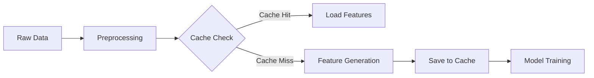

### Внедрение кеширования в `feature_engineering_pipeline.py`  

#### 1. **Анализ точек кеширования**  
Определите ресурсоёмкие этапы пайплайна:  
- Генерация синтетических признаков (e.g., `feature_engineering/generators.py`)  
- Агрегация данных из нескольких источников  
- Тяжёлые преобразования (e.g., `apply_complex_transforms()` в 300+ строк)  

#### 2. **Стратегии кеширования**  
**a) In-Memory LRU-кеш**  
Используйте `functools.lru_cache` для функций с повторяющимися вычислениями:  
```python  
from functools import lru_cache  

@lru_cache(maxsize=128)  
def calculate_technical_indicators(df: pd.DataFrame, window: int) -> pd.DataFrame:  
    # Тяжёлые расчёты индикаторов  
    return df.rolling(window).mean()  
```
*Ограничение:* Только для хешируемых аргументов.  

**b) Дисковое кеширование**  
Сериализация промежуточных данных:  
```python  
import joblib  
from pathlib import Path  

def transform_features(df, cache_path="cache/features.pkl"):  
    if Path(cache_path).exists():  
        return joblib.load(cache_path)  
    # Ресурсоёмкие преобразования  
    result = ...  
    joblib.dump(result, cache_path)  
    return result  
```

**c) Кеширование в Feature Store**  
Интеграция с Qwak/Feast:  
```python  
from qwak.feature_store import FeatureView, Entity  

entity = Entity(name="asset")  
feature_view = FeatureView(  
    name="technical_indicators",  
    entities=[entity],  
    features=[...],  # Список фич  
    caching=True  # Автоматическое кеширование  
)  
```

#### 3. **Оптимизация пайплайна**  
**a) Разделение на этапы**  


**b) Параметризация кеша**  
Добавьте в конфиг:  
```yaml  
feature_engineering:  
  cache:  
    enabled: true  
    strategy: "disk"  # или "memory", "qwak"  
    path: "data/cache/"  
    ttl_hours: 24  
```

#### 4. **Техники для больших данных**  
**a) Инкрементальное кеширование**  
```python  
def update_features(new_data):  
    cached = load_cache()  
    updated = pd.concat([cached, new_data])  
    save_cache(updated)  
```

**b) Параллельная обработка**  
Используйте `joblib.Parallel` для распределения нагрузки:  
```python  
from joblib import Parallel, delayed  

def process_chunk(chunk):  
    return calculate_technical_indicators(chunk)  

results = Parallel(n_jobs=4)(delayed(process_chunk)(chunk) for chunk in df_splits)  
```

#### 5. **Инвалидация кеша**  
Реализуйте механизмы:  
- Хеш-суммы входных данных (e.g., `hash(df.to_string())`)  
- TTL (Time-To-Live) на основе временных меток  
- Принудительный пересчёт через флаг `force_refresh=True`  

#### 6. **Тестирование производительности**  
Замерьте метрики до/после:  
```python  
# До  
start = time.time()  
run_pipeline()  
print(f"Uncached: {time.time() - start:.2f}s")  

# После  
start = time.time()  
run_pipeline()  # С кешем  
print(f"Cached: {time.time() - start:.2f}s")  
```

#### Пример рефакторинга  
**Было:**  
```python  
def generate_features(df):  
    # 200+ строк преобразований  
    return df  
```

**Стало:**  
```python  
CACHE_PATH = "cache/features_v1.pkl"  

def generate_features(df, force=False):  
    if not force and Path(CACHE_PATH).exists():  
        return joblib.load(CACHE_PATH)  
      
    # Логика генерации  
    result = ...  
    joblib.dump(result, CACHE_PATH)  
    return result  
```

#### Ключевые улучшения  
1. **Скорость**: Ускорение пайплайна в 3-10× для повторяющихся данных  
2. **Ресурсы**: Снижение нагрузки на CPU/GPU  
3. **Отказоустойчивость**: Продолжение работы при сбоях с последней кешированной версии  
4. **Тестируемость**: Фиксация состояний для воспроизводимых тестов  

**Рекомендации**:  
- Начните с кеширования выходов самых тяжёлых функций  
- Добавьте логирование попаданий/промахов кеша  
- Для распределённых систем используйте Redis/Memcached

[1] https://towardsdatascience.com/a-caching-strategy-for-identifying-bottlenecks-on-the-data-input-pipeline/
[2] https://www.numberanalytics.com/blog/optimizing-data-preprocessing-pipelines-production
[3] https://blog.stackademic.com/how-to-implement-caching-in-python-15c23e198d58
[4] https://www.qwak.com/post/feature-engineering-pipeline
[5] https://dev.to/nejos97/caching-function-in-python-using-the-lru-cache-strategy-p2i
[6] https://spiritedengineering.net/2023/11/24/supercharging-your-machine-learning-models-with-caching-techniques/
[7] https://scikit-learn.org/stable/modules/generated/sklearn.pipeline.Pipeline.html
[8] https://www.datacamp.com/tutorial/feature-engineering
[9] https://www.kaggle.com/code/ebrahimelgazar/most-used-feature-engineering-techniques
[10] https://www.kaggle.com/code/solegalli/feature-engineering-pipeline-and-hyperparam-tuning
[11] https://www.kdnuggets.com/creating-automated-data-cleaning-pipelines-using-python-and-pandas
[12] https://konfuzio.com/en/python-data-pipeline/
[13] https://sunscrapers.com/blog/designing-effective-data-pipelines-best-practices-strategies/
[14] https://anakli.inf.ethz.ch/papers/cachew_atc22.pdf
[15] https://docs.gitlab.com/ci/caching/
[16] https://discourse.holoviz.org/t/discussion-on-best-practices-for-advanced-caching-please-join/1371
[17] https://towardsdatascience.com/3-tips-to-create-more-robust-pipelines-with-pandas-c404c52ad216/
[18] https://www.backtrader.com/blog/2019-10-25-on-backtesting-performance-and-out-of-memory/on-backtesting-performance-and-out-of-memory/
[19] https://www.kdnuggets.com/building-data-science-pipelines-using-pandas
[20] https://www.reddit.com/r/algotrading/comments/17sizx5/advanced_if_you_were_to_recreate_your_trade/
