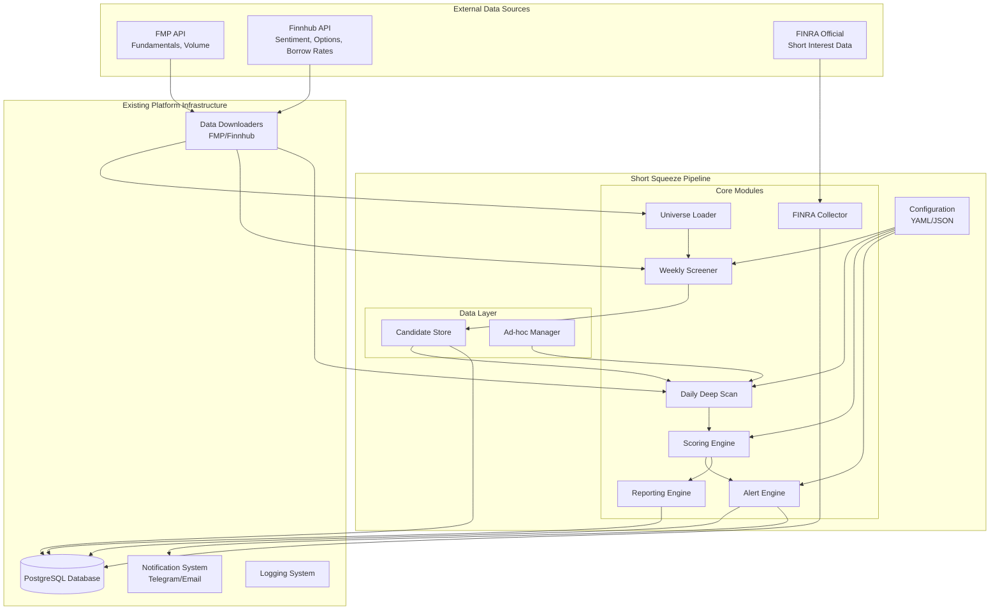

# Design

## Purpose
The Short Squeeze Detection Pipeline exists to systematically identify publicly traded stocks with high probability of short squeeze events. It serves as an automated screening and monitoring system that integrates with the existing trading platform to provide timely alerts on potential squeeze opportunities.

## Architecture
The system follows a modular, event-driven architecture that separates concerns between data collection, analysis, scoring, and alerting. The design emphasizes integration with existing platform infrastructure while maintaining the flexibility to operate as standalone scripts initially.

### High-Level Architecture

### Component Design

#### Configuration Layer
- **ConfigManager**: Centralized YAML configuration loading with validation
- **Data Classes**: Type-safe configuration objects using Python dataclasses
- **Environment Integration**: Support for environment variable substitution
- **Validation**: Comprehensive configuration validation with meaningful error messages

#### Core Processing Layer
- **Universe Loader**: Fetches and filters initial stock universe from FMP
- **Weekly Screener**: Performs structural analysis (short interest, days to cover, float)
- **Daily Deep Scan**: Conducts real-time analysis (volume spikes, sentiment, options)
- **Scoring Engine**: Combines metrics into squeeze probability scores
- **Alert Engine**: Evaluates thresholds and manages cooldown logic

#### Data Management Layer
- **Candidate Store**: PostgreSQL-based persistence with optimized queries
- **Ad-hoc Manager**: TTL-based management of manually added candidates
- **Database Schema**: Four new tables integrated with existing schema

#### Integration Layer
- **Logging Integration**: Extends existing notification system logging
- **Data Provider Integration**: Uses existing FMP/Finnhub downloaders
- **Notification Integration**: Leverages existing Telegram/email systems

## Data Flow

### Weekly Screener Flow
1. **Universe Loading**: Fetch stock universe from FMP with basic filters
2. **Data Collection**: Retrieve short interest, float, and volume data
3. **Metric Calculation**: Compute structural metrics (SI%, days to cover)
4. **Scoring**: Apply weighted scoring algorithm
5. **Filtering**: Select top K candidates based on thresholds
6. **Storage**: Persist results in `ss_snapshot` table

### Daily Deep Scan Flow
1. **Candidate Loading**: Retrieve active candidates from database
2. **FINRA Enhancement**: Get latest FINRA short interest data for each candidate
3. **Real-time Data**: Fetch current volume, sentiment, options data
4. **Metric Calculation**: Compute transient metrics (volume spike, sentiment)
5. **Scoring**: Combine transient (50%) + FINRA (30%) + structural (20%) metrics
6. **Alert Evaluation**: Check thresholds and cooldown periods
7. **Storage**: Update `ss_deep_metrics` and `ss_alerts` tables
8. **Notification**: Send alerts via existing notification system

### FINRA Data Collection Flow
1. **Date Generation**: Calculate expected settlement dates with business day logic
2. **Availability Check**: Verify which dates actually exist on FINRA servers
3. **Missing Detection**: Compare available dates against database records
4. **Incremental Download**: Download only missing data to avoid duplicates
5. **Storage**: Store historical data with unique constraint on (ticker, settlement_date)

## Design Decisions

### Technology Choices
- **Python Dataclasses**: Chosen for type safety and automatic validation
- **YAML Configuration**: Human-readable format with environment variable support
- **PostgreSQL Integration**: Leverages existing database infrastructure
- **Modular Architecture**: Enables independent testing and future scheduler integration

### Architecture Patterns
- **Factory Pattern**: Used for logger creation and configuration building
- **Strategy Pattern**: Scoring algorithms can be easily swapped
- **Observer Pattern**: Alert system decoupled from scoring engine
- **Repository Pattern**: Database operations abstracted through CandidateStore

### Performance Considerations
- **Batch Processing**: API calls and database operations batched for efficiency
- **Connection Pooling**: Reuse database connections across operations
- **Rate Limiting**: Built-in compliance with API provider limits
- **Caching**: Configuration and reference data cached to reduce overhead
- **Smart Date Logic**: FINRA business day calculations prevent unnecessary API calls

### FINRA Business Day Logic
- **Settlement Dates**: 15th and last day of month, adjusted for weekends
- **Weekend Adjustment**: Saturday/Sunday dates moved to previous Friday
- **Examples**: Feb 15 2025 (Sat) → Feb 14, Aug 31 2025 (Sun) → Aug 29
- **Historical Coverage**: Maintains 1 year of FINRA data for trend analysis

### Security Decisions
- **Environment Variables**: Sensitive data never stored in configuration files
- **Input Validation**: All external data validated before processing
- **SQL Injection Prevention**: Parameterized queries and ORM usage
- **Audit Logging**: All operations logged for security and debugging

## Integration Patterns

### Existing System Integration
- **Data Providers**: Extend existing FMP/Finnhub downloaders with new methods
- **Database**: Add new tables while maintaining existing schema patterns
- **Logging**: Integrate with existing logger setup and file rotation
- **Notifications**: Use existing Telegram/email notification infrastructure

### Future Scheduler Integration
- **Interface Design**: Abstract scheduler interface for multiple implementations
- **Job Management**: Support for job registration, monitoring, and failure handling
- **Timezone Handling**: European trading hours support with DST awareness
- **Error Recovery**: Automatic retry and escalation for failed jobs

## Error Handling Strategy

### Error Categories
1. **API Errors**: Rate limiting, timeouts, invalid responses
2. **Data Quality**: Missing fields, invalid formats, stale data
3. **Database Errors**: Connection failures, constraint violations
4. **Configuration Errors**: Invalid YAML, missing environment variables

### Recovery Patterns
- **Exponential Backoff**: For transient API failures
- **Circuit Breaker**: For repeated service failures  
- **Graceful Degradation**: Continue with partial data when possible
- **Fallback Mechanisms**: Use cached data when external services fail

## Testing Strategy

### Unit Testing
- **Configuration**: YAML parsing, validation, environment substitution
- **Scoring**: Metric calculations with known inputs and expected outputs
- **Database**: CRUD operations with test database
- **Logging**: Context management and metric collection

### Integration Testing
- **API Integration**: Mock responses for FMP/Finnhub services
- **Database Integration**: Containerized PostgreSQL for realistic testing
- **End-to-End**: Complete pipeline execution with sample data

### Performance Testing
- **Load Testing**: Verify performance with realistic data volumes
- **Rate Limiting**: Ensure API compliance under various load conditions
- **Memory Profiling**: Monitor resource usage during large operations