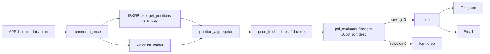

# Portfolio PnL Alert - Specification

Owner: portfolio monitoring
Status: Draft (planning phase, not yet implemented)
Last updated: 2026-04-20

## 1. Purpose

Send the user a single daily notification that lists every ticker whose current price is at least **+10%** above the user's average buy price. The alert combines two sources of holdings:

1. Live positions pulled from IBKR (via the existing `IBKRBroker`).
2. A user-maintained YAML watchlist of symbols + manually entered average buy prices (for positions held outside IBKR, or paper-tracked entries).

The digest is sent to Telegram and Email in one combined message, sorted from highest PnL% to lowest.

## 2. Functional requirements

### 2.1 Inputs

- **IBKR positions** - fetched via `IBKRBroker.get_positions()` in [src/trading/broker/ibkr_broker.py](../../../trading/broker/ibkr_broker.py). Each `Position` already exposes `average_price = pos.avgCost` (IBKR's own average cost). Only equity positions (`sec_type == "STK"`) are considered.
- **Watchlist YAML** - a user-editable file at `src/portfolio/pnl_alert/config/watchlist.yaml` with the following schema:
  ```yaml
  entries:
    - symbol: NVDA
      avg_price: 120.00
    - symbol: AAPL
      avg_price: 150.00
      notes: "optional free-text"
  ```
  All entries are assumed to be US equities quoted in USD. Validation rejects: missing `symbol`, non-positive `avg_price`, duplicate symbols within the file.
- **Pipeline config YAML** - `src/portfolio/pnl_alert/config/pnl_alert.yaml`:
  ```yaml
  threshold_pct: 0.10
  channels: [telegram, email]
  cron: "30 21 * * 1-5"
  watchlist_path: src/portfolio/pnl_alert/config/watchlist.yaml
  include_ibkr: true
  ibkr_stk_only: true
  ```

### 2.2 Merging rule (IBKR + Watchlist)

- If a symbol exists in both sources, **IBKR wins** (the broker's `avgCost` reflects actual fills). A WARNING is logged naming the symbol and both prices.
- The final set of holdings is `IBKR STK positions UNION (watchlist entries whose symbol is not in IBKR)`.
- Each holding carries a `source` field (`"ibkr"` or `"watchlist"`) used only for logging and the eventual message footer.

### 2.3 Price fetch

- Latest daily close is fetched via `DataManager.get_ohlcv` in [src/data/data_manager.py](../../../data/data_manager.py), using a batched request of the last 2 trading days at `1d` interval per symbol. The latest bar's `close` is used as the current price.
- Per-symbol failures are logged at WARNING and excluded from the evaluation; they do not fail the run.
- If **all** price fetches fail, send a single CRITICAL-priority notification describing the failure and exit non-zero.

### 2.4 Evaluation

For each holding with a valid current price:

- `pnl_abs = (current_price - avg_price) * quantity` (for watchlist entries without quantity, `quantity = 1` so `pnl_abs` degenerates to the per-share delta and the `pnl_pct` is what matters)
- `pnl_pct = (current_price - avg_price) / avg_price`
- Include in the alert iff `pnl_pct >= threshold_pct`.
- Sort the included rows by `pnl_pct` descending. Ties broken by `pnl_abs` descending, then symbol alphabetically.

### 2.5 Notification

- **One** combined message per run, sent to every channel in `channels`.
- If zero symbols cross the threshold: send nothing, log an INFO line `"PnL alert: 0 symbols above threshold; no notification sent"`.
- Delivery uses `NotificationServiceClient` from [src/notification/service/client.py](../../../notification/service/client.py). Channels are configured via existing env vars (`TELEGRAM_BOT_TOKEN`, `SMTP_SERVER`, `SMTP_USER`, `SMTP_PASSWORD`, ...). No new env vars are introduced.
- **Dedup behavior**: none. The user explicitly chose to be notified every day for every symbol currently above threshold.

### 2.6 Message format

Telegram (plain text) and Email (HTML table with same column layout):

```
Portfolio PnL Alert - 2026-04-20
3 positions above +10% threshold

1. NVDA   avg $120.00   now $156.40   PnL +$364.00  (+30.33%)
2. AAPL   avg $150.00   now $180.15   PnL +$301.50  (+20.10%)
3. MSFT   avg $310.00   now $352.70   PnL +$42.70   (+13.77%)

Sources: ibkr=2, watchlist=1
```

- Columns: rank, ticker, average buy price, current price, absolute PnL (USD), percent PnL.
- Monetary formatting rounds to 2 decimals at the output boundary.

### 2.7 Scheduling

- The job runs **once per weekday at 21:30 UTC** (= ~16:30-17:30 US Eastern depending on DST; comfortably after the US cash close). Configurable via the `cron` field.
- Execution is driven by the existing APScheduler service in [src/scheduler/scheduler_service.py](../../../scheduler/scheduler_service.py). Integration is a **single INSERT** into the `job_schedules` table (`Schedule` ORM in [src/data/db/models/model_jobs.py](../../../data/db/models/model_jobs.py)):

  ```
  name         = "portfolio_pnl_alert"
  job_type     = "alert"
  target       = "portfolio.pnl_alert"
  task_params  = {"config_path": "src/portfolio/pnl_alert/config/pnl_alert.yaml"}
  cron         = "30 21 * * 1-5"
  enabled      = true
  ```

- The `job_type = "alert"` choice is deliberate: the `job_schedules` table has a hard DB check constraint restricting `job_type` to the existing six values. Adding a new enum value (`portfolio_pnl_alert`) would require a schema migration. Reusing `ALERT` with `target` as the routing key avoids this entirely.
- `target` acts as the dispatch key: any `target` starting with `"portfolio."` is routed to `src.portfolio.pnl_alert.runner.run_once(cfg)` inside the existing `ALERT` branch of `execute_job_wrapper`. All other `target` values fall through to the pre-existing `AlertEvaluator` path, unchanged.

## 3. Non-functional requirements

- **Idempotency**: seeding the schedule is idempotent by the existing `unique(user_id, name)` constraint on `job_schedules`.
- **Observability**: every run logs (a) number of IBKR positions, (b) number of watchlist entries, (c) number of price fetch failures, (d) number of symbols crossing the threshold, (e) notification delivery status per channel.
- **Failure isolation**: IBKR unreachable -> proceed with watchlist only; individual symbol errors never fail the digest; notification-channel failure in one channel does not prevent the other from firing.
- **No new dependencies**: reuses `ib_insync`, `yfinance`, `aiogram`, `aiosmtplib`, `apscheduler` already in `requirements.txt`.

## 4. Module layout

```
src/portfolio/pnl_alert/
  __init__.py
  config.py                 # PnLAlertConfig + load_config()
  watchlist_loader.py       # YAML -> list[WatchlistEntry]
  position_aggregator.py    # merge IBKR positions + watchlist -> list[Holding]
  price_fetcher.py          # DataManager-backed latest-close fetch
  pnl_evaluator.py          # pure function: evaluate(holdings, prices, threshold)
  notifier.py               # format message + dispatch via NotificationServiceClient
  runner.py                 # async run_once(cfg) orchestrator
  cli.py                    # python -m src.portfolio.pnl_alert (--dry-run, --threshold, --config)
  seed_schedule.py          # one-shot inserter for the job_schedules row
  config/
    pnl_alert.yaml
    watchlist.yaml
  docs/
    alert-specification.md  (this file)
  tests/
    test_pnl_evaluator.py
    test_position_aggregator.py
    test_notifier_format.py
    test_watchlist_loader.py
```

## 5. End-to-end flow



## 6. Edge cases

- **Non-equity IBKR positions** (options/FX/crypto): filtered out at the aggregation step. Logged at DEBUG with counts.
- **Symbol in both IBKR and watchlist with conflicting avg price**: IBKR wins; WARNING logged naming both prices and the delta.
- **Stale/halted ticker with no recent close**: treated as "price fetch failure"; excluded with a WARNING.
- **Negative or zero `avg_price`** in the watchlist: fails YAML validation at load time; run aborts with a CRITICAL notification.
- **Quantity unknown for watchlist entries**: default to `1`. `pnl_abs` for watchlist-only entries is therefore "per-share" and should be interpreted via `pnl_pct` primarily. (Optional future enhancement: allow `quantity` in the YAML schema.)
- **FX / non-USD accounts**: out of scope. All holdings are assumed USD.
- **Partial channel failure**: if Telegram succeeds and Email fails (or vice versa), the run is marked SUCCESS with WARNING; delivery status is recorded via the notification service.

## 7. Out of scope (explicit non-goals)

- Real-time intraday alerts (this is a once-a-day digest).
- Alert history / deduplication state (the user wants daily repeats).
- Downside alerts (e.g. `-10%`).
- Lot-level cost basis / FIFO accounting.
- FX conversion for non-USD accounts.
- Interactive controls via the Telegram bot (acknowledge, snooze, etc.).

Any of the above can be layered on later without changing the core schema or schedule row.

## 8. Open questions

- None at the time of writing. All prior design questions (channels, scheduling mechanism, watchlist source, dedup behavior) were resolved with the user before drafting this spec.

## 9. References

- Plan file: `.cursor/plans/portfolio_pnl_alert_*.plan.md`
- IBKR broker: [src/trading/broker/ibkr_broker.py](../../../trading/broker/ibkr_broker.py)
- Data manager: [src/data/data_manager.py](../../../data/data_manager.py)
- Notification client: [src/notification/service/client.py](../../../notification/service/client.py)
- Notification config (env mapping): [src/notification/service/config.py](../../../notification/service/config.py)
- Scheduler service: [src/scheduler/scheduler_service.py](../../../scheduler/scheduler_service.py)
- Job schedule model: [src/data/db/models/model_jobs.py](../../../data/db/models/model_jobs.py)
