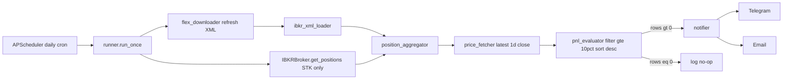

# Portfolio PnL Alert - Specification

Owner: portfolio monitoring
Status: Implemented
Last updated: 2026-08-13

## 1. Purpose

Send the user a single daily notification that lists every ticker whose current price is at least **+10%** above the user's average buy price. Holdings come from a single source of truth: IBKR.

1. The daily Flex Query "Open Positions" XML export (downloaded automatically by `flex_downloader.py` at the start of every run).
2. Optionally, same-day live positions from the connected `IBKRBroker`, merged on top of the XML on matching symbol (live wins - it reflects same-day fills the XML export, generated at prior-day close, wouldn't yet have).

> **2026-08-13 change**: a YAML watchlist for manually tracked / outside-IBKR positions previously existed as a second input source. It was removed - IBKR (XML + live) is now the sole source. See §8 for the rationale.

The digest is sent to Telegram and Email in one combined message, sorted from highest PnL% to lowest.

## 2. Functional requirements

### 2.1 Inputs

- **IBKR Flex Query XML export** - `Open_Positions.xml`, refreshed daily via the Flex Web Service (`flex_downloader.py`) and parsed by `ibkr_xml_loader.py`. Positions across multiple `<FlexStatement>` accounts are merged per symbol with a weighted-average cost basis. Symbols are disambiguated against same-named tickers on other exchanges (e.g. `GOLD` on LSE vs NYSE) using the `listingExchange` Flex Query column - see the module docstring in `ibkr_xml_loader.py` for the full resolution order.
- **Live IBKR positions** (optional) - fetched via `IBKRBroker.get_positions()` / `ib.positions()` in [src/trading/broker/ibkr_broker.py](../../../trading/broker/ibkr_broker.py). Each position exposes `average_price = pos.avgCost` (IBKR's own average cost). Only equity positions (`sec_type == "STK"`) are considered when `ibkr_stk_only: true`.
- **Pipeline config YAML** - `src/portfolio/pnl_alert/config/pnl_alert.yaml`:
  ```yaml
  threshold_pct: 0.10
  channels: [telegram, email]
  cron: "30 21 * * 1-5"
  ibkr_xml_path: data/portfolio/pnl_alert/Open_Positions.xml
  include_ibkr: true
  ibkr_stk_only: true
  ```

### 2.2 Merging rule (XML + live IBKR)

- Positions are keyed by symbol. Live broker positions overwrite XML positions on the same symbol (same-day fills the XML export wouldn't yet reflect); otherwise both contribute to the merged set.
- Every holding carries a `source` field, always `"ibkr"` today. It's kept as a field (rather than removed) so the notifier's per-source breakdown doesn't need a special case if a second source is reintroduced later.

### 2.3 Price fetch

- Latest daily close is fetched via `DataManager.get_ohlcv` in [src/data/data_manager.py](../../../data/data_manager.py), using a batched request of the last 2 trading days at `1d` interval per symbol. The latest bar's `close` is used as the current price.
- Per-symbol failures are logged at WARNING and excluded from the evaluation; they do not fail the run.
- If **all** price fetches fail, send a single CRITICAL-priority notification describing the failure and exit non-zero.

### 2.4 Evaluation

For each holding with a valid current price:

- `pnl_abs = (current_price - avg_price) * quantity`
- `pnl_pct = (current_price - avg_price) / avg_price`
- Include in the alert iff `pnl_pct >= threshold_pct`.
- Sort the included rows by `pnl_pct` descending. Ties broken by `pnl_abs` descending, then symbol alphabetically.

### 2.5 Notification

- **One** combined message per run, sent to every channel in `channels`.
- If zero symbols cross the threshold: send nothing, log an INFO line `"PnL alert: 0 symbols above threshold; no notification sent"`.
- Delivery uses `NotificationServiceClient` from [src/notification/service/client.py](../../../notification/service/client.py). Channels are configured via existing env vars (`TELEGRAM_BOT_TOKEN`, `SMTP_SERVER`, `SMTP_USER`, `SMTP_PASSWORD`, ...). No new env vars are introduced.
- **Dedup behavior**: none. The user explicitly chose to be notified every day for every symbol currently above threshold.

### 2.6 Message format

Telegram (plain text) and Email (HTML table with same column layout):

```
Portfolio PnL Alert - 2026-04-20
3 positions above +10% threshold

1. NVDA   avg $120.00   now $156.40   PnL +$364.00  (+30.33%)
2. AAPL   avg $150.00   now $180.15   PnL +$301.50  (+20.10%)
3. MSFT   avg $310.00   now $352.70   PnL +$42.70   (+13.77%)

Sources: ibkr=3
```

- Columns: rank, ticker, average buy price, current price, absolute PnL (USD), percent PnL.
- Monetary formatting rounds to 2 decimals at the output boundary.

### 2.7 Scheduling

- The job runs **once per weekday at 21:30 UTC** (= ~16:30-17:30 US Eastern depending on DST; comfortably after the US cash close). Configurable via the `cron` field.
- Execution is driven by the existing APScheduler service in [src/scheduler/scheduler_service.py](../../../scheduler/scheduler_service.py). Integration is a **single INSERT** into the `job_schedules` table (`Schedule` ORM in [src/data/db/models/model_jobs.py](../../../data/db/models/model_jobs.py)):

  ```
  name         = "portfolio_pnl_alert"
  job_type     = "alert"
  target       = "portfolio.pnl_alert"
  task_params  = {"config_path": "src/portfolio/pnl_alert/config/pnl_alert.yaml"}
  cron         = "30 21 * * 1-5"
  enabled      = true
  ```

- The `job_type = "alert"` choice is deliberate: the `job_schedules` table has a hard DB check constraint restricting `job_type` to the existing six values. Adding a new enum value (`portfolio_pnl_alert`) would require a schema migration. Reusing `ALERT` with `target` as the routing key avoids this entirely.
- `target` acts as the dispatch key: any `target` starting with `"portfolio."` is routed to `src.portfolio.pnl_alert.runner.run_once(cfg)` inside the existing `ALERT` branch of `execute_job_wrapper`. All other `target` values fall through to the pre-existing `AlertEvaluator` path, unchanged.

## 3. Non-functional requirements

- **Idempotency**: seeding the schedule is idempotent by the existing `unique(user_id, name)` constraint on `job_schedules`.
- **Observability**: every run logs (a) number of IBKR positions, (b) number of price fetch failures, (c) number of symbols crossing the threshold, (d) notification delivery status per channel.
- **Failure isolation**: individual symbol errors never fail the digest; notification-channel failure in one channel does not prevent the other from firing; a stale/undownloadable Flex Query XML falls back to whatever export is already on disk.
- **No new dependencies**: reuses `ib_insync`, `yfinance`, `aiogram`, `aiosmtplib`, `apscheduler` already in `requirements.txt`.

## 4. Module layout

```
src/portfolio/pnl_alert/
  __init__.py
  config.py                 # PnLAlertConfig + load_config()
  flex_downloader.py        # IBKR Flex Web Service -> Open_Positions.xml
  ibkr_xml_loader.py         # Open_Positions.xml -> list[RawIbkrPosition] (+ exchange disambiguation)
  position_aggregator.py    # raw IBKR positions -> list[Holding]
  price_fetcher.py          # DataManager-backed latest-close fetch
  pnl_evaluator.py          # pure function: evaluate(holdings, prices, threshold)
  notifier.py               # format message + dispatch via NotificationServiceClient
  runner.py                 # async run_once(cfg) orchestrator
  cli.py                    # python -m src.portfolio.pnl_alert (--dry-run, --threshold, --config)
  seed_schedule.py          # one-shot inserter for the job_schedules row
  config/
    pnl_alert.yaml
  docs/
    alert-specification.md  (this file)
  tests/
    test_pnl_evaluator.py
    test_position_aggregator.py
    test_notifier_format.py
    test_ibkr_xml_loader.py
    test_flex_downloader.py

data/portfolio/pnl_alert/
  Open_Positions.xml        # refreshed daily by flex_downloader.py (writable path
                             # under scheduler.service's ProtectSystem=strict)
```

## 5. End-to-end flow


```mermaid
flowchart LR
    Sched[APScheduler daily cron] --> Run[runner.run_once]
    Run --> FlexDL[flex_downloader refresh XML]
    FlexDL --> XmlLoad[ibkr_xml_loader]
    Run --> Live[IBKRBroker.get_positions STK only]
    XmlLoad --> Agg[position_aggregator]
    Live --> Agg
    Agg --> Px[price_fetcher latest 1d close]
    Px --> Eval[pnl_evaluator filter gte 10pct sort desc]
    Eval -->|rows gt 0| Notif[notifier]
    Eval -->|rows eq 0| Skip[log no-op]
    Notif --> TG[Telegram]
    Notif --> EM[Email]
```

## 6. Edge cases

- **Non-equity IBKR positions** (options/FX/crypto): filtered out at the aggregation step. Logged at DEBUG with counts.
- **Symbol collision across exchanges** (e.g. `GOLD` = LSE gold ETC vs NYSE Barrick Gold): resolved via `listingExchange` in `ibkr_xml_loader.py`; unrecognized non-US exchanges are logged as a WARNING and left unresolved rather than silently mispriced.
- **Stale/halted ticker with no recent close**: treated as "price fetch failure"; excluded with a WARNING.
- **Flex Query download failure**: best-effort; falls back to whatever `Open_Positions.xml` is already on disk, matching the "IBKR unreachable" tolerance below.
- **Live IBKR unreachable**: WARNING, run continues with the XML export alone.
- **FX / non-USD accounts**: out of scope. All holdings are assumed USD.
- **Partial channel failure**: if Telegram succeeds and Email fails (or vice versa), the run is marked SUCCESS with WARNING; delivery status is recorded via the notification service.

## 7. Out of scope (explicit non-goals)

- Real-time intraday alerts (this is a once-a-day digest).
- Alert history / deduplication state (the user wants daily repeats).
- Downside alerts (e.g. `-10%`).
- Lot-level cost basis / FIFO accounting.
- FX conversion for non-USD accounts.
- Interactive controls via the Telegram bot (acknowledge, snooze, etc.).

Any of the above can be layered on later without changing the core schema or schedule row.

## 8. Open questions

- None at the time of writing.
- **Resolved 2026-08-13**: the YAML watchlist (manually tracked / outside-IBKR positions) was removed. At the time, all but 4 of its 12 entries duplicated positions already present in the IBKR XML; the remaining 4 (`IOVA`, `RPD`, `RGNX`, `MELI`) were confirmed closed/stale and intentionally dropped rather than migrated. If a genuine outside-IBKR holding needs tracking again in the future, reintroducing a second source is straightforward (`Holding.source` already supports more than `"ibkr"`), but it is not implemented today.

## 9. References

- Plan file: `.cursor/plans/portfolio_pnl_alert_*.plan.md`
- IBKR broker: [src/trading/broker/ibkr_broker.py](../../../trading/broker/ibkr_broker.py)
- Data manager: [src/data/data_manager.py](../../../data/data_manager.py)
- Notification client: [src/notification/service/client.py](../../../notification/service/client.py)
- Notification config (env mapping): [src/notification/service/config.py](../../../notification/service/config.py)
- Scheduler service: [src/scheduler/scheduler_service.py](../../../scheduler/scheduler_service.py)
- Job schedule model: [src/data/db/models/model_jobs.py](../../../data/db/models/model_jobs.py)
