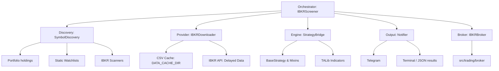

# Architecture: IBKR Screener

This document outlines the refined architecture for the new IBKR Screener. The design focuses on modularity, reuse of existing project logic, and efficient operation on Raspberry Pi hardware.

## 1. System Overview

The screener is designed as an event-driven orchestrator that periodically scans a set of symbols, applies technical analysis logic (Strategy), and notifies the user of potential entries.



---

## 2. Core Components

### A. Provider (`src/data/downloader/ibkr_downloader.py`)
To maintain consistency, the `IBKRDownloader` will inherit from `BaseDataDownloader`.

*   **Interface Integration:** Implements `get_ohlcv(symbol, interval, start_date, end_date)`.
*   **Data Mode:** Uses **Delayed Market Data** (`ib.reqMarketDataType(3)`) to increase throughput and avoid requiring real-time subscriptions for all symbols.
*   **Persistence:** Saves raw data in `.csv` format within `DATA_CACHE_DIR` (as defined in `donotshare.py`).
*   **Performance:** Uses the "Black Box" logic to sync only missing bars from IBKR and merge with local CSVs.

### B. Discovery (`src/screeners/discovery/symbol_discovery.py`)
A modular system to define *what* to screen.

*   `PortfolioDiscovery`: Fetches current account positions using `ib.positionsAsync()`.
*   `StaticDiscovery`: Reads a list of symbols from `config/screener_symbols.json`.
*   `ScannerDiscovery`: Leverages IBKR's `ScannerSubscription` to find "Top Gainers", "Most Active", etc.

### C. Strategy Bridge (`src/screeners/logic/strategy_bridge.py`)
To ensure compatibility with `base_strategy.py` and its Mixins:

*   **Approach:** We will implement a `ScreenerStrategy` (inheriting from `BaseStrategy`).
*   **Execution:** Instead of a long-running bot, the Orchestrator will instantiate a minimal Backtrader `Cerebro` for each symbol, run it for a single pass of the available data, and capture the final state of `should_enter()`.
*   **Benefits:** 
    *   100% logic parity with backtesting.
    *   No need to rewrite indicator logic or HMM/LSTM processing.
    *   Automatic support for `required_lookback` calculation.

### D. Broker Integration (`src/trading/broker/`)
To support the future transition from alerts to active trading, the screener will directly reuse the existing broker infrastructure.

*   **Reuse:** The Orchestrator will use `src.trading.broker.broker_factory.get_broker()` to instantiate an `IBKRBroker`.
*   **Discovery Role:** Use `broker.get_positions()` and `broker.get_account_info()` to populate the `PortfolioDiscovery` module.
*   **Future-Proofing:** Since `IBKRBroker` already supports `paper` and `live` modes via configuration, switching from "Alert-Only" to "Auto-Trade" will simply involve calling `broker.place_order()` when a signal is generated.

### E. Orchestrator (`src/screeners/ibkr_screener_service.py`)
The main loop/service manager.

*   **Loop:** Runs at user-defined intervals (e.g., 15m, 1h).
*   **Batching:** Processes up to 50 symbols. 
*   **Result Management:** Saves signal state in `results/screeners/ibkr/` as `.json` files to track signal history and prevent alert spam.

---

## 3. Data Requirements & Persistence

### Caching (CSV)
*   **Path:** `DATA_CACHE_DIR` (from `donotshare.py`).
*   **Format:** `symbol_interval.csv`.
*   **Role:** Acts as the primary data source for the `StrategyBridge` to minimize API calls.

### Results (JSON)
*   **Path:** `results/screeners/ibkr/`.
*   **Format:** `signals_YYYYMMDD_HHMM.json`.
*   **Content:**
    ```json
    {
      "timestamp": "2026-01-30T18:00:00",
      "symbol": "AAPL",
      "signal": "BUY",
      "reason": "RSI_OVERSOLD",
      "regime": "BULLISH",
      "indicators": {"rsi": 28.5, "ema200": 150.2}
    }
    ```

---

## 4. Notifications
Uses the project's existing `src/notification` module.
*   **Channels:** Telegram (primary) and Email (secondary).
*   **Behavior:** Alert-Only mode. Notifications include the symbol, signal reason, and current price.

---

## 5. Implementation Roadmap
1. [ ] Create `IBKRDownloader` (Align with `BaseDataDownloader`).
2. [ ] Implement `SymbolDiscovery` types.
3. [ ] Develop `StrategyBridge` to wrap existing `BaseStrategy` / Mixins.
4. [ ] Build the `Orchestrator` loop and notification integration.
5. [ ] Verify on Raspberry Pi with ~50 symbols.
