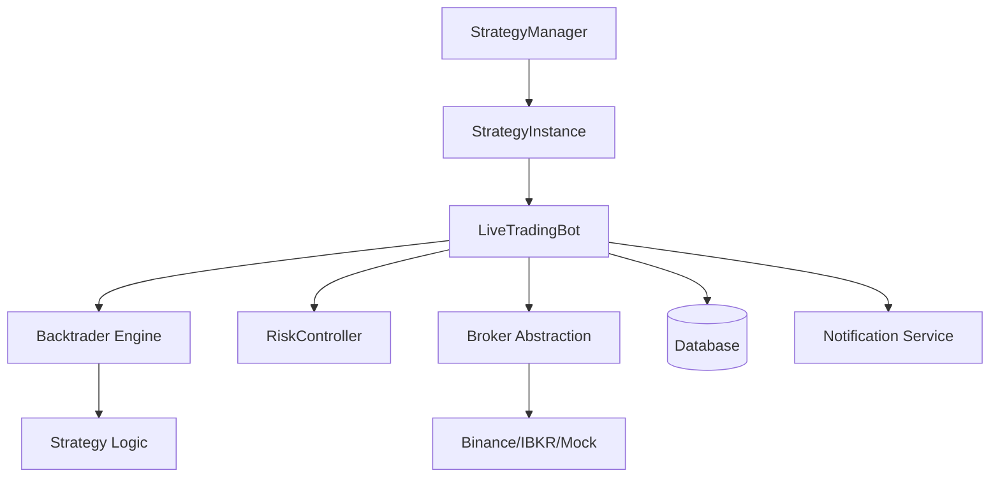

# Architectural Review: `src/trading` Module

## 1. Problem Summary
The `src/trading` module is designed to provide a robust, scalable framework for automated trading. It addresses the complexity of managing multiple trading strategies, integrating with various brokers (Binance, IBKR), ensuring real-time risk management, and maintaining system reliability (heartbeats, persistence, notifications). It aims to bridge the gap between backtesting (Backtrader) and live execution.

## 2. Assumptions
- **Connectivity**: Assumes reliable internet connectivity for API interactions with brokers and data providers.
- **Data Source**: Assumes high-quality, real-time OHLCV data is available via `DataFeedFactory`.
- **Environment**: Designed to run in diverse environments, including local machines and low-power devices like Raspberry Pi.
- **State Management**: Assumes a SQL database (handled by `trading_service`) is available for persistence, with local JSON as a fallback/redundancy.

## 3. Architecture Overview
The system follows a **Modular Layered Architecture**:
- **Orchestration Layer**: `StrategyManager` and `LiveTradingBot` manage the lifecycle of strategy instances.
- **Execution Layer**: Backtrader serves as the core engine, driving the strategy logic.
- **Abstraction Layer**: `BaseBroker` and its implementations (Binance, IBKR, Mock) decouple the bot from specific API details.
- **Risk Layer**: `RiskController` provides a centralized point for pre-trade, real-time, and post-trade safety checks.
- **Support Layer**: Integrated services for notifications (Telegram/Email), database persistence, and health monitoring (Heartbeats).

## 4. Component Breakdown
- **`BaseTradingBot`**: The "God Class" for trading logic, handling initialization, signal processing, and persistence.
- **`LiveTradingBot`**: Extends `BaseTradingBot` for real-time execution, adding data feed management and Backtrader integration.
- **`StrategyManager`**: Enables multi-strategy execution within a single process. It provides isolation and independent health monitoring for each strategy instance.
- **`StrategyHandler`**: A factory for dynamic strategy loading, supporting "Mixins" for entry/exit logic, allowing for highly composable strategies.
- **`RiskController`**: Implements a three-phase risk check:
    - **Pre-trade**: Position sizing (Fixed Fractional), exposure limits, and correlation checks.
    - **Real-time**: Trailing stops and volatility-based scaling.
    - **Post-trade**: P&L attribution and reporting.

## 5. Data Model
- **Entities**: Bots (`BotInstance`), Trades (`Trade`), Signals.
- **State Persistence**: 
    - **Primary**: Database via `trading_bot_service`.
    - **Secondary**: Local JSON files (`logs/json/trades.json`, `logs/json/state.json`) for recovery and debugging.
- **Configuration**: Pydantic-validated JSON manifests (`TradingBotConfig`).

## 6. API Design
- **Internal**: Components interact via well-defined interfaces (e.g., `get_signals()`, `execute_trade()`, `pre_trade_checks()`).
- **External**: Integration with a microservice-like `NotificationServiceClient` and a centralized `trading_service` for data persistence.

## 7. Scalability Strategy
- **Horizontal**: The `StrategyManager` allows multiple strategies per service. For larger scales, multiple instances of the trading service can be deployed across different nodes (e.g., Raspberry Pi clusters or cloud VMs).
- **Asynchronous Operations**: Uses `asyncio` for non-blocking I/O (notifications, certain database calls), crucial for real-time responsiveness.

## 8. Failure Handling
- **Graceful Shutdown**: Signal handlers (SIGINT, SIGTERM) ensure positions are closed/logged before exit.
- **Auto-Recovery**: `StrategyManager` and `LiveTradingBot` monitor data feed health and attempt reconnections.
- **Observability**: Heartbeat mechanism allows a central monitor to detect "zombie" bots.
- **Redundancy**: Dual persistence (DB + JSON).

## 9. Security Considerations
- **API Key Management**: Sensitive credentials should be handled via environment variables or secure `config.donotshare` modules (referenced in conversation logs).
- **Network Isolation**: Integration with Raspberry Pi services suggests a decentralized deployment model, which can limit the blast radius of a single node failure or compromise.

## 10. Trade-offs
- **Complexity vs. compositions**: The Mixin-based strategy architecture allows for great flexibility but increases the cognitive load for new strategy developers.
- **Backtrader Dependency**: While powerful, Backtrader is synchronous in its core loop, which the system mitigates by running it in executors within an `asyncio` context.
- **State Synchronicity**: Managing state in both DB and JSON introduces potential drift, though the code prioritizes DB as the source of truth.

## 11. Recommended Stack (Current vs. Suggested)
- **Current**: Python, Backtrader, SQLAlchemy (implied), Pydantic, asyncio.
- **Observation**: The move towards a decentralized `StrategyManager` and `NotificationService` is a strong step toward a distributed architecture.
- **Recommendation**: Consider moving to a more cloud-native event-driven architecture (e.g., Kafka or RabbitMQ) for signal distribution if the number of bots/pairs scales significantly.

---
*Review compiled by Senior Software Architect.*
