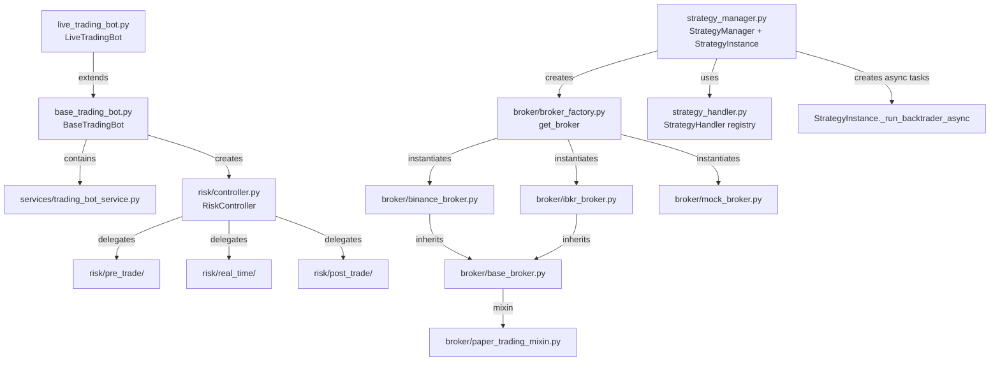

# Architectural Review: `src/trading` Submodule

> **Scope**: `src/trading/` — all files and subdirectories
> **Date**: 2026-03-27

---

## Executive Summary

The trading submodule is **architecturally ambitious but not yet production-safe**. It has a well-structured layer separation (broker / risk / strategy / service), good patterns like the factory and registry, and solid paper-trading infrastructure. However it contains several **critical runtime bugs**, **two genuine security concerns**, and a pervasive pattern of **dual/parallel implementations** that cause confusion and fragile coupling. The risk layer is a skeleton. Test coverage is near-zero.

Overall code level: **mid-level engineering with senior-level design intent but significant execution gaps**.

---

## 1. Architecture Overview



The design intent is clean. The execution has serious issues.

---

## 2. Critical Bugs

### 2.1 `NameError` in `base_trading_bot.py` — `trade_id` undefined on BUY path

**File**: `base_trading_bot.py`, line 284

```python
# BUY branch — trade_id is not yet defined when this line runs:
'order_id': str(order) if order else trade_id,   # ← NameError
```

`trade_id` is only set in the `sell` branch (line 292). On a BUY, if `order` is `None`, this raises an unhandled `NameError` at runtime. The except clause on line 388 will catch it and suppress it silently — but the position notification will silently fail.

**Fix**: Replace `trade_id` with `None` or use the freshly created `trade.id`.

---

### 2.2 `asyncio.run()` called inside a running event loop

**Files**: `base_trading_bot.py` lines 287, 386, 530, 586, 704

```python
asyncio.run(self.position_notification_manager.notify_position_opened(…))
asyncio.run(self.notification_client.send_to_admins(…))
```

`asyncio.run()` creates a **new event loop** and panics with `RuntimeError: This event loop is already running` when called from within an async context (e.g., when `StrategyManager` calls these via `asyncio.create_task`). The pattern should be:

```python
# Option A — if caller is sync:
loop = asyncio.new_event_loop()
loop.run_until_complete(coro)

# Option B — if caller may be async (preferred):
asyncio.ensure_future(coro)   # fire-and-forget
```

---

### 2.3 `BaseTradingBot.save_state()` uses `self.state_file` but never sets it

**File**: `base_trading_bot.py`, line 457

```python
with open(self.state_file, "w", encoding="utf-8") as f:
```

`BaseTradingBot.__init__` never sets `self.state_file`. `LiveTradingBot` does not set it either. Only `BatchSimulationBot` (in `run_batch_simulation.py`) works around this with a manual fix comment:

```python
# Initialize paths manually as BaseTradingBot expects state_file but doesn't seem to set it (Added Fix)
self.state_file = os.path.join(data_dir, "state.json")
```

This means `save_state()` and `load_state()` will `AttributeError` in production on the very first cycle when called through `LiveTradingBot`. The heartbeat loop calls `save_state()` each iteration.

---

### 2.4 `get_order_status` returns `None` placeholder for live IBKR / Binance

**Files**: `ibkr_broker.py` line 492, `binance_broker.py` line 472

```python
return None  # Placeholder
```

Both live-mode `get_order_status` implementations are stubs. Any caller checking order fill state in live mode will silently get `None`, making order tracking non-functional in live trading.

---

### 2.5 `TradingBotService.get_open_trades()` returns `List[Dict]` but callers expect ORM objects

**File**: `services/trading_bot_service.py` line 86; `base_trading_bot.py` line 494

```python
# Service returns dicts ↓
trades = trading_service.get_open_trades(symbol=symbol)

# Caller accesses as ORM attributes ↓
self.active_positions[trade.symbol] = {
    "entry_price": float(trade.entry_price) if trade.entry_price else 0.0,
```

If `trading_service.get_open_trades` returns plain dicts (not ORM model instances), attribute access (`trade.symbol`, `trade.entry_price`) raises `AttributeError`. This is the `load_state()` → `_load_open_positions_from_db()` path.

---

## 3. Security Issues

### 3.1 ⚠️ API Credentials imported at module level from a hardcoded path

**File**: `broker/broker_factory.py`, line 28

```python
from config.donotshare.donotshare import (
    BINANCE_KEY, BINANCE_PAPER_KEY, BINANCE_PAPER_SECRET, BINANCE_SECRET,
    IBKR_CLIENT_ID, IBKR_HOST, IBKR_PORT, IBKR_PAPER_PORT
)
```

This imports live trading API keys unconditionally at **module load time**. Any import of `broker_factory` — including during testing or simulation — loads real credentials into memory. The file is named `donotshare` suggesting awareness, but:

- There is **no environment variable fallback** — the system cannot run without this file
- If this file is accidentally committed to git (which a `donotshare` convention tries to prevent but cannot enforce), live keys are exposed
- All tests that import anything touching `broker_factory` will fail in CI/CD unless the secrets file is present

**Recommendation**: Use environment variables (`os.getenv`) with an optional `.env` file loaded by `python-dotenv`. The credential file pattern is not portable and is a secrets management anti-pattern.

---

### 3.2 ⚠️ Sensitive trade/strategy data logged in error paths

**File**: `base_trading_bot.py` line 687

```python
f"Parameters: {getattr(self, 'parameters', {})}\n"
```

Strategy parameters (which may contain API keys, risk thresholds, or proprietary signal weights) are logged at `INFO` level in `notify_bot_event()` and `log_bot_event()`. Log files are typically not as tightly controlled as secrets stores.

**Recommendation**: Sanitize or omit `parameters` from notification messages. At minimum, strip any keys matching `*key*`, `*secret*`, `*token*`.

---

### 3.3 Risk Management is Bypassed in Trade Execution

**File**: `base_trading_bot.py`, `execute_trade()` (lines 223–390)

The `RiskController` is initialized in `__init__` (line 118) but **is never called during trade execution**. Signals arrive → `process_signals()` → `execute_trade()` without any pre-trade risk check:

```python
def execute_trade(self, trade_type, price, size):
    # No call to self.risk_controller.pre_trade_checks(...)
    if not self.paper_trading and self.broker:
        order = self.broker.place_order(...)
```

This is a significant correctness/safety issue. The risk machinery exists but is entirely decorative. In live mode with real money, position sizing, exposure limits, and correlation checks are all silently skipped.

---

## 4. Architectural Problems

### 4.1 Two Parallel Strategy Orchestration Systems

There are **two competing approaches** to running a strategy:

| Component | Entry Point | Approach |
|---|---|---|
| `StrategyManager` + `StrategyInstance` | `strategy_manager.py` | Async, multi-instance, database-tracked, `asyncio.create_task` |
| `LiveTradingBot` | `live_trading_bot.py` | Sync + threads, single-instance, Pydantic config |

Both duplicate: data feed creation, Backtrader setup, heartbeat, monitoring threads, reconnect logic. `StrategyInstance._start_trading_bot()` is explicitly a stub that doesn't call `BaseTradingBot`:

```python
async def _start_trading_bot(self):
    """Start the trading bot (placeholder for actual implementation)."""
    _logger.info("Trading bot for %s would start here", self.name)
    # self.trading_bot.start()  # Uncomment when ready
```

This means `StrategyManager` runs Backtrader **without** `BaseTradingBot` — bypassing position tracking, PnL accounting, and notification hooks.

**Recommendation**: Collapse to one execution path. `StrategyInstance` should delegate trading lifecycle to `BaseTradingBot`, not duplicate it.

---

### 4.2 Duplicate Strategy Registry

There is a `STRATEGY_REGISTRY` dict in `live_trading_bot.py` (line 44) and a `StrategyHandler` class in `strategy_handler.py`. They are entirely separate. `LiveTradingBot` uses the dict; `StrategyInstance` uses `StrategyHandler`. Adding a new strategy requires updating both in different files.

---

### 4.3 `run_batch_simulation.py` — Structural Fragility (Monkey-Patching)

The batch simulation script patches `sys.modules` before importing to bypass the database:

```python
mock_service_module = types.ModuleType("src.trading.services.trading_bot_service")
mock_service_module.trading_bot_service = MockRepository()
sys.modules["src.trading.services.trading_bot_service"] = mock_service_module
```

Then it bypasses `LiveTradingBot.__init__` entirely because it is "broken", and manually calls `BaseTradingBot.__init__`. There is also a `ConfigWrapper` that replicates `TradingBotConfig` because the Pydantic model is described as "broken":

```python
# Bypasses the broken TradingBotConfig model in the codebase.
```

This is a **red flag** — it indicates the production config model cannot be trusted, and the workaround is deeply coupled to internal implementation details that will break on any refactor. The proper fix is a Dependency Injection pattern on the service, not `sys.modules` patching.

---

### 4.4 Thread-Safety: Shared Mutable State Without Locks

**File**: `base_trading_bot.py`

`self.active_positions` (a dict) is modified from:
- The main `run()` loop (via `process_signals` → `execute_trade`)
- The `update_positions()` loop (stop-loss / take-profit)
- Potentially from monitoring threads in `StrategyInstance`

There is **no threading lock** protecting `active_positions` mutations. Under `StrategyManager`'s threading model (monitor + heartbeat threads), this is a race condition waiting for a silent data corruption.

---

### 4.5 Risk Layer is a Skeleton

All `risk/pre_trade/`, `risk/real_time/`, and `risk/post_trade/` modules are minimal stubs (20–40 lines each). The `RiskController` wires them but, as noted above, it is **never called** from the trading path. The risk layer currently provides zero actual protection.

Furthermore `risk/pre_trade/correlation_check.py`, `exposure_limits.py`, and `risk/real_time/volatility_scaling.py` are all stubs without any real algorithm. `volatility_scaling.py`:

```python
def volatility_scaled_position(account_equity, target_vol, returns):
    vol = np.std(returns) * np.sqrt(252)
    return (account_equity * target_vol) / max(vol, 1e-6)
```

These are toy implementations — but since they're never called, the risk is contained.

---

### 4.6 `BaseBroker` Conditional Inheritance Anti-Pattern

```python
try:
    import backtrader as bt
    BaseBrokerClass = bt.broker.BrokerBase
except ImportError:
    from abc import ABC
    BaseBrokerClass = ABC

class BaseBroker(BaseBrokerClass):
```

Inheriting from a completely different class depending on runtime environment makes testing and typing impossible. `bt.broker.BrokerBase` and `ABC` have different method resolution orders. This was likely done for Backtrader compatibility but creates classes with unstable interfaces.

---

### 4.7 `StrategyManager` Bot ID Type Mismatch

**File**: `strategy_manager.py`, line 145

```python
trading_service.update_bot_status(
    int(self.instance_id),   # ← cast to int
```

`instance_id` is a `str` (set from a UUID or a string in config). If the database expects a UUID/string primary key, `int()` conversion will either silently use the wrong value or raise `ValueError`.

---

### 4.8 Config File Path Hardcoded Without Environment Override

**File**: `live_trading_bot.py`, line 117

```python
config_path = f"config/trading/{self.config_file}"
```

Paths are relative to the current working directory. This works only if the process is launched from the project root. There is no `PROJECT_ROOT` or `BASE_DIR` constant referenced here. In production (Docker, Kubernetes, systemd), the CWD is often not the project root.

---

### 4.9 Order/Trade Log Files Written to Relative Paths

**File**: `base_trading_bot.py`, lines 398, 424

```python
folder = os.path.join("logs", "json")
path = os.path.join(folder, "orders.json")
```

All trade/order logs write to `./logs/json/` relative to CWD. Same issue as 4.8, plus: multiple bot instances would write to the **same file** with no file locking, causing JSON corruption on concurrent writes (the current `r+` / `seek(0)` / `truncate()` pattern is not atomic).

---

### 4.10 Insufficient Test Coverage

The `tests/` directory contains a single file: `test_bot_config_integration.py` (11 KB). There are no unit tests for:

- `BaseTradingBot` execution logic
- `RiskController` or any risk module
- `BrokerFactory` or broker behaviors
- `StrategyHandler` registry
- `StrategyManager` lifecycle

---

## 5. Code Quality Observations

| Area | Assessment |
|---|---|
| Docstrings | ✅ Good — most public methods documented |
| Type hints | ✅ Present throughout |
| Logging | ✅ Structured, uses `setup_logger`, avoids `print` |
| Error handling | ⚠️ Over-broad `except Exception` swallows bugs silently in many places |
| Naming conventions | ✅ Consistent `snake_case`, clear names |
| Module size | ⚠️ `strategy_manager.py` is 1601 lines — needs splitting |
| `base_broker.py` | ⚠️ 1681 lines — God class with 10+ responsibilities |
| Imports | ⚠️ `from binance.enums import *` is a star import in `binance_broker.py` |
| Async consistency | ❌ Mixed sync/async throughout; `asyncio.run()` in sync contexts |

---

## 6. Prioritised Recommendations

### 🔴 Critical (fix before any live trading)

1. **Fix `state_file` AttributeError** in `BaseTradingBot.__init__` — set a default path
2. **Fix `trade_id` NameError** in `execute_trade()` BUY branch
3. **Wire `RiskController`** into `execute_trade()` pre-trade checks
4. **Replace `asyncio.run()`** with `asyncio.ensure_future()` or equivalent
5. **Implement live `get_order_status()`** for Binance and IBKR (currently returns `None`)

### 🟠 High (address before scaling)

6. **Credentials**: Move API keys to environment variables; remove `config.donotshare` import
7. **Add threading locks** on `active_positions` (use `threading.RLock`)
8. **Unify orchestration**: Remove one of `StrategyManager`/`LiveTradingBot` duplicates or properly delegate
9. **Fix type mismatch** for `instance_id` in `StrategyManager` (int vs str)
10. **Sanitize sensitive parameters** from notification and log messages

### 🟡 Medium (technical debt)

11. **Replace `sys.modules` patching** in `run_batch_simulation.py` with proper DI
12. **Unify strategy registry** — one source of truth, not dict + `StrategyHandler`
13. **Split God classes** (`base_broker.py`, `strategy_manager.py`) into focused modules
14. **Use absolute paths** via `PROJECT_ROOT` constant for config, logs, and state files
15. **Add file locking** or switch to append-only log format for `orders.json` / `trades.json`
16. **Remove conditional inheritance** in `BaseBroker`; use composition for Backtrader integration

### 🟢 Low (improvements)

17. Expand test suite: unit tests for risk modules, broker factory, strategy handler
18. Replace `from binance.enums import *` with explicit imports
19. Break `strategy_manager.py` into smaller service modules

---

## 7. What Is Done Well

- **Broker factory pattern** with `LiveTradingValidator` for live-mode gating — good safety thinking
- **Paper trading simulation** is comprehensive: slippage, latency, market impact, partial fills
- **`StrategyHandler` plugin architecture** — lazy-loading, self-discovery, fallback to CustomStrategy
- **Execution quality metrics** (`ExecutionMetrics`, `ExecutionQuality`) show mature thinking
- **`PositionNotificationManager`** and the notification abstraction layer are clean
- **Heartbeat + monitor thread** pattern in `StrategyInstance` is correct
- **Config versioning and rollback** in `ConfigManager` is production-grade
- Documentation (docstrings, README) is generally present and helpful
